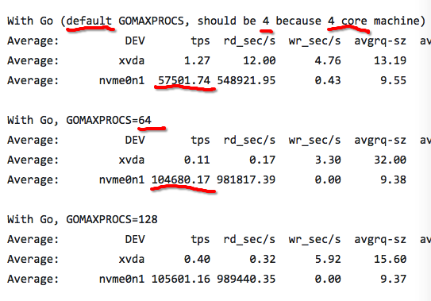

### P出现的原因
只有M和G的情况下， 所有的G都在一个全局队列上，  
M每次到这个全局队列取G，都要上锁。   
为了避免锁， 就设计出了P。
---
### M与P的关系
M就是线程  
P是CPU核  
G是goroutine  
M的创建，就是开启新的线程  
所以M必须绑定到P上才能创建，最多只有P个线程在真正的并行执行。

G启动时，并不总是新开线程。  
只有当目前所有的线程都阻塞时才新开线程。
阻塞的原因可能是： 系统调用，网络， 通道，锁。

所以M虽然需要跟P绑定执行，但数量上并不与 P 相等。
M会因为阻塞， 更多的M会被创建出来。所有M的数量会增长，而P的数量保持不变。  

---
### GOMAXPROCS设置P的数量

GOMAXPROCS设置P的数量， P的数量是可以并行执行的最大线程数。阻塞的线程不在这个数目内.  
ThreadLimit是最大线程数，阻塞的线程在这个数目内。  
举例：  
假设设置 GOMAXPROCS为10, ThreadLimit为100  
如果开启的 goroutine 小于 10 个，那么线程也小于 10 个。  
如果有很多 goroutines，但是没有阻塞，那么只有 10 个线程会并行执行。 
如果有很多 goroutines，  有10个以上的线程阻塞了，  
那么超过10个的线程会被创建， 最多可以是99个线程被创建，  
但是只有 10 个活跃的线程执行user-level 代码。  

---
### 默认的GOMAXPROCS太小， 影响性能
GOMAXPROCS 默认值是 CPU 核数， 这个值太小，如果在io密集的goroutine, 这个值会影响性能  
原因：  
如果一个M调用了什么API导致了操作系统线程阻塞了，操作系统立刻会把这个线程M调度走，
具体动作就是让这个线程进入阻塞睡眠，  
这个操作的另一个说法是:  
把这个线程从当前绑定的P上调度走， 这样这个线程绑定的P就是空闲的了。  
这时这个P就可以被抢走了。  
但是因为 GOMAXPROCS太小，P的数量太少，Go调度器不会马上把别的没有阻塞的M调度到这个P上，  
即没有抢到这个P。  
Go调度器2ms才扫描一次，于是没来得及发现这个阻塞的M，阻塞就结束了。  
这2ms期间， 宝贵的P资源就因为没来得及调度就浪费了。  

操作系统在1ms内可以完成很多次线程调度（一般情况1ms可以完成几十次线程调度）

GOMAXPROCS合理的数目是cpu核数的8倍以上。  
下面是GOMAXPROCS默认数目4和自定义数目64的性能比较  

