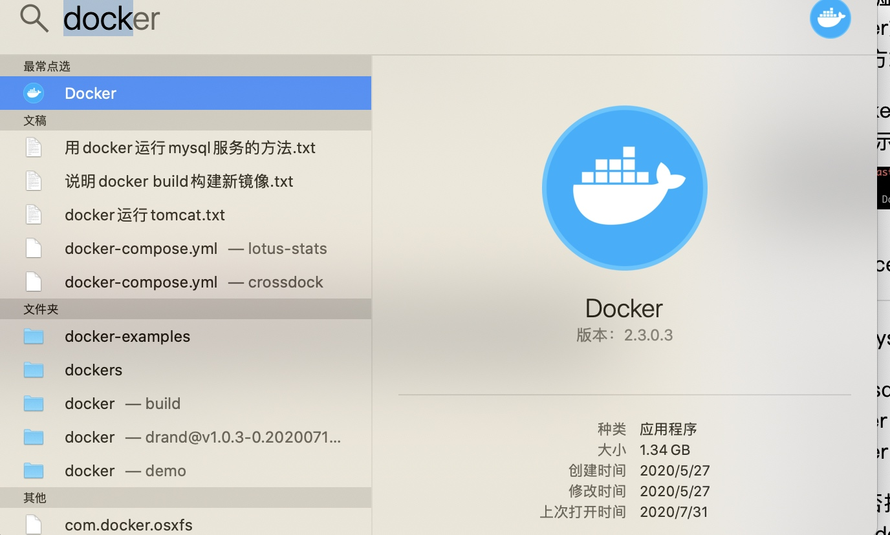

windows 下mysql 在导入数据库时， 出现表创建不了的问题，用linux环境没问题，
Linux可用三种方式：
1. 直接安装mysql服务， rpm地址要找对， 要找到适用在centos8上的repo源， 或者要找对rpm路径，有的仅在centos7上适用，
2. 用k8s集群，需要master节点主机，和node节点主机， 因为是笔记本，运行两个vmware虚拟机, 就很吃力了，所以不用
3. 用docker方式，是最快捷的方式，省去了很多环境搭建的动作。 这里采用docker方式。

#### mac启动docker；
没有启动会显示：

用cmd + space 弹出启动框：

#### centos启动docker
Docker的启动与停止
systemctl命令是系统服务管理器指令

启动docker：

systemctl start docker
 

停止docker：

systemctl stop docker
 

重启docker：

systemctl restart docker
 

查看docker状态：

systemctl status docker
 

开机启动：

systemctl enable docker
 

查看docker概要信息

docker info
 

查看docker帮助文档

docker --help

### docker运行mysql服务的方法步骤：

1. 拉取mysql服务镜像
$ docker pull mysql:5.7   # 拉取 mysql 5.7
用docker pull mysql可以拉取最新版mysql镜像， 这里不需要最新的

2. 检查是否拉取成功
$ sudo docker images

3. 运行容器：
$ sudo docker run -p 3306:3306 --name mysql -e MYSQL_ROOT_PASSWORD=123456 -d mysql:5.7
命令参数说明：
-d      ： 指定源镜像名，此处为 mysql:5.7
–name   ： 指定容器名，此处命名为mysql
-e      ： 指定配置信息，此处配置mysql的root用户的登陆密码
-p      ： 指定端口映射，此处映射 主机3306端口 到 容器的3306端口

3. 查看正在运行的容易
$ docker container ls
可以看到容器ID，容器的源镜像，启动命令，创建时间，状态，端口映射信息，容器名字
也可以用：
$ docker ps
如果查看所用容器，包括在运行和不在运行的：
$ docker ps -a
在重启docker后，需要用这个命令查看所用容器ID， 然后用
$ docker start 容器ID
启动容器

4. 进入mysql服务容器，修改mysql root用户密码
$ sudo docker exec -it mysql bash
# mysql -uroot -p123456
以上都是四个步骤都是在linux环境下的操作

5. windows 运行命令行：
C:\Users\Administrator> mysql -h 192.168.0.141:3306 -uroot -p123456
连接linux主机的3306端口， 因为linux docker的mysql服务容器的3306端口直接映射到了linxu宿主机上，
所以可以直接连接linux主机的3306端口，就可获取mysql服务。

#### 挂载
-v /docker/redis/conf/redis.conf:/etc/redis.conf

