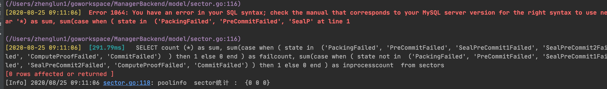
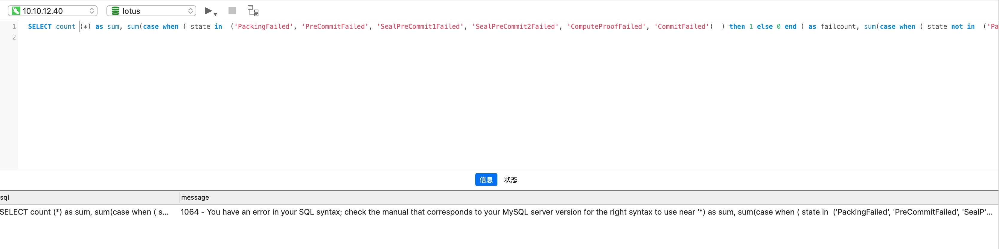

#### sum 语句问题
```
func GetSectorCountsForPoolIn( DB *gorm.DB) (SectorCounts, error) {
	sectorCounts  := SectorCounts{}

	sum := "count(*) as sum, "
	failCount := "sum(case when ( state in  " + SectorFailedSql + "  ) then 1 else 0 end ) as failcount, "
	inprocessCount := "sum(case when ( state not in  " + SectorFailedSql + " ) then 1 else 0 end ) as inprocesscount "


	sql :=  "SELECT " + sum + failCount + inprocessCount  + " from sectors"
	err :=  DB.Model(&Sector{}).Raw( sql ).Find(&sectorCounts).Error

	logger.Info.Println("poolinfo  sector统计 : ", sectorCounts)
	return sectorCounts, err
}

```

运行后， 显示如下log：


在gorm 中看不出错误， 可以到navicat运行这个sql语句， 




在navicat里看到这个错误， 就很明显了， 提示显示在count 后面缺少一个空格。 
