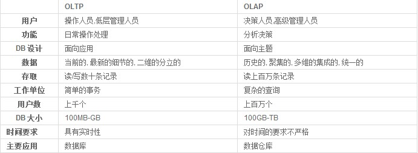
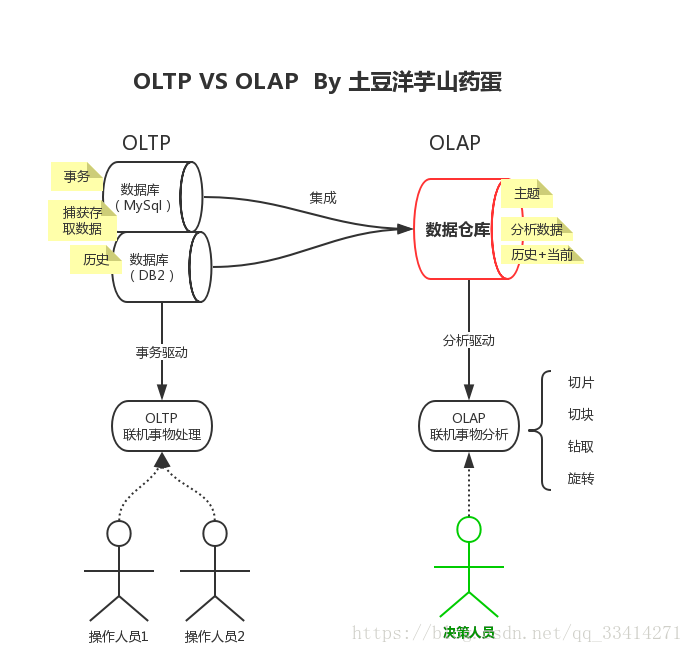

联机事务处理OLTP（on-line transaction processing）、联机分析处理OLAP（On-Line Analytical Processing）。
* OLTP是传统的关系型数据库的主要应用，主要是基本的、日常的事务处理，例如银行交易。
* OLAP是数据仓库系统的主要应用，支持复杂的分析操作，侧重决策支持，并且提供直观易懂的查询结果。
对比1： 

对比2：  

