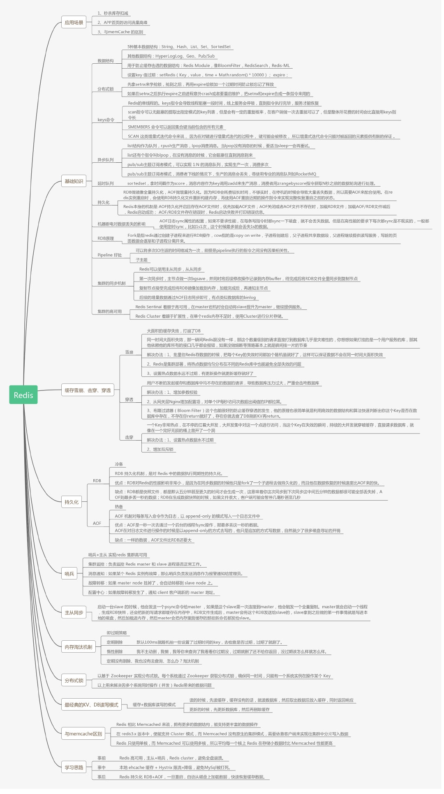

redis的设计目的是就快速增删改查数据，
虽然是一个存放在内存里的非关系数据库，
但为了快速，对于数据库事务ACID四个特性不能严格满足

他和硬盘上的关系型数据库有许多不同

redis不是严格意义的数据库，即：不严格满足严格的原子性，一致性，隔离性，持久性。 
redis不能回滚，因为回滚回使每次加入一个kv时，会有很多动作，
所以中间出错，不能回到之前的状态，这样就不具备原子性， 
不具备原子性，就不具备一致性，因为数据关系不能前后保持一致
在说隔离性，因为单线程，所以是具备隔离性。 
持久化，有rdb, aof, 和纯内存无持久方式， 
rdb 相当于一个快照，比较耗时，用fork一个进程来做。 

--- 
存储方式
key-value键值对是速度最快的存储方式
一个key直接找到value. 先要找到这个key-value的地址， 
这是一种典型的查找，但redis没用采用树查找方式， 因为树相对复杂， 而且内存分布不连续， redis就用了跳表的方式

---
键过期的删除方式：
定期删除， 耗费cpu, 惰性删除， 觉得内存不够用时，再删，耗费内存。 

用finder图片放大看

