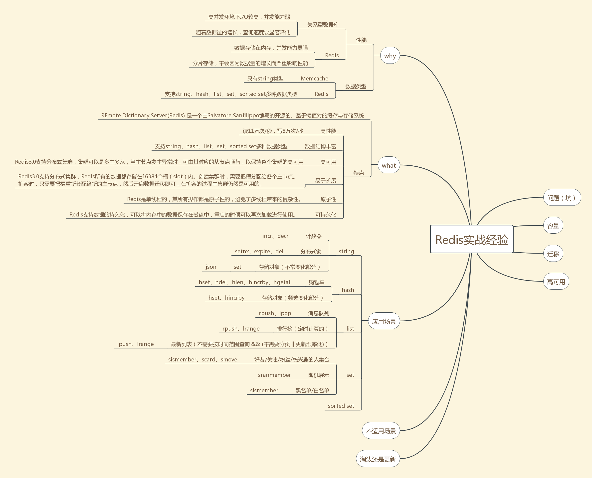

redis是用C语言开发的一个开源的高性能键值对（key-value）数据库。它通过提供多种键值数据类型来适应不同场景下的存储需求，
redis在5.0版本支持的键值数据类型如下字符串、列表（lists）、集合（sets）、有序集合（sorts sets）、哈希表（hashs）

redis的应用场景 

缓存（数据查询、短连接、新闻内容、商品内容等等）。（最多使用）
分布式集群架构中的session分离。
聊天室的在线好友列表。
任务队列。（秒杀、抢购、12306等等） 
应用排行榜。 
网站访问统计。 
数据过期处理（可以精确到毫秒）

### set应用场景
set类型是string类型的集合，
其特点是集合元素无序且不重复，
每个集合最多可以存储 232 - 1 个元素（40多亿），

set类型主要有以下应用场景。

#### 1. 好友/关注/粉丝/感兴趣的人集合
　set类型唯一的特点使得其适合用于存储好友/关注/粉丝/感兴趣的人集合，集合中的元素数量可能很多，每次全部取出来成本不小，set类型提供了一些很实用的命令用于直接操作这些集合，如
```
 a. sinter命令可以获得A和B两个用户的共同好友
 b. sismember命令可以判断A是否是B的好友
 c. scard命令可以获取好友数量
 d. 关注时，smove命令可以将B从A的粉丝集合转移到A的好友集合
```
　需要注意的是，如果你用的是Redis Cluster集群，对于sinter、smove这种操作多个key的命令，要求这两个key必须存储在同一个slot（槽位）中，否则会报出 (error) CROSSSLOT Keys in request don't hash to the same slot 错误。Redis Cluster一共有16384个slot，每个key都是通过哈希算法CRC16(key)获取数值哈希，再模16384来定位slot的。要使得两个key处于同一slot，除了两个key一模一样，还有没有别的方法呢？答案是肯定的，Redis提供了一种Hash Tag的功能，在key中使用{}括起key中的一部分，在进行 CRC16(key) mod 16384 的过程中，只会对{}内的字符串计算，例如friend_set:{123456}和fans_set:{123456}，分别表示用户123456的好友集合和粉丝集合，在定位slot时，只对{}内的123456进行计算，所以这两个集合肯定是在同一个slot内的，当用户123456关注某个粉丝时，就可以通过smove命令将这个粉丝从用户123456的粉丝集合移动到好友集合。相比于通过srem命令先将这个粉丝从粉丝集合中删除，再通过sadd命令将这个粉丝加到好友集合，smove命令的优势是它是原子性的，不会出现这个粉丝从粉丝集合中被删除，却没有加到好友集合的情况。然而，对于通过sinter获取共同好友而言，Hash Tag则无能为力，例如，要用sinter去获取用户123456和456789两个用户的共同好友，除非我们将key定义为{friend_set}:123456和{friend_set}:456789，否则不能保证两个key会处于同一个slot，但是如果真这样做的话，所有用户的好友集合都会堆积在同一个slot中，数据分布会严重不均匀，不可取，所以，在实战中使用Redis Cluster时，sinter这个命令其实是不适合作用于两个不同用户对应的集合的（同理其它操作多个key的命令）。

#### 2. 随机展示
　通常，app首页的展示区域有限，但是又不能总是展示固定的内容，一种做法是先确定一批需要展示的内容，再从中随机获取。如下图所示，酷狗音乐K歌擂台赛当日的打擂歌曲共29首，首页随机展示5首；昨日打擂金曲共200首，首页随机展示30首。
　set类型适合存放所有需要展示的内容，而srandmember命令则可以从中随机获取几个。
####　3. 黑名单/白名单
  经常有业务出于安全性方面的考虑，需要设置用户黑名单、ip黑名单、设备黑名单等，set类型适合存储这些黑名单数据，sismember命令可用于判断用户、ip、设备是否处于黑名单之中。
