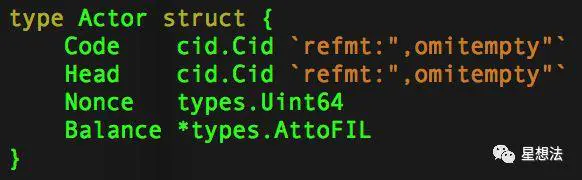

查询actor的账户余额， 即balance
文档地址： 	https://www.jianshu.com/p/2077f743730f
[fil@yangzhou010010019017 ~]$ ./lotus state get-actor t3tdha666hzopozcjnkarijatngjhmshoca3g4qdcvdp7pregoxk6mkhkflwup2yck7flmlga6mt7iicgmf6ra
Address:	t3tdha666hzopozcjnkarijatngjhmshoca3g4qdcvdp7pregoxk6mkhkflwup2yck7flmlga6mt7iicgmf6ra
Balance:	49.999532350421657008
Nonce:		11
Code:		bafkqadlgnfwc6mjpmfrwg33vnz2a
Head:		bafy2bzacecac2a7ymjpcva5gnb6jysdqoayyfjclozzkirg5nlh2u7eelhqw6
   
  Actor：
  
  Filecoin网络中的Actor可以类比以太坊网络中的账户（一般账户或者智能合约账户）。每个Actor有自己的地址，余额，也可以维护自己的状态，同时Actor提供一些函数调用（也正是这些函数调用触发Actor的状态变化）。Filecoin的状态机，包括所有Actor的状态。
  Actor的状态，包括：账户信息（Balance），类型（Code），以及序号（Nonce）。Actor的定义在actor/actor.go中。
  
  
  
### message
Message：

Filecoin网络中的区块是由一个个的Message组成。你可以把Message想象成以太坊的交易。一个Message由发起地址，目标地址，金额，调用的函数以及参数组成。所有Message的执行的结果就是状态机的全局状态。Filecoin网络的全局状态就是映射表：Actor的地址和Actor的状态/信息。以太坊的全局信息是通过leveldb数据库存储。Filecoin的全局状态是使用IPLD HAMT(Hash-Array Mapped Trie) 存储。

### FIL & AttoFIL:

FIL是Filecoin项目的代币。AttoFIL是FIL代币的最小单位，1 AttoFIL = 10^(-18) FIL。

### Gas费用：

和以太坊网络类似，执行Actor的函数需要消耗Gas。Actor的函数调用有两种方式：1/ 用户发起签名后的Message（指定调用某个Actor的某个函数），并支付矿工Gas费用（类似以太坊的Gas费用）。2/ Actor之间调用。Actor之间调用也必须是用户发起。

### 区块
区块（Block & TipSet）:

Block是一个区块，定义在types/block.go文件中：

一个区块的信息主要包括：

打包者的地址信息

区块的高度/权重信息

区块中包括的交易信息/更新后新的Root信息

Ticket信息以及Ticket的PoSt的证明信息

一个Tip，就是一个区块。一个TipSet，就是多个区块信息的集合，这些区块拥有同一个父亲区块。所谓的TipSet，就是一个区块的多个子区块，定义在types/tipset.go文件中：

目前Filecoin的代码中，每个区块的生成时间设置为30秒

### 地址
02  Filecoin地址生成逻辑
在深入其他逻辑之前，先介绍一下Filecoin网络中的地址生成逻辑。Filecoin的地址总共为41个字节，比如fcqphnea72vq5yynshuur33pfnnksjsn5sle75rxc。fc代表是主网，tf代表是测试网络。

详细的代码在address/address.go，核心逻辑在encode函数。 在address/constants.go文件中定义了一些参数，并预制了一些固定地址：Filecoin的铸币地址，存储市场地址，支付通道地址等等。

### 03 Filecoin的整体框架
Filecoin区块链相关的整体框架如下图所示：

所有的交易在节点间同步到每个节点的“Message Pool”中。经过“Expected Consensus”共识机制，当选为Leader的一个或者多个节点从“Message Pool”中挑选Message，并打包。被打包的区块，会同步给其他节点。打包的区块中的交易（Message）会被Filecoin虚拟机执行，更新各个Actor的状态。所有的区块数据，Actor的状态是通过IPFS/IPLD进行存储

### 04 Filecoin 虚拟机以及Gas计算
Filecoin虚拟机比较简单，在Filecoin虚拟机执行具体某个Message的时候（Actor的某个Method），会准备VMContext，提供Actor的执行环境：

Filecoin虚拟机相关的代码在vm的目录下。所有的区块数据以及Actor状态数据存储是通过IPFS/IPLD实现。

Message（）函数提供了当前交易Message的信息

BlockHeight（）函数提供了当前区块高度信息

Stoage/ReadStorage/WriteStorage提供对当前目标地址的存储访问信息

Charge()函数提供油费耗费的调用

CreateNewActor/AddressForNewActor/IsFromAcccountActor函数提供了对Actor地址的创建以及基本查询功能

Rand函数提供了随机数能力

Send函数提供了调用其他Actor函数的能力

### 05 Expected Consensus - EC共识机制
Filecoin的共识算法叫Expected Consensus，简称EC共识机制。Expected Consensus实现的相关代码在consensus目录。除了区块链数据外，Expected Consensus每一轮会生成一个Ticket，每个节点通过一定的计算，确定是否是该轮的Leader。如果选为Leader，节点可以打包区块。也就是说，每一轮可能没有Leader（所有节点都不符合Leader的条件），或者多个Leader（有多个节点符合Leader）。Filecoin使用TipSet的概念，表明一轮中多个Leader产生的指向同一个父亲区块的区块集合。

Ticket的生成：

下一轮的Ticket是通过前一轮的区块的Proof以及节点的地址的Hash计算的结果，具体看consensus/expected.go中的CreateTicket函数。

Leader的选择：

在每个Ticket生成的基础上，进行Leader的选择，具体查看consensus/expected.go中的IsWinningTicket函数。也就是说，如果Ticket的数值小于当前节点的有效存储的比例的话，该节点在该轮就是Leader。

Weight的计算：

当多个Leader打包，形成多个TipSet时，通过计算TipSet的Weight的计算确定“主链”。具体查看consensus/expected.go中的Weight函数。如下图，在高度n+1，存在两个合法的TipSet，如何选择TipSet作为主链：计算Weight。

每个区块的Weight的计算公式如下：

   Weight = ParentWeight + ECV + ECPrM * ratio

目前，ECV设置为10， ECPrM设置为100，Ratio是当前节点的存储有效率（节点存储的容量/所有节点的存储容量）。在目前的算法下，也就是说，节点的ratio高，Weight就高。

一个TipSet的Weight等于TipSet中所有区块的Weight的总和。Weight大的TipSet认为是主链。当两个TipSet的Weight一样大的时候，取Ticket较小者。

### 06 Filecoin协议层
在区块链的基础上，Filecoin设计了几个协议：hello协议，storage协议以及retrieval协议。协议层在区块链数据之上，通过Message驱动区块链状态转移。Hello协议负责TipSet的区块同步，storage协议负责存储需求双方的撮合，retrieval协议负责文件的检索以及读取服务。协议层的代码在protocol目录中。

以storage协议为例，讲解一些协议层的主要逻辑：

Miner（紫红色）就是平时所说的存储矿工，通过createMiner创建Miner Actor。使用Miner Actor的addAsk提供存储服务。存储需求方，也就是Client，通过getAsks获取所有Miner Actor的存储服务，并在这些服务中确定相应的存储矿工。在确定存储矿工的基础上，使用createChannel创建支付通道，并和存储矿工进行数据的传输。存储矿工在存储数据后，定期向Miner Actor报告存储证明（submitPoSt）。存储矿工通过FPS（Filecon Proving Subsystem）实现数据的存储以及存储证明：SectorBase提供存储接口，Storage Proof提供PoRep以及PoSt的存储证明。PoRep以及PoSt的存储证明逻辑可以查看：IPFS & FileCoin - PoRep和PoSt算法。其他协议逻辑类似，感兴趣的小伙伴可以自行查看源代码。

总结：Filecoin是由区块链以及上层协议构成的存储系统。Filecoin有自己的一套术语：Message，Block，TipSet，Actor，Ticket，GAS。Filecoin的状态由多个Actor的状态组成。Filecoin区块链的区块数据以及Actor的状态数据通过IPFS/IPLD进行存储。Filecoin采用EC共识机制，通过TipSet的Weight确定主链。Filecoin目前实现三个上层协议：Hello，Storage（存储协议）以及Retrieval（检索协议）。目前的代码还在迭代中，代码中有很多TODO，也有一些和设计文档不一致的地方。

### 两个机制保证ipfs的安全
1、共识和激励机制   鼓励更多的矿工出现

Filecoin 采用的是一种混合共识机制 : 以预期共识 (EC) 为主，复制证明(PoRep) 及时空证明(PoSt) 为辅。作为激励，Filecoin采用区块链通证体系发行了FIL代币，发行总量20亿枚。按照官方代币分配方案，其中70%将通过区块奖励的方式线性释放，分配给矿工。其余的部分分别按15%、10%、5%分配给团队、投资人和基金会作为研发运营、投资分红、社区建设费用。

Filecoin的矿工根据其存储能力大小将获得区块奖励，存储能力的衡量方式即矿工在 Filecoin 网络中提供多少单位有效存储空间及能够存储的时长。因此可以理解为，Filecoin矿工的存储能力相当于比特币网络中矿工的算力。矿工获得的区块奖励取决于其存储能力占全网存储能力的比例。例如，一个矿工在网络大小为 100 PB 的情况下提供了 1 PB 的存储算力，那其将获得相应时间内区块奖励的百分之一。

2、质押机制   矿工提供的存储如果在规定的存储市场离线，或出现问题， 将受到很大惩罚
所以推测， 未来只有专业的商业矿工， 才能在ipfs存在, 

此外，需要注意的是Filecoin的参与和挖矿并不是有矿机就可以，还需要质押代币。

Filecoin为了防止客户的数据丢失，设置了一种质押机制，也可以理解为矿工惩罚机制。当一笔交易协议生成时，矿工会将客户提供的数据存放于网络中，这个区域称为扇区 (Sector)。每个扇区会包含存储文件内容及承诺存储时长，确保客户在约定存储时长中，可以自由运用自身存储的数据。

当矿工想添加一个扇区至 Filecoin 网络时，他需要质押一笔锁定资金。这个锁定资金由两个部分组成：矿工自身持有的 FIL 代币以及部分区块奖励。如果矿工在承诺的存储时长内离线，他就会损失一部分的锁定资金。如果矿工完全停止存储行为，那他则可能将失去所有锁定代币。

### 实用
在IPFS上建立网站的流程和过去一样，而且把网站加入到IPFS节点的指令只需要一条指令：ipfs add -r yoursitedirectory。网页间的连接不再需要人去维护，IPFS自带的查找可以解决。
IPFS不会要求每一个节点都存储所有的内容，节点的所有者可以自由选择想要维持的数据。这就像是书签一样，在备份了自己的网站之外，自愿的为其他的关注的内容提供服务，不同的是这个书签不会像以前一样最终变得失效。
IPFS节点间的拷贝、存储和网站支援都很容易，只需要使用一条指令以及网站的哈希，例如：ipfs pin add -r QmcKi2ae3uGb1kBg1yBpsuwoVqfmcByNdMiZ2pukxyLWD8，剩下的IPFS会搞定。

如果IPFS得以普及，节点数达到一定规模，即使每个节点只存放一点点内容，所累计的空间、带宽和可靠性也远超HTTP能提供的。随之而来，分布式Web会变成地球上最快、最可靠、最大的数据仓

### 变动
确定在第二阶段测试网中使用v26参数
lotus与go-filecoin互操作测试的实现
支持32G和64G扇区，将不支持512M和1G的扇区
Filecoin经济结构的发布以及经济参数的植入

压力测试
与第二阶段测试网同步进行的还有大矿工测试，共有来自全球48家矿工参与，按照大矿工申请的最低门槛5PB的承诺容量计算，参与第二阶段测试的规模至少在200PB以上，这将是非常大的一个规模，如果第二阶段测试顺利，Filecoin主网上线后实现真正的商用将毫无压力。
100万枚FIL测试奖励
胡安表示，在测试网第二阶段中将会给出超过100万FIL的奖励 （FIL奖励将在主网启动后交付，并有锁仓和时间限制）。这些测试将衡量矿工的存储和传输文件的能力，例如：总存储容量、进行的存储交易、检索到的文件、数据服务带宽、数据服务延迟等。
所以，即使是奔着这100万枚FIL的测试奖励，相信各家矿工肯定也都会卯足了劲争取最好的成绩，以获取更多的奖励代币。凡在二测开始前购买FILPool矿池云算力的客户，也有机会参与奖励代币的分配。
检验矿商的技术实力
目前Filecoin矿机市场鱼龙混杂，第一阶段测试网期间，许多矿商都在说自己是第一名，到底谁才是第一名？到底有多少打着IPFS&Filecoin的旗号、实际上却没有真正技术实力的公司在摸鱼？
Filecoin第二阶段测试网就犹如一个试金石，作为投资人到底应该选择哪一家矿商，怎么知道自己选择的矿商是否真正有实力，第二阶段测试网中的测试数据是一个非常好的检验工具。

### 个人理解
ipfs 如能大规模使用， 可以为数字货币的实用性铺平道路

ipfs提供了 数据的快速同步，比如100G每秒的同步速度， 也保证数据的绝对安全

目前的云存储都不是数字货币理想的存储方案 

将来存储市场也会大量被需求

各种区块链产品要想进入实用阶段，就必须有个即快速又安全的存储。
 
