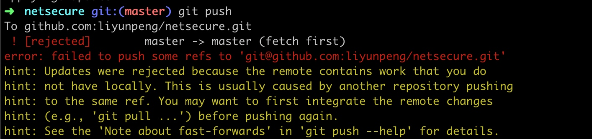
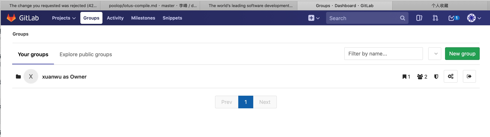
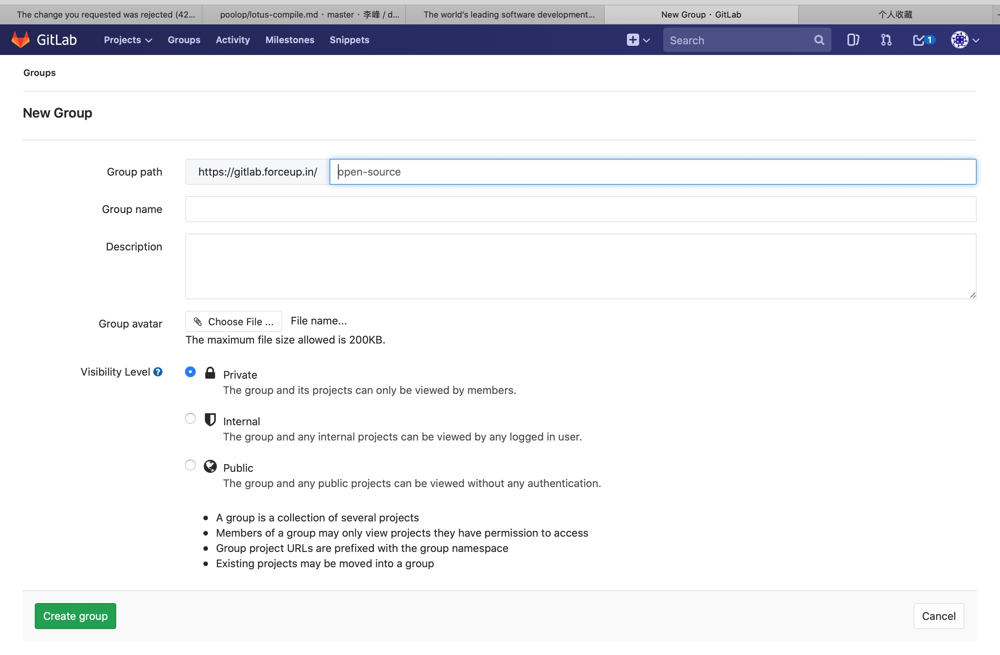
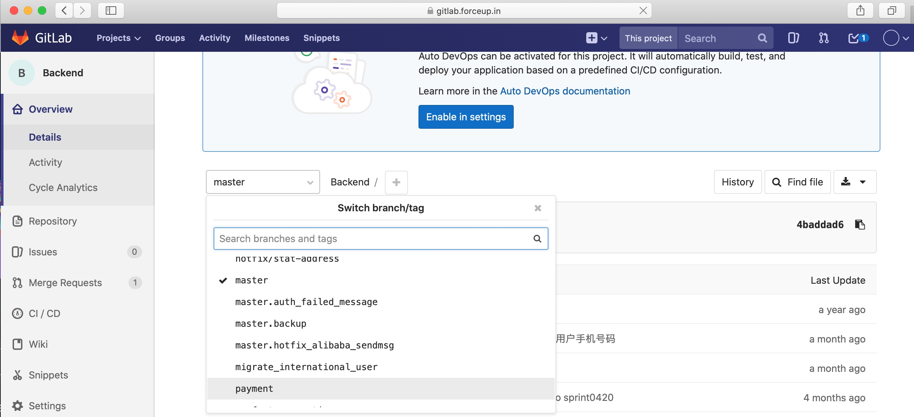

### git 撤销：
因为要撤销刚刚提交， 将刚刚的提交打包成patch 
git format-patch -1 b503d89fd3cc01945a25b9ecb74ed8d7e7f84955

撤销当前提交， 回退当前提交
git reset --hard a6945a88ac1a74e427d15fb862ed4216eff3ef8f

代码恢复如初， patch打进去
git apply ~/0001-Defect-No.-AR000D7OQT.patch


撤销最近一次提交：
git reset --hard HEAD
这个只能使用一次

撤销到指定的提交点：
git reset --hard 812269738af44cb95423a36731b97f4fb7d9addd

### 解决github下载慢的问题：
在/etc/hosts下添加：
192.30.253.112 github.com
151.101.185.194 github.global.ssl.fastly.net
即省去了域名解析的时间


### git push相关
#### push时遇到的错误： 

解决办法：
git pull

####  push到远程仓库的指定分支：
```
$ git branch -a
* local
  remotes/korg/huawei_xian/sprdroid9.0_wear_huawei_cus
  remotes/korg/huawei_xian/sprdroid9.0_wear_huawei_cus_W19.46.1
  remotes/korg/huawei_xian/sprdroid9.0_wear_huawei_cus_W19.49.5
  remotes/korg/hw/cbg/EMUIWear/debug-Nick_Merge_TEMP1101
  remotes/korg/master
  remotes/m/hw/cbg/EMUIWear/debug-Nick_Merge_TEMP1101 -> korg/hw/cbg/EMUIWear/debug-Nick_Merge_TEMP1101
```

push到远程仓库的指定分支：
git push korg HEAD:refs/for/hw/cbg/EMUIWear/debug-Nick_Merge_TEMP1101

### git fetch 与 git rebase

#### git rebase只有在有本地提交后，才能rebase
```
shop$ git fetch
shop$ git rebase
error: cannot rebase: You have unstaged changes.
error: additionally, your index contains uncommitted changes.
error: Please commit or stash them.
shop$ git add .
shop$ git commit . -m "整理footer模板"
[master 32c9380] 整理footer模板
 14 files changed, 124 insertions(+), 132 deletions(-)
 create mode 100644 models/goods.go
 rename web/views/{index.html => home.html} (95%)
 create mode 100644 web/views/shared/footer.html
shop$ git rebase
First, rewinding head to replay your work on top of it...
Applying: 整理footer模板
```

#### 本地有修改的， 没有提交, 不能rebase
E:\web-front\vue-router\baoge>git rebase
Cannot rebase: You have unstaged changes.
Please commit or stash them.

E:\web-front\vue-router\baoge>git checkout -f .

本地都提交了之后， 可以rebase：
E:\web-front\vue-router\baoge>git rebase
First, rewinding head to replay your work on top of it...
Fast-forwarded master to refs/remotes/origin/master.


#### 没有rebase, 不能push
```
D:\goworkspace\netsecure>git push
To github.com:liyunpeng/netsecure.git
 ! [rejected]        master -> master (non-fast-forward)
error: failed to push some refs to 'git@github.com:liyunpeng/netsecure.git'
hint: Updates were rejected because the tip of your current branch is behind
hint: its remote counterpart. Integrate the remote changes (e.g.
hint: 'git pull ...') before pushing again.
hint: See the 'Note about fast-forwards' in 'git push --help' for details.

D:\goworkspace\netsecure>git rebase
First, rewinding head to replay your work on top of it...
Applying: update

D:\goworkspace\netsecure>git push
remote: Resolving deltas:  25% (1/4)ounting objects: 8, done.
Delta compression using up to 4 threads.
Compressing objects: 100% (8/8), done.
Writing objects: 100% (8/8), 4.21 KiB | 4.21 MiB/s, done.
Total 8 (delta 4), reused 0 (delta 0)
remote: Resolving deltas: 100% (4/4), completed with 4 local objects.
To github.com:liyunpeng/netsecure.git
   dac8f36..d1ddbbd  master -> master
```


#### 只有git fetch, 没有git rebase, 本地看到的代码还不是同步下来的代码

## gitlab 建立一个组



建立组：



gitlab：
 git commit . -m "update"
  699  git status .
  700  git add .
  701  git commit . -m "update"
  702  git branch -a
  703  git checkout -b force-send
  704  git remote add gitlab git@gitlab.forceup.in:xuanwu/forcesend.git
  705  git remote 
  706  git checkout master
  707  git status .
  708  git submodule update
  709  git status .
  710  git push gitlab master 
  711  git checkout force-send 
  712  git submodule update
  713  git push gitlab force-send 
  
  
###  checkout出一个分支 并push到远程
  ```
  ➜  Backend git:(master) git checkout -b payment
切换到一个新分支 'payment'
➜  Backend git:(payment) git push origin payment
总共 0（差异 0），复用 0（差异 0），包复用 0
remote:
remote: To create a merge request for payment, visit:
remote:   https://gitlab.forceup.in/ForcePool/Backend/merge_requests/new?merge_request%5Bsource_branch%5D=payment
remote:
To gitlab.forceup.in:ForcePool/Backend.git
 * [new branch]      payment -> payment
  ```
  
  在浏览器上，可以看到远程上已经有了这个分支： 
  
