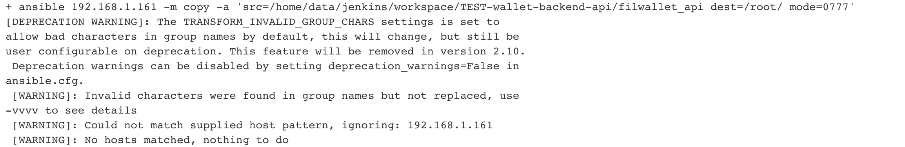
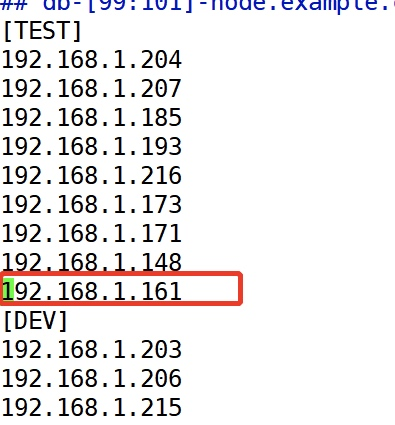

### ansible 报错
```
+ ansible 192.168.1.161 -m copy -a 'src=/home/data/jenkins/workspace/TEST-wallet-backend-api/filwallet_api dest=/root/ mode=0777'
[DEPRECATION WARNING]: The TRANSFORM_INVALID_GROUP_CHARS settings is set to 
allow bad characters in group names by default, this will change, but still be 
user configurable on deprecation. This feature will be removed in version 2.10.
 Deprecation warnings can be disabled by setting deprecation_warnings=False in 
ansible.cfg.
 [WARNING]: Invalid characters were found in group names but not replaced, use
-vvvv to see details
 [WARNING]: Could not match supplied host pattern, ignoring: 192.168.1.161
 [WARNING]: No hosts matched, nothing to do
 ```
 

解决办法：
地址要写到ansible的hosts文件里， 如：

