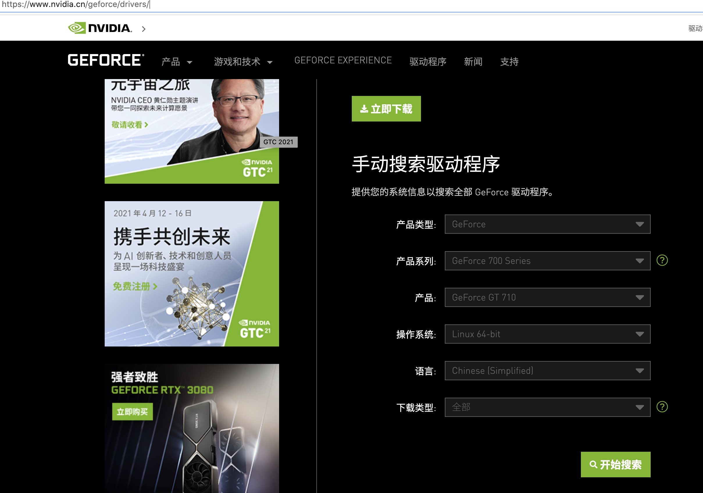
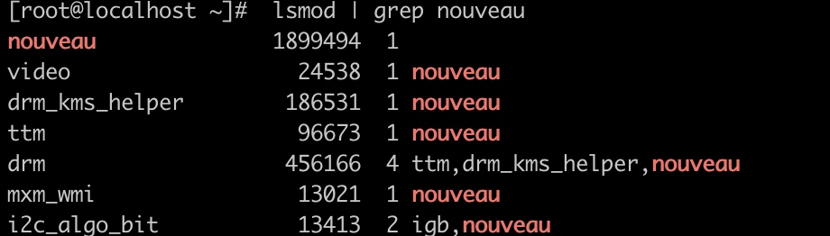
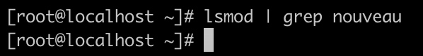
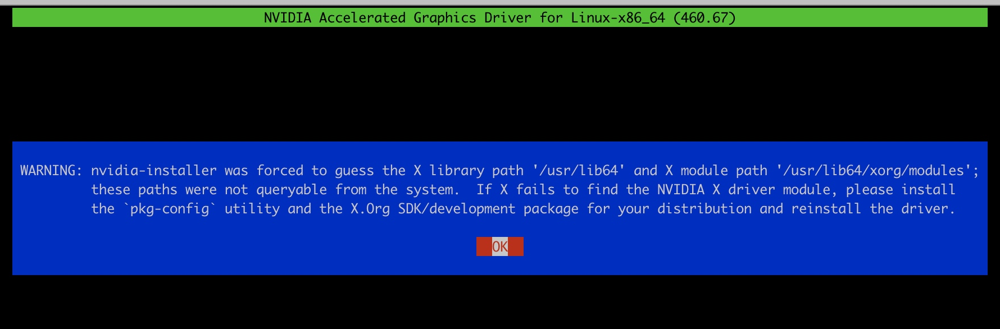
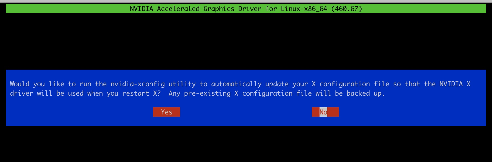
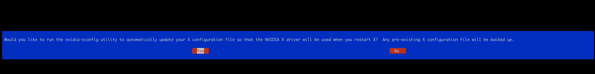
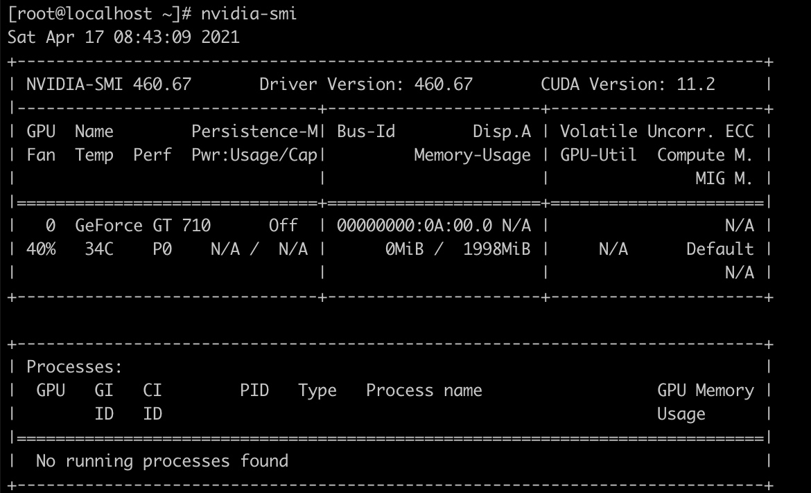

centos7如何安装显卡驱动，nvidia显卡亲测有效
先看显卡型号，然后到官网下载这个型号的版本
[fil@miner ~]$  lspci | grep -i vga
0a:00.0 VGA compatible controller: NVIDIA Corporation GK208B [GeForce GT 710] (rev a1)

官网下载驱动：
https://www.nvidia.cn/geforce/drivers/

### 第一步 安装内核版本

先安装 gcc, kernel, kernel-devel

yum install -y gcc-c++  

yum install -y kernel-devel(对应内核版本号)

内核版本号 这样找到：
uname -r
3.10.0-1160.el7.x86_64

这里为 ：
yum install -y kernel-devel-3.10.0-1160.el7.x86_64

否则安装显卡驱动过程中会报错：error：unable to find the kernel source tree for the currently running kernel. please make sure you have installed the kernel source files for your kernel and that htey are properly configured; on red hat linux system, for example, be sure you have the ‘kernel-source’ or ‘kernel-devel’ RPM installed. if you know the correct kernel source files are installed ,you may specify the kernel source path with the ‘–kernel-source-path’ command line option.

### 第二步：屏蔽默认的nouveau驱动
cents默认的是nouveau驱动，这是非nvidia官方的驱动，由linux爱好者修改版本，所以兼容性很糟糕，居然不支持1024P以上分辨率，而且无法全屏，只能一半屏幕显示，

在 /etc/modprobe.d/blacklist.conf  在后面加入：

blacklist nouveau

然后添加以下语句：

blacklist nouveau

options nouveau modeset=0 # 这句可以没有
保存

### 备份boot.img, 生成新的boot.img
接着给当前镜像做备份, 备份原boot.img

      sudo  mv /boot/initramfs-$(uname -r).img   /boot/initramfs-$(uname -r).img.bak

建立新的镜像， 即按禁用nouveau重新编译出一个boot.img

     sudo  dracut  /boot/initramfs-$(uname -r).img   $(uname -r)

这是还能看到有nouveau驱动

系统重启后， 就看不到这个nouveau驱动了
查看nouveau是否已经禁用
lsmod | grep nouveau
如果没有显示相关的内容，说明已禁用。

### 安装nvidia驱动
进入下载的驱动所在目录
执行之前先让.run文件有可执行权限：
chmod u+x NVIDIA-Linux-x86_64-415.13.run

执行安装脚本：
./NVIDIA-Linux-x86_64-340.108.run 

如果找不到内核版本， 可以
./NVIDIA-Linux-x86_64-340.108.run --kernel-source-path=/usr/src/kernels/3.10.0-1127.el7.x86_64

安装过程中选择如下：

记得把上面的内核版本改为自己系统的，按安装提示进行安装就可以了。

（ 如果失败，一般是驱动版本不支持新版的linux系统，卸载掉显卡驱动：

./NVIDIA-Linux-x86_64-340.108.run  --uninstall

做完这个步骤 重启reboot）

这时就有nvidia-smi 命令了

显卡内存是1998MiB

