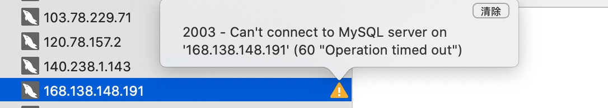
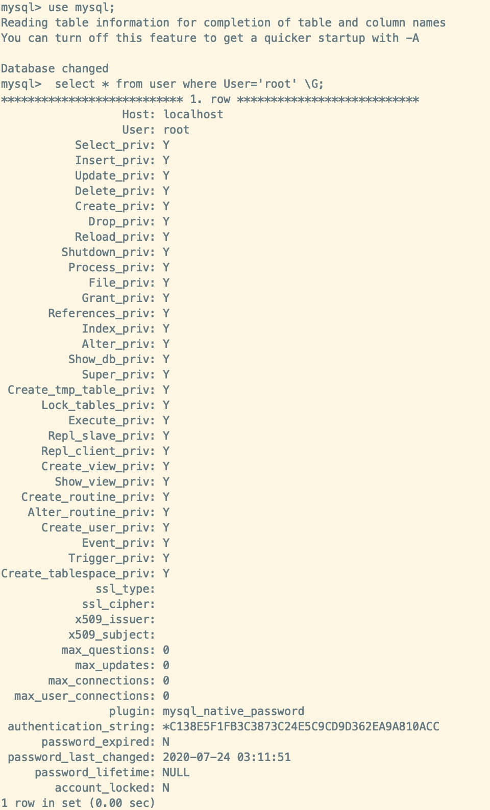
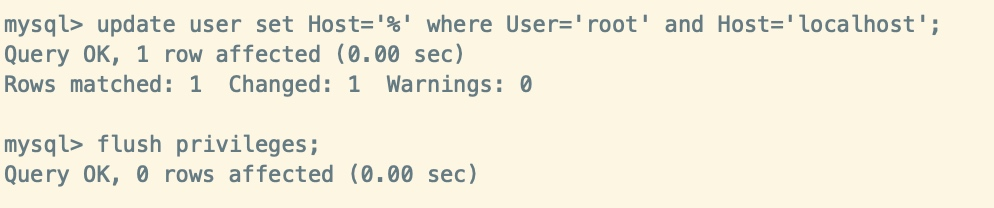
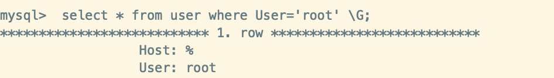

### 获取rpm包
一、安装YUM Repo
1、由于CentOS 的yum源中没有mysql，需要到mysql的官网下载yum repo配置文件。
下载命令：

wget https://dev.mysql.com/get/mysql57-community-release-el7-9.noarch.rpm


### 安装
2、然后进行repo的安装：
rpm -ivh mysql57-community-release-el7-9.noarch.rpm

执行完成后会在/etc/yum.repos.d/目录下生成两个repo文件mysql-community.repo mysql-community-source.repo

二、使用yum命令即可完成安装
注意：必须进入到 /etc/yum.repos.d/目录后再执行以下脚本

1、安装命令：
yum install mysql-server

### 启动
2、启动msyql：
systemctl start mysqld #启动MySQL


### 获取密码
3、获取安装时的临时密码（在第一次登录时就是用这个密码）：
```
# grep 'temporary password' /var/log/mysqld.log
2020-06-22T08:43:49.083578Z 1 [Note] A temporary password is generated for root@localhost: 8UO0S*6.zAqY
```

4、倘若没有获取临时密码，则
4.1、删除原来安装过的mysql残留的数据

rm -rf /var/lib/mysql

4.2.再启动mysql

systemctl start mysqld #启动MySQL


### 登陆并修改密码
三、登录：
1、方式一（已验证）：
mysql -u root -p

然后输入密码（刚刚获取的临时密码), 即grep 'temporary password' /var/log/mysqld.log  看到的密码

修改密码：

```
mysql> set password for root@localhost = password('Ipfs@123ky');
Query OK, 0 rows affected, 1 warning (0.01 sec)
mysql> exit
```

update user set Host='%' where User='root' and Host='localhost';


远程主机没有打开端口， 可能会报超时错误。 





更新用户为 % ， 代表所有用户

 update user set Host='%' where User='root' and Host='localhost';


结果为：

