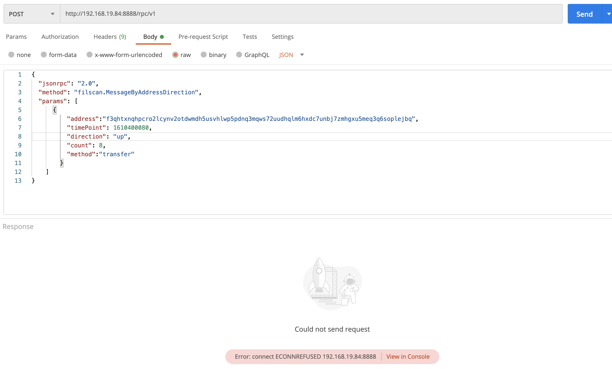
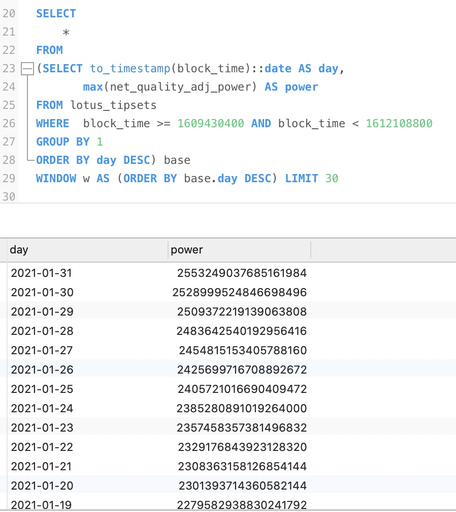

### 禁止本机以外的地址访问本服务
bind = "127.0.0.1" 表示只允许本地访问， 其他地址不能访问， 如本地地址为192.168.19.84， 而：


直接显示这个错误； 


### 反射


### 反射应用之一： 实现rpc调用


### 缺少主键
没有主键的表， 打开时报错：


可以在唯一索引上建立主键：
```
Height        int             `gorm:"primary_key;unique_index:height_index;type:bigint(20);comment:'fil'" json:"height"`
```
automigrage后有： 


### 建立唯一索引
```
Height        int             `gorm:"primary_key;unique_index:height_index;type:bigint(20);comment:'fil'" json:"height"`
```


### 本地地址添加代理ip服务器的百名单 
获取本主机公网ip地址

得到

将这个地址添加到海量ip的百名单里：


点击打开链接：

可以看到分配了ip
```
{"Claims": {"/": "bafy2bzaceajsoxvvl7kpsvcegconsvjui3b6v6vb564m5tcqnrdmowi6zyjhi"}, "MinerCount": 25333, "CronEventQueue": {"/": "bafy2bzacecomni2qh5zfipvzeojh4xs7zsi2t2gy4wjehu4bq7cdd5ghazina"}, "FirstCronEpoch": 450616, "TotalRawBytePower": "2476284697546588160", "TotalBytesCommitted": "2476872627029803008", "ProofValidationBatch": null, "TotalQualityAdjPower": "2476675206600261632", "ThisEpochRawBytePower": "2476284697546588160", "TotalPledgeCollateral": "33723763523854197855663208", "TotalQABytesCommitted": "2477263155331923968", "MinerAboveMinPowerCount": 1060, "ThisEpochQAPowerSmoothed": {"PositionEstimate": "841816222345035920745067969164119436377358501819842926548", "VelocityEstimate": "3239973013640125633924499096181203450380766386691539"}, "ThisEpochQualityAdjPower": "2476675206600261632", "ThisEpochPledgeCollateral": "33723763523854197855663208"}


{"Claims": {"/": "bafy2bzacebzzyzhdeqag2use76uryrfgx4qiikkzxtbwbhjw3szw5v3hjhfoy"}, "MinerCount": 25333, "CronEventQueue": {"/": "bafy2bzacec65r3tvspzvq7j4wlub2feoijkccybeqeatu7rrct6km22aiufdw"}, "FirstCronEpoch": 450614, "TotalRawBytePower": "2476283872912867328", "TotalBytesCommitted": "2476877574832128000", "ProofValidationBatch": null, "TotalQualityAdjPower": "2476674381966540800", "ThisEpochRawBytePower": "2476283872912867328", "TotalPledgeCollateral": "33723494133744057422247589", "TotalQABytesCommitted": "2477268103134248960", "MinerAboveMinPowerCount": 1060, "ThisEpochQAPowerSmoothed": {"PositionEstimate": "841807975315131780843377741446014310621385461452538251815", "VelocityEstimate": "3239430219799008033116474695019713807226536996845021"}, "ThisEpochQualityAdjPower": "2476674381966540800", "ThisEpochPledgeCollateral": "33723494133744057422247589"}


{"Claims": {"/": "bafy2bzaceb3zr4epodaei6xgk46xyhqadhaliktfvmv6nooknm6m4ptrkq7co"}, "MinerCount": 25333, "CronEventQueue": {"/": "bafy2bzacechu4qq5xhgiwuyfzzorxhq7bj3yg2dyou4gkwjrixgofrlyb4aai"}, "FirstCronEpoch": 450599, "TotalRawBytePower": "2475895573509570560", "TotalBytesCommitted": "2476489962623598592", "ProofValidationBatch": null, "TotalQualityAdjPower": "2476285777957027840", "ThisEpochRawBytePower": "2475895573509570560", "TotalPledgeCollateral": "33721448900726147235660425", "TotalQABytesCommitted": "2476880186319503360", "MinerAboveMinPowerCount": 1060, "ThisEpochQAPowerSmoothed": {"PositionEstimate": "841746406575968822986796717474774047704164757281816897478", "VelocityEstimate": "3235435889954835535937620765589234920335635137733438"}, "ThisEpochQualityAdjPower": "2476285777957027840", "ThisEpochPledgeCollateral": "33721448900726147235660425"}
```


### 超时访问


### 限流访问
限流访问， 对api做限流， 如果一个api太频繁， 识别到这个ip， 对这个IP做如下返回：
```
{
        "statusCode": 429,
        "error": "Too Many Requests",
        "message": "Rate limit exceeded, retry in 1 minute"
}
```
这时就没法得到他的数据了

### 线上hotfix
线上分支需要用master分支， 
测试环境要用test分支， 
如果测试环境也用master分支， 有时需要线上解决问题时， 这时master已经提交很多了， 这些没有详细测试， 为了解决一个紧急问题， 需要把这些没有测试的提交都进入到线上版本，这是有极大风险的， 是不允许的。 

线上紧急解决问题， 叫做hotfix, 需要在那个发布版本时的提交点，切出一个分支出来， 这个分支一般命名为hotfix分之， 然后在这个分支上，再fix提交，然后在这个临时分支发布版本， 所以每次发布线上发布版本时， 要用这个提交号。 如果没有提交， 就可以在当钱master直接提交。  

### 浏览器端查看rpc
http方式的rpc 参数在 requestpayload里面：

在新的岁月里，祝愿每个人都健康，平安， 财富自由， 有更多的正能量

### http方式的rpc api接口的声明文件与接口的实现文件
接口的包名为为rpc方法的前缀， 这里包名为filscan.
接口的声明文件为api.go
接口的实现文件为impl.go


### pgsql 类型没写全字段， 报错


报错： 

解决办法： 类型里加一个字段：

即： 如果 select * ， 那么对象类型里要容纳所有的字段。 


### git status 看到 extern/有提交， 要git submodule update --init --recursive


### jekins
构建长时间没反应， 

可以查看控制台输出： 

第一次构建会下载第三方代码：


http://192.168.1.185/#/address/detail?address=f052429
### jekins 新建时，可以从原有的复制过来

在复制里输一个字符， 就有已有的项目， 
所有的配置项目都和原油的一直。 


### pgsql:  window 查询30天算力趋势图

```sql
SELECT 
		*
FROM
(SELECT to_timestamp(block_time)::date AS day,
       max(net_quality_adj_power) AS power
FROM lotus_tipsets
WHERE  block_time >= 1609430400 AND block_time < 1612108800
GROUP BY 1
ORDER BY day DESC) base
WINDOW w AS (ORDER BY base.day DESC) LIMIT 30
```





### pgsql:  统计每天算力， 再加上每天的新增算力

```sql
SELECT 
		day,
		power,
		(base.power - lead(base.power) OVER w) AS increased
FROM
(SELECT to_timestamp(block_time)::date AS day,
       max(net_quality_adj_power) AS power
FROM lotus_tipsets
WHERE  block_time >= 1609430400 AND block_time < 1612108800
GROUP BY 1
ORDER BY day DESC) base
WINDOW w AS (ORDER BY base.day DESC) LIMIT 30
```


### 连接没关， 超过限制连接池限制， 导致pg数据库没反应

```json
{"Claims": {"/": "bafy2bzacebilf6bcdfizf4aozvz3e3fm2tyy63z6ldlf67o3snbfjbo6qptrg"}, "MinerCount": 25705, "CronEventQueue": {"/": "bafy2bzacebfsslgei3fungoznk5mqv3vmtinbqz46lurl43tn72t6z3lqqm3w"}, "FirstCronEpoch": 468149, "TotalRawBytePower": "2626616043329552384", "TotalBytesCommitted": "2627190813032972288", "ProofValidationBatch": null, "TotalQualityAdjPower": "2627130202754875392", "ThisEpochRawBytePower": "2626616043329552384", "TotalPledgeCollateral": "35466975376044844050748045", "TotalQABytesCommitted": "2627704991706742784", "MinerAboveMinPowerCount": 1123, "ThisEpochQAPowerSmoothed": {"PositionEstimate": "893974282535353253965660431331790991136404327440817423927", "VelocityEstimate": "3141338273791504296067148645107963086964651045810581"}, "ThisEpochQualityAdjPower": "2627130202754875392", "ThisEpochPledgeCollateral": "35466975376044844050748045"}
```

### 表的分区， 导致了慢， 导致其他查询都跟着慢


###  结果集可查多少个json项

ctl+f 可以看到有多少个相同项


### B+树的查找时间复杂度， 与插入时间复杂度
就怕删除， 和乱序， 乱序插入就是先插入了100， 又插入了99， 又插入了101， 乱序，是插入乱序。 B+树 插入如果顺序， 插入的速率是最好的，顺寻插入， 表可以保持稳定状态。 

查找的时间复杂度可以达到 logN， 是最优的， 

插入的时间复杂度， 就会大很多， 

### 查询必须写上索引区间， 不然会对所有数据排序， 
如下会对所有数据排序， 

虽然epoch是索引， 但也会对所有数据排序， 

下面的写法只会对索引区间排序， 查询是很快的：


最好学会用explain 分析查询速度。 

basefee 趋势图起点时间修改

    


增加推荐值优化相关接口
调试推荐值优化相关接口，根据地址找到actorId， 根据actorId，动态获取消息id对应的消息类型  Send方法名改为transfer， 接口缓存与返回值修改，
查询加索引区间
处理代打包消息列表显示慢的问题
处理Forcepool 未提现用户的账户余额查询

### 两个 join 的查询
需要讲一个join的查询结果作为子查询， 将子查询结果再与另外一个表 join ， 如：
```sql
select s.*, pr.name as product_name from (
select 
u.name,
u.phone,
u.email,
u.buy_space+u.other_space,
p.pid as pid,
p.buy_power
from user u 
LEFT JOIN purchase_orders p 
on u.code = p.code
) s 
LEFT JOIN product pr 
on s.pid = pr.id
ORDER BY s.phone
```


在注意一下，获取全部子查询的写法：
``` 
s.*, pr.name
```
s.* 获取了全部的子查询

### 两个表都有效，才算有效
purchase_orders 表和product 表都有product id， 这个订单才算有效

```sql
select s.name, s.phone,  s.space, sum(s.buy_power) from
(select 
u.name,
u.phone,
u.email,
u.buy_space+u.other_space as space,
p.buy_power as buy_power,
p.pid as pid
from user u 
inner JOIN purchase_orders p 
on u.code = p.code 
) s 
inner JOIN product pr
on s.pid = pr.id
GROUP BY s.phone 
```


### gaslimit 过大会被惩罚


### chaininfo 生产
```
chain-info生产, 
地址:13.115.185.218
项目目录:/home/filscan-test/backend/code
```

### pg表示： 一个字符串在一个字符串数组里面
```
SELECT sum(miner_penalty)*3 as msg_penalty
							FROM lotus_messages lm
									 LEFT JOIN lotus_blocks lb
											   ON lm.block_time = lb.block_time AND lm.blk_cids @> ARRAY [lb.cid]
							WHERE lb.block_time >= ?
							  AND lb.block_time < ?
							  AND lb.bad = FALSE
							  AND lm.epoch > 0  AND lm.miner_penalty > 0
                              AND lb.miner = ?

```
里面的lm.blk_cids @> ARRAY [lb.cid]
表示lb.cid 在lm.blk_cids 数组里面


### 高度信息


### pool_rewards


###  分支保护


###  生产服务器
chain-info生产, 
地址:13.115.185.218
项目目录:/home/filscan-test/backend/code
ssh 进去以后,切换到root用户:
sudo su -
cd /home/filscan-test/backend/code
上传你的新版本chian-info-新版本, 然后更新软连接:
ln -s -f ./chain-info-新版本 ./chain-info
kill chain-info进程
./start.sh
ssh 进去以后,切换到root用户:
sudo su -
cd /home/filscan-test/backend/code
上传你的新版本chian-info-新版本, 然后更新软连接:
ln -s -f ./chain-info-新版本 ./chain-info
kill chain-info进程
./start.sh

### 测试服务器


### 传入的参数类型与代码规定的不一致， 导致


代码中规定的： 


###  加上--recursive，才可以下载代码
```
➜  ChainInfo git:(local-filscan-master) ✗ git submodule update --init

➜  ChainInfo git:(local-filscan-master) ✗ git submodule update --init --recursive
子模组路径 'extern/ChainSyncer/extern/filecoin-ffi'：检出 'b6e0b35fb49ed0fedb6a6a473b222e3b8a7d7f17'
子模组路径 'extern/ChainSyncer/extern/serialization-vectors'：检出 '5bfb928910b01ac8b940a693af2884f7f8276211'
子模组路径 'extern/ChainSyncer/extern/test-vectors'：检出 'd9a75a7873aee0db28b87e3970d2ea16a2f37c6a'
子模组路径 'extern/ChainSyncer/extern/test-vectors/gen/extern/fil-blst'：检出 '5f93488fc0dbfb450f2355269f18fc67010d59bb'
子模组路径 'extern/ChainSyncer/extern/test-vectors/gen/extern/filecoin-ffi'：检出 'f640612a1a1f7a2dd8b3a49e1531db0aa0f63447'
```
make build不过，因为缺少子仓库


