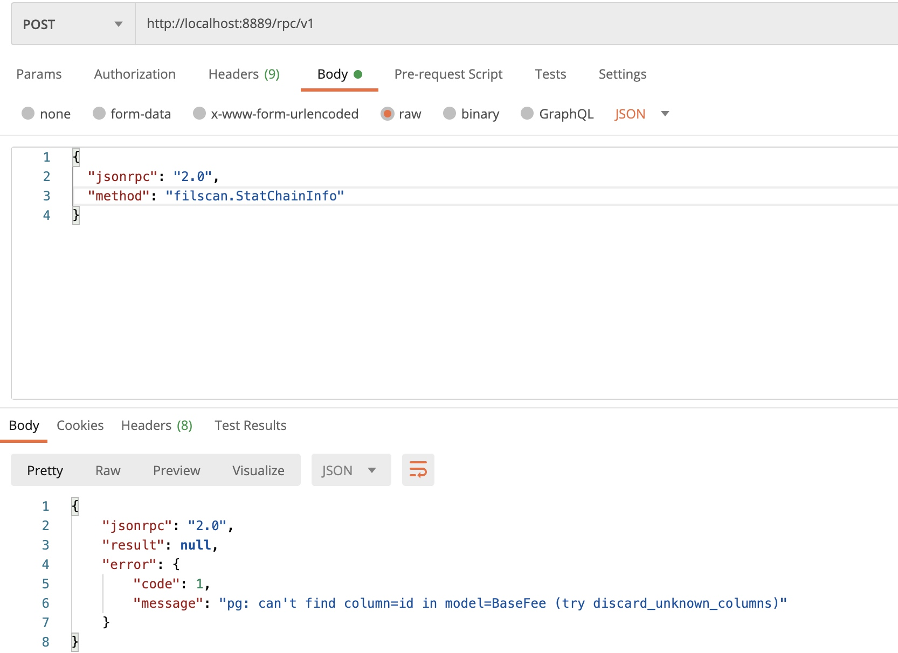

### 分析慢查询
```
SELECT 
  pid, 
  datname AS db, 
  query_start AS start,
  now() - query_start AS lap, 
  wait_event_type,wait_event,
  query 
FROM pg_stat_activity 
WHERE state <> 'idle' and query not like '%pg_stat_activity%'
  and (now() - query_start) > interval '3 seconds';
```
  
  如下， 查到慢查询： select distinct method_name, from like
  lotus_messages表非常大， 导致


像distanct， like等语句，尽量不要， 秽导致慢查询

### 服务器日志记录慢查询

自己的.ssh/id_rsa.pub 贴到 192.168.1.185服务器的.ssh/authorized_keys 文件里， ssh 免密登陆

/data/chain-info/code/cron-info.log 过滤关键子： ··
cost time:

### 统计全网每天奖励， 每天新增新增， 每天算力
```

SELECT
				base.day,
				(base.rewards/pow(10, 18))::INT AS rewards,
		     ( (base.rewards - lead(base.rewards) OVER w)/pow(10, 18))::INT AS increased,
				 (power/pow(2, 40))::INT as power
		FROM
		(SELECT to_timestamp(block_time)::date AS day,
		      max(sigma_rewards) AS rewards,
		      max(net_quality_adj_power) AS power
		FROM lotus_tipsets
		WHERE  block_time >= 1616828989 - 86400*218 AND block_time <= 1616828989
		GROUP BY 1
		ORDER BY day DESC) base
		WINDOW w AS (ORDER BY base.day DESC) LIMIT 210
```


### 有分区的查询，要加上索引
and block_time >= 1616515200 
and block_time < 1616601600 

不能只用order by block_time

### to 是关键字， 要用双引号，不然有语法错误


计算矿工的封装费用的： 

```
SELECT sum(basefee_burn+over_estimation_burn+miner_tip) as burn  
from lotus_messages 
where  block_time >= 1616515200 
and block_time < 1616601600 
and “to”='f0127595'
and method_name='PreCommitSector'
```
pg语法， 字段要用双引号

　有客作礼而问曰。余生晚。机钝寡闻。自昔至今伶俜湖海。处静进功。量力未得。若即旅次不假道场。六时三业皆可奉行。伏愿弘慈曲垂方便。答世。人欲修三昧必百事具足然后发行。今子之志拔乎类矣。念佛三昧普摄群机。四威仪中皆为道用。子若力行。最初当立不欺心。藏德露玭。慎毋矜耀。从脚跟下便内外稳当。熟读净土经咒忏法极令通利。习所行威仪使端庄雅重。乃如前说起真信心。运大悲智。普为众生。如理观察二土净薉。苦乐两报实可厌忻。清净身心随分净服。于六斋日具蕞尔香华供三宝前。拜跪稽颡。立广大愿。在处生世以此为归。更不中悔。是日为始至形寿尽。每日六时修行此法。香灯有无毋固必矣。问。三昧一心。人事万绪。如何修行不相妨碍。答。如鸟入笼。身在笼。心忆园林。两不妨碍。笼系身不能系彼求出之心。事拘身不能拘我愿往之志。三界如笼。此身如鸟。求出即愿往园林。乃净土也。故知妄缘万绪不碍真心。日三夜三若有像处。或自有像随身。当口诵身礼。或默诵身礼。如无佛像或对经卷。或面西遥礼。或除东向随方修礼。若在道登舟及治身动用之事不可拨置。则佛事世事同运。念此世务本为养身。我身行道。世务即与三昧同体。问。心无二用。如何二事同运。答。一心不妨眼见耳闻身作心忆。应用无尽何止二事。便就动用中一心诵小弥陀经一卷。或上品。或楞严势至章。及诵净土咒或三或七至百多遍。又称佛号或三五百至千。为入忏佛事。回向已方入忏。随其文义节段。想我身恭对净土佛前。或形像佛前。跪拜瞻绕一一明了。不使昏乱。礼毕观白毫相等。量时而止。如前诵经咒佛号回向。此想礼与前道场行法同。但身礼异耳。其音随人境好恶而轻重之。当令声默相半沉大雅重。俾两肩隐闻。切不可与人多语。先于佛前烧香一炷。或拈物为香。至时但运想耳。余时宜独坐独行。远离喧杂及聚首闲谈戏谑侮弄哂笑歌叹吟咏笔砚。使人忘失正念等事。


chain-info生产, 
地址:13.115.185.218
项目目录:/home/filscan-test/backend/code
1月29日 11:08
1
ssh 进去以后,切换到root用户:
2
sudo su -
3
cd /home/filscan-test/backend/code
4
上传你的新版本chian-info-新版本, 然后更新软连接:
5
ln -s -f ./chain-info-新版本 ./chain-info
6
kill chain-info进程
7
./start.sh


### 对没有索引的字段， 查询会导致逐个扫描， 会非常慢
sector_size没有索引， 下面的查询非常慢：
```
SELECT * from lotus_miners WHERE sector_size=34359738368 and epoch >= 599000 and  epoch < 600000 order by epoch desc limit 1;
```


### 禁止本机以外的地址访问本服务
bind = "127.0.0.1" 表示只允许本地访问， 其他地址不能访问， 如本地地址为192.168.19.84， 而：


直接显示这个错误； 


### 反射


### 反射应用之一： 实现rpc调用


### 缺少主键
没有主键的表， 打开时报错：


可以在唯一索引上建立主键：
```
Height        int             `gorm:"primary_key;unique_index:height_index;type:bigint(20);comment:'fil'" json:"height"`
```
automigrage后有： 


### 建立唯一索引
```
Height        int             `gorm:"primary_key;unique_index:height_index;type:bigint(20);comment:'fil'" json:"height"`
```


夜中人定境寂。用功正宜不同。生死事大岂随懈怠而恣睡眠。纵寒暑之极。慎勿脱衣。法服数珠宜置近处。手巾净水不离坐隅。或有所需皆应预备。又应观彼信根厚薄。不恼他人。不使人厌。于此无碍。则当微出其声如琴如瑟。细而沉重。大而不雌。使天神欢喜。鬼畜闻声。其功弥深。或在船及他家卑隈处。皆当察境察人。一心精进方便宛转以竭其行。切不可于中起人之过彰人之恶。又不可尽人之欢倾人之美。时闲处便而有他事异人为碍者。亦当择僻处端坐面西合掌至膺。声嘿随宜。如前想礼。又作务时一句一拜未圆。事讫。身闲当身礼圆满。佛前礼时忽有他事急为。一句一拜未圆。当随作处想礼圆满。切不可入忏未多而重起忏。又想礼盖不得已。不可暇时亦想礼。又不可想礼于作务时而闲时反虚掷也。浅信人不可遽然劝修。深信人不可不密启之使其自肯。又不可使功归己。如春育物不见其功。依道场修。顺中易行。从客中修。逆中易行。逆中易行其功益著。问。想与身同否。答。意为身口之主。主既注想。焉得不及身口。如运香华身心遍至。岂不亦但念想。问。若尔。可不运身口耶。答。意业虽胜。若全身口。名三业圆修。问。六时之外如何用心。答。观佛相好．持咒．诵经．称名．顶礼等行。念念不舍克期往生。如行路。人步紧到速。步缓到迟。当如是用心也。若身心力弱不能具修六时。但克定每日若干时。虽不厌加多。亦不可一时增减而改其所立之行。问。若尔。道场所修为不必耶。答。如人堕海求船未得。忽遇横木执之达岸。岂可有船必求其木。况客中去住随主厌忻。得无挂碍。可不进功。如上为客途所修三昧。境界甚深。四三昧中名非行非坐三昧。亦名随顺四威仪三昧。正被大机。小智小根随分受益。余观世人闻易即作易想。妄谓得证。闻难即生退屈。尽失其志。信心切者又入邪见。密相传授。以误多人。其传授之法千形万状。有不可闻者。皆能罗罩人心。非行渐张。师徒俱陷。岂能若尔正心下问之切也。此既可修。则一切奔驰世务流荡四方。邸店市廛百工伎艺。奴婢黄门受人驱役。及被牢狱者。未有不可修时。况出家四众。在家四民。有居有暇。所欲皆具。得自在者宁不进其行也。客名行一。字志西。自言读智觉禅师万善同归集甚熟。后游庐山见远公遗迹。因发愿念佛云。
### 本地地址添加代理ip服务器的百名单 
获取本主机公网ip地址

得到

将这个地址添加到海量ip的百名单里：


点击打开链接：

可以看到分配了ip
```
{"Claims": {"/": "bafy2bzaceajsoxvvl7kpsvcegconsvjui3b6v6vb564m5tcqnrdmowi6zyjhi"}, "MinerCount": 25333, "CronEventQueue": {"/": "bafy2bzacecomni2qh5zfipvzeojh4xs7zsi2t2gy4wjehu4bq7cdd5ghazina"}, "FirstCronEpoch": 450616, "TotalRawBytePower": "2476284697546588160", "TotalBytesCommitted": "2476872627029803008", "ProofValidationBatch": null, "TotalQualityAdjPower": "2476675206600261632", "ThisEpochRawBytePower": "2476284697546588160", "TotalPledgeCollateral": "33723763523854197855663208", "TotalQABytesCommitted": "2477263155331923968", "MinerAboveMinPowerCount": 1060, "ThisEpochQAPowerSmoothed": {"PositionEstimate": "841816222345035920745067969164119436377358501819842926548", "VelocityEstimate": "3239973013640125633924499096181203450380766386691539"}, "ThisEpochQualityAdjPower": "2476675206600261632", "ThisEpochPledgeCollateral": "33723763523854197855663208"}


{"Claims": {"/": "bafy2bzacebzzyzhdeqag2use76uryrfgx4qiikkzxtbwbhjw3szw5v3hjhfoy"}, "MinerCount": 25333, "CronEventQueue": {"/": "bafy2bzacec65r3tvspzvq7j4wlub2feoijkccybeqeatu7rrct6km22aiufdw"}, "FirstCronEpoch": 450614, "TotalRawBytePower": "2476283872912867328", "TotalBytesCommitted": "2476877574832128000", "ProofValidationBatch": null, "TotalQualityAdjPower": "2476674381966540800", "ThisEpochRawBytePower": "2476283872912867328", "TotalPledgeCollateral": "33723494133744057422247589", "TotalQABytesCommitted": "2477268103134248960", "MinerAboveMinPowerCount": 1060, "ThisEpochQAPowerSmoothed": {"PositionEstimate": "841807975315131780843377741446014310621385461452538251815", "VelocityEstimate": "3239430219799008033116474695019713807226536996845021"}, "ThisEpochQualityAdjPower": "2476674381966540800", "ThisEpochPledgeCollateral": "33723494133744057422247589"}


{"Claims": {"/": "bafy2bzaceb3zr4epodaei6xgk46xyhqadhaliktfvmv6nooknm6m4ptrkq7co"}, "MinerCount": 25333, "CronEventQueue": {"/": "bafy2bzacechu4qq5xhgiwuyfzzorxhq7bj3yg2dyou4gkwjrixgofrlyb4aai"}, "FirstCronEpoch": 450599, "TotalRawBytePower": "2475895573509570560", "TotalBytesCommitted": "2476489962623598592", "ProofValidationBatch": null, "TotalQualityAdjPower": "2476285777957027840", "ThisEpochRawBytePower": "2475895573509570560", "TotalPledgeCollateral": "33721448900726147235660425", "TotalQABytesCommitted": "2476880186319503360", "MinerAboveMinPowerCount": 1060, "ThisEpochQAPowerSmoothed": {"PositionEstimate": "841746406575968822986796717474774047704164757281816897478", "VelocityEstimate": "3235435889954835535937620765589234920335635137733438"}, "ThisEpochQualityAdjPower": "2476285777957027840", "ThisEpochPledgeCollateral": "33721448900726147235660425"}
```


### 超时访问


### 限流访问
限流访问， 对api做限流， 如果一个api太频繁， 识别到这个ip， 对这个IP做如下返回：
```
{
        "statusCode": 429,
        "error": "Too Many Requests",
        "message": "Rate limit exceeded, retry in 1 minute"
}
```
这时就没法得到他的数据了

### 线上hotfix
线上分支需要用master分支， 
测试环境要用test分支， 
如果测试环境也用master分支， 有时需要线上解决问题时， 这时master已经提交很多了， 这些没有详细测试， 为了解决一个紧急问题， 需要把这些没有测试的提交都进入到线上版本，这是有极大风险的， 是不允许的。 

线上紧急解决问题， 叫做hotfix, 需要在那个发布版本时的提交点，切出一个分支出来， 这个分支一般命名为hotfix分之， 然后在这个分支上，再fix提交，然后在这个临时分支发布版本， 所以每次发布线上发布版本时， 要用这个提交号。 如果没有提交， 就可以在当钱master直接提交。  

### 浏览器端查看rpc
http方式的rpc 参数在 requestpayload里面：

在新的岁月里，祝愿每个人都健康，平安， 财富自由， 有更多的正能量

### http方式的rpc api接口的声明文件与接口的实现文件
接口的包名为为rpc方法的前缀， 这里包名为filscan.
接口的声明文件为api.go
接口的实现文件为impl.go


### pgsql 类型没写全字段， 报错


报错： 

解决办法： 类型里加一个字段：

即： 如果 select * ， 那么对象类型里要容纳所有的字段。 


### git status 看到 extern/有提交， 要git submodule update --init --recursive


### jekins
构建长时间没反应， 

可以查看控制台输出： 

第一次构建会下载第三方代码：


http://192.168.1.185/#/address/detail?address=f052429
### jekins 新建时，可以从原有的复制过来

在复制里输一个字符， 就有已有的项目， 
所有的配置项目都和原油的一直。 


### pgsql:  window 查询30天算力趋势图

```sql
SELECT 
		*
FROM
(SELECT to_timestamp(block_time)::date AS day,
       max(net_quality_adj_power) AS power
FROM lotus_tipsets
WHERE  block_time >= 1609430400 AND block_time < 1612108800
GROUP BY 1
ORDER BY day DESC) base
WINDOW w AS (ORDER BY base.day DESC) LIMIT 30
```


### pgsql:  统计每天算力， 再加上每天的新增算力

```sql
SELECT 
		day,
		power,
		(base.power - lead(base.power) OVER w) AS increased
FROM
(SELECT to_timestamp(block_time)::date AS day,
       max(net_quality_adj_power) AS power
FROM lotus_tipsets
WHERE  block_time >= 1609430400 AND block_time < 1612108800
GROUP BY 1
ORDER BY day DESC) base
WINDOW w AS (ORDER BY base.day DESC) LIMIT 30
```


### 连接没关， 超过限制连接池限制， 导致pg数据库没反应

```json
{"Claims": {"/": "bafy2bzacebilf6bcdfizf4aozvz3e3fm2tyy63z6ldlf67o3snbfjbo6qptrg"}, "MinerCount": 25705, "CronEventQueue": {"/": "bafy2bzacebfsslgei3fungoznk5mqv3vmtinbqz46lurl43tn72t6z3lqqm3w"}, "FirstCronEpoch": 468149, "TotalRawBytePower": "2626616043329552384", "TotalBytesCommitted": "2627190813032972288", "ProofValidationBatch": null, "TotalQualityAdjPower": "2627130202754875392", "ThisEpochRawBytePower": "2626616043329552384", "TotalPledgeCollateral": "35466975376044844050748045", "TotalQABytesCommitted": "2627704991706742784", "MinerAboveMinPowerCount": 1123, "ThisEpochQAPowerSmoothed": {"PositionEstimate": "893974282535353253965660431331790991136404327440817423927", "VelocityEstimate": "3141338273791504296067148645107963086964651045810581"}, "ThisEpochQualityAdjPower": "2627130202754875392", "ThisEpochPledgeCollateral": "35466975376044844050748045"}
```

### 表的分区， 导致了慢， 导致其他查询都跟着慢


###  结果集可查多少个json项

ctl+f 可以看到有多少个相同项


### B+树的查找时间复杂度， 与插入时间复杂度
就怕删除， 和乱序， 乱序插入就是先插入了100， 又插入了99， 又插入了101， 乱序，是插入乱序。 B+树 插入如果顺序， 插入的速率是最好的，顺寻插入， 表可以保持稳定状态。 

查找的时间复杂度可以达到 logN， 是最优的， 

插入的时间复杂度， 就会大很多， 

### 查询必须写上索引区间， 不然会对所有数据排序， 
如下会对所有数据排序， 

虽然epoch是索引， 但也会对所有数据排序， 

下面的写法只会对索引区间排序， 查询是很快的：


最好学会用explain 分析查询速度。 

basefee 趋势图起点时间修改

    


增加推荐值优化相关接口
调试推荐值优化相关接口，根据地址找到actorId， 根据actorId，动态获取消息id对应的消息类型  Send方法名改为transfer， 接口缓存与返回值修改，
查询加索引区间
处理代打包消息列表显示慢的问题
处理Forcepool 未提现用户的账户余额查询

### 两个 join 的查询
需要讲一个join的查询结果作为子查询， 将子查询结果再与另外一个表 join ， 如：
```sql
select s.*, pr.name as product_name from (
select 
u.name,
u.phone,
u.email,
u.buy_space+u.other_space,
p.pid as pid,
p.buy_power
from user u 
LEFT JOIN purchase_orders p 
on u.code = p.code
) s 
LEFT JOIN product pr 
on s.pid = pr.id
ORDER BY s.phone
```


在注意一下，获取全部子查询的写法：
``` 
s.*, pr.name
```
s.* 获取了全部的子查询

### 两个表都有效，才算有效
purchase_orders 表和product 表都有product id， 这个订单才算有效

```sql
select s.name, s.phone,  s.space, sum(s.buy_power) from
(select 
u.name,
u.phone,
u.email,
u.buy_space+u.other_space as space,
p.buy_power as buy_power,
p.pid as pid
from user u 
inner JOIN purchase_orders p 
on u.code = p.code 
) s 
inner JOIN product pr
on s.pid = pr.id
GROUP BY s.phone 
```


### gaslimit 过大会被惩罚


### chaininfo 生产
```
chain-info生产, 
地址:13.115.185.218
项目目录:/home/filscan-test/backend/code
```

### pg表示： 一个字符串在一个字符串数组里面
```
SELECT sum(miner_penalty)*3 as msg_penalty
							FROM lotus_messages lm
									 LEFT JOIN lotus_blocks lb
											   ON lm.block_time = lb.block_time AND lm.blk_cids @> ARRAY [lb.cid]
							WHERE lb.block_time >= ?
							  AND lb.block_time < ?
							  AND lb.bad = FALSE
							  AND lm.epoch > 0  AND lm.miner_penalty > 0
                              AND lb.miner = ?

```
里面的lm.blk_cids @> ARRAY [lb.cid]
表示lb.cid 在lm.blk_cids 数组里面


### 高度信息


### pool_rewards


###  分支保护


###  生产服务器
chain-info生产, 
地址:13.115.185.218
项目目录:/home/filscan-test/backend/code
ssh 进去以后,切换到root用户:
sudo su -
cd /home/filscan-test/backend/code
上传你的新版本chian-info-新版本, 然后更新软连接:
ln -s -f ./chain-info-新版本 ./chain-info
kill chain-info进程
./start.sh
ssh 进去以后,切换到root用户:
sudo su -
cd /home/filscan-test/backend/code
上传你的新版本chian-info-新版本, 然后更新软连接:
ln -s -f ./chain-info-新版本 ./chain-info
kill chain-info进程
./start.sh

### 测试服务器


### 传入的参数类型与代码规定的不一致， 导致返回报参数错误


代码中规定的： 


###  加上--recursive，才可以下载代码
```
➜  ChainInfo git:(local-filscan-master) ✗ git submodule update --init

➜  ChainInfo git:(local-filscan-master) ✗ git submodule update --init --recursive
子模组路径 'extern/ChainSyncer/extern/filecoin-ffi'：检出 'b6e0b35fb49ed0fedb6a6a473b222e3b8a7d7f17'
子模组路径 'extern/ChainSyncer/extern/serialization-vectors'：检出 '5bfb928910b01ac8b940a693af2884f7f8276211'
子模组路径 'extern/ChainSyncer/extern/test-vectors'：检出 'd9a75a7873aee0db28b87e3970d2ea16a2f37c6a'
子模组路径 'extern/ChainSyncer/extern/test-vectors/gen/extern/fil-blst'：检出 '5f93488fc0dbfb450f2355269f18fc67010d59bb'
子模组路径 'extern/ChainSyncer/extern/test-vectors/gen/extern/filecoin-ffi'：检出 'f640612a1a1f7a2dd8b3a49e1531db0aa0f63447'
```
make build不过，因为缺少子仓库


### 代码质量        
代码： 最好的代码都是写出来的


### goland 可以直接test 运行


### XHR 只过滤出接口


### 接口耗用时间查看


### 将多个提交合并成一个提交
git log --pretty=oneline --abbrev-commit --graph
git rebase -i  03031746
git push --set-upstream origin filscan-msg


### 什么都没返回， 表示服务没启动


###  文件路径找不到的排查
docker 里的路径和宿主机路径的映射：

用docker inspect a8 看到：
```
   "Mounts": [
            {
                "Type": "bind",
                "Source": "/home/forcepool/backend-user/static",
                "Destination": "/root/static",
                "Mode": "rw",
                "RW": true,
                "Propagation": "rprivate"
            },
            {
                "Type": "bind",
                "Source": "/home/forcepool/backend-user/code",
                "Destination": "/root/www/code",
                "Mode": "rw",
                "RW": true,
                "Propagation": "rprivate"
            },
            {
                "Type": "bind",
                "Source": "/etc/localtime",
                "Destination": "/etc/localtime",
                "Mode": "rw",
                "RW": true,
                "Propagation": "rprivate"
            }
        ],
```
看到source和destimation， 进程运行在docker里面， 要用desctinaiton的路径。 

### postman 下载pdf文件


点save to file. 

404 表示服务已启动， 但服务器上没有这个文件

### 子仓库chainsyncer 版本号更新

先到chainsyncer 项目目录， 更新到最新， 获取指定分支的版本号，  注意不是chaininfo下的chainsyncer 目录
```
➜  ChainSyncer git:(local_actor_msg_count) ✗ git log  
➜  ChainSyncer git:(local_actor_msg_count) ✗ git fetch --all
正在获取 origin
remote: Counting objects: 1547, done.
remote: Compressing objects: 100% (795/795), done.
remote: Total 1547 (delta 952), reused 1141 (delta 738)
接收对象中: 100% (1547/1547), 3.28 MiB | 11.58 MiB/s, 完成.
处理 delta 中: 100% (952/952), 完成.
来自 gitlab.forceup.in:ChainService/ChainSyncer
 * [新分支]              force/ft/optmize -> origin/force/ft/optmize
   0d4e1ec63..de1862a7e  force/utimate2   -> origin/force/utimate2
 + 14a1aea94...f6e4295e2 master           -> origin/master  (强制更新)
 * [新分支]              master_bak_0308  -> origin/master_bak_0308
 * [新标签]              before-merge-v1.5.0 -> before-merge-v1.5.0
 * [新标签]              force.v.1.50        -> force.v.1.50
 * [新标签]              force_stablev1.5.0  -> force_stablev1.5.0
 * [新标签]              force_v1.5.0-rc2    -> force_v1.5.0-rc2
 * [新标签]              v1.4.2              -> v1.4.2
 * [新标签]              v1.4.2-rc1          -> v1.4.2-rc1
 * [新标签]              v1.5.0              -> v1.5.0
 * [新标签]              v1.5.0-rc1          -> v1.5.0-rc1
 * [新标签]              v1.5.0-rc2          -> v1.5.0-rc2
warning: 82f1558cda4c68b8a59626333e1d6efa5cc68db0:.gitmodules, multiple configurations found for 'submodule.extern/filecoin-ffi.path'. Skipping second one!
warning: 82f1558cda4c68b8a59626333e1d6efa5cc68db0:.gitmodules, multiple configurations found for 'submodule.extern/filecoin-ffi.url'. Skipping second one!
warning: 82f1558cda4c68b8a59626333e1d6efa5cc68db0:.gitmodules, multiple configurations found for 'submodule.extern/serialization-vectors.path'. Skipping second one!
warning: 82f1558cda4c68b8a59626333e1d6efa5cc68db0:.gitmodules, multiple configurations found for 'submodule.extern/serialization-vectors.url'. Skipping second one!
warning: 82f1558cda4c68b8a59626333e1d6efa5cc68db0:.gitmodules, multiple configurations found for 'submodule.extern/test-vectors.path'. Skipping second one!
warning: 82f1558cda4c68b8a59626333e1d6efa5cc68db0:.gitmodules, multiple configurations found for 'submodule.extern/test-vectors.url'. Skipping second one!
正在获取子模组 extern/filecoin-ffi
来自 https://github.com/filecoin-project/filecoin-ffi
 * [新分支]          feat-aggregation  -> origin/feat-aggregation
 * [新分支]          feat-aggregation2 -> origin/feat-aggregation2
   62f89f1..b6e0b35  master            -> origin/master
 * [新标签]          b6e0b35fb49ed0fe  -> b6e0b35fb49ed0fe
 * [新标签]          951d66ae93f6f4d3  -> 951d66ae93f6f4d3
➜  ChainSyncer git:(local_actor_msg_count) ✗ git branch -vv
➜  ChainSyncer git:(local_actor_msg_count) ✗ git remote -v                    
origin  git@gitlab.forceup.in:ChainService/ChainSyncer.git (fetch)
origin  git@gitlab.forceup.in:ChainService/ChainSyncer.git (push)
➜  ChainSyncer git:(local_actor_msg_count) ✗ git checkout -b force/master origin/master
error: 您对下列文件的本地修改将被检出操作覆盖：
        lotuspond/front/src/chain/methods.json
请在切换分支前提交或贮藏您的修改。
正在终止
➜  ChainSyncer git:(local_actor_msg_count) ✗ git chekcout .
git：'chekcout' 不是一个 git 命令。参见 'git --help'。

最相似的命令是
        checkout
➜  ChainSyncer git:(local_actor_msg_count) ✗ git checkout .
从索引区更新了 2 个路径
➜  ChainSyncer git:(local_actor_msg_count) ✗ git status
位于分支 local_actor_msg_count
您的分支与上游分支 'origin/force/ft/actor_msg_count' 一致。

未跟踪的文件:
  （使用 "git add <文件>..." 以包含要提交的内容）
        extern/fil-blst/
        extern/oni/
        trace-crawler

提交为空，但是存在尚未跟踪的文件（使用 "git add" 建立跟踪）
➜  ChainSyncer git:(local_actor_msg_count) ✗ rm -rf extern/fil-blst 
➜  ChainSyncer git:(local_actor_msg_count) ✗ rm -rf extern/oni 
➜  ChainSyncer git:(local_actor_msg_count) ✗ rm -rf trace-crawler 
➜  ChainSyncer git:(local_actor_msg_count) git status
位于分支 local_actor_msg_count
您的分支与上游分支 'origin/force/ft/actor_msg_count' 一致。

无文件要提交，干净的工作区
➜  ChainSyncer git:(local_actor_msg_count) git checkout -b force/master origin/master
warning: unable to rmdir 'extern/blst': Directory not empty
M       extern/filecoin-ffi
分支 'force/master' 设置为跟踪来自 'origin' 的远程分支 'master'。
切换到一个新分支 'force/master'
➜  ChainSyncer git:(force/master) ✗ git submodule update --init --recursive
子模组路径 'extern/filecoin-ffi'：检出 'b6e0b35fb49ed0fedb6a6a473b222e3b8a7d7f17'
➜  ChainSyncer git:(force/master) ✗ git status
位于分支 force/master
您的分支与上游分支 'origin/master' 一致。

未跟踪的文件:
  （使用 "git add <文件>..." 以包含要提交的内容）
        extern/blst/

提交为空，但是存在尚未跟踪的文件（使用 "git add" 建立跟踪）
➜  ChainSyncer git:(force/master) ✗ rm -rf extern/blst
➜  ChainSyncer git:(force/master) git status
位于分支 force/master
您的分支与上游分支 'origin/master' 一致。

无文件要提交，干净的工作区
➜  ChainSyncer git:(force/master) git log
➜  ChainSyncer git:(force/master) 
```
拿到版本号：f6e4295e20334fe94cdcc3ef7e3049b1c02b8085

到chain-info 更新子仓库版本号：

```
➜  ChainInfo git:(filscan-msg) git submodule 
 db065f4c4c4c53114b5b654ee975d713950379c9 extern/ChainSyncer (force_v1.5.0-rc2-59-gdb065f4c4)
➜  ChainInfo git:(filscan-msg) git status
位于分支 filscan-msg
您的分支与上游分支 'origin/filscan-msg' 一致。

无文件要提交，干净的工作区
➜  ChainInfo git:(filscan-msg) cd extern/ChainSyncer 
➜  ChainSyncer git:(db065f4c4) git brach
git：'brach' 不是一个 git 命令。参见 'git --help'。

最相似的命令是
        branch
➜  ChainSyncer git:(db065f4c4) git checkout f6e4295e20334fe94cdcc3ef7e3049b1c02b8085
fatal: 引用不是一个树：f6e4295e20334fe94cdcc3ef7e3049b1c02b8085
➜  ChainSyncer git:(db065f4c4) git fetch --all
正在获取 origin
remote: Counting objects: 58, done.
remote: Compressing objects: 100% (51/51), done.
remote: Total 58 (delta 19), reused 33 (delta 7)
展开对象中: 100% (58/58), 120.99 KiB | 2.33 MiB/s, 完成.
来自 gitlab.forceup.in:ChainService/ChainSyncer
 * [新分支]              force/ft/optmize -> origin/force/ft/optmize
   db065f4c4..de1862a7e  force/utimate2   -> origin/force/utimate2
 + 14a1aea94...f6e4295e2 master           -> origin/master  (强制更新)
 * [新分支]              master_bak_0308  -> origin/master_bak_0308
 * [新标签]              force_stablev1.5.0 -> force_stablev1.5.0
➜  ChainSyncer git:(db065f4c4) git checkout f6e4295e20334fe94cdcc3ef7e3049b1c02b8085
之前的 HEAD 位置是 db065f4c4 out put details for collection headers
HEAD 目前位于 f6e4295e2 Merge branch 'force/ft/optmize' into 'master'
➜  ChainSyncer git:(f6e4295e2) git checkout origin/master
HEAD 目前位于 f6e4295e2 Merge branch 'force/ft/optmize' into 'master'
➜  ChainSyncer git:(f6e4295e2) git log
➜  ChainSyncer git:(f6e4295e2) git submodule update --init --recursive
➜  ChainSyncer git:(f6e4295e2) cd ../
➜  extern git:(filscan-msg) ✗ git status
位于分支 filscan-msg
您的分支与上游分支 'origin/filscan-msg' 一致。

尚未暂存以备提交的变更：
  （使用 "git add <文件>..." 更新要提交的内容）
  （使用 "git restore <文件>..." 丢弃工作区的改动）
        修改：     ChainSyncer (新提交)

修改尚未加入提交（使用 "git add" 和/或 "git commit -a"）
➜  extern git:(filscan-msg) ✗ git status
位于分支 filscan-msg
您的分支与上游分支 'origin/filscan-msg' 一致。

尚未暂存以备提交的变更：
  （使用 "git add <文件>..." 更新要提交的内容）
  （使用 "git restore <文件>..." 丢弃工作区的改动）
        修改：     ChainSyncer (新提交)

修改尚未加入提交（使用 "git add" 和/或 "git commit -a"）
➜  extern git:(filscan-msg) ✗ git diff
➜  extern git:(filscan-msg) ✗ git add -A
➜  extern git:(filscan-msg) ✗ git status
位于分支 filscan-msg
您的分支与上游分支 'origin/filscan-msg' 一致。

要提交的变更：
  （使用 "git restore --staged <文件>..." 以取消暂存）
        修改：     ChainSyncer

➜  extern git:(filscan-msg) ✗ git commit -m'update submodule chainsyncer'
[filscan-msg d97a4ead] update submodule chainsyncer
 1 file changed, 1 insertion(+), 1 deletion(-)
➜  extern git:(filscan-msg) git push
枚举对象: 5, 完成.
对象计数中: 100% (5/5), 完成.
使用 12 个线程进行压缩
压缩对象中: 100% (2/2), 完成.
写入对象中: 100% (3/3), 317 字节 | 317.00 KiB/s, 完成.
总共 3（差异 1），复用 0（差异 0），包复用 0
remote: 
remote: To create a merge request for filscan-msg, visit:
remote:   https://gitlab.forceup.in/ChainService/ChainInfo/merge_requests/new?merge_request%5Bsource_branch%5D=filscan-msg
remote: 
To gitlab.forceup.in:ChainService/ChainInfo.git
   30689841..d97a4ead  filscan-msg -> filscan-msg
➜  extern git:(filscan-msg) git status
位于分支 filscan-msg
您的分支与上游分支 'origin/filscan-msg' 一致。

无文件要提交，干净的工作区
➜  extern git:(filscan-msg) git submodule
 f6e4295e20334fe94cdcc3ef7e3049b1c02b8085 ChainSyncer (force_stablev1.5.0-5-gf6e4295e2)

```

这时 子仓库号f6e4295e20334fe94cdcc3ef7e3049b1c02b8085 和 chainsyncer代码目录 是同一个， 就对了


### git status 看到extern/ChainSyncer (新提交)， 不能切到别的分支的解决办法
 rm -rf extern/ChainSyncer 
git submodule update --init 
可以消除extern/ChainSyncer (新提交)
```
➜  ChainInfo git:(filscan) ✗ git status
位于分支 filscan
您的分支落后 'origin/filscan' 共 347 个提交，并且可以快进。
  （使用 "git pull" 来更新您的本地分支）

尚未暂存以备提交的变更：
  （使用 "git add <文件>..." 更新要提交的内容）
  （使用 "git restore <文件>..." 丢弃工作区的改动）
        修改：     extern/ChainSyncer (新提交)

修改尚未加入提交（使用 "git add" 和/或 "git commit -a"）
➜  ChainInfo git:(filscan) ✗ pwd
/Users/zhenglun1/goworkspace/ChainInfo
➜  ChainInfo git:(filscan) ✗ cd extern 
➜  extern git:(filscan) ✗ rm -rf ChainSyncer 
➜  extern git:(filscan) ✗ cd ..
➜  ChainInfo git:(filscan) ✗ git submodule update --init            
子模组路径 'extern/ChainSyncer'：检出 '3816b51be8643003a1f5be8cf2b89022be06da25'
➜  ChainInfo git:(filscan) git status
位于分支 filscan
您的分支落后 'origin/filscan' 共 347 个提交，并且可以快进。
  （使用 "git pull" 来更新您的本地分支）

无文件要提交，干净的工作区
```
### extern/chainsyncer 和他人提交冲突的解决办法
执行git merge --abort命令回到解决冲突之前的状态

git merge filscan
git merge --abort
git submodule update --init
git push

git status 提示
双方修改：     extern/ChainSyncer (新提交)
当有这个冲突时， 可以用git merge --abort 来解决冲突， git status 就不会看到有冲突了


### git status  修改：     extern/ChainSyncer (修改的内容, 未跟踪的内容) 的解决办法
问题描述：
```
➜  ChainInfo git:(filscan-msg) git status . 
位于分支 filscan-msg
您的分支与上游分支 'origin/filscan-msg' 一致。

尚未暂存以备提交的变更：
  （使用 "git add <文件>..." 更新要提交的内容）
  （使用 "git restore <文件>..." 丢弃工作区的改动）
  （提交或丢弃子模组中未跟踪或修改的内容）
        修改：     extern/ChainSyncer (修改的内容, 未跟踪的内容)

```

解决办法； 
```
➜  ChainInfo git:(filscan-msg) ✗ cd extern 
➜  extern git:(filscan-msg) ✗ rm -rf ChainSyncer 
➜  extern git:(filscan-msg) ✗ cd ..
➜  ChainInfo git:(filscan-msg) ✗ git submodule update --init 
子模组路径 'extern/ChainSyncer'：检出 'f6e4295e20334fe94cdcc3ef7e3049b1c02b8085'
➜  ChainInfo git:(filscan-msg) ✗ git status 
位于分支 filscan-msg
您的分支与上游分支 'origin/filscan-msg' 一致。
```

将子仓库的子仓库也同步下来：
```
➜  ChainInfo git:(filscan-msg) ✗ git submodule update --init --recursive
子模组路径 'extern/ChainSyncer/extern/filecoin-ffi'：检出 'b6e0b35fb49ed0fedb6a6a473b222e3b8a7d7f17'
子模组路径 'extern/ChainSyncer/extern/serialization-vectors'：检出 '5bfb928910b01ac8b940a693af2884f7f8276211'
子模组路径 'extern/ChainSyncer/extern/test-vectors'：检出 'd9a75a7873aee0db28b87e3970d2ea16a2f37c6a'
子模组路径 'extern/ChainSyncer/extern/test-vectors/gen/extern/fil-blst'：检出 '5f93488fc0dbfb450f2355269f18fc67010d59bb'
子模组路径 'extern/ChainSyncer/extern/test-vectors/gen/extern/filecoin-ffi'：检出 'f640612a1a1f7a2dd8b3a49e1531db0aa0f63447'
```

### 计算count查询，避免or查询做的优化


避免类似这样的查询： "actor_addr=?" or "actor=?"

### pg 查询的钩子函数
db 链接初始化时， 设置钩子函数， 

钩子函数可以设置查询前后的动作： 

查询后， 统计查询耗时， 如果超过1秒， 或设置了showquery， 就把查询语句和耗时打印出来。 


###  make 开始就停止的问题
```
➜  ChainInfo git:(filscan-msg) make
make -C ./extern/ChainSyncer clean
make[1]: *** No rule to make target `clean'.  Stop.
make: [clean-deps] Error 2 (ignored)
make -C ./extern/ChainSyncer deps
make[1]: *** No rule to make target `deps'.  Stop.
make: *** [build-deps] Error 2

```


make 之前要把子仓库下载好, 解决办法：
```
➜  ChainInfo git:(filscan-msg) git submodule update --init --recursive
子模组路径 'extern/ChainSyncer'：检出 '36704cb07986e07f5b7b5cb9aa3c99fe1c71a3ab'
子模组路径 'extern/ChainSyncer/extern/filecoin-ffi'：检出 'b6e0b35fb49ed0fedb6a6a473b222e3b8a7d7f17'
子模组路径 'extern/ChainSyncer/extern/serialization-vectors'：检出 '5bfb928910b01ac8b940a693af2884f7f8276211'
子模组路径 'extern/ChainSyncer/extern/test-vectors'：检出 'd9a75a7873aee0db28b87e3970d2ea16a2f37c6a'
子模组路径 'extern/ChainSyncer/extern/test-vectors/gen/extern/fil-blst'：检出 '5f93488fc0dbfb450f2355269f18fc67010d59bb'
子模组路径 'extern/ChainSyncer/extern/test-vectors/gen/extern/filecoin-ffi'：检出 'f640612a1a1f7a2dd8b3a49e1531db0aa0f63447'
```


### 依赖仓库的升级
buildmessage 接口返回 invalid to 错误， 代码；


原因
extern下的依赖仓库有变形， 但版本号还是原来的

浮现问题
checkout相应的提交点， 可以浮现问题


解决问题：


浮现问题， 解决问题可以通过 切子仓库分支， 来验证


### 

 MethodsMap 缺少
actors = append(actors, exported4.BuiltinActors()...)
说明chainsyncer没有同步好， 到

解决办法： 
ChainInfo git:(filscan-msg) ✗ cd extern/ChainSyncer 
➜  ChainSyncer git:(a85672810) git fetch --all
正在获取 origin
➜  ChainSyncer git:(a85672810) git checkout master

