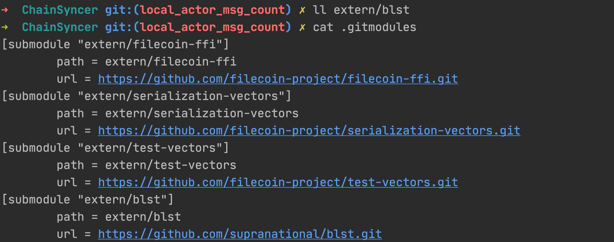

### extern/blst为空，不能编译的解决办法：
问题现象：

问题分析：

问题解决：

这时就有内容了， 

make 就可以编译了， make不仅仅是编译， 也会去下载代码， 但先检查一下extern/blst, make就停止， 不会下载代码， 所以goland会有很多红色显示。 

单T质押计算方式
修改钱包接口扇区抵押查询
钱包接口增加查询gas消耗开关
钱包接口WalletStatisticalIndicators增加昨日扇区抵押
GasFeeCap修改
整理代码
FilScan, Filwallet后端 发布生产
排查出入账消息显示为空的问题
李刚 committed about 10 hours ago
6639101c
聋劓哑者作耳鼻舌。

眉睫绀舒方口颊

细筋锁骨鹿膊肠
幰盖

  钱包BuildMessage接口gas值用公式计算替换lotus api获取，提高接口返回速度
   判断地址类型， 对于普通地址，转为actor地址
用tipset高度判断nonce更新是否最新有效
    forcepool 统计每个用户算力和每个产品下的购买算力