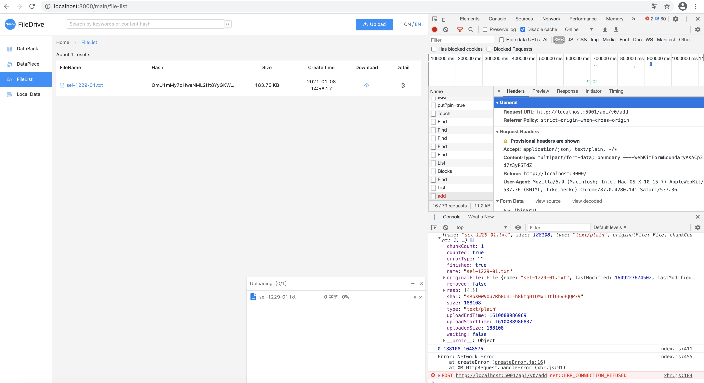
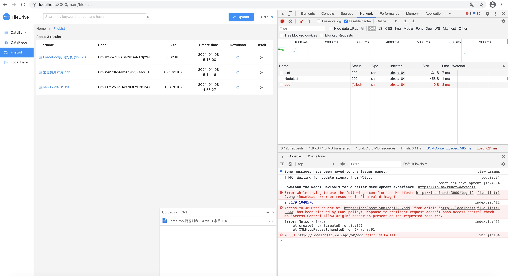
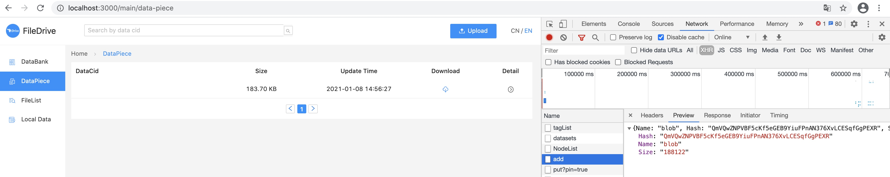

### ipfs跨域问题
访问的接口不在， 浏览器跨域问题显示为：
POST http://localhost:5001/api/v0/add net::ERR_CONNNECTION_REFUSED


跨越配置错误， 跨域问题显示为
POST http://localhost:5001/api/v0/add net::ERR_FAILED


现在看跨越配置问题：问题的最终解决， 是输入这个配置命令：


```
➜  ipfs_staging docker exec -it 09c992e758f6 /bin/sh
/ # ipfs config --json API.HTTPHeaders.Access-Control-Allow-Origin '["http://localhost:5001", "http://localhost:3000", "http://127.0.0.1:5001", "https://webui.ipfs.io"]'
/ # ipfs config --json API.HTTPHeaders.Access-Control-Allow-Methods '["PUT", "POST"]'
/ # ps aux | grep ipfs
    1 root      0:00 /sbin/tini -- /usr/local/bin/start_ipfs daemon --migrate=true
    6 ipfs      0:38 ipfs daemon --migrate=true
  183 root      0:00 grep ipfs
/ # kill 6
```

配置改后， kill 6会使docker退出，重启docker, 还是生效的                                                                                                                                                                 
```
➜  ipfs_staging docker restart 09c992e758f6
➜  ipfs_staging docker ps
CONTAINER ID        IMAGE               COMMAND                  CREATED             STATUS              PORTS                               NAMES
0c482ba044c8        mysql:5.7           "docker-entrypoint.s…"   4 months ago        Up 23 hours         0.0.0.0:3306->3306/tcp, 33060/tcp   mysql
➜  ipfs_staging docker restart 09c992e758f6
```
　念佛三昧名一行者。世出世间诸助道行。悉为净土而修。无别岐路。如众流入海同得海名。万善同归得名一行。是故一切念处．正勤．根．力．觉．道．四弘六度皆净土行。乃至弹指之善及散心念佛。一称名一举手。礼诵瞻仰。一香一水一华一灯一供养具。或一念至十念。或一施一戒一忍禅定智慧。一切善根回向极乐。愿力持故。虽有迟疾。皆得往生。如滴水寄海。虽经多劫不坏不失不异不竭。以小善根回向极乐。虽经异生善根不失亦不坏竭。惟除外道种性及因心未起。善行未立。身心未屈。先期感应者不可同语也。是故三昧解脱行愿总持无量法门。惟念佛一门圆摄无外。悉皆具足。如大海吞纳众流性无增减。如如意珠满一切愿体无亏损。故又名为三昧宝王。世尊以此三昧遍告众会大根之士。若文殊等。三乘八部无不倾心。法流东土。庐山阐扬。天下之望咸美其教。自佛至今圣贤之人。高僧巨儒或自行而劝人。或著文而作誓。重法如宝轻身若尘。挺身立行力修此道者。列宿尘沙莫况其多也。信不决人尚生边地。况正行者哉。纵欲别修道品。但假自力有退转著魔之患。此仗佛力。修则必成。无复魔业。永不退转。又此三昧非但远魔。一切县官口舌是非患难水火盗贼恶人凶事乃至虎狼虫兽鬼魅妖精不吉祥事不能侵害。
　亦不为一切疫痢伤寒痈疥下贱眼耳鼻舌诸病所恼。愿行无亏皆能排遣。惟名闻利养甜爱软贼及嗔心嗔火。虽有佛力不能救焉。行人当深加精进以攘却之。一念因循必为所夺。然软魔但害浅信贪怠失念之人。其精进者如刚火。得水反坚。焉敢小近而睥睨也。此身天人护助。
　临终正念往生。天乐盈空异香满室。光明照体宝座现前。弥陀臂迎菩萨手接。预知时至。正念不谬诸障忽空。沐浴加趺。会众说法叉手告别。或更勉人进道。书偈
　　
　　
　　
手动修改配置文件， 或在页面上修改：

➜  ipfs_staging docker exec -it 09c992e758f6 /bin/sh
/ # export EDITOR=vi
/ # ipfs config edit
```
"Gateway": {
    "APICommands": [],
    "HTTPHeaders": {
      "Access-Control-Allow-Headers": [
        "X-Requested-With",
        "Range",
        "User-Agent",
        "DNT",
        "X-Mx-ReqToken",
        "Keep-Alive",
        "User-Agent",
        "X-Requested-With",
        "If-Modified-Since",
        "Cache-Control",
        "Content-Type",
        "Authorization",
        "X-Language",
        "X-SID",
        "X-USE-JSON"
      ],
      "Access-Control-Allow-Methods": [
        "GET",
        "POST",
        "OPTIONS",
        "PUT"
      ],
      "Access-Control-Allow-Origin": [
        "*"
      ]
    },
    "NoDNSLink": false,
    "NoFetch": false,
    "PathPrefixes": [],
    "PublicGateways": null,
    "RootRedirect": "",
    "Writable": false
  },
  ```
  
  
  
  
  
  
  大雄氏观娑婆有生老病死业系诸苦。教人念阿弥陀佛求生极乐国土。去圣逾远。人世浇漓。错解诸法在心。便认胸中六尘缘影。谓乐土在内不求生彼。此六缘影皆属前尘。本无自体。前尘若无。此心即灭。云何有土在此内耶。或谓悟道便为佛土在心。既见性。岂有反执缘影之理。魔外恶贼亦超此见。世无此见最下劣矣。汝欲悟真实本心者。当观所认六尘缘影之心。本在汝胸。胸住于身。身居国土。土及一切净薉刹海悉在虚空。虚空无际。十界依正一切在中。此空虽大。我不动真实本心非大极大。彼空在我真心。如小片云点太清里。云何净薉刹海不在本心中耶。然则佛说诸法在心者。非在胸中妄想缘影心内。乃在现前一念本真心内也。此心离知觉。超闻见。永断一切生灭增减之相。非始非今。本真如。含众妙。乃十界迷悟之本。不可得而议其广大者。既一切身土皆在大觉真心。与佛同证。则知极乐．娑婆等实境。乃全我心任意于中舍东取西厌薉忻净炽然著相而求。皆不离我心也。故极乐弥陀相好现时即自心显。自心显时即彼佛现。我心彼佛心。彼佛我心佛。一体无二。故云惟心净土本性弥陀。非谓西方无土无佛不须求生。但在汝生灭缘影之中。名为惟心本性也。求彼佛即求自心。求自心须求彼佛。云何今时破法散僧闲道游儒与泛参禅理者。不知即境即心求不碍真之理。反于不二法中分内分外辨境辨心。教人舍外取内背境向心。使憎爱转多分别更甚。一分其境。便以极乐为外。教人不必求生。一分其心。便妄指六尘缘影虚伪妄想为心。谓极乐在内。又思此心无质。本无一切因果善恶修证之法。从是恣意妄涉世缘。教人不须礼佛烧香然灯诵经忏愿等。谓之著相。其上者使缚心不动如顽石相似。坏乱禅法。甚者更令放旷自如。杀盗淫业悉是空华。无妨于道。因此邪见直向阿鼻最下一层而住。直待此见悔时彼狱随坏。又于身外依境。虽见实有不敢说无。亦皆指为外物。打作两橛。不能心境一如。惟著衣吃饭。因贪口体。不敢叱之为外。而于天堂地狱及乐土尘刹。虽曾闻名。因不见故。直说为无。反言快乐便是天堂。苦楚便是地狱。其见卑哉。如来说为可怜愍者。是以我心实与佛心同一理。故弥陀顾力威德光明在我心中。承我心愚痴之力作一切佛事。无时不引导于我。我心亦于弥陀愿心之内。修念佛求生一切善行。无行不具含佛德。了彼佛德成我三昧。故知弥陀愿力始发心终究竟。无一法不直趣我心以。我心即佛心。故我亦于无始至今尽未来际修一切三昧。无一法不摄归佛海成本来佛。以佛心即我心故。如是依正色心因果净薉虽同一心。而实不妨一一自分各住其位。以一心故。虽净薉不同。所求不出于真心。以自分故。虽一心而必舍薉取净也。舍薉取净则感应道交。见彼本性弥陀。了悟一心则净薉自分。可悟惟心净土。如是而修。如一滴投海便同一味。方知大海即自己也。岂有一行虚弃不成功德者哉。村愚夫妇虽不识理。以信实有彼土。故于命终时反得往生。畏有陷空之人因认缘影为心。谓无外土。故虽修道行还受生死。是故凡求生者。当深心起胜愿行。或称名持咒。或旋绕礼拜烧香散华。六时忏悔。尽拨世缘。一心专注观白毫相。心不懈废。命终便生。更能孝养父母。奉事师长。慈心不杀。修十善业。受持三归。具足众戒。不犯威仪。深信因果。不谤大乘。劝进行者。修如此法亦生彼也。如此念念求生。正是无念无求无生。何故。即精修是无修。非不修是无修也。人命无常。转息来世。尘事连环。钩锁不断。若不能于尘劳郁结及得志歇手不得处一割割断。起愿立行尽力一跳。焉得应念生彼。我今作礼奉劝佛子。当一心而行也(自注。因大方李居士作劝念佛国。请著语。故述。洪武乙亥九月廿日)。

  
  
  跨域设置好就可以上传了， 前端调用ipfs的add接口
  
