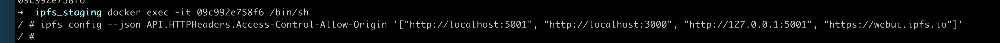

### ipfs跨域问题
访问的接口不在， 浏览器跨域问题显示为：
POST http://localhost:5001/api/v0/add net::ERR_CONNNECTION_REFUSED


跨越配置错误， 跨域问题显示为
POST http://localhost:5001/api/v0/add net::ERR_FAILED


现在看跨越配置问题：问题的最终解决， 是输入这个配置命令：


```
➜  ipfs_staging docker exec -it 09c992e758f6 /bin/sh
/ # ipfs config --json API.HTTPHeaders.Access-Control-Allow-Origin '["http://localhost:5001", "http://localhost:3000", "http://127.0.0.1:5001", "https://webui.ipfs.io"]'
/ # ipfs config --json API.HTTPHeaders.Access-Control-Allow-Methods '["PUT", "POST"]'
/ # ps aux | grep ipfs
    1 root      0:00 /sbin/tini -- /usr/local/bin/start_ipfs daemon --migrate=true
    6 ipfs      0:38 ipfs daemon --migrate=true
  183 root      0:00 grep ipfs
/ # kill 6
```

配置改后， kill 6会使docker退出，重启docker, 还是生效的                                                                                                                                                                 
```
➜  ipfs_staging docker restart 09c992e758f6
➜  ipfs_staging docker ps
CONTAINER ID        IMAGE               COMMAND                  CREATED             STATUS              PORTS                               NAMES
0c482ba044c8        mysql:5.7           "docker-entrypoint.s…"   4 months ago        Up 23 hours         0.0.0.0:3306->3306/tcp, 33060/tcp   mysql
➜  ipfs_staging docker restart 09c992e758f6
```

手动修改配置文件， 或在页面上修改：
➜  ipfs_staging docker exec -it 09c992e758f6 /bin/sh
/ # export EDITOR=vi
/ # ipfs config edit
```
"Gateway": {
    "APICommands": [],
    "HTTPHeaders": {
      "Access-Control-Allow-Headers": [
        "X-Requested-With",
        "Range",
        "User-Agent",
        "DNT",
        "X-Mx-ReqToken",
        "Keep-Alive",
        "User-Agent",
        "X-Requested-With",
        "If-Modified-Since",
        "Cache-Control",
        "Content-Type",
        "Authorization",
        "X-Language",
        "X-SID",
        "X-USE-JSON"
      ],
      "Access-Control-Allow-Methods": [
        "GET",
        "POST",
        "OPTIONS",
        "PUT"
      ],
      "Access-Control-Allow-Origin": [
        "*"
      ]
    },
    "NoDNSLink": false,
    "NoFetch": false,
    "PathPrefixes": [],
    "PublicGateways": null,
    "RootRedirect": "",
    "Writable": false
  },
  ```
  
  跨域设置好就可以上传了， 前端调用ipfs的add接口
  
