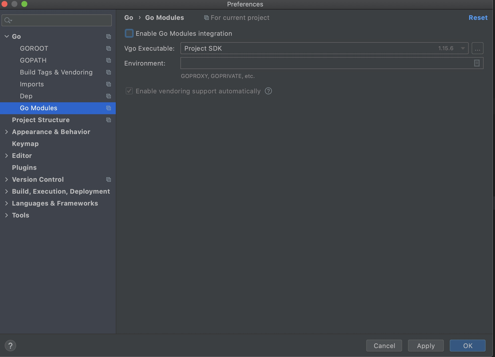
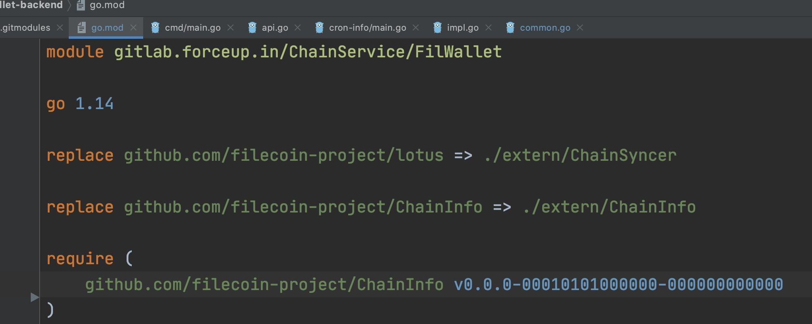

###  获取子仓库的步骤 

1. touch .gitmodules
2. mkdir extern
3. cd extern
4. 下载子代码库

用git submodule add 添加子库：

```
extern git:(master) ✗ git submodule add -b filscan git@gitlab.forceup.in:ChainService/ChainInfo.git 
正克隆到 '/Users/zhenglun1/goworkspace/fil-wallet-backend/extern/ChainInfo'...
remote: Counting objects: 38919, done.
remote: Compressing objects: 100% (10069/10069), done.
remote: Total 38919 (delta 27868), reused 38882 (delta 27846)
接收对象中: 100% (38919/38919), 9.81 MiB | 13.05 MiB/s, 完成.
处理 delta 中: 100% (27868/27868), 完成.
```

这时.gitmodules会增加一些内容：
```
fil-wallet-backend git:(master) ✗ cat .gitmodules
[submodule "extern/ChainInfo"]
        path = extern/ChainInfo
        url = git@gitlab.forceup.in:ChainService/ChainInfo.git
        branch = filscan
```

再下载一个代码库：
```
➜  extern git:(master) ✗ git submodule add git@gitlab.forceup.in:ChainService/ChainSyncer.git          
正克隆到 '/Users/zhenglun1/goworkspace/fil-wallet-backend/extern/ChainSyncer'...
remote: Counting objects: 74965, done.
remote: Compressing objects: 100% (13/13), done.
remote: Total 74965 (delta 3), reused 0 (delta 0)
接收对象中: 100% (74965/74965), 109.76 MiB | 19.45 MiB/s, 完成.
处理 delta 中: 100% (55190/55190), 完成.
```

.gitmoduls会自动增加内容
```
➜  extern git:(master) ✗ cat ../.gitmodules 
[submodule "extern/ChainInfo"]
        path = extern/ChainInfo
        url = git@gitlab.forceup.in:ChainService/ChainInfo.git
        branch = filscan
[submodule "extern/ChainSyncer"]
        path = extern/ChainSyncer
        url = git@gitlab.forceup.in:ChainService/ChainSyncer.git
```

.git/config也会自动增加子仓库的配置， 即submodule内容：
```
➜  extern git:(master) ✗ cat ../.git/config 
[core]
        repositoryformatversion = 0
        filemode = true
        bare = false
        logallrefupdates = true
        ignorecase = true
        precomposeunicode = true
[remote "origin"]
        url = git@gitlab.forceup.in:ChainService/fil-wallet-backend.git
        fetch = +refs/heads/*:refs/remotes/origin/*
[branch "master"]
        remote = origin
        merge = refs/heads/master
[submodule "extern/ChainSyncer"]
        active = true
        url = git@gitlab.forceup.in:ChainService/ChainSyncer.git
[submodule "ChainInfo"]
        url = git@gitlab.forceup.in:ChainService/ChainInfo.git
        active = true
[submodule "extern/ChainInfo"]
        url = git@gitlab.forceup.in:ChainService/ChainInfo.git
        active = true
```

###  module 设置


如果不勾选这个enable go module integration ， 代码 import 后出现红色
go.mod 里也是红色 

勾选这个enable go module integration, go.mod 里才会正常建立索引：

