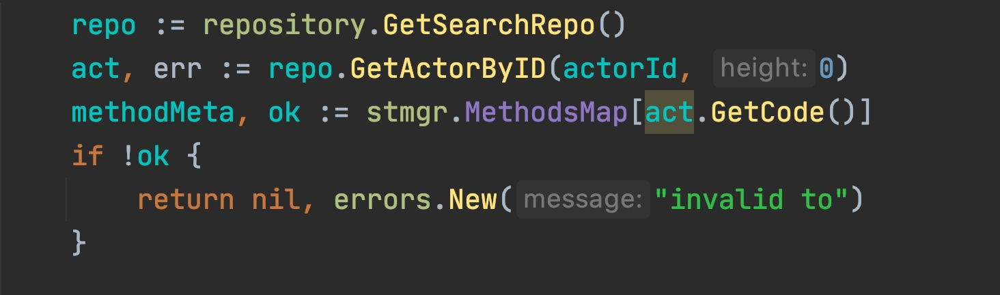
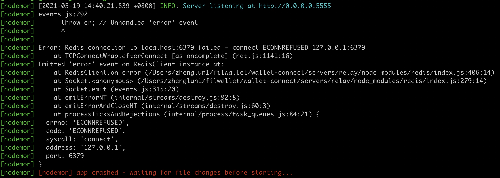

### 子仓库版本号， 没有更新导致 actor Getcode在旧的子仓库找不到

給钱包构建消息的接口报invalid toc错误， 导致钱包不能发消息， 导致钱包无法转账



```
ChainInfo git:(filscan-msg) ✗ git status .
位于分支 filscan-msg
尚未暂存以备提交的变更：
  （使用 "git add <文件>..." 更新要提交的内容）
  （使用 "git restore <文件>..." 丢弃工作区的改动）
  （提交或丢弃子模组中未跟踪或修改的内容）
	修改：     extern/ChainSyncer (新提交, 未跟踪的内容)

➜  ChainInfo git:(filscan-msg) ✗ git diff extern/ChainSyncer
diff --git a/extern/ChainSyncer b/extern/ChainSyncer
index db065f4c..cad23205 160000
--- a/extern/ChainSyncer
+++ b/extern/ChainSyncer
@@ -1 +1 @@
-Subproject commit cad232053fb8bcdbd75f372829cacd38d79ab8a6
+Subproject commit db065f4c4c4c53114b5b654ee975d7139jsidjod-dirty
```
需要把子仓库更新到最新的版本号， 与做这个仓库代码的人， 确定最新的版本号， 即git log里看到的， 这里版本号为cad232053fb8bcdbd75f372829cacd38d79ab8a6, 要想把子仓库这个版本号提交上， 不是修改文件， 要需要到子仓库目录，git checkout 版本号 得到的。 

### 子仓库出现dirty，和解决办法
```shell
➜  ChainInfo git:(filscan-msg) ✗ cd extern 
➜  ChainInfo git:(filscan-msg) ✗ rm -rf extern

➜  ChainInfo git:(filscan-msg) ✗ git submodule update --init --recursive
子模组路径 'extern/ChainSyncer'：检出 'db065f4c4c4c53114b5b654ee975d713950379c9'
fatal: 无法访问 'https://github.com/filecoin-project/filecoin-ffi.git/'：Failed to connect to github.com port 443: Operation timed out
无法在子模组路径 'extern/ChainSyncer/extern/filecoin-ffi' 中获取，尝试直接获取 b6e0b35fb49ed0fedb6a6a473b222e3b8a7d7f17：
remote: Enumerating objects: 7, done.
remote: Counting objects: 100% (7/7), done.
remote: Total 9 (delta 7), reused 7 (delta 7), pack-reused 2
展开对象中: 100% (9/9), 3.18 KiB | 171.00 KiB/s, 完成.
来自 https://github.com/filecoin-project/filecoin-ffi
 * branch            b6e0b35fb49ed0fedb6a6a473b222e3b8a7d7f17 -> FETCH_HEAD
子模组路径 'extern/ChainSyncer/extern/filecoin-ffi'：检出 'b6e0b35fb49ed0fedb6a6a473b222e3b8a7d7f17'
子模组路径 'extern/ChainSyncer/extern/serialization-vectors'：检出 '5bfb928910b01ac8b940a693af2884f7f8276211'
子模组路径 'extern/ChainSyncer/extern/test-vectors'：检出 'd9a75a7873aee0db28b87e3970d2ea16a2f37c6a'
子模组路径 'extern/ChainSyncer/extern/test-vectors/gen/extern/fil-blst'：检出 '5f93488fc0dbfb450f2355269f18fc67010d59bb'
子模组路径 'extern/ChainSyncer/extern/test-vectors/gen/extern/filecoin-ffi'：检出 'f640612a1a1f7a2dd8b3a49e1531db0aa0f63447'
这时extern下又有了代码仓库， 

cd extern/ChainSyncer

git pull

git checkout db065f4c4c4c53114b5b654ee975d713950379c9

命令提示显示当前分支或定位到的点是 db065f4c4， 是版本号的前8位

➜  ChainSyncer git:(db065f4c4) cd ../.. 

git diff extern/ChainSyncer
-Subproject commit cad232053fb8bcdbd75f372829cacd38d79ab8a6
+Subproject commit db065f4c4c4c53114b5b654ee975d713950379c9
这时就可以提交了
git commit extern/ChainSyncer -m “更新子仓库版本号到db065f4c4c4c53114b5b654ee975d713950379c9. 
```


### 参数地址 
singner 是from， to 是多签地址
### 消息的签名
chaininfo接口构建出转账消息后， 前端必须对这个消息签名后， 在把消息发送给message服务， 服务先将消息的签名验证， 验证通过过， 才发消息。 
    签名必须持有私钥， 然后传给该私钥的f3地址, 和要签名的字符串， 才能得到签名。 
    签名命令： 
./lotus wallet sign  被签名的f3地址 签名信息的hex编码
如：
被签名的f3地址: f3vsf55rntpsof2m663jjzayr5u4dpyfcbmeed45wofpkvbhpwpj55up3lou3anbamevomykt23exwevdpghtq
签名信息: Signature for filscan f0135467 2021-03-19T07:41:21.463Z ， 
   命令为：
```
./lotus wallet sign f3vsf55rntpsof2m663jjzayr5u4dpyfcbmeed45wofpkvbhpwpj55up3lou3anbamevomykt23exwevdpghtq 5369676E617475726520666F722066696C7363616E20663031333534363720323032312D30332D31395430373A34313A32312E3436335A
```
	 得到签名结果：  
```	   02a4f2ecefcea2356f26c8ce0b1b0362949f48a0a4bba1745499d171cc0879ddef9678b9fd3cb9770785a0793d45d8193017dae717b0cc00c31227fffcebd1e79e96cbdb1900ab5855a1aed639457a367320943938447054cb693e74d5b3681ed8
```
签名是对信息的身份的证明， 有私钥才能签名。 lotus本地地址要有这个f3地址的私钥，才能对这个f3地址签名。 

也可以做成工具， 用参数指定私钥。 
如： 
```
➜  Downloads ./sign-tool-4 wallet-sign --key-info 7b2254797065223a22736563703235366b31222c22507269766174654b6579223a22444f776a377669762b756c79524e684a4c4d30346c733270626236704256335876516e2f4a5353573253633d227d 5369676E617475726520666F722066696C7363616E20663031333534363720323032312D30332D31395430373A34313A32312E3436335A f1zh2d3rprwhch4yjqsor7xoyzeg4czxjkcoocmjy
=================================
signature: {"Type":1,"Data":"rf41x+7/x1ISAxTSI8Ro1OJnI9cP/B2ocA7hUfMBx091pZQVMB2hfglrt1w2xxvcfTa/fAfJ79AqPPI9TF/DpAA="}
01adfe35c7eeffc752120314d223c468d4e26723d70ffc1da8700ee151f301c74f75a59415301da17e096bb75c36c71bdc7d36bf7c07c9efd02a3cf23d4c5fc3a400
=================================
``` 

### wallet-connect 
make dev


需要开启redis 服务， 可以用容器


### nonce 
钱包app, 当push了一个消息， lotus message 会得到一个返回， 但这时还没有真正上链， 钱包五分钟内如果再发一个消息， 就要手动去加nonce值， 如果五分钟后， 可以查接口获取到。 


