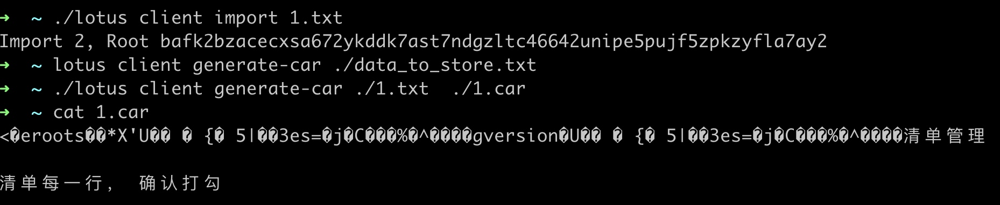

[TOC]

Filecoin离线数据存储
前面介绍的Filecoin数据存储步骤是针对线上操作，适用于数据不大、网络状况良好的场景。
对于大体量数据、网络传输不稳定或速度受限的场景，可以使用离线交易。
同样，我们需要lotus作为客户端，具体步骤如下：
### 1 获取文件的DataCID
```
lotus client import ./data_to_store.txt
(上面命令会返回data_to_store.txt的DataCID）
```
如： 
```
➜  ~ ./lotus client import 1.txt
Import 2, Root bafk2bzacecxsa672ykddk7ast7ndgzltc46642unipe5pujf5zpkzyfla7ay2
```
### 2 把文件转换为CAR文件
```
lotus client generate-car ./data_to_store.txt./data_to_store.car
(上面命令会把data_to_store.txt转换问IPLDDAG,序列化为data_to_store.car）
```


### 3 计算PieceCID
```
lotus client commP ./data_to_store.car
（上面命令返回car文件的PieceCID和Piecesize)
```
如： 
```
➜  ~ ./lotus client commP ./1.car
CID:  baga6ea4seaqkueg3hwnhx3vwuz73xcmdomim24zkqhwfb7ldl3ry2swadef22jy
Piece size:  3.969 KiB
```

### 4 发起离线交易
```
lotus client deal --manual-piece-cid=CID --manual-piece-size=piecesize <DataCID> <miner> <price> <duration>
--manual-piece-cid步骤3生成的PieceCID
--manual-piece-size步骤3生成的Piecesize
<DataCID>步骤1生成的DataCID
<miner>选择的数据存储矿工
<price>愿意出的单价
<duration>交易的有效期
（上面命令返回dealCid)
```

### 5 离线方式把数据给矿工
把步骤2生成的car文件已离线的方式（例如，邮件数据盘）给到数据存储矿工。
把步骤4生成的dealCid也需要发送给矿工。
如果同时做多个离线交易，记住标注好car文件和dealCid的对应关系。
### 6 矿工收到离线的car文件和dealCid后，导入交易
lotus-minerstorage-dealsimport-data<dealCid><carFilePath>
剩下步骤的就是矿工的数据封装和证明了