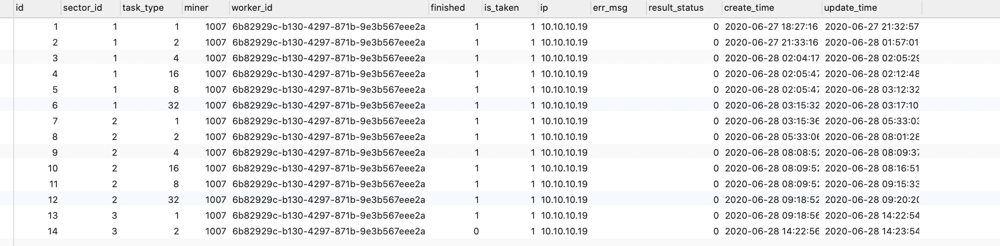

### 32G 空间大小

P1 昨晚会有389G
[fil@allinone ~]$ du -sch /mnt/cpfs/0.0.0.1/nfs/0.0.0.1/cache/s-t01002-10306
389G	/mnt/cpfs/0.0.0.1/nfs/0.0.0.1/cache/s-t01002-10306
389G	total


commiting  的 会放在sealed
[fil@allinone ~]$ du -sch /mnt/cpfs/0.0.0.1/nfs/0.0.0.1/sealed/s-t01002-10306
33G	/mnt/cpfs/0.0.0.1/nfs/0.0.0.1/sealed/s-t01002-10306
33G	total

所以一个sector 占用caceh+seale = 420G空间


### worker 的层
P2 有11层


### force-remote-worker完成一个任务的6个阶段
做任务有6个阶段：
六个阶段
扬州 。 1000个机器， 按机会分组

一个机会单独分一个组， 一个组起P1到P6阶段的四个程序，  一个程序就是一个worker

11台机器写文件 ， 证明需要这些文件 
一个组起一个sealer, 分到机器，做任务
sealer 按机会分组 
数据库连接60秒，每60秒到数据查任务， 领取任务， 然后值1 
第一阶段，后面的阶段可以同时做。 


 6个阶段，被划分到4个进程，真实环境下， 每个进程运行在单独的一个主机上。 
 这些主机被化作一个组。 
 每个P都有自己所在组的编号
 同一个任务的
 p1到p6 必须严格的顺序执行。 

select * fromt task where sector_id=

select task_type, count(*). from tasks group by 

32G 只有一个机会

测试人员开测 


sealer/目录下的 cache 是p1产生的
sealer/目录下的 seal是p2产生的

#### 矿池分配

一个矿池分配一个 server
window  破2000多个分区，做sector证明 
每个ing去
分配到爱面对worker中 。
500G 本地文件生成 32G，把这32G拷贝到远程 ， 远程存储目录为 --dit-path=/mnt
nsync .  忽略同步高度
lotus-storage-miner run -h

#### P1
p1 做sector开始的部分，包括存储空间，时空证明，非常耗时间的。 
P1 起Nfs , P1到P6共享此nfs。

P1，P2向nfs写， 
P3, p6 从nfs读。 

P1 10个worker,  即10个P1，同时跑  
P1 用 intel要 32个小时 
P1 用 amd 只要3个小时， 

输出块的大小与时间对应
512M：    25分钟
32G：  60个小时

32G需要500G
64G需要1T
2k可以同时起500个P1

P1是所有P中最耗时的， P1会产生非常大的中间文件， p1产生的中间文件都会存放在本地的
/sealer/nfs/10.10.4.23/cache
目录下。 


可以用8组在跑32G sector， 

#### P2与P3合并
P2 会计算出 最终放在 存储服务器的块。 

P2计算出的结果文件， 存放在
/sealer/nfs/10.10.4.23/sealed目录下。 

P3产生数据， 并且copy
p2 p3 放在容器里。

#### P4与P5合并
p4 验证100多G的证明文件， 耗时1个小时多

p5 copy 耗时20分钟， p4, p5可以同时，

p5 也叫pc拷贝
pc 负责把p2产生的结果文件拷贝到存储服务器，即storage-nodes字段指定的存储服务器。 
P2生成的结果文件为512M， p5拷贝大概需要1分钟的时间。 

而P4要做一些证明的事情， 时间大概5分钟， 所以P6要等P4，完成后， 才可以删除 /sealer/nfs/10.10.4.23/cache文件， 

poster读取这个区块， 完成证明， 然后lotus 把这个区块提交到链上， 这样就封装好了一块磁盘，

#### P6
p6 clean: 本地临时 500G，结果为32G的块， 32G传出去， 就可以删除500G


### config.toml 说明
force-remote-worker读取config.toml文件。
33到40 8台 ， 4台做p2p3， 4台做p4. 
10.21 做pc 和 p1

force log
pre_commit1
pre_commit2
commit1

vi for.log
过滤error log
The application panicked (crashed).
  called `Result::unwrap()` on an `Err` value: No such file or directory (os error 2)

  Stack backtrace:
  
  
  向上找到第几个error
```
[fil@yangzhou010010019017 ~]$ cat config.toml
scheduler_url = "http://10.10.19.17:3456"
local_dir = "/sealer"
copy_limit_mb_per_sec = 500
group_id= [1]
sector_size = 536870912
ip = "10.10.19.17"

[[worker]]
num = 1
supported_phase = ["PreCommitPhase1","PreCommitPhase2","CommitPhase1","CommitPhase2"]
wait_sec = 60

[[worker]]
num = 1
supported_phase = ["CopyTask","CleanTask"]
wait_sec = 60
```
配置文件的详细解释：
```
[fil@yangzhou010010019017 ~]$ cat config.toml
scheduler_url = "http://10.10.19.17:3456"
local_dir = "/sealer"

copy_limit_mb_per_sec = 500
500是限速度， 因为P1到P6 都在使用网络， 对每个P限制最大速度


group_id= [1]
sector_size = 536870912
ip = "10.10.19.17"

[[worker]]
num = 1
表示只有1个这样的worker， 一个worker是一个线程

supported_phase = ["PreCommitPhase1","PreCommitPhase2","CommitPhase1","CommitPhase2"]
表示一个work做这4个事情，

wait_sec = 60
force-remote-worker 每60秒 到sealer 分发的task表读任务， 读到任务就把is-taken字段置1， 表示这个任务已经被 orce-remote-worker领取


[[worker]]
num = 1
supported_phase = ["CopyTask","CleanTask"]
wait_sec = 60
```


### 启动force-remote-worker
```
RUST_LOG=debug BELLMAN_PROOF_THREADS=3 RUST_BACKTRACE=1 nohup ./force-remote-worker > force-remote-worker.log 2>&1 &
```


2020-06-23 17:45:39 DEBUG [hyper::client::pool] pooling idle connection for ("http", 10.10.11.39:3456)
2020-06-23 17:45:39 DEBUG [reqwest::async_impl::client] response '200 OK' for http://10.10.11.39:3456/acquire-task
2020-06-23 17:45:39 INFO [force_remote_worker::worker] {"code":0,"msg":"record not found","data":null}


#### tasks表字段含义
| is_finished | 含义| 
|----|----|
|0| 任务没完成|
|1| 任务完成|


| result_status | 含义| 
|----|----|
|0| 结果正常|
|1| 还没结束|
|2| 结果错误|

只有is_finished为1， result_status为0， 才表示该P正常完成。 

result_status为2 时， 可以手动设置为1， 这样这个P可以重做。 

#### 排查sector表大量failed
precommitfailed 消息，  就会直接走到32 任务，做清理， 中间不会经历4，8，16阶段。  


应为大量的sector卡在32， 做32的worker太少， 
修改force-remote-worker的配置文件config.toml,  p6 worker 的数量。 

worker 
512M 拷贝 30秒


##### 任务做不过去， 没有在第一时见知道。 
存储是错误的， 本来就是错误的， 是做不过去的， 但到了p3 或p5 才知道， 

### 问题排查

#### 1. 设置核数， 避免被force-remote-worker占满
核数不能占满， 要不ssh很难连上
p2 p3 会把核占满 ， 要留下2 个核  
打开文件数目没限制， 900万个驶过没问题， 

#### 2.  /sealer 挂错了磁盘， 导致P1卡住
p1阶段， 系统搞的非常慢，p1容易在io卡住
用root用户看iostate -ix 看下写的状态
最后发现， /sealer挂上了sda系统盘
sealer 应该挂上md1磁盘。
从 df -h  应该看到 /sealer下挂载了 md1盘， 如果挂载了sda盘， 这是系统盘， 做p1时会严重影响速度。 

#### 3. P1 做不下去的原因：
```
force-remote-worker log:
2020-06-23 17:45:39 ERROR [force_remote_worker] failed to create out dir with: "/sealer/nfs/10.10.13.22/sealed"
```
这个/sealer/nfs/10.10.13.22/sealed是取数据库表storage-nodes拼接出来的字符串。 


虽然/sealer挂载在10.10.10.21:/sealer， 但是也允许/sealer下创建其他ip的目录如
/sealer/nfs/10.10.13.22

```
[fil@yangzhou010010011039 ~]$ df -h
Filesystem                Size  Used Avail Use% Mounted on
/dev/sda4                 1.1T  112G 1001G  11% /
devtmpfs                   63G     0   63G   0% /dev
tmpfs                      63G     0   63G   0% /dev/shm
tmpfs                      63G   19M   63G   1% /run
tmpfs                      63G     0   63G   0% /sys/fs/cgroup
/dev/sda2                 3.9G  112M  3.5G   4% /boot
/dev/sda3                 128M  4.0K  128M   1% /boot/efi
10.10.10.21:/sealer        58T  113G   55T   1% /sealer
tmpfs                      13G     0   13G   0% /run/user/0
10.10.13.22:/mnt/storage   22T     0   21T   0% /mnt
```
worker会创建/sealer/nfs/10.10.13.22 但/sealer/nfs/ 是root用户， 755权限， fil用户无法创建这个目录。 

查看/sealer 下到底有没有这个目录：
```
[root@yangzhou010010011039 10.10.11.21]# ll /sealer/nfs/10.10.11.21/
总用量 8
drwxr-xr-x. 58 root root 4096 6月  23 17:55 cache
drwxrwxrwx.  2 root root 4096 6月  23 17:55 sealed
```

解决办法；  改变owner， 或改777权限
```
[root@yangzhou010010011039 sealer]# ll
总用量 24
drwxrwxrwx. 2 root root 16384 6月  21 23:59 lost+found
drwxr-xr-x. 3 root root  4096 6月  23 12:07 nfs
drwxr-xr-x. 2 root root  4096 6月  23 15:59 p3cache
[root@yangzhou010010011039 sealer]# chown -R fil:fil *
[root@yangzhou010010011039 sealer]# ll
总用量 24
drwxrwxrwx. 2 fil fil 16384 6月  21 23:59 lost+found
drwxr-xr-x. 3 fil fil  4096 6月  23 12:07 nfs
drwxr-xr-x. 2 fil fil  4096 6月  23 15:59 p3cache
```

#### p2 waitseed
p2 做完后， 要发消息给 链上， 等链上处理完消息后， 才能处理P3


#### p6(32) 有很多失败的


查看所有任务为32， 结果状态为2的： 
```
SELECT sector_id, task_type, finished, result_status, create_time, update_time  from tasks WHERE task_type=32 and result_status=2
```

有大量的32的任务失败， 查看force-remote-worker.log， 搜索error, 看到：
```
2020-06-24 16:07:11 INFO [force_remote_worker::worker] got a task: AcqTaskRes { task_type: CleanTask, sector_id: SectorId(36), params: [123, 34, 99, 97, 99, 104, 101, 68, 105, 114, 34, 58, 34, 110, 102, 115, 47, 49, 48, 46, 49, 48, 46, 49, 51, 46, 50, 50, 47, 99, 97, 99, 104, 101, 47, 115, 45, 116, 48, 49, 48, 48, 52, 45, 51, 54, 34, 44, 34, 115, 101, 97, 108, 101, 100, 80, 97, 116, 104, 34, 58, 34, 110, 102, 115, 47, 49, 48, 46, 49, 48, 46, 49, 51, 46, 50, 50, 47, 115, 101, 97, 108, 101, 100, 47, 115, 45, 116, 48, 49, 48, 48, 52, 45, 51, 54, 34, 44, 34, 114, 101, 109, 111, 116, 101, 83, 101, 97, 108, 101, 100, 68, 105, 114, 34, 58, 34, 34, 44, 34, 114, 101, 109, 111, 116, 101, 67, 97, 99, 104, 101, 68, 105, 114, 34, 58, 34, 34, 125], miner: 1004, cid: "" }
2020-06-24 16:07:11 DEBUG [force_remote_worker::worker] input: {"cacheDir":"nfs/10.10.13.22/cache/s-t01004-36","sealedPath":"nfs/10.10.13.22/sealed/s-t01004-36","remoteSealedDir":"","remoteCacheDir":""}
2020-06-24 16:07:11 INFO [force_remote_worker::worker] current_phase: CleanTask,  input_param: {"cacheDir":"nfs/10.10.13.22/cache/s-t01004-36","sealedPath":"nfs/10.10.13.22/sealed/s-t01004-36","remoteSealedDir":"","remoteCacheDir":""}
2020-06-24 16:07:11 INFO [force_remote_worker::worker] try to remove cache_dir: "/sealer/nfs/10.10.13.22/cache/s-t01004-36"
2020-06-24 16:07:12 INFO [force_remote_worker::worker] "/sealer/nfs/10.10.13.22/cache/s-t01004-36" removed
2020-06-24 16:07:12 INFO [force_remote_worker::worker] try to remove sealed file: "/sealer/nfs/10.10.13.22/sealed/s-t01004-36"

Run with RUST_BACKTRACE=full to include source snippets.
Backtrace (most recent call last):
  File "<unknown>:0", in __clone
  File "<unknown>:0", in start_thread
  File "rust:src/libstd/sys/unix/thread.rs:80", in std::sys::unix::thread::Thread::new::thread_start
```

里面关键log：
```
try to remove sealed file: "/sealer/nfs/10.10.13.22/sealed/s-t01004-36"
```
在删除sealed文件时， 没有找到要删除的sealed文件。 

原因是， 可能是两个链挂到了同一个存储被多个链同时挂载， 但另一个链也挂载了这个存储。 


5个worker， 同时扫数据库， 专扫自己服务负责的task， 比如配置为p6的worker，只检查task-type为32的task记录， 然后把这群记录里的第一个task记录的is_taken设置为1，在设置的时候， 要尽享加锁， 避免并发的worker， 也来设置， 因为谁设置了， 谁就要做接下来的清除动作， 如果两个worker都做了相同的事情， 其中一个做删除动作的， 就会报错， 就会吧result_status 设置为2， 表示32任务最后的执行结果是错误的。 程序在这已经加锁处理， 没有问题。 

问题的原因是， P1阶段就删除了/sealer下的文件， 导致p6 32任务失败。 

nfs出问题， 你那个cd都进不去了。 

长时间没有找到问题的原因是， 进入了思维盲点， 因为程序如果有问题， 不会在这个时候，所有都去怀疑文件系统去了， 一个怀疑nfs文件系统问题， 一个怀疑存储挂载问题， 反复的排查这个方向， 却没有怀疑代码逻辑的问题。 没有怀疑并发下两个worker做同样的事情， 虽然最后找到的根本原因是， P1过早的删除了文件。 这个问题两天前， 已经出现了， 声称解决了， 但解决的并不彻底， 之所以没有及时发现，  删除的动作比较隐蔽， 而且log 没有醒目的error, 只打出了普通的removed log, 这个会隐藏在大量的类似log中，出现问题时， 没有发现这个不起眼，却是问题根本原因的log.   


### p3失败
因为groupid 没有配置好， 所以p1 p2 写到不同的sealed目录下了， 导致p3去拿的sealed不是正确的sealed, 导致p3 失败。

###  P4 是数据提交证明 ， 具体P4做了什么， 一般在p4不会出什么问题


算力全部清掉

创世节点链接到外网。 

再N一下

#### 32G 任务的分发
P1 在最快的amd上， 大概需要两个多小时， 为了测试P1， P2各阶段的时间，sealer 不能想512M那样一下起很多个P， 因为测试环境只有一个节点主机， 上面跑了p1, p2, 到p6 所有的P。P1 完成了，出发了sealer发下一个任务的动作， 把sealer设置为1， 表示当前如果没做完的任务数为1，或超过1个， sealer就不会发下一个任务， 
   

sealer检查finished=0的任务记录的个数，来得出没做完的任务的个数。 worker要么正在做任务， 要么没任务可做，workerlog里会看到didn't aquire task.  
  如果result_status是2， 这时，sealer就会卡住， 不发任务了， worker也会卡住， 没任务任务可做了。 
  
  #### 

 

