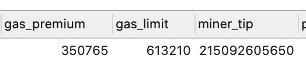
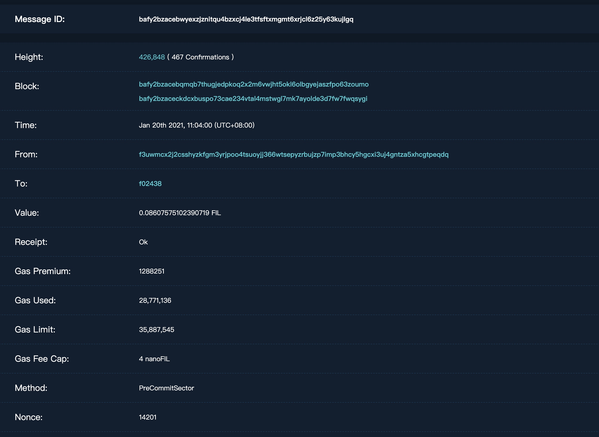
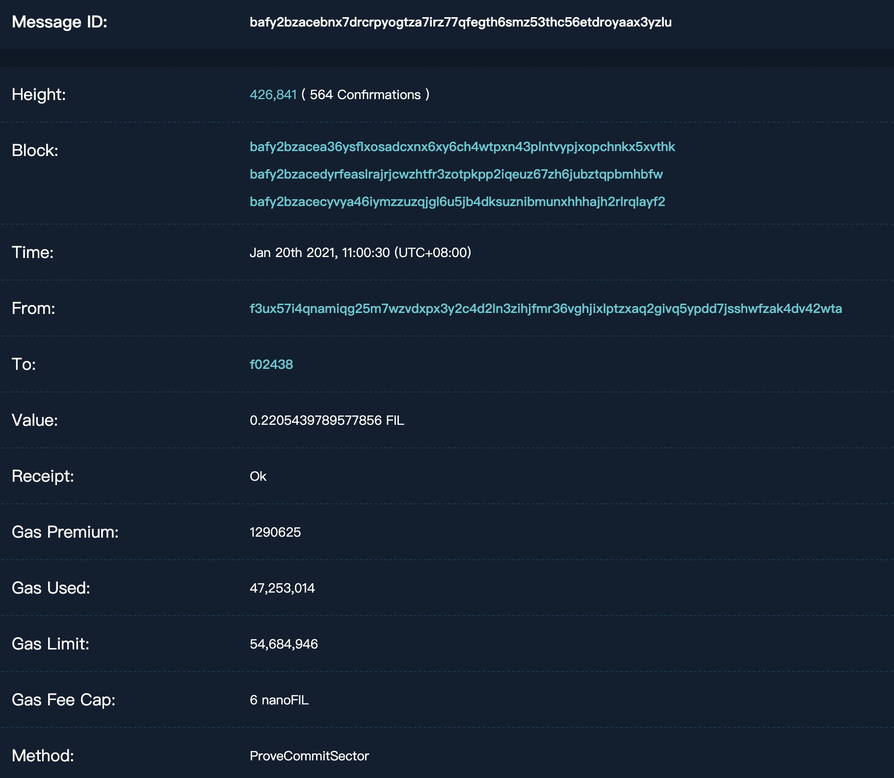
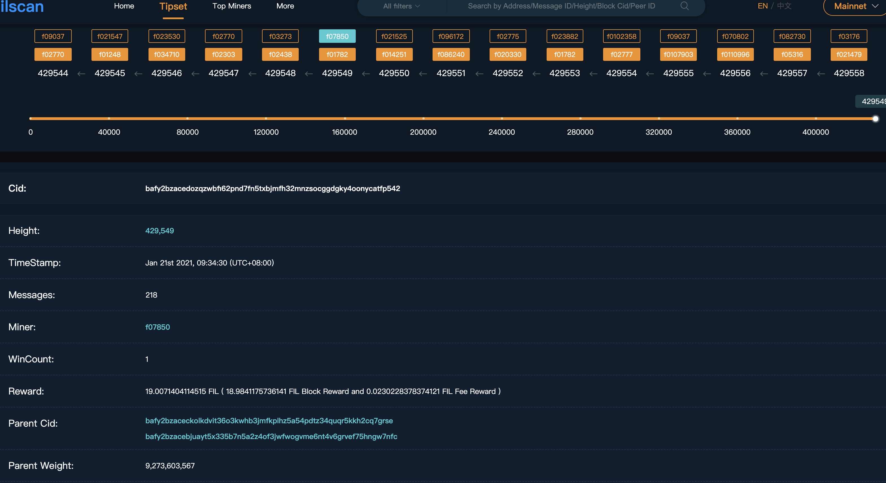
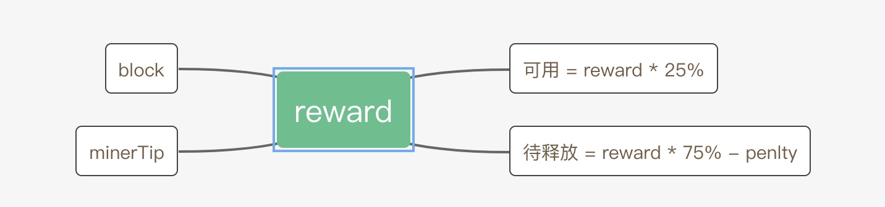
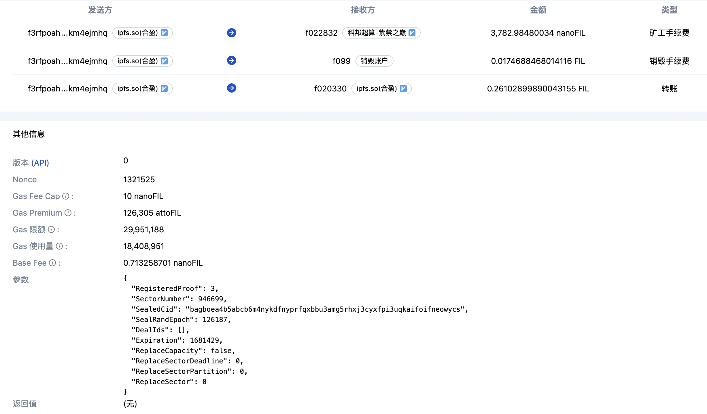

### 什么是gas
gas是“燃料”的意思，在以太坊区块链上实现了一个EVM（以太坊虚拟机）的代码运行环境，在链上执行写入操作时，网络中的每个全节点都会进行相同的计算并存储相同的值，这种执行的消耗是昂贵的，为了促使大家将能在链下进行的运算都不放到链上进行，也为了奖励矿工，因此在链上每执行一个写入操作时，都需要支付一定的费用，用gas为单位来计数，每个在链上可以执行的命令都设置了一个消耗的gas值，例：PUSH操作需要消耗3个gas，一次转账一般要消耗21000gas，gas使用ETH来支付。

注意：无论您执行的命令是成功还是失败，都需要支付计算费用，即使失败，节点也验证并执行了您的交易（计算），因此必须和成功执行支付一样的费用

什么是gas limit
每个区块有gas limit，即单个区块允许的最多gas总量，以此可以用来决定单个区块中能打包多少笔交易。

我们每一次交易或合约调用都要设置一个gas limit，如果该次操作所使用的gas数量小于或等于您所设置的gas limit，则会被执行，但如果gas总消耗量超过gas limit，所有的操作都会被重置，但费用依旧会被收取。在执行中实际消耗的gas值总和叫gas used，没有使用完的gas会退还到原账号。

如果您尝试将一个会使用超过当前区块gas limit的交易打包，则会被网络拒绝，会反馈“below gas limit”

什么是gas price
在发起交易或合约调用时，我们可以自己设置gas的价格，即gas price，一般以GWei（1 ETH = 1000000000 GWei）为单位。通过gas price可以节省矿工费用，但也会减慢矿工打包的速度，矿工会优先打包gas price设置高的交易，如果您想加快转账，您可以把gas price设置得更高，这样您就可以插队靠前。

在定义gas price时候，推荐浏览https://ethgasstation.info/ 这里能看到以太坊区块链上最近完成的交易对应的消耗单价、记录时间、等待时间、手续费均价等。根据自身交易需求，我们可以参考右下Safelow/Standard/Fast三个速度对应的gasPrice。

总结
gas limit由我们自己设定，相当于我们预计汽车需要加多少升汽油；
gas price由我们自己设定，相当于每升汽油的价格；
一次交易或调用实际需要消耗的gas（gas used）由该次交易或调用过程中执行的命令决定；
gas used 必须小于或等于gas limit；
实际支付的费用 = gas used * gas price。

###  gascap 
feecap = preminum + basefee
feecap 就是一个gas的价格，  包括 附加费premium， 和 base费， 附加费是给矿工的， basefee 是要销毁掉的， 

```
要花费的钱 = premium * gas_limit + basefee * gas_used
```

因为premium 是给矿工的， 所有乘上gas_limit, 

gas_limit 是消息的发送者设定的， 如果设置的过低， gas_limit 小于gas_used, 就不会发出消息， 如果设置太高， 就会多花， 也就惩罚， gas_limit设置过高， 要花的钱，一个gas的

要花的钱 = preminum + basefee + burn*(设置值 - 合理值的120%)

比如gas_limit 正常的值是100， 那么gas_limit 设置了150， 那么150-100 * 120 = 30， 就是超越的值， 即：
```
要花的钱 = preminum * gas_limit + basefee * gas_used + burn* 30
```
计算出的值， 是attofil为单位
验证了一个转账的消息： 

miner_tip = gas_premium * gas_limit


### 一个消息可以有多个block（块）
一个消息允许被多个矿工打包出块， block就存放块的id,  消息的minertip只会给第一个出块的矿工， 
一个块现在有200多个消息。 
## 质押
### fil单位
1FIL=1x109nanoFIL=1x1018attoFIL
### P2 转账质押 precommit 
质押 = initpledge + precommit 


p2 结束发送 precommitSector 消息，这是一个转账消息，消息的 value 即转账数额， 由矿工的controller转入到矿工地址，  矿工的controller地址是f3地址，这个钱进入到矿工的precommit质押中，当P4完成时， 这个钱就会释放出来， 

### P4 转账质押 initpledge
p4 结束后， 发送 provesector 消息， 这也是一个转账消息， 也是由矿工的controller地址转入到矿工地址， 这个钱会进入到矿工的initpledge质押，在sector有效期结束后， 才会释放， 这个钱是最多的。 


## 块
### 一个块的基本信息

一个块可以有多个parentCid, 

### 一个出块奖励的构成及分发
 现在抱一个块， f02奖励矿工18fil，小费是非常少的， 大概0点0000几， 现在一个块大概有200多个消息， 加在一起的小费， 也就0点0几。 


## gas费
### gas费构成
每个消息，都有消耗gas费， gas费包括两个部分： 

矿工手续费是minertip,  即转给爆块矿工的小费， 爆块矿工除了得到消息的小费， 还会得到f02转来的钱。
销毁手续费会转给一个f099地址， 这个就纯粹是燃烧掉的。 销毁手续费里又包括： 
```
BaseFeeBurn        decimal.NullDecimal `pg:"basefee_burn" json:"base_fee_burn"`
MinerPenalty       decimal.NullDecimal `pg:"miner_penalty" json:"miner_penalty"`
```

MinerPenalty 这个在矿工收到的奖励中， 已经扣掉了

statChainInfo接口增加近24小时全网新增奖励，近1小时全网新增算力， 近24小时全网新增算力等 
计算gaslimit, gas消耗平均值，整数显示
filcompose 接口缓存
全网24小时算力趋势缓存与排序
statChainInfo接口更新
转账列表接口增加时间戳
编写basefee 24小时，7天 sql语句
处理Forcepool 禁用账户的账户余额， 冻结， 可提现， 已体现， 矿池收益等数据表 

###  gas 名词


Gas Fee Cap: 用户选择支付的总手续费率
Gas Premium: 用户选择支付给矿工的手续费率
Gas 限额: 该笔交易能消耗的最大Gas量
Gas 使用量: 完成这笔交易真实消耗的Gas量
Base Fee: 根据区块链网络拥堵状况实时更新的基础手续费率