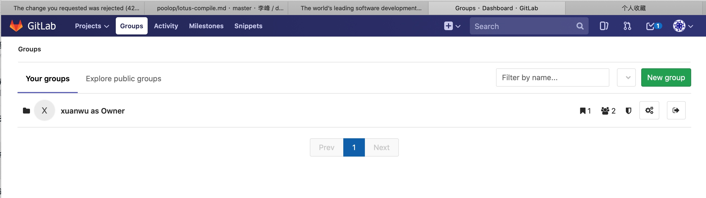
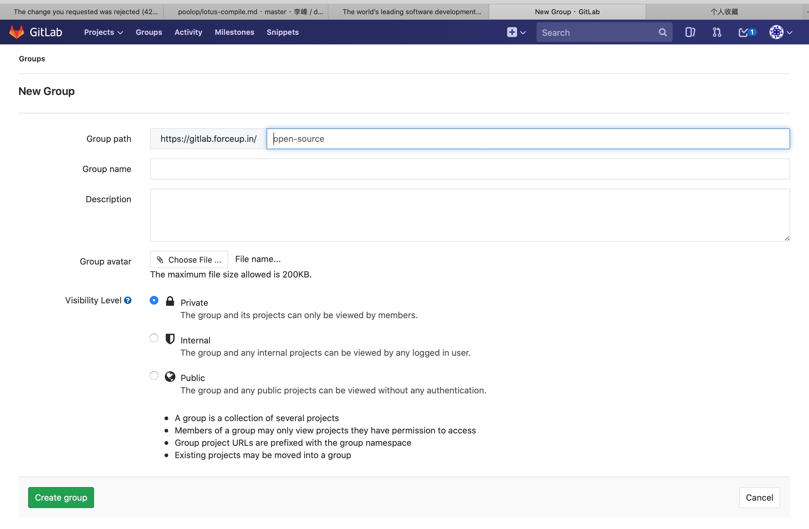

#### gitlab 建立一个组

建立组：

gitlab：
 git commit . -m "update"
  699  git status .
  700  git add .
  701  git commit . -m "update"
  702  git branch -a
  703  git checkout -b force-send
  704  git remote add gitlab git@gitlab.forceup.in:xuanwu/forcesend.git
  705  git remote 
  706  git checkout master
  707  git status .
  708  git submodule update
  709  git status .
  710  git push gitlab master 
  711  git checkout force-send 
  712  git submodule update
  713  git push gitlab force-send 
