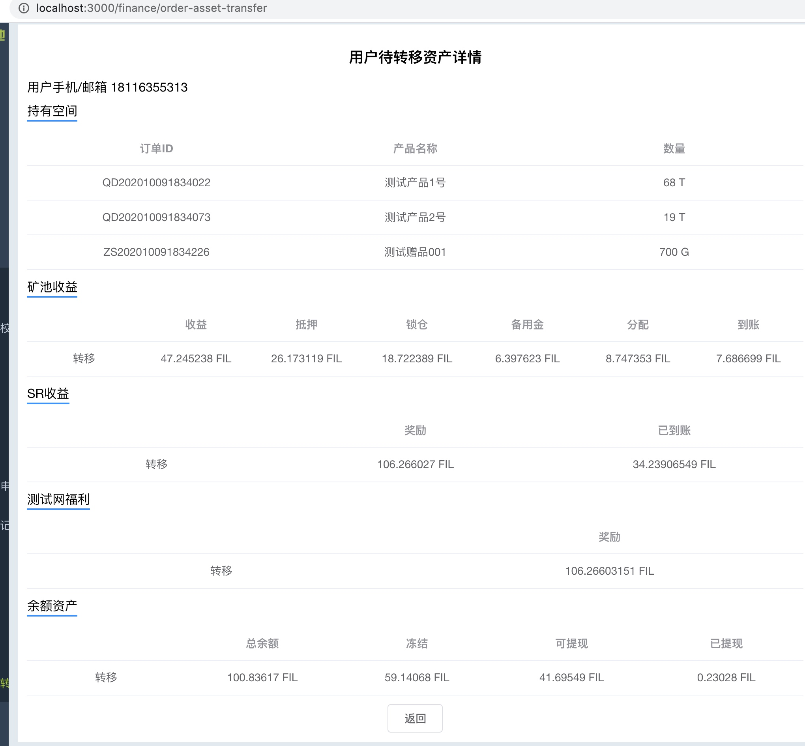

###  gitlab上解决冲突
冲突的解决办法：
可以先在gitlab上解决冲突， 然后合到自己开发分支：

然后合并到本地：

然后就push到gitlab, 走正常流程即可。 

spacerace释放汇总转移
spacerace汇总转移
矿池收益汇总转移
购买订单转移
资产转移多个表操作，用事务完成

### git submodule
admin 后端代码引用 user 后端代码, 为了让user的提交的代码能被admin引用到， 可以用submodule
* user端提交代码：

* admin端引用代码
.gitmodules 增加一个submodule:

下载并同步这个submodule

admin就会下载到这个代码：

admin的go.mod引用这个submodule的代码：

### 父项目对子项目的管理
子项目 git pull或 切换分支， 

父项目会发生变化： 

这时父项目需要update

父项目通过子项目的commitid管理子项目， 子项目git pull后，comitid秽变化， 父项目用submodule update, 让父项目记录的commitid和子项目的commiteid一直。 这样git status  就不会有如下差异：
修改：     extern/UserBackend (修改的内容)

修改执行转移时的balance计算逻辑
修改汇总待转移spacerace计算逻辑
针对sr2=1时，修改balance的计算逻辑
br2 12小数改为截断方式获取
更新版本号
整理代码
user增加到账转移记录字段
整理代码,调整api接口

歌呗赞颂

### 从缓冲区撤出， 可以git checkout, git reset --soft HEAD^1

git reset --soft HEAD^1
撤销最近一次提交， 并且保留住提交的修改内容， hard则会删除提交的修改