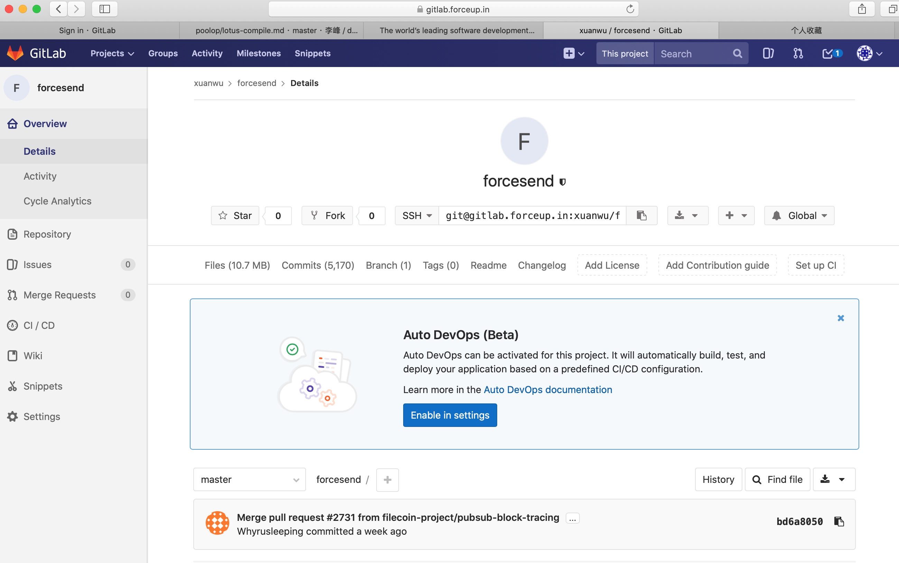

### 提交子仓库版本号示范步骤
```
➜  Backend git:(payment_test) git status 
位于分支 payment_test
您的分支领先 'origin/test' 共 1 个提交。
  （使用 "git push" 来发布您的本地提交）

尚未暂存以备提交的变更：
  （使用 "git add <文件>..." 更新要提交的内容）
  （使用 "git restore <文件>..." 丢弃工作区的改动）
  （提交或丢弃子模组中未跟踪或修改的内容）
        修改：     extern/UserBackend (修改的内容)

修改尚未加入提交（使用 "git add" 和/或 "git commit -a"）
➜  Backend git:(payment_test) rm extern/UserBackend/
➜  Backend git:(payment_test) cd extern 
➜  extern git:(payment_test) rm -rf UserBackend
➜  extern git:(payment_test) ✗ cd ..
➜  Backend git:(payment_test) ✗ git status
位于分支 payment_test
您的分支领先 'origin/test' 共 1 个提交。
  （使用 "git push" 来发布您的本地提交）

尚未暂存以备提交的变更：
  （使用 "git add/rm <文件>..." 更新要提交的内容）
  （使用 "git restore <文件>..." 丢弃工作区的改动）
        删除：     extern/UserBackend

修改尚未加入提交（使用 "git add" 和/或 "git commit -a"）
➜  Backend git:(payment_test) ✗ git submodule update --init --recursive
子模组路径 'extern/UserBackend'：检出 'a8d87ce6ee5493c27e88e4d1dfc76def2202a837'
➜  Backend git:(payment_test) cd extern/UserBackend 
➜  UserBackend git:(a8d87ce) git log  
➜  UserBackend git:(a8d87ce) git pull
warning: 不建议在没有为偏离分支指定合并策略时执行 pull 操作。 您可以在执行下一次
pull 操作之前执行下面一条命令来抑制本消息：

  git config pull.rebase false  # 合并（缺省策略）
  git config pull.rebase true   # 变基
  git config pull.ff only       # 仅快进

您可以将 "git config" 替换为 "git config --global" 以便为所有仓库设置
缺省的配置项。您也可以在每次执行 pull 命令时添加 --rebase、--no-rebase，
或者 --ff-only 参数覆盖缺省设置。

remote: Counting objects: 230, done.
remote: Compressing objects: 100% (108/108), done.
remote: Total 230 (delta 127), reused 186 (delta 110)
接收对象中: 100% (230/230), 79.12 KiB | 13.19 MiB/s, 完成.
处理 delta 中: 100% (127/127), 完成.
来自 gitlab.forceup.in:ForcePool/UserBackend
 * [新分支]          hotfix/forbidden-user -> origin/hotfix/forbidden-user
   fe31861..849e0c0  master                -> origin/master
   080598b..c8646bb  master1.10            -> origin/master1.10
   5309277..29e7564  sky                   -> origin/sky
   a8d87ce..777f757  test                  -> origin/test
   e8b02a0..844c5da  test1                 -> origin/test1
您当前不在一个分支上。
请指定您要合并哪一个分支。
详见 git-pull(1)。

    git pull <远程> <分支>

➜  UserBackend git:(a8d87ce) git pull origin test
warning: 不建议在没有为偏离分支指定合并策略时执行 pull 操作。 您可以在执行下一次
pull 操作之前执行下面一条命令来抑制本消息：

  git config pull.rebase false  # 合并（缺省策略）
  git config pull.rebase true   # 变基
  git config pull.ff only       # 仅快进

您可以将 "git config" 替换为 "git config --global" 以便为所有仓库设置
缺省的配置项。您也可以在每次执行 pull 命令时添加 --rebase、--no-rebase，
或者 --ff-only 参数覆盖缺省设置。

来自 gitlab.forceup.in:ForcePool/UserBackend
 * branch            test       -> FETCH_HEAD
更新 a8d87ce..777f757
Fast-forward
 api/types/request.go               |  10 +++
 api/user/asset.go                  |  18 ++++
 api/user/force_refresh.go          |  94 +++++++++++++++++---
 api/user/login.go                  |  14 ++-
 api/user/rlpoolassert.go           |   2 +-
 api/user/user.go                   | 115 +++++++++++++++++++-----
 api/user/userspace_income.go       |   7 --
 conf/app.toml                      |  10 ++-
 mes/mes.go                         |   2 +
 middleware/session/checksess.go    |  10 ++-
 models/gas_model.go                |  11 +++
 models/miner_balance.go            |   2 +-
 models/pledge_model_new.go         |   2 +
 models/pledge_model_rpc.go         | 488 ++++++++++++++++++++++++++++++++++-------------------------------------------------------------------
 models/pledge_model_rpc_user.go    | 454 +---------------------------------------------------------------------------------------------
 models/pool_total_income.go        |  10 ++-
 models/user.go                     |  89 ++++++++++++-------
 models/wallet_record.go            |   4 +-
 pledgetype/pledge_type.go          |  42 ++-------
 pledgetype/rpc_balance.go          |  25 +-----
 routers/routers.go                 |   8 +-
 rpc/rpc_balance.go                 |   2 +
 rpc/rpc_call.go                    |   2 +-
 rpc/rpc_gas.go                     |  42 +++++++++
 settings/settingtypes/tomltypes.go |   3 +
 25 files changed, 544 insertions(+), 922 deletions(-)
 create mode 100644 api/user/asset.go
 create mode 100644 models/gas_model.go
 create mode 100644 rpc/rpc_gas.go
➜  UserBackend git:(777f757) git log
➜  UserBackend git:(777f757) cd ..
➜  extern git:(payment_test) ✗ git status 
位于分支 payment_test
您的分支领先 'origin/test' 共 1 个提交。
  （使用 "git push" 来发布您的本地提交）

尚未暂存以备提交的变更：
  （使用 "git add <文件>..." 更新要提交的内容）
  （使用 "git restore <文件>..." 丢弃工作区的改动）
        修改：     UserBackend (新提交)

修改尚未加入提交（使用 "git add" 和/或 "git commit -a"）
➜  extern git:(payment_test) ✗ git sub
git：'sub' 不是一个 git 命令。参见 'git --help'。

最相似的命令是
        push
➜  extern git:(payment_test) ✗ git submodule 
+777f75792cf3567734cf7c2aa78835cd8df443e1 UserBackend (v1.8.4-1366-g777f757)
➜  extern git:(payment_test) ✗ git status
位于分支 payment_test
您的分支领先 'origin/test' 共 1 个提交。
  （使用 "git push" 来发布您的本地提交）

尚未暂存以备提交的变更：
  （使用 "git add <文件>..." 更新要提交的内容）
  （使用 "git restore <文件>..." 丢弃工作区的改动）
        修改：     UserBackend (新提交)

修改尚未加入提交（使用 "git add" 和/或 "git commit -a"）
➜  extern git:(payment_test) ✗ git commit 
➜  extern git:(payment_test) ✗ cd ..
➜  Backend git:(payment_test) ✗ git submodule 
+777f75792cf3567734cf7c2aa78835cd8df443e1 extern/UserBackend (v1.8.4-1366-g777f757)
➜  Backend git:(payment_test) ✗ git status
位于分支 payment_test
您的分支领先 'origin/test' 共 1 个提交。
  （使用 "git push" 来发布您的本地提交）

尚未暂存以备提交的变更：
  （使用 "git add <文件>..." 更新要提交的内容）
  （使用 "git restore <文件>..." 丢弃工作区的改动）
        修改：     extern/UserBackend (新提交)

修改尚未加入提交（使用 "git add" 和/或 "git commit -a"）
```



 ➜  lotus git:(ntwk-calibration) ✗ ./lotus client  list-deals start -h
➜  lotus git:(ntwk-calibration) ✗ 
➜  lotus git:(ntwk-calibration) ✗ ./lotus-force send start -h
No help topic for 'send'
➜  lotus git:(ntwk-calibration) ✗ ./lotus-force batchsend start -h
NAME:
   force send batchsend start - batch start send deals

USAGE:
   force send batchsend start [command options] [arguments...]

CATEGORY:
   forcesend

OPTIONS:
   --sendcount value    send count (default: 1)
   --startepotch value  start epotch (default: 20000)
   --size value         file size (default: 102400)
   --from value         specify from t3 address (default: "t3rlg22zvz6tgdy26urciotphs6n2qytqrqoloopbbzdzcrxifj5azuawltvqevjml2quhpwuxsfbnwrkfcbjq")
   --to value           specify to t0 address
   --duration value     specify duration (default: "800000")
   --filamount value    specify filamount (default: "0.0000000000000002")
   --help, -h           show help (default: false)
   
➜  lotus git:(ntwk-calibration) ✗ ./lotus-force batchsend start --to t02138  
could not get API info: could not get api endpoint: failed to read "api": read api: is a directory
➜  lotus git:(ntwk-calibration) ✗ ./lotus-force batchsend start --to t02138
could not get API info: could not get api endpoint: failed to read "api": read api: is a directory
➜  lotus git:(b261ec5f) ✗ ./lotus
NAME:
   lotus - Filecoin decentralized storage network client

USAGE:
   lotus [global options] command [command options] [arguments...]

VERSION:
   0.4.3+git.b261ec5f.dirty

COMMANDS:
   daemon   Start a lotus daemon process
   version  Print version
   help, h  Shows a list of commands or help for one command
   basic:
     send       Send funds between accounts
     wallet     Manage wallet
     client     Make deals, store data, retrieve data
     forcesend  batch send deals
     msig       Interact with a multisig wallet
     paych      Manage payment channels
   developer:
     auth          Manage RPC permissions
     mpool         Manage message pool
     state         Interact with and query filecoin chain state
     chain         Interact with filecoin blockchain
     log           Manage logging
     wait-api      Wait for lotus api to come online
     fetch-params  Fetch proving parameters
   network:
     net   Manage P2P Network
     sync  Inspect or interact with the chain syncer

GLOBAL OPTIONS:
   --help, -h     show help (default: false)
   --version, -v  print the version (default: false)
➜  lotus git:(ntwk-calibration) ✗ ./lotus forcesend
NAME:
   lotus forcesend - batch send deals

USAGE:
   lotus forcesend command [command options] [arguments...]

COMMANDS:
   help, h  Shows a list of commands or help for one command
   storage:
     start  batch start send deals

OPTIONS:
   --help, -h     show help (default: false)
   --version, -v  print the version (default: false)
   
➜  lotus git:(ntwk-calibration) ✗ ./lotus forcesend start 
Import 65, Root encode= bafk2bzacecb66dzd2vsravzfs252wf6zguo3eis6fue43f6nqacpwryttpc32
sendCount= 1 , startEpotch= 20000 , fileSize= 102400 , fileCidEncode= bafk2bzacecb66dzd2vsravzfs252wf6zguo3eis6fue43f6nqacpwryttpc32 ,  fromT3Address= t3rlg22zvz6tgdy26urciotphs6n2qytqrqoloopbbzdzcrxifj5azuawltvqevjml2quhpwuxsfbnwrkfcbjq ,  toT0Address=  , filMount= 0.0000000000000002 , duration= 800000
ERROR: failed getting peer ID: (get ssize) failed to load miner actor state: get actor: GetActor called on undefined address

➜  lotus git:(ntwk-calibration) ✗ ./lotus forcesend start --to t02138
Import 66, Root encode= bafk2bzaceam3y4turek2o2ovlkthygyzzvbvxstjgkzdzdi4gyajn4p4dnxkg
sendCount= 1 , startEpotch= 20000 , fileSize= 102400 , fileCidEncode= bafk2bzaceam3y4turek2o2ovlkthygyzzvbvxstjgkzdzdi4gyajn4p4dnxkg ,  fromT3Address= t3rlg22zvz6tgdy26urciotphs6n2qytqrqoloopbbzdzcrxifj5azuawltvqevjml2quhpwuxsfbnwrkfcbjq ,  toT0Address= t02138 , filMount= 0.0000000000000002 , duration= 800000
bafyreihymplgr2psjmbj4rnrnef4onzrgpjhk22nbx673x7loox3cmb72a
➜  lotus git:(ntwk-calibration) ✗ ./lotus-force batchsend start --to t02138
could not get API info: could not get api endpoint: failed to read "api": read api: is a directory
➜  lotus git:(ntwk-calibration) ✗ make lotus-force
rm -f lotus-force
go build  -ldflags="-X=github.com/filecoin-project/lotus/build.CurrentCommit=+git.b261ec5f.dirty" -o lotus-force ./cmd/lotus-force
# github.com/filecoin-project/lotus/cmd/lotus-force
ld: warning: could not create compact unwind for _sha256_block_data_order: does not use RBP or RSP based frame
go run github.com/GeertJohan/go.rice/rice append --exec lotus-force -i ./build
➜  lotus git:(ntwk-calibration) ✗ ./lotus-force batchsend start --to t02138
could not get API info: could not get api endpoint: failed to read "api": read api: is a directory
➜  lotus git:(ntwk-calibration) ✗ make lotus-force
➜  lotus git:(ntwk-calibration) ✗ git status .
位于分支 ntwk-calibration
您的分支领先 'origin/ntwk-calibration' 共 2 个提交。
  （使用 "git push" 来发布您的本地提交）

要提交的变更：
  （使用 "git restore --staged <文件>..." 以取消暂存）
        新文件：   cmd/lotus-force/force-send.go
        新文件：   cmd/lotus-force/main.go

尚未暂存以备提交的变更：
  （使用 "git add <文件>..." 更新要提交的内容）
  （使用 "git restore <文件>..." 丢弃工作区的改动）
        修改：     Makefile
        修改：     cli/forcesend.go
        修改：     cmd/fadan/main.go
        修改：     cmd/lotus-force/force-send.go
        修改：     cmd/lotus-force/main.go

未跟踪的文件:
  （使用 "git add <文件>..." 以包含要提交的内容）
        lotus-force
        testfile-2020-08-09-14:05:07.txt
        testfile-2020-08-09-14:17:39.txt
        testfile-2020-08-09-14:25:32.txt
        testfile-2020-08-09-14:31:58.txt
        testfile-2020-08-09-14:38:47.txt
        testfile-2020-08-09-14:40:08.txt
        testfile-2020-08-09-14:45:28.txt
        testfile-2020-08-09-14:45:29.txt
        testfile-2020-08-09-14:45:30.txt
        testfile-2020-08-09-14:45:31.txt
        testfile-2020-08-09-14:45:32.txt
        testfile-2020-08-09-14:45:33.txt
        testfile-2020-08-09-14:46:13.txt
        testfile-2020-08-09-14:46:14.txt
        testfile-2020-08-09-14:46:15.txt
        testfile-2020-08-09-14:46:16.txt
        testfile-2020-08-09-14:46:17.txt
        testfile-2020-08-09-14:46:18.txt
        testfile-2020-08-09-14:46:26.txt
        testfile-2020-08-09-14:46:27.txt
        testfile-2020-08-09-14:46:28.txt
        testfile-2020-08-09-14:46:29.txt
        testfile-2020-08-09-14:46:30.txt
        testfile-2020-08-09-14:46:31.txt
        testfile-2020-08-09-16:37:05.txt
        testfile-2020-08-09-16:38:19.txt
        testfile-2020-08-09-16:54:31.txt
        testfile-2020-08-09-16:55:41.txt
        testfile-2020-08-09-16:58:29.txt
        testfile-2020-08-09-17:10:51.txt
        testfile-2020-08-09-17:14:28.txt
        testfile-2020-08-09-17:16:00.txt

➜  lotus git:(ntwk-calibration) ✗ git status .
位于分支 ntwk-calibration
您的分支领先 'origin/ntwk-calibration' 共 2 个提交。
  （使用 "git push" 来发布您的本地提交）

要提交的变更：
  （使用 "git restore --staged <文件>..." 以取消暂存）
        新文件：   cmd/lotus-force/force-send.go
        新文件：   cmd/lotus-force/main.go

尚未暂存以备提交的变更：
  （使用 "git add <文件>..." 更新要提交的内容）
  （使用 "git restore <文件>..." 丢弃工作区的改动）
        修改：     .gitignore
        修改：     Makefile
        修改：     cli/forcesend.go
        修改：     cmd/fadan/main.go
        修改：     cmd/lotus-force/force-send.go
        修改：     cmd/lotus-force/main.go

未跟踪的文件:
  （使用 "git add <文件>..." 以包含要提交的内容）
        lotus-force

➜  lotus git:(ntwk-calibration) ✗ git status .
位于分支 ntwk-calibration
您的分支领先 'origin/ntwk-calibration' 共 2 个提交。
  （使用 "git push" 来发布您的本地提交）

要提交的变更：
  （使用 "git restore --staged <文件>..." 以取消暂存）
        新文件：   cmd/lotus-force/force-send.go
        新文件：   cmd/lotus-force/main.go

尚未暂存以备提交的变更：
  （使用 "git add <文件>..." 更新要提交的内容）
  （使用 "git restore <文件>..." 丢弃工作区的改动）
        修改：     .gitignore
        修改：     Makefile
        修改：     cli/forcesend.go
        修改：     cmd/fadan/main.go
        修改：     cmd/lotus-force/force-send.go
        修改：     cmd/lotus-force/main.go

➜  lotus git:(ntwk-calibration) ✗ git add .
➜  lotus git:(ntwk-calibration) ✗ git commit . -m "update"
[ntwk-calibration f0cf0e74] update
 6 files changed, 373 insertions(+), 24 deletions(-)
 create mode 100644 cmd/lotus-force/force-send.go
 create mode 100644 cmd/lotus-force/main.go
➜  lotus git:(ntwk-calibration) git branch -a
➜  lotus git:(ntwk-calibration) git checkout -b force-send 
切换到一个新分支 'force-send'
➜  lotus git:(force-send) git remote add            
➜  lotus git:(force-send) git remote add gitlab git@gitlab.forceup.in:xuanwu/forcesend.git
➜  lotus git:(force-send) 
➜  lotus git:(force-send) git remote     
gitlab
origin
➜  lotus git:(force-send) git checkout master
M       extern/filecoin-ffi
切换到分支 'master'
您的分支落后 'origin/master' 共 11 个提交，并且可以快进。
  （使用 "git pull" 来更新您的本地分支）
➜  lotus git:(master) ✗ git status .
位于分支 master
您的分支落后 'origin/master' 共 11 个提交，并且可以快进。
  （使用 "git pull" 来更新您的本地分支）

尚未暂存以备提交的变更：
  （使用 "git add <文件>..." 更新要提交的内容）
  （使用 "git restore <文件>..." 丢弃工作区的改动）
        修改：     extern/filecoin-ffi (新提交)

未跟踪的文件:
  （使用 "git add <文件>..." 以包含要提交的内容）
        lotus-force
        lotus-miner
        lotus-worker
        testfile-2020-08-09-14:05:07.txt
        testfile-2020-08-09-14:17:39.txt
        testfile-2020-08-09-14:25:32.txt
        testfile-2020-08-09-14:31:58.txt
        testfile-2020-08-09-14:38:47.txt
        testfile-2020-08-09-14:40:08.txt
        testfile-2020-08-09-14:45:28.txt
        testfile-2020-08-09-14:45:29.txt
        testfile-2020-08-09-14:45:30.txt
        testfile-2020-08-09-14:45:31.txt
        testfile-2020-08-09-14:45:32.txt
        testfile-2020-08-09-14:45:33.txt
        testfile-2020-08-09-14:46:13.txt
        testfile-2020-08-09-14:46:14.txt
        testfile-2020-08-09-14:46:15.txt
        testfile-2020-08-09-14:46:16.txt
        testfile-2020-08-09-14:46:17.txt
        testfile-2020-08-09-14:46:18.txt
        testfile-2020-08-09-14:46:26.txt
        testfile-2020-08-09-14:46:27.txt
        testfile-2020-08-09-14:46:28.txt
        testfile-2020-08-09-14:46:29.txt
        testfile-2020-08-09-14:46:30.txt
        testfile-2020-08-09-14:46:31.txt
        testfile-2020-08-09-16:37:05.txt
        testfile-2020-08-09-16:38:19.txt
        testfile-2020-08-09-16:54:31.txt
        testfile-2020-08-09-16:55:41.txt
        testfile-2020-08-09-16:58:29.txt
        testfile-2020-08-09-17:10:51.txt
        testfile-2020-08-09-17:14:28.txt
        testfile-2020-08-09-17:16:00.txt

修改尚未加入提交（使用 "git add" 和/或 "git commit -a"）
➜  lotus git:(master) ✗ git submodule update
子模组路径 'extern/filecoin-ffi'：检出 '6a143e06f923f3a4f544c7a652e8b4df420a3d28'
➜  lotus git:(master) ✗ git status .
位于分支 master
您的分支落后 'origin/master' 共 11 个提交，并且可以快进。
  （使用 "git pull" 来更新您的本地分支）

未跟踪的文件:
  （使用 "git add <文件>..." 以包含要提交的内容）
        lotus-force
        lotus-miner
        lotus-worker
        testfile-2020-08-09-14:05:07.txt
        testfile-2020-08-09-14:17:39.txt
        testfile-2020-08-09-14:25:32.txt
        testfile-2020-08-09-14:31:58.txt
        testfile-2020-08-09-14:38:47.txt
        testfile-2020-08-09-14:40:08.txt
        testfile-2020-08-09-14:45:28.txt
        testfile-2020-08-09-14:45:29.txt
        testfile-2020-08-09-14:45:30.txt
        testfile-2020-08-09-14:45:31.txt
        testfile-2020-08-09-14:45:32.txt
        testfile-2020-08-09-14:45:33.txt
        testfile-2020-08-09-14:46:13.txt
        testfile-2020-08-09-14:46:14.txt
        testfile-2020-08-09-14:46:15.txt
        testfile-2020-08-09-14:46:16.txt
        testfile-2020-08-09-14:46:17.txt
        testfile-2020-08-09-14:46:18.txt
        testfile-2020-08-09-14:46:26.txt
        testfile-2020-08-09-14:46:27.txt
        testfile-2020-08-09-14:46:28.txt
        testfile-2020-08-09-14:46:29.txt
        testfile-2020-08-09-14:46:30.txt
        testfile-2020-08-09-14:46:31.txt
        testfile-2020-08-09-16:37:05.txt
        testfile-2020-08-09-16:38:19.txt
        testfile-2020-08-09-16:54:31.txt
        testfile-2020-08-09-16:55:41.txt
        testfile-2020-08-09-16:58:29.txt
        testfile-2020-08-09-17:10:51.txt
        testfile-2020-08-09-17:14:28.txt
        testfile-2020-08-09-17:16:00.txt

提交为空，但是存在尚未跟踪的文件（使用 "git add" 建立跟踪）
➜  lotus git:(master) ✗ git push gitlab master 
枚举对象: 37423, 完成.
对象计数中: 100% (37423/37423), 完成.
使用 12 个线程进行压缩
压缩对象中: 100% (9584/9584), 完成.
写入对象中: 100% (37423/37423), 9.66 MiB | 11.16 MiB/s, 完成.
总共 37423（差异 26894），复用 37423（差异 26894），包复用 0
remote: Resolving deltas: 100% (26894/26894), done.
To gitlab.forceup.in:xuanwu/forcesend.git
 * [new branch]        master -> master
➜  lotus git:(master) ✗ git checkout force-send
M       extern/filecoin-ffi
切换到分支 'force-send'
➜  lotus git:(force-send) ✗ git submodule update    
子模组路径 'extern/filecoin-ffi'：检出 'cddc56607e1d851ea6d09d49404bd7db70cb3c2e'
➜  lotus git:(force-send) git push gitlab force-send  
枚举对象: 9557, 完成.
对象计数中: 100% (6671/6671), 完成.
使用 12 个线程进行压缩
压缩对象中: 100% (1944/1944), 完成.
写入对象中: 100% (6056/6056), 30.01 MiB | 7.27 MiB/s, 完成.
总共 6056（差异 4555），复用 5443（差异 3987），包复用 0
remote: Resolving deltas: 100% (4555/4555), completed with 325 local objects.
remote: 
remote: To create a merge request for force-send, visit:
remote:   https://gitlab.forceup.in/xuanwu/forcesend/merge_requests/new?merge_request%5Bsource_branch%5D=force-send
remote: 
To gitlab.forceup.in:xuanwu/forcesend.git
 * [new branch]        force-send -> force-send
➜  lotus git:(force-send) git clone git@gitlab.forceup.in:xuanwu/forcesend.git
正克隆到 'forcesend'...
remote: Counting objects: 43478, done.
remote: Compressing objects: 100% (11005/11005), done.
remote: Total 43478 (delta 31484), reused 43397 (delta 31404)
接收对象中: 100% (43478/43478), 39.68 MiB | 24.88 MiB/s, 完成.
处理 delta 中: 100% (31484/31484), 完成.
➜  lotus git:(force-send) ✗ ll
total 667368
-rw-r--r--   1 zhenglun1  staff   351B Aug  1 17:24 CHANGELOG.md
-rw-r--r--   1 zhenglun1  staff   520B Aug  1 17:24 LICENSE-APACHE
-rw-r--r--   1 zhenglun1  staff   1.0K Aug  1 17:24 LICENSE-MIT
-rw-r--r--   1 zhenglun1  staff   8.4K Aug  9 17:24 Makefile
-rw-r--r--   1 zhenglun1  staff   2.4K Aug  1 17:24 README.md
-rw-r--r--   1 zhenglun1  staff   1.7K Aug  1 17:24 SECURITY.md
drwxr-xr-x  15 zhenglun1  staff   480B Aug  9 17:24 api
drwxr-xr-x  23 zhenglun1  staff   736B Aug  9 17:24 build
drwxr-xr-x  27 zhenglun1  staff   864B Aug  9 17:24 chain
drwxr-xr-x  20 zhenglun1  staff   640B Aug  9 17:24 cli
drwxr-xr-x  18 zhenglun1  staff   576B Aug  9 17:24 cmd
drwxr-xr-x   4 zhenglun1  staff   128B Aug  1 17:24 documentation
drwxr-xr-x   4 zhenglun1  staff   128B Aug  1 17:24 extern
drwxr-xr-x  38 zhenglun1  staff   1.2K Aug  9 17:29 forcesend
drwxr-xr-x   3 zhenglun1  staff    96B Aug  9 17:24 gen
drwxr-xr-x   3 zhenglun1  staff    96B Aug  9 17:24 genesis
-rw-r--r--   1 zhenglun1  staff   6.5K Aug  9 17:24 go.mod
-rw-r--r--   1 zhenglun1  staff   180K Aug  9 17:24 go.sum
drwxr-xr-x   3 zhenglun1  staff    96B Aug  9 17:24 journal
drwxr-xr-x  16 zhenglun1  staff   512B Aug  9 17:24 lib
-rw-r--r--   1 zhenglun1  staff   5.2K Aug  9 17:24 localnet.json
-rwxr-xr-x   1 zhenglun1  staff    89M Aug  9 14:44 lotus
-rwxr-xr-x   1 zhenglun1  staff    59M Aug  9 17:10 lotus-force
-rwxr-xr-x   1 zhenglun1  staff    89M Aug  8 18:12 lotus-miner
-rwxr-xr-x   1 zhenglun1  staff    61M Aug  8 18:12 lotus-worker
-rw-r--r--   1 zhenglun1  staff   7.7K Aug  9 17:24 lotus.log
drwxr-xr-x   7 zhenglun1  staff   224B Aug  9 17:24 lotuspond
drwxr-xr-x   7 zhenglun1  staff   224B Aug  9 17:24 markets
drwxr-xr-x   3 zhenglun1  staff    96B Aug  9 17:24 metrics
drwxr-xr-x   4 zhenglun1  staff   128B Aug  9 17:24 miner
drwxr-xr-x  12 zhenglun1  staff   384B Aug  9 17:24 node
drwxr-xr-x  17 zhenglun1  staff   544B Aug  9 17:24 paychmgr
drwxr-xr-x  22 zhenglun1  staff   704B Aug  9 17:24 scripts
drwxr-xr-x  10 zhenglun1  staff   320B Aug  9 17:24 storage
-rw-r--r--   1 zhenglun1  staff   100K Aug  9 14:05 testfile-2020-08-09-14:05:07.txt
-rw-r--r--   1 zhenglun1  staff   100K Aug  9 14:17 testfile-2020-08-09-14:17:39.txt
-rw-r--r--   1 zhenglun1  staff   100K Aug  9 14:25 testfile-2020-08-09-14:25:32.txt
-rw-r--r--   1 zhenglun1  staff   100K Aug  9 14:31 testfile-2020-08-09-14:31:58.txt
-rw-r--r--   1 zhenglun1  staff   100K Aug  9 14:38 testfile-2020-08-09-14:38:47.txt
-rw-r--r--   1 zhenglun1  staff   100K Aug  9 14:40 testfile-2020-08-09-14:40:08.txt
-rw-r--r--   1 zhenglun1  staff   100K Aug  9 14:45 testfile-2020-08-09-14:45:28.txt
-rw-r--r--   1 zhenglun1  staff   100K Aug  9 14:45 testfile-2020-08-09-14:45:29.txt
-rw-r--r--   1 zhenglun1  staff   100K Aug  9 14:45 testfile-2020-08-09-14:45:30.txt
-rw-r--r--   1 zhenglun1  staff   100K Aug  9 14:45 testfile-2020-08-09-14:45:31.txt
-rw-r--r--   1 zhenglun1  staff   100K Aug  9 14:45 testfile-2020-08-09-14:45:32.txt
-rw-r--r--   1 zhenglun1  staff   100K Aug  9 14:45 testfile-2020-08-09-14:45:33.txt
-rw-r--r--   1 zhenglun1  staff   100K Aug  9 14:46 testfile-2020-08-09-14:46:13.txt
-rw-r--r--   1 zhenglun1  staff   100K Aug  9 14:46 testfile-2020-08-09-14:46:14.txt
-rw-r--r--   1 zhenglun1  staff   100K Aug  9 14:46 testfile-2020-08-09-14:46:15.txt
-rw-r--r--   1 zhenglun1  staff   100K Aug  9 14:46 testfile-2020-08-09-14:46:16.txt
-rw-r--r--   1 zhenglun1  staff   100K Aug  9 14:46 testfile-2020-08-09-14:46:17.txt
-rw-r--r--   1 zhenglun1  staff   100K Aug  9 14:46 testfile-2020-08-09-14:46:18.txt
-rw-r--r--   1 zhenglun1  staff   100K Aug  9 14:46 testfile-2020-08-09-14:46:26.txt
-rw-r--r--   1 zhenglun1  staff   100K Aug  9 14:46 testfile-2020-08-09-14:46:27.txt
-rw-r--r--   1 zhenglun1  staff   100K Aug  9 14:46 testfile-2020-08-09-14:46:28.txt
-rw-r--r--   1 zhenglun1  staff   100K Aug  9 14:46 testfile-2020-08-09-14:46:29.txt
-rw-r--r--   1 zhenglun1  staff   100K Aug  9 14:46 testfile-2020-08-09-14:46:30.txt
-rw-r--r--   1 zhenglun1  staff   100K Aug  9 14:46 testfile-2020-08-09-14:46:31.txt
-rw-r--r--   1 zhenglun1  staff   100K Aug  9 16:37 testfile-2020-08-09-16:37:05.txt
-rw-r--r--   1 zhenglun1  staff   100K Aug  9 16:38 testfile-2020-08-09-16:38:19.txt
-rw-r--r--   1 zhenglun1  staff   100K Aug  9 16:54 testfile-2020-08-09-16:54:31.txt
-rw-r--r--   1 zhenglun1  staff   100K Aug  9 16:55 testfile-2020-08-09-16:55:41.txt
-rw-r--r--   1 zhenglun1  staff   100K Aug  9 16:58 testfile-2020-08-09-16:58:29.txt
-rw-r--r--   1 zhenglun1  staff   100K Aug  9 17:10 testfile-2020-08-09-17:10:51.txt
-rw-r--r--   1 zhenglun1  staff   100K Aug  9 17:14 testfile-2020-08-09-17:14:28.txt
-rw-r--r--   1 zhenglun1  staff   100K Aug  9 17:16 testfile-2020-08-09-17:16:00.txt
drwxr-xr-x   4 zhenglun1  staff   128B Aug  1 17:24 tools
➜  lotus git:(force-send) ✗ pwd
/Users/zhenglun1/goworkspace/lotus3/lotus
➜  lotus git:(force-send) ✗ 
