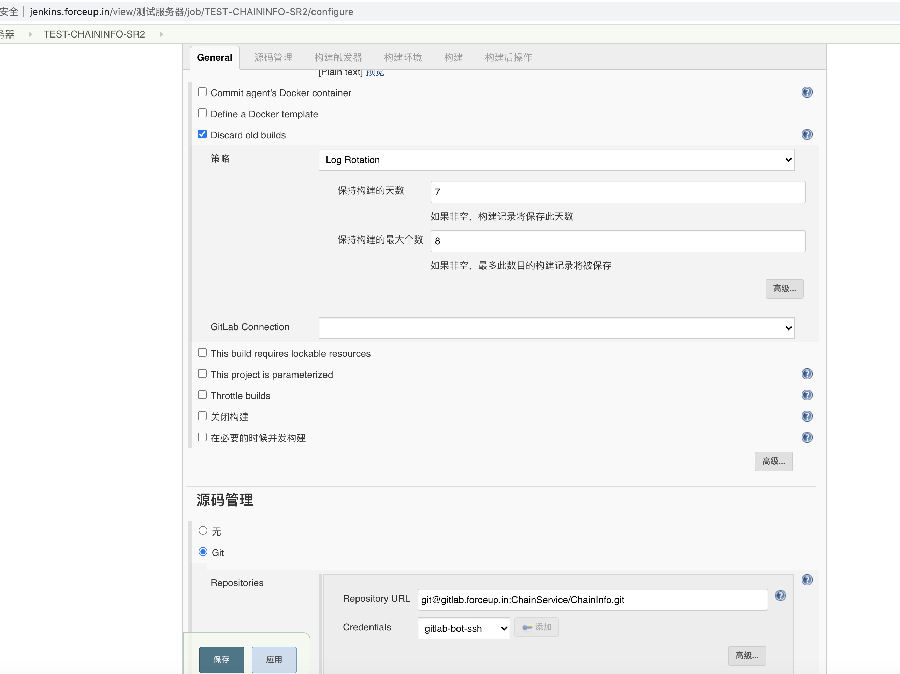
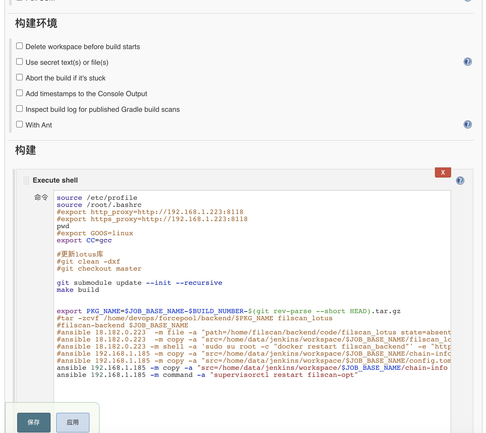

### 配置



#### 构建环境


```
source /etc/profile
source /root/.bashrc
#export http_proxy=http://192.168.1.223:8118
#export https_proxy=http://192.168.1.223:8118
pwd
#export GOOS=linux
export CC=gcc

#更新lotus库
#git clean -dxf
#git checkout master

git submodule update --init --recursive
make build


export PKG_NAME=$JOB_BASE_NAME-$BUILD_NUMBER-$(git rev-parse --short HEAD).tar.gz
#tar -zcvf /home/devops/forcepool/backend/$PKG_NAME filscan_lotus
#filscan-backend $JOB_BASE_NAME
#ansible 18.182.0.223  -m file -a "path=/home/filscan/backend/code/filscan_lotus state=absent" -e "http_proxy=http://192.168.1.223:8118"
#ansible 18.182.0.223  -m copy -a "src=/home/data/jenkins/workspace/$JOB_BASE_NAME/filscan_lotus dest=/home/filscan/backend/code mode=0777" -e "http_proxy=http://192.168.1.223:8118"
#ansible 18.182.0.223 -m shell -a 'sudo su root -c "docker restart filscan_backend"' -e "http_proxy=http://192.168.1.223:8118"
#ansible 192.168.1.185 -m copy -a "src=/home/data/jenkins/workspace/$JOB_BASE_NAME/chain-info dest=/home/chain-info/code/ mode=0777"
#ansible 192.168.1.185 -m copy -a "src=/home/data/jenkins/workspace/$JOB_BASE_NAME/config.toml dest=/home/chain-info/code/ mode=0777"
ansible 192.168.1.185 -m copy -a "src=/home/data/jenkins/workspace/$JOB_BASE_NAME/chain-info dest=/home/chain-info/code/ mode=0777"
ansible 192.168.1.185 -m command -a "supervisorctl restart filscan-opt"
```