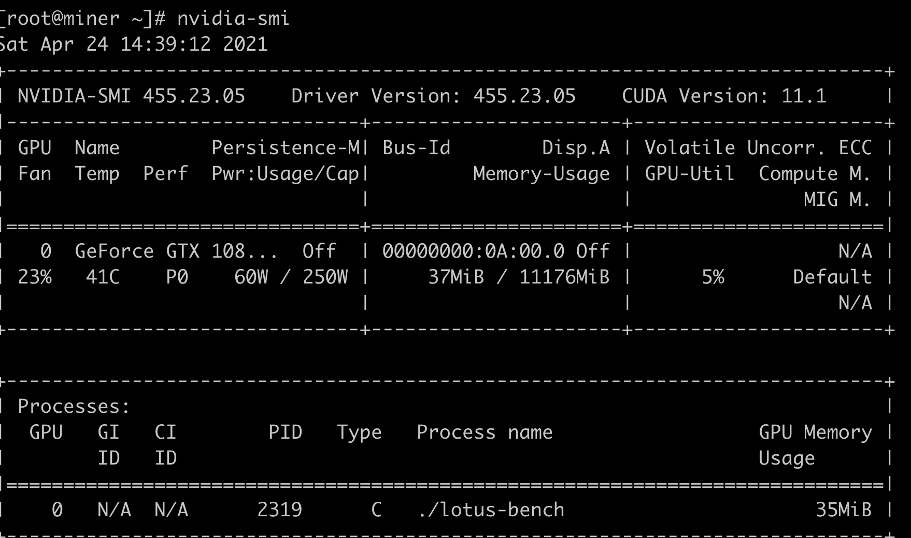
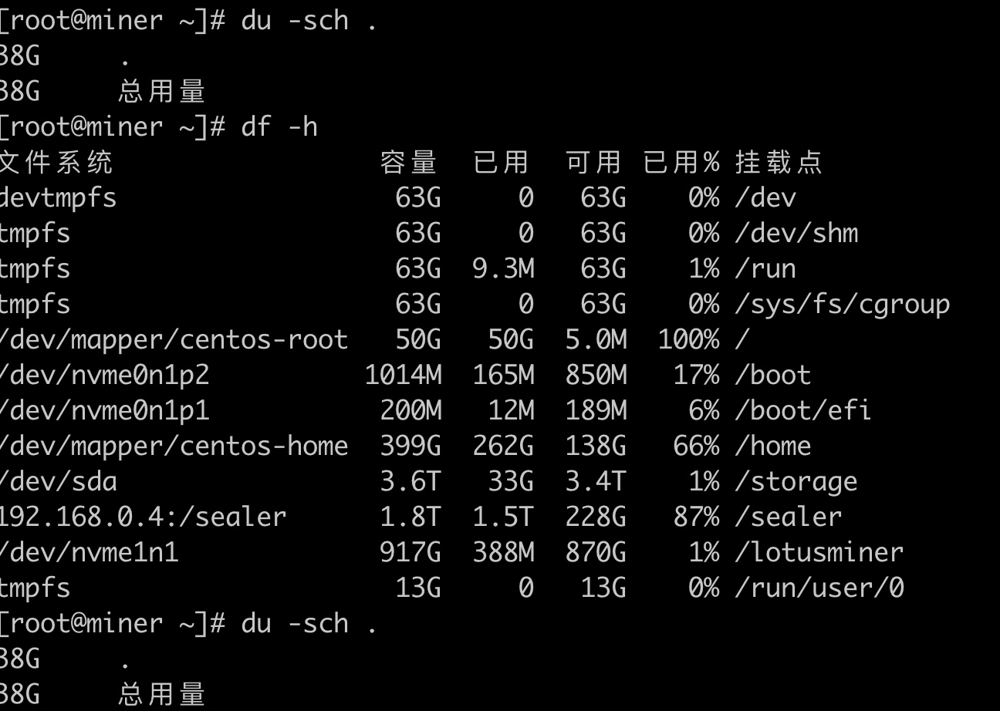
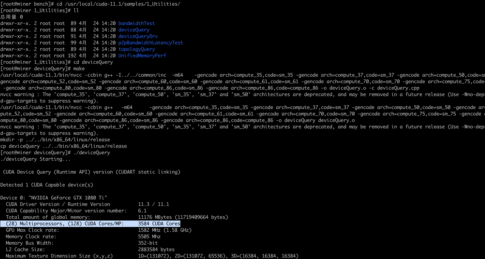

Separating Nvidia GPUs
When using proprietary Nvidia drivers, it's possible to select which GPU device will be used by Lotus with the NVIDIA_VISIBLE_DEVICES=[device number] env var.

Device numbers can be obtained with the nvidia-smi -L command.

### 测试gpu

第一栏的Fan：N/A是风扇转速，从0到100%之间变动，这个速度是计算机期望的风扇转速，实际情况下如果风扇堵转，可能打不到显示的转速。有的设备不会返回转速，因为它不依赖风扇冷却而是通过其他外设保持低温（比如我们实验室的服务器是常年放在空调房间里的）。 
第二栏的Temp：是温度，单位摄氏度。 
第三栏的Perf：是性能状态，从P0到P12，P0表示最大性能，P12表示状态最小性能。 
第四栏下方的Pwr：是能耗，上方的Persistence-M：是持续模式的状态，持续模式虽然耗能大，但是在新的GPU应用启动时，花费的时间更少，这里显示的是off的状态。 
第五栏的Bus-Id是涉及GPU总线的东西，domain:bus:device.function 
第六栏的Disp.A是Display Active，表示GPU的显示是否初始化。 
第五第六栏下方的Memory Usage是显存使用率。 
第七栏是浮动的GPU利用率。 
第八栏上方是关于ECC的东西。 
第八栏下方Compute M是计算模式。 
下面一张表示每个进程占用的显存使用率。

### 显卡安装 遇到 Received signal SIGBUS; aborting 驱动程序推出， 错误
原因 / 剩余空间太小

### 观察gpu使用
 watch -n 0.5 nvidia-smi
 
 
 
### cuda cores 查看
用验证CUDA是否安装成功， 可以看到 cores
 pwd
/usr/local/cuda-11.1/samples/1_Utilities/deviceQuery

sudo make
./deviceQuery
 
