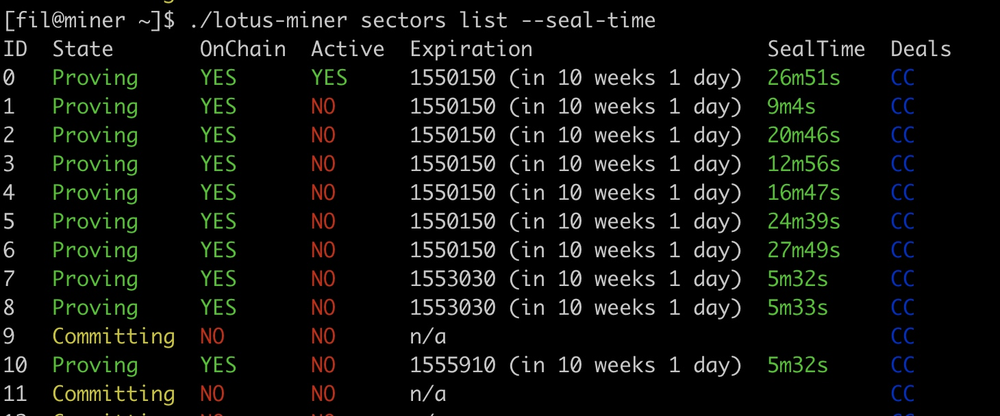
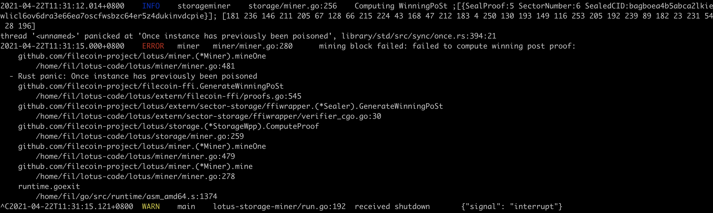
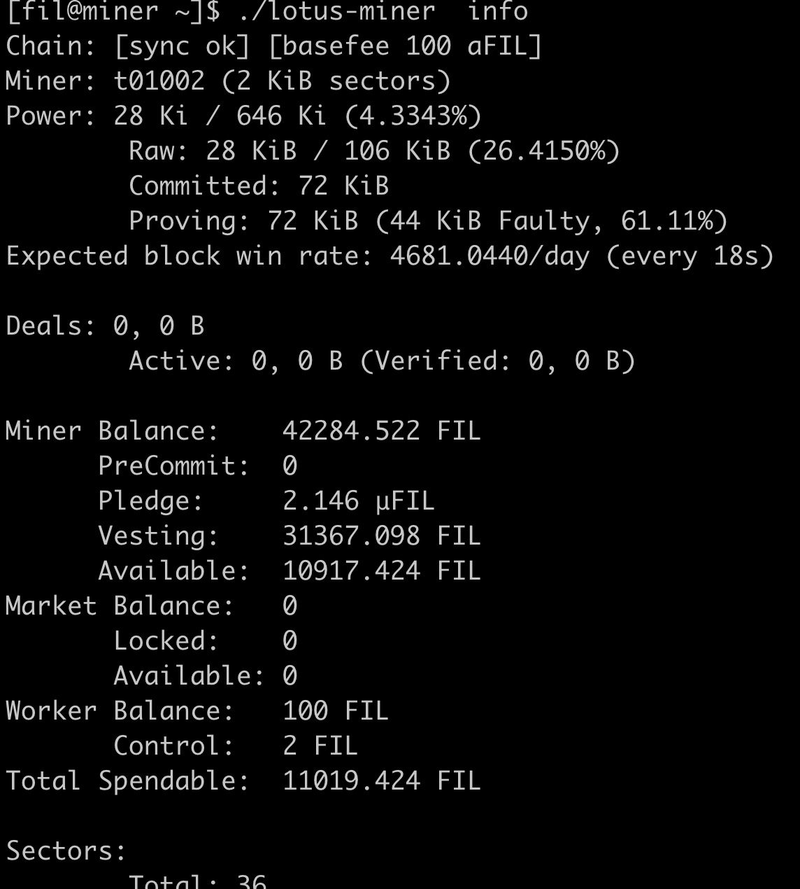
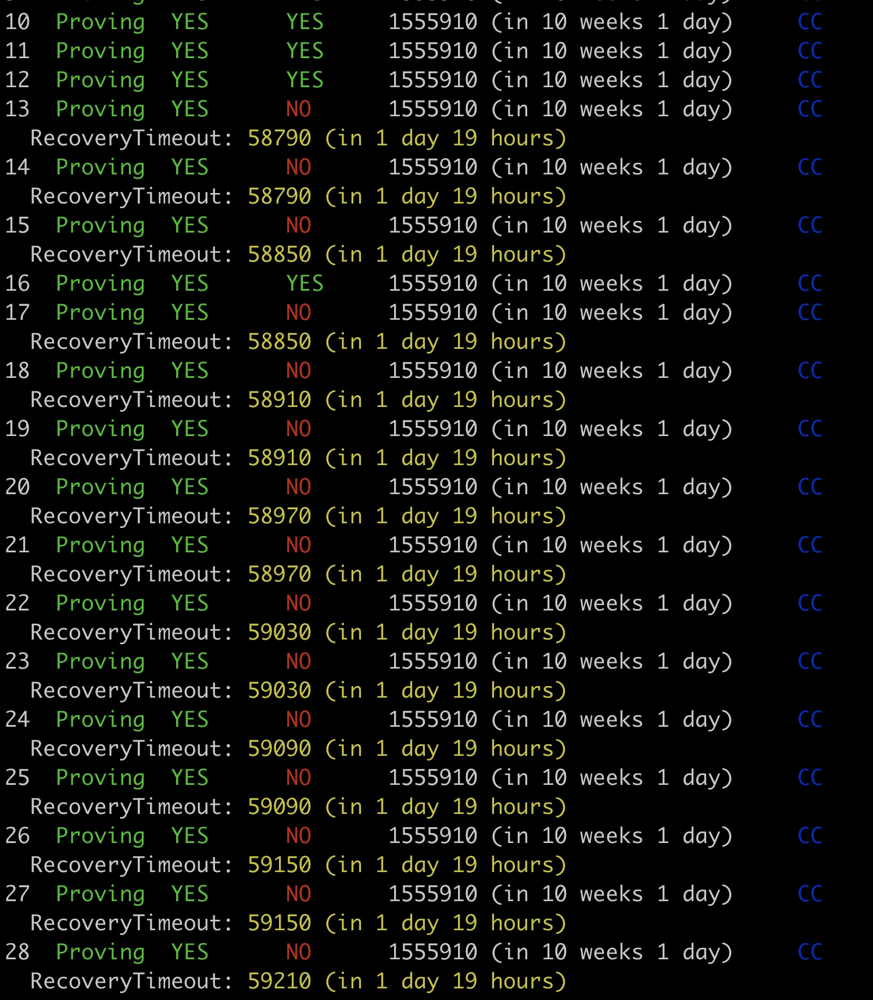

 ./lotus-miner log set-level -h 
 
 ./lotus-miner log set-level debug， 
 
 
 
 
### seal-time 
./lotus-miner sectors list --seal-time
 

### 显卡指定错误， miner wining post报错：

export BELLMAN_CUSTOM_GPU="GeForce GT 710"

miner报错：

### lotus miner 停止， 没有及时提供证明，  出现faulty sectors

对应的sector这样：

