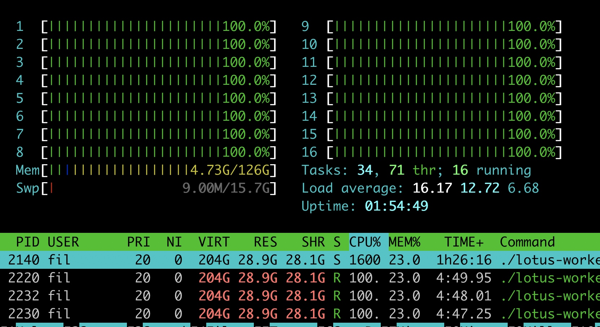

### packing 结束后， 产生共120多G的文件


### p1 会用全部的核



### p2 nvme swap 128G
先看当前的内存 swap
```
[root@worker fil]# free -h
              total        used        free      shared  buff/cache   available
Mem:            62G        2.0G         31G        9.1M         28G         60G
Swap:           35G          0B         15G
```

目标 把swap 15G 扩展为20G：
看硬盘哪里有20G空间： 
df 看到：
/dev/mapper/centos-home    865G   22G  843G    3% /home
在/home 创建 20G 的文件
```
[root@worker fil]# dd if=/dev/zero of=/home/fil/swipfile bs=1024M count=20
记录了20+0 的读入
记录了20+0 的写出
21474836480字节(21 GB)已复制，11.3427 秒，1.9 GB/秒

[root@worker fil]# chmod 600 swipfile

[root@worker fil]# mkswap swipfile
正在设置交换空间版本 1，大小 = 20971516 KiB
无标签，UUID=d53dc54f-d452-46bc-ab93-3ae6b7f6defa

[root@worker fil]# swapon swipfile

[root@worker fil]# swapon -s
文件名				类型		大小	已用	权限
/dev/dm-1                              	partition	16515068	0	-2
/home/fil/aa                           	file	20971516	0	-4

[root@worker fil]# free -h
              total        used        free      shared  buff/cache   available
Mem:            62G        2.0G         31G        9.1M         28G         60G
Swap:           35G          0B         35G

```

### worker重启动后， 不会自动做上次没完成的


### 系统空间太小， filecoin-parents， 要链接到大的目录
链接效果：

命令：
rm /var/tmp/filecoin-parents -rf
mkdir /home/fil/filecoin-parents
ln -s /home/fil/filecoin-parents /var/tmp/filecoin-parents


### 显卡驱动装错 导致P1 起不来， /usr/lib64/下so文件找不到的错误， 
解决：  sudo yum remove kmod-nvidia-340xx.x86_64

### p2 用gpu 2G内存


有时会是3G


### 查看每个worker在那个机器上， 以及做那个任务， 和做任务已经进行的时间

