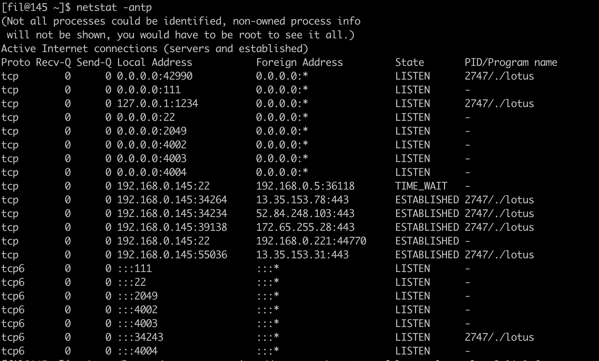
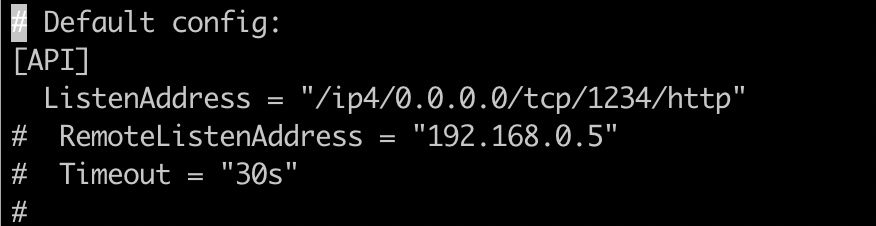
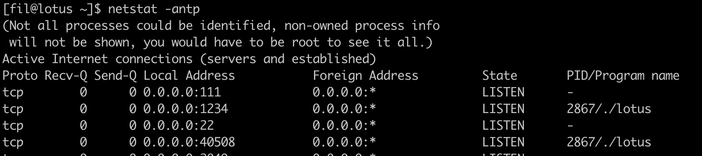
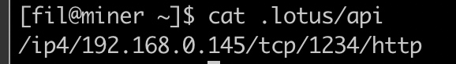
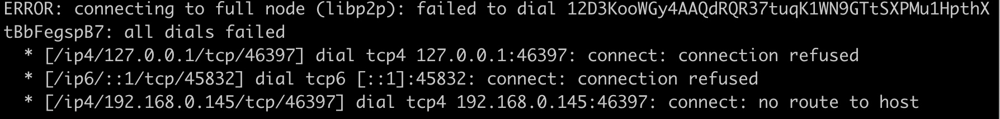

### lotus 主机上的操作
lotus daemon 第一次启动时， 会创建.lotus/config.toml, 第一次启动默认对外端口是1234， 只允许127.0.0.1访问， 所以只能本地访问端口

第二次启动， 会读取confit.toml， 为了miner能访问lotus的端口， 需要修改配置文件，改为：

lotus daemon 不指定 --api， 就用.lotus/config.tml里的api，
这样再次启动时时：

127.0.0.1 变为了0.0.0.0 ， lotus端口可以被其他主机访问。 
lotus 每次启动， 都要net connect 到有效的Peer节点

### miner 主机上的操作
然后将.lotus/api .lotus/token拷贝到miner主机，同目录下  
在miner主机.lotus/api 改为：

这样miner主机， 就可以使用lotus了， lotus chain list， sync wait, 等命令正常使用。 

lotus 正常使用了， 就可以miner初始化了。 
./lotus-miner init --nosync --sector-size=2048 --owner=t3v4mxwf6ounqksdivbmnpv23xlbt2ptfglhufv3siedpjafswjkgtfrfuts6did3lk45zusjik3wq6u7mehwq

启动miner时的log：

miner要用libp2p的方式连接 lotus节点， 

到lotus上打开端口
sudo firewall-cmd --zone=public --add-port=46397/tcp --permanent

再重启miner

### lotus miner
创世节点挂掉， 有算力的矿工一样可以出块， 维护链的增长    

