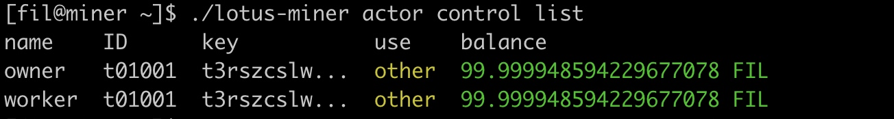
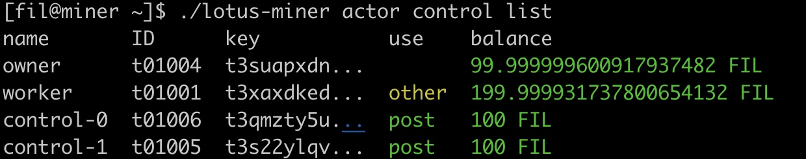
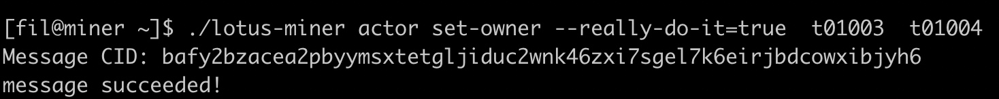
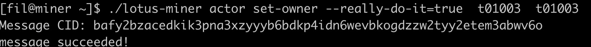
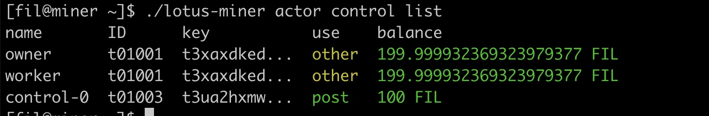
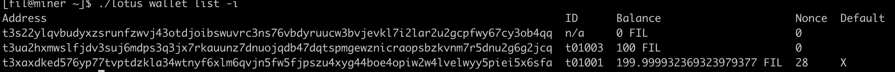

### 默认的， worker owner地址相同



### 设置owner地址, 要调用两次set-owner命令


操作的owner地址， 可以是t3地址， 也可以是f0 id ,  id 操作起来比较方便

第一次命令：
./lotus-miner actor set-owner --really-do-it=true 新owner地址id 原owner地址id



第二次命令：
./lotus-miner actor set-owner --really-do-it=true 新owner地址id新owner地址id



### 设置control地址
```
[fil@miner ~]$ ./lotus-miner actor control set --really-do-it t3ua2hxmwslfjdv3suj6mdps3q3jx7rkauunz7dnuojqdb47dqtspmgewznicraopsbzkvnm7r5dnu2g6g2jcq
Add t3ua2hxmwslfjdv3suj6mdps3q3jx7rkauunz7dnuojqdb47dqtspmgewznicraopsbzkvnm7r5dnu2g6g2jcq
Message CID: bafy2bzacecvcbzjtcuxvqwmbu5iqxw6sramxvwpyrsepb7qtkl5tqt6ie5itu
```
新增了control-0 : 


钱包又一次转账， 才有id， 不然只有个n/a



