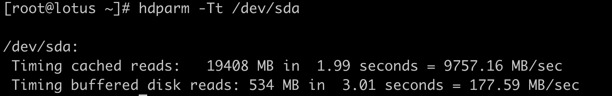
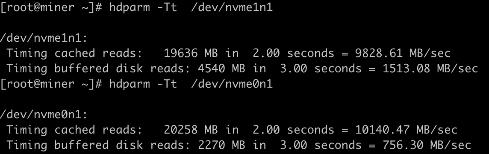
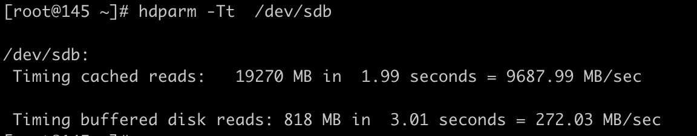
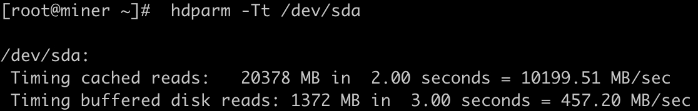
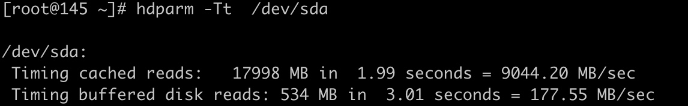
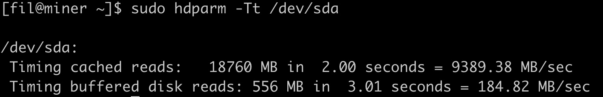
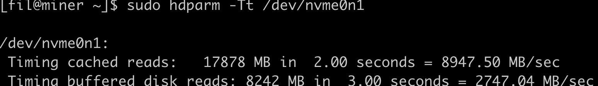
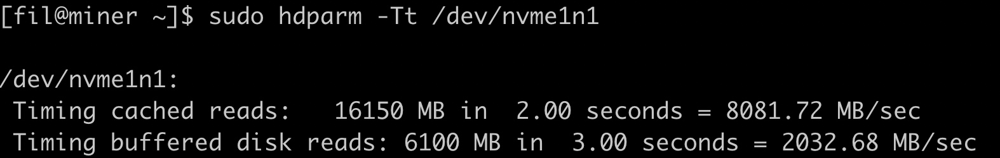
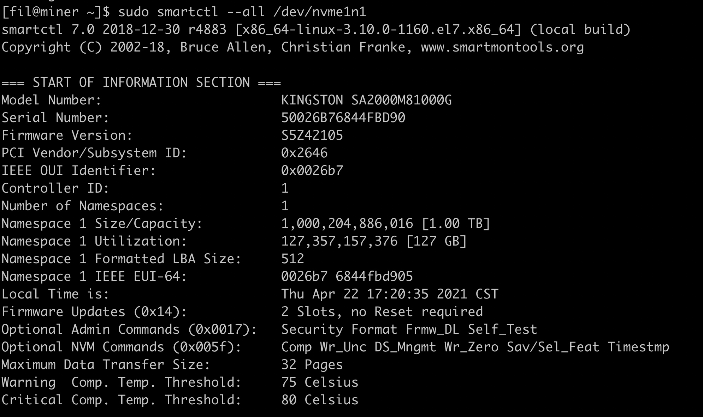

### 测试硬盘速度
nvme速度：
海盗船的 1.5G ， 
联想的750M
三星的2.7G
金士顿的 2.0G

京东上的sata固态： 450M
组装店里的sata固态： 270M

平多多 组装机箱的机械硬盘：170M

hdparm -Tt /dev/sda
nvme的速度 

海盗船的 1.5G ， 
联想的750M
三星的2.7G
金士顿的 2.0G

每个集群 一个cpfs ，一个nas， 一个treed， 
组装店里买的sata固态硬盘速度：

自己京东上买的sata固态硬盘速度：

机械硬盘速度：

西部 nas 盘速度：

三星 nvme:

金士顿nvme：

### 看硬盘厂商
sudo smartctl --all /dev/nvme1n1

### mount.nfs: Stale file handle 解决
服务端重启nfs
 service nfs restart
 
 
### raid 50
 RAID 50 编辑 讨论
RAID50是RAID5与RAID0的结合。此配置在RAID5的子磁盘组的每个磁盘上进行包括奇偶信息在内的数据的剥离。每个RAID5子磁盘组要求至少三个硬盘。RAID50具备更高的容错能力，因为它允许某个组内有一个磁盘出现故障，而不会造成数据丢失。而且因为奇偶位分部于RAID5子磁盘组上，故重建速度有很大提高。优势：更高的容错能力，具备更快数据读取速率的潜力。需要注意的是：磁盘故障会影响吞吐量。故障后重建信息的时间比镜像配置情况下要长。
外文名RAID 50属    于RAID5与RAID0的结合要    求六个硬盘优    点具备更高的容错能力
