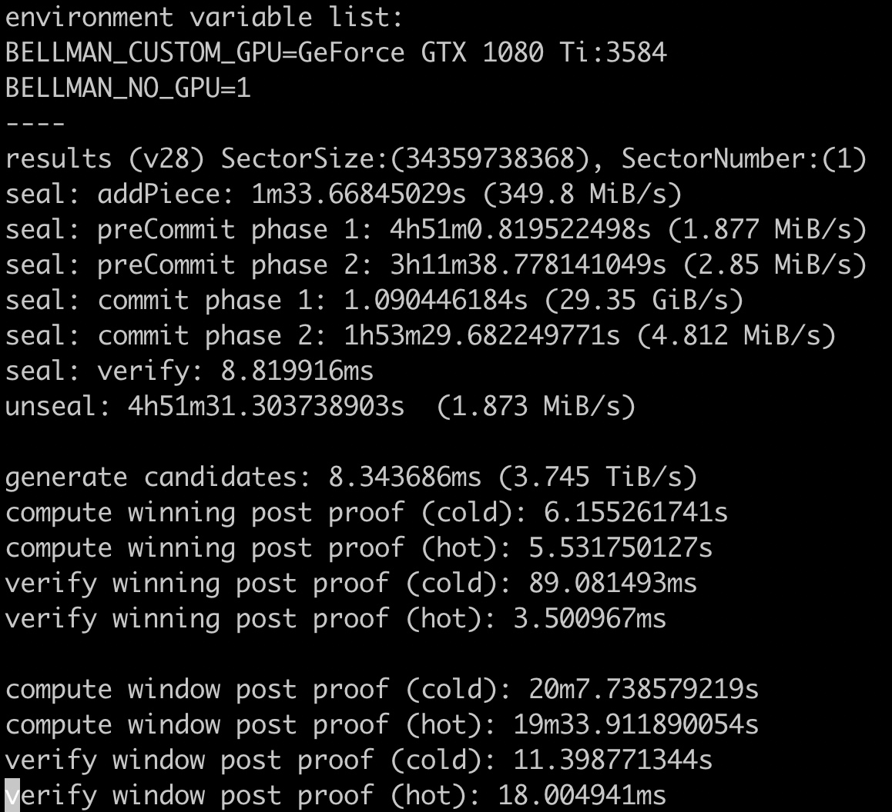
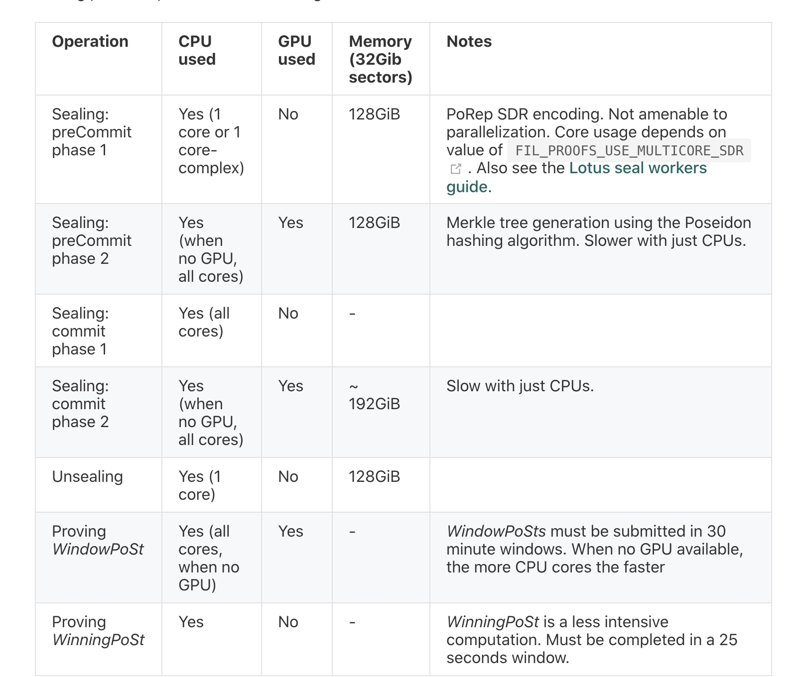
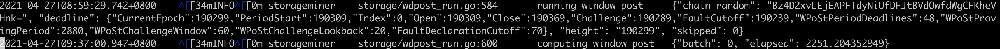
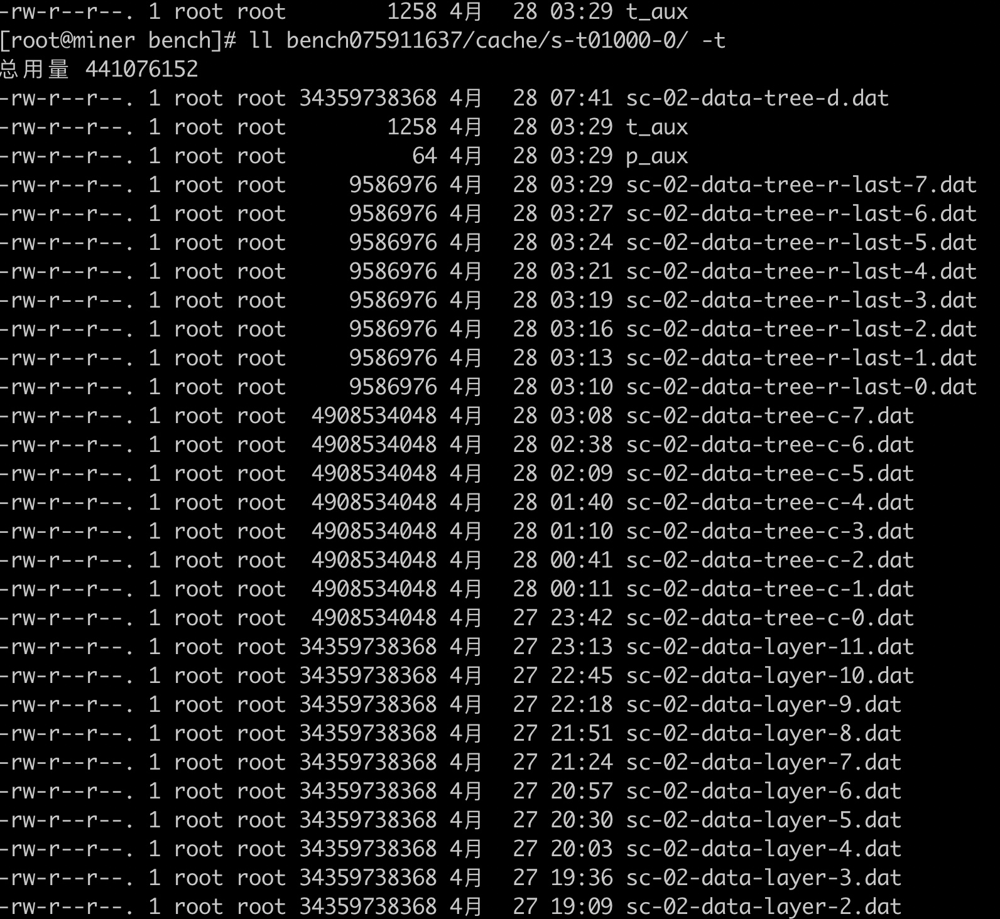
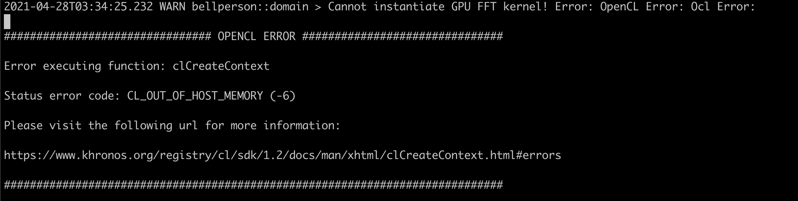
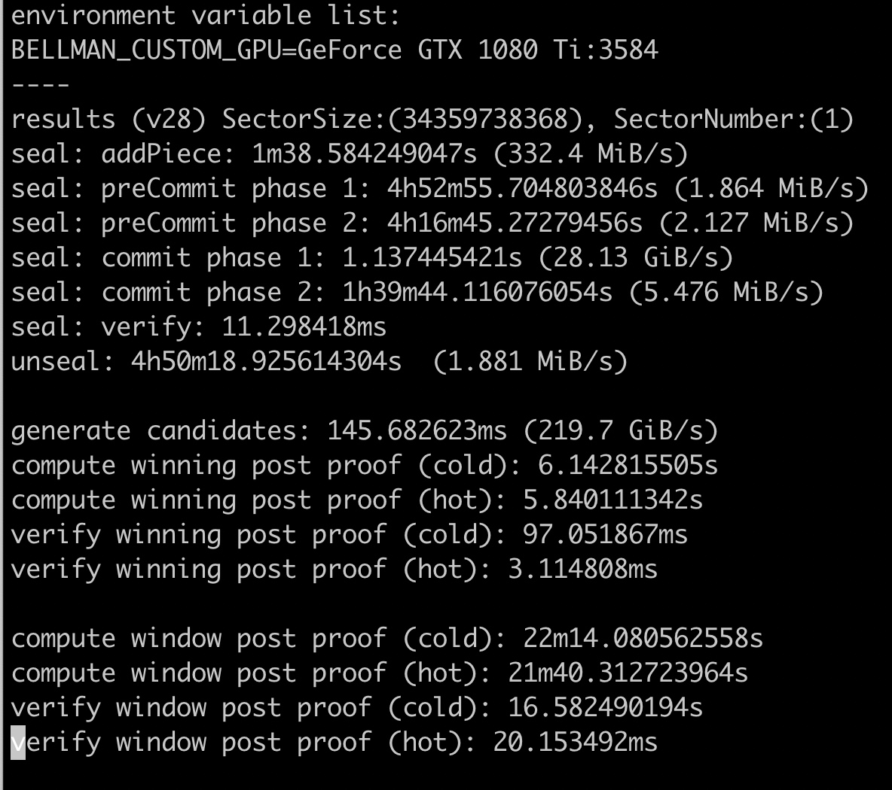
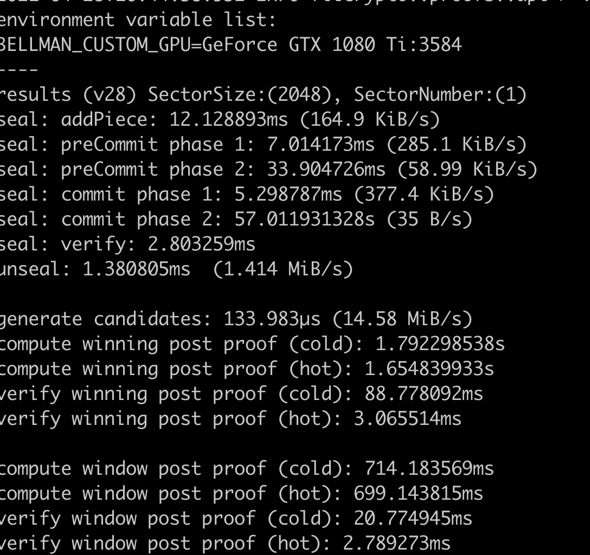
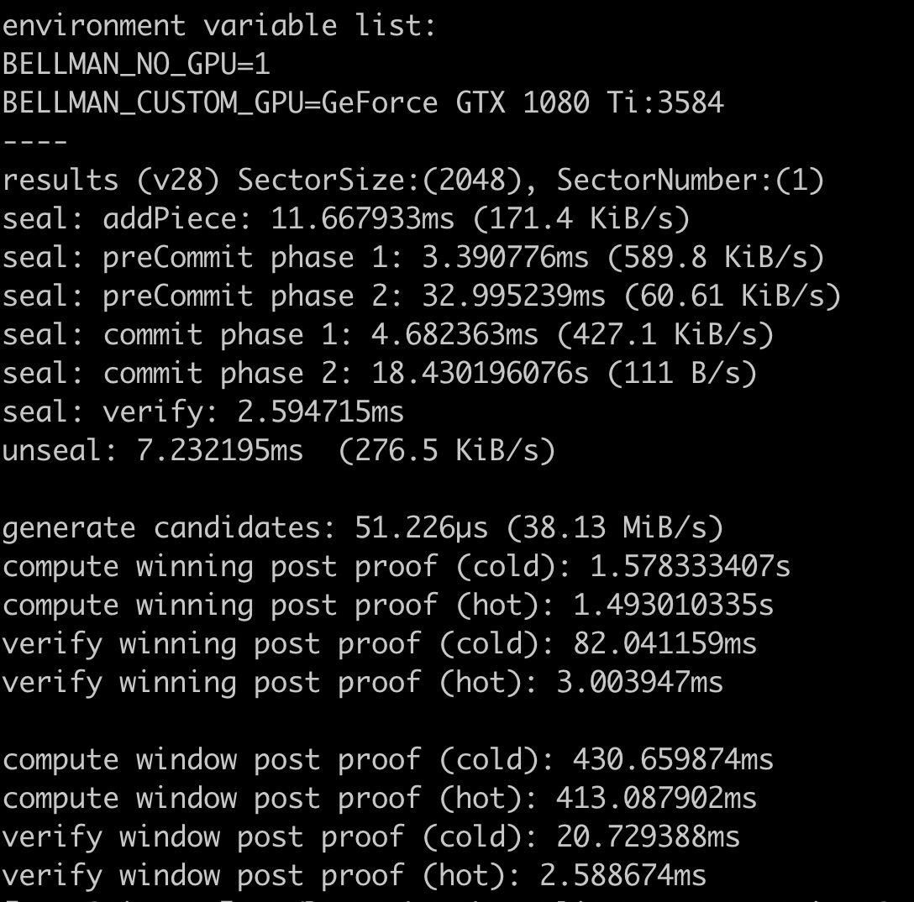
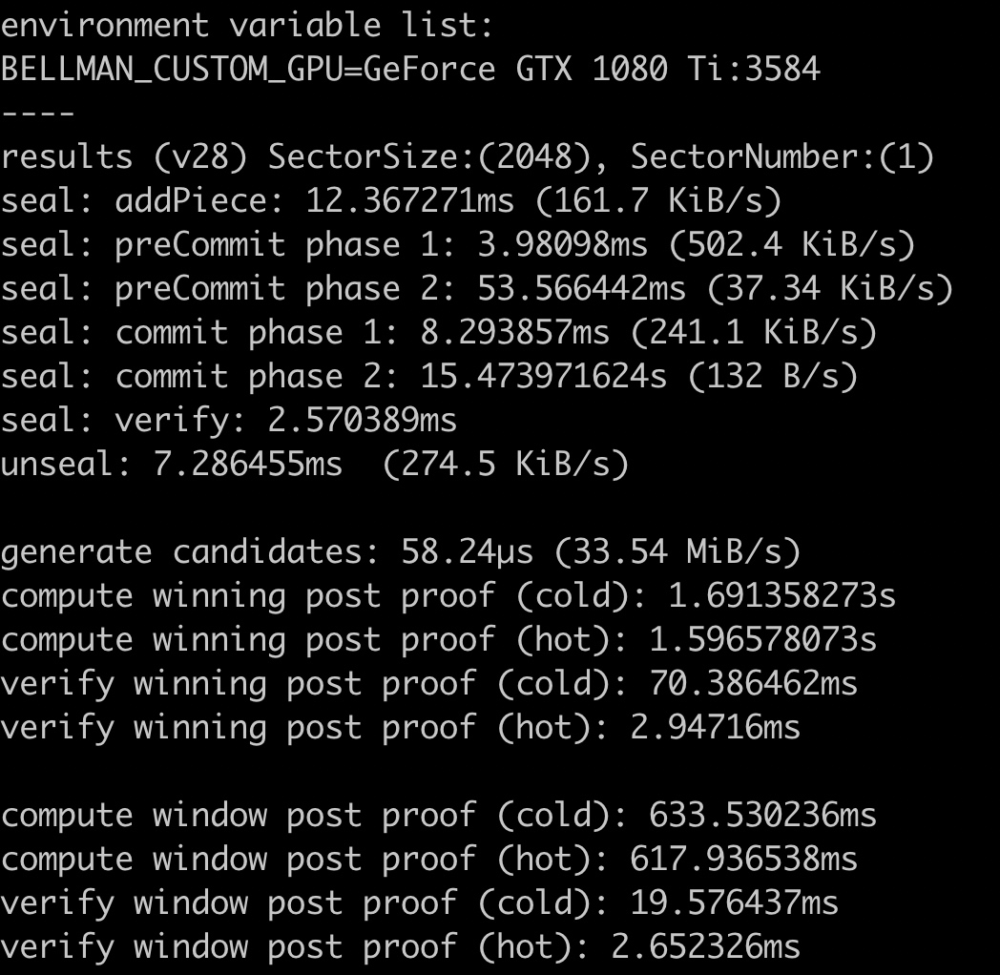

### lotus-bench

winning window 时间要求

机械硬盘， window post时间： 

当时还有p2 在跑

### lotus 1.6 gpu 32G 

### 优化gpu 到最新驱动， NVIDIA-Linux-x86_64-465.24.02.run
用gpu的：

不用gpu的：

RUST_LOG=trace ./lotus-bench sealing --sector-size 2KiB

重启后， 用gpu的：

