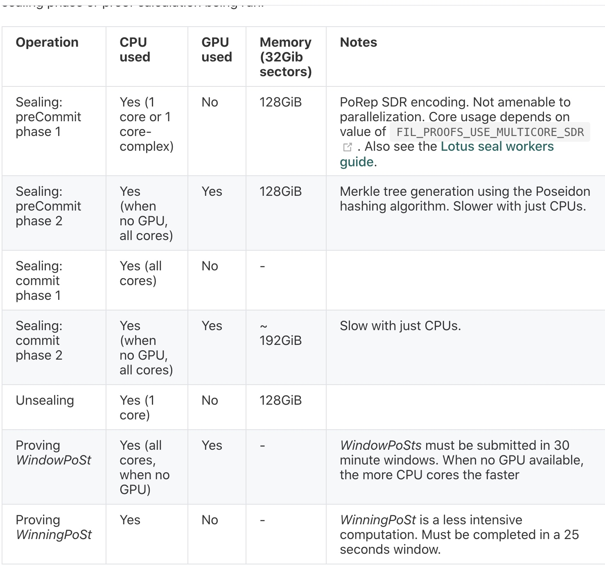
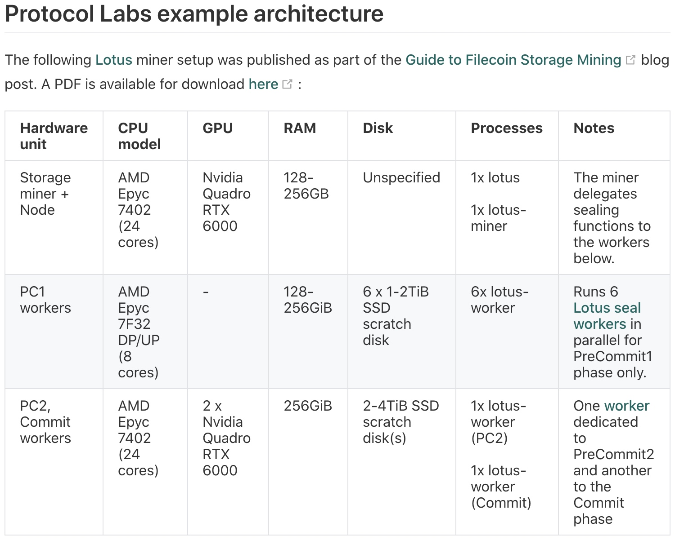
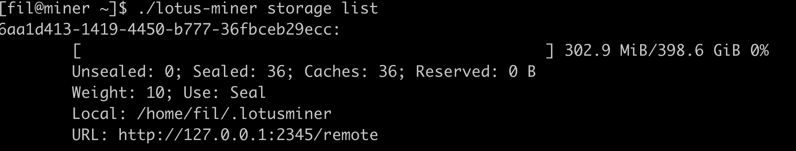
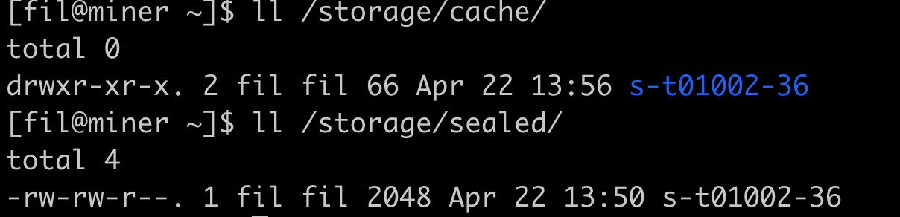

config.tml文件修改：
[Libp2p]
  ListenAddresses = ["/ip4/0.0.0.0/tcp/24001"] # choose a fixed port
  AnnounceAddresses = ["/ip4/192.168.0.2/tcp/24001"] # important!
  
[Storage]
  ParallelFetchLimit = 10
  AllowAddPiece = false
  AllowPreCommit1 = false
  AllowPreCommit2 = false
  AllowCommit = false
  AllowUnseal = false
  
###  miner 启动时， lotus端口不能访问的错误
  ```
  ERROR: connecting to full node (libp2p): failed to dial 12D3KooWPsERG1dbphiSfPNyZt5y3WVXsjGJkiyhF1Sd3Bon4VEP: all dials failed
  * [/ip6/::1/tcp/39038] dial tcp6 [::1]:39038: connect: connection refused
  * [/ip4/127.0.0.1/tcp/40508] dial tcp4 127.0.0.1:40508: connect: connection refused
  * [/ip4/192.168.0.145/tcp/40508] dial tcp4 192.168.0.145:40508: connect: no route to host
  ```
  192.168.0.145 位lotus节点地址
  
  解决 ：
  miner所连接的lotus节点打开端口：
  sudo firewall-cmd --zone=public --add-port=40508/tcp --permanent
  

### winning post不需要使用gpu, window post需要使用gpu


miner 需要 swap 内存

  
  
### lotus-miner 修改 sectors.json, .lotusminer/ 下不用store
"CanStore" 又true 改为false, store有专门的目录
```
[fil@miner ~]$ cat .lotusminer/sectorstore.json
{
  "ID": "6aa1d413-1419-4450-b777-36fbceb29ecc",
  "Weight": 10,
  "CanSeal": true,
  "CanStore": false,
  "MaxStorage": 0
}
```

重启miner: 

  

新的sector会存到专门的store目录下：



存储方案：


nvme 做Sealer用 放在 p1机器上， 要2T 
storage 也放在 P1 机器上， 现在4T 
P1 