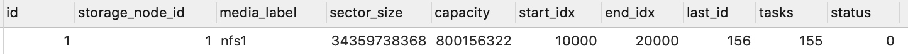

[TOC] 
### 数据库准备
#### 测试数据库联通：
```
[root@yangzhou010010019017 fil]# telnet 10.10.19.15 3306
Trying 10.10.19.15...
Connected to 10.10.19.15.
Escape character is '^]'.
J
5.7.30
```

创建数据库lotus17a
```
[root@yangzhou010010019015 ~]# mysql -uroot -pIpfs@123ky
mysql> create database `lotus17a` ；
mysql> exit 
```


### 数据库各表的关系

#### medio-infos  
定义了多少个存储柜
1	1	nfs1	536870912	8001563222016	1	238465	1	0	0
每个存储柜对一个存储节点， storage-id表示他所对应的存储节点id. 


#### storage-nodes  
表示有多少个存储节点.  存储节点具体用哪个存储柜，可以到media-infos表里查找。 存储节点是force worker存数据的地方
1	10.10.1.11	1	10.10.1.11	10.10.1.11


#### groups表
  一个group里会包括p1 到P6 这些计算节点， 但存储节点只有一个。一个group就对应一个存储节点， 而且存储节点存放了groups的最重目标数据， 所以groups的编号和存储节点编号相同：
1	10.10.1.11	10.10.1.11


#### storage-nodes-group表
存放存储节点和group的关联
1	1	1


### 数据库表中添加记录行：
打开navicat,在fconfigs, groups表中添加数据 

#### config.json 中修改数据库

[root@yangzhou010010019017 fil]# vi Config.json
将"dbConnString":后的内容改为
"root:Ipfs@123ky@tcp(10.10.19.15:3306)/lotus17?loc=Local&parseTime=true",
  
```
[fil@yangzhou010010019017 ~]$ cat config.json
{
  "port": "3456",
  "dbConfig": {
    "dbConnString": "root:Ipfs@123ky@tcp(10.10.19.15:3306)/lotus17?loc=Local&parseTime=true",
    "dbType": "mysql",
    "dbDebugMode": true
  },
  "sealerSleepDurationSeconds":60,
  "lockLifeCircleMinutes": 40,
  "sectorStoreZoneMap": {
    "2048": 3078,
    "8388608": 12582912,
    "34359738368": 51539607552,
    "536870912": 805306368
  }
}
```
config.json由lotus-server读取,  lotus-server把数据保存到数据库中， 配置文件制定了数据库的地址


###  lotus-server为如下进程服务
```
[fil@yangzhou010010019017 ~]$ ps -ef | grep lotus
fil       1113     1  0 Jun13 ?        00:23:28 ./lotus-storage-miner run --mode=remote-wdposter --server-api=http://10.10.19.17:3456 --dist-path=/mnt --nosync
fil       6765     1 20 Jun13 ?        08:22:15 ./lotus daemon --server-api=http://10.10.19.17:3456 --msg-api=http://10.10.19.17:5678/rpc/v0
root      8513     1  0 Jun13 ?        00:23:46 ./lotus-storage-miner run --mode=remote-sealer --server-api=http://10.10.19.17:3456 --dist-path=/mnt --nosync --groups=1
fil      18297     1  0 Jun13 ?        00:05:44 ./lotus-message daemon --network=interop
fil      39825     1  0 Jun13 ?        00:00:35 ./lotus-server
[fil@yangzhou010010019017 ~]$ ps -ef | grep forc
fil      22667     1 22 Jun13 ?        09:20:20 ./force-remote-worker
```

### 启动lotus-server
```
$ nohup ./lotus-server >lotus-server.log 2>&1 &
```
#### 创建表
lotus-server会检查json config制定的库里面， 有没有表， 没有会创建。 lotus-server.log 会看到创建表的记录： 
```
[fil@yangzhou010010019017 ~]$ tail -100f lotus-server.log
[2020-06-13 14:27:41]  [3.85ms]  CREATE TABLE `tasks` (`id` bigint(20) unsigned AUTO_INCREMENT,`sector_id` bigint(20) unsigned,`task_type` int(11),`miner` bigint(20) unsigned,`finished` tinyint(1) COMMENT '0表示未完成 1表示完成',`is_taken` int(10) unsigned COMMENT '0表示未被领取，1表示被领取',`ip` varchar(20),`params` longblob,`result` longblob,`err_msg` varchar(255),`result_status` int(11) COMMENT '0表示正常，1表示不正常可重启，2表示不正常不可重启',`worker_id` varchar(255),`create_time` datetime,`update_time` datetime , PRIMARY KEY (`id`))
[0 rows affected or returned ]

(/builds/ForceMining/lotus-server/sql_model/mysql_conn.go:45)
[2020-06-13 14:27:41]  [4.59ms]  CREATE INDEX search_empty_task ON `tasks`(sector_id, task_type, is_taken)
[0 rows affected or returned ]

(/builds/ForceMining/lotus-server/sql_model/mysql_conn.go:45)
[2020-06-13 14:27:41]  [4.25ms]  CREATE UNIQUE INDEX uq_sid_ttype ON `tasks`(sector_id, task_type, `miner`)
[0 rows affected or returned ]

(/builds/ForceMining/lotus-server/sql_model/mysql_conn.go:46)
[2020-06-13 14:27:41]  [4.88ms]  CREATE TABLE `post_tasks` (`id` bigint(20) unsigned AUTO_INCREMENT,`cid` varchar(100),`task_type` varchar(20),`finished` tinyint(1) COMMENT '0表示未完成 1表示完成',`is_taken` int(10) unsigned COMMENT '0表示未被领取，1表示被领取',`params` longblob,`result` longblob,`err_msg` varchar(255),`result_status` int(11) COMMENT '0表示正常，1表示不正常可重启，2表示不正常不可重启',`worker_id` varchar(255),`create_time` datetime,`update_time` datetime , PRIMARY KEY (`id`))
[0 rows affected or returned ]

(/builds/ForceMining/lotus-server/sql_model/mysql_conn.go:46)
[2020-06-13 14:27:41]  [4.16ms]  CREATE INDEX search_empty_task ON `post_tasks`(is_taken)
[0 rows affected or returned ]

(/builds/ForceMining/lotus-server/sql_model/mysql_conn.go:46)
[2020-06-13 14:27:41]  [3.62ms]  CREATE UNIQUE INDEX uq_cid ON `post_tasks`(`cid`)
[0 rows affected or returned ]

(/builds/ForceMining/lotus-server/sql_model/mysql_conn.go:48)
[2020-06-13 14:27:41]  [4.26ms]  CREATE TABLE `media_infos` (`id` bigint(20) unsigned AUTO_INCREMENT,`storage_node_id` bigint(20) unsigned NOT NULL,`media_label` varchar(255) NOT NULL UNIQUE,`sector_size` bigint(20) unsigned NOT NULL,`capacity` bigint(20) unsigned NOT NULL,`start_idx` bigint(20) unsigned,`end_idx` bigint(20) unsigned,`last_id` bigint(20) unsigned,`tasks` bigint(20) unsigned,`status` int(8) COMMENT '0表示正常 其他表示错误' , PRIMARY KEY (`id`))
[0 rows affected or returned ]

(/builds/ForceMining/lotus-server/sql_model/mysql_conn.go:49)
[2020-06-13 14:27:41]  [3.54ms]  CREATE TABLE `task_groups` (`id` bigint(20)  unsigned AUTO_INCREMENT,`sector_id` bigint(20) unsigned,`group_id` bigint(20) unsigned , PRIMARY KEY (`id`))
[0 rows affected or returned ]

(/builds/ForceMining/lotus-server/sql_model/mysql_conn.go:49)
[2020-06-13 14:27:41]  [3.50ms]  CREATE UNIQUE INDEX uq_sid_gid ON `task_groups`(sector_id, group_id)
[0 rows affected or returned ]

(/builds/ForceMining/lotus-server/sql_model/mysql_conn.go:50)
[2020-06-13 14:27:41]  [3.73ms]  CREATE TABLE `storage_nodes` (`id` bigint(20) unsigned AUTO_INCREMENT,`name` varchar(255),`type` int(255),`loc` varchar(255),`remark` varchar(255) , PRIMARY KEY (`id`))
[0 rows affected or returned ]

(/builds/ForceMining/lotus-server/sql_model/mysql_conn.go:51)
[2020-06-13 14:27:41]  [3.39ms]  CREATE TABLE `storage_node_groups` (`id` bigint(20) unsigned AUTO_INCREMENT,`node_id` bigint(20) unsigned NOT NULL,`group_id` bigint(20) unsigned NOT NULL , PRIMARY KEY (`id`))
[0 rows affected or returned ]

(/builds/ForceMining/lotus-server/sql_model/mysql_conn.go:52)
[2020-06-13 14:27:41]  [3.49ms]  CREATE TABLE `storage_node_locks` (`id` bigint(20) unsigned AUTO_INCREMENT,`storage_node_id` bigint(20) unsigned NOT NULL,`sealer_id` bigint(20) unsigned NOT NULL,`is_expired` tinyint(1) NOT NULL  COMMENT '0表示没过期 1表示过期',`except_expired_time` datetime NOT NULL , PRIMARY KEY (`id`))
[0 rows affected or returned ]

(/builds/ForceMining/lotus-server/sql_model/mysql_conn.go:52)
[2020-06-13 14:27:41]  [3.90ms]  CREATE UNIQUE INDEX unique_sealer_storage_lock ON `storage_node_locks`(storage_node_id, sealer_id)
[0 rows affected or returned ]
[GIN-debug] [WARNING] Running in "debug" mode. Switch to "release" mode in production.
 - using env:	export GIN_MODE=release
 - using code:	gin.SetMode(gin.ReleaseMode)
```

#### 提供服务的路由
```
[GIN-debug] GET    /ping                     --> gitlab.forceup.in/ForceMining/lotus-server/lotus_server.Pong (3 handlers)
[GIN-debug] GET    /build-version            --> gitlab.forceup.in/ForceMining/lotus-server/lotus_server.Run.func1 (3 handlers)
[GIN-debug] POST   /actor-info               --> gitlab.forceup.in/ForceMining/lotus-server/controller.GetActorInfo (3 handlers)
[GIN-debug] POST   /nonce                    --> gitlab.forceup.in/ForceMining/lotus-server/controller.ReportNonce (3 handlers)
[GIN-debug] POST   /next-nonce               --> gitlab.forceup.in/ForceMining/lotus-server/controller.GetNextNonce (3 handlers)
[GIN-debug] POST   /end-sector               --> gitlab.forceup.in/ForceMining/lotus-server/controller.EndSector (3 handlers)
[GIN-debug] GET    /sectors                  --> gitlab.forceup.in/ForceMining/lotus-server/controller.GetSectors (3 handlers)
[GIN-debug] POST   /updatepaux               --> gitlab.forceup.in/ForceMining/lotus-server/controller.UpdatePaux (3 handlers)
[GIN-debug] POST   /updatetaux               --> gitlab.forceup.in/ForceMining/lotus-server/controller.UpdateTaux (3 handlers)
[GIN-debug] POST   /get-filter-block         --> gitlab.forceup.in/ForceMining/lotus-server/controller.GetFilterBlock (3 handlers)
[GIN-debug] POST   /get-filter-message       --> gitlab.forceup.in/ForceMining/lotus-server/controller.GetFilterMsg (3 handlers)
[GIN-debug] GET    /get-storage              --> gitlab.forceup.in/ForceMining/lotus-server/controller.GetNewSectorID (3 handlers)
[GIN-debug] POST   /storage-server-upload-device-info --> gitlab.forceup.in/ForceMining/lotus-server/controller.StorageServerUploadDeviceInfo (3 handlers)
[GIN-debug] POST   /load-all-matched-device  --> gitlab.forceup.in/ForceMining/lotus-server/controller.LoadAllMatchedDevice (3 handlers)
[GIN-debug] POST   /storage-server-get-device-info --> gitlab.forceup.in/ForceMining/lotus-server/controller.StorageServerGetDeviceInfo (3 handlers)
[GIN-debug] POST   /getlocks                 --> gitlab.forceup.in/ForceMining/lotus-server/controller.GetLocks (3 handlers)
[GIN-debug] POST   /endlocks                 --> gitlab.forceup.in/ForceMining/lotus-server/controller.EndLocks (3 handlers)
[GIN-debug] POST   /miner-info/add           --> gitlab.forceup.in/ForceMining/lotus-server/controller.AddActor (3 handlers)
[GIN-debug] GET    /nonce/get-nonce          --> gitlab.forceup.in/ForceMining/lotus-server/controller.GetNonce (3 handlers)
[GIN-debug] POST   /nonce/set-nonce          --> gitlab.forceup.in/ForceMining/lotus-server/controller.SetNonce (3 handlers)
[GIN-debug] GET    /storage-nodes/get-all    --> gitlab.forceup.in/ForceMining/lotus-server/controller.GetAllStorageNodes (3 handlers)
[GIN-debug] GET    /storage-nodes/get-info/:loc --> gitlab.forceup.in/ForceMining/lotus-server/controller.GetOneStorageNodeByLoc (3 handlers)
[GIN-debug] PUT    /storage-nodes/create-storage-node --> gitlab.forceup.in/ForceMining/lotus-server/controller.CreateNewStorageNode (3 handlers)
[GIN-debug] DELETE /storage-nodes/delete-storage-node/:id --> gitlab.forceup.in/ForceMining/lotus-server/controller.DeleteStorageNode (3 handlers)
[GIN-debug] POST   /storage-nodes/update-storage-node --> gitlab.forceup.in/ForceMining/lotus-server/controller.UpdateStorageNode (3 handlers)
[GIN-debug] GET    /storage-nodes/get-specific-state-sectors --> gitlab.forceup.in/ForceMining/lotus-server/controller.GetSectorInSpecificState (3 handlers)
[GIN-debug] POST   /storage-nodes/get-sealer-work-in-duration --> gitlab.forceup.in/ForceMining/lotus-server/controller.CalcOneSealerWorkInDuration (3 handlers)
[GIN-debug] GET    /distribute-lock/get-lock-info/:storageIP --> gitlab.forceup.in/ForceMining/lotus-server/controller.GetOneStorageNodeLockInfo (3 handlers)
[GIN-debug] GET    /distribute-lock/get-all-lock-infos --> gitlab.forceup.in/ForceMining/lotus-server/controller.GetAllLockInfos (3 handlers)
[GIN-debug] POST   /distribute-lock/manual-set-lock-expire/:id --> gitlab.forceup.in/ForceMining/lotus-server/controller.SetOneLockExpire (3 handlers)
[GIN-debug] POST   /distribute-lock/change-lock-nums --> gitlab.forceup.in/ForceMining/lotus-server/controller.SetOneStorageNodes (3 handlers)
[GIN-debug] GET    /get-fconfig              --> gitlab.forceup.in/ForceMining/lotus-server/controller.GetFconfig (3 handlers)
[GIN-debug] POST   /change-fconfig           --> gitlab.forceup.in/ForceMining/lotus-server/controller.ModifyFconfig (3 handlers)
[GIN-debug] POST   /new-task                 --> gitlab.forceup.in/ForceMining/lotus-server/controller.NewTask (3 handlers)
[GIN-debug] POST   /task-status              --> gitlab.forceup.in/ForceMining/lotus-server/controller.TaskStatus (3 handlers)
[GIN-debug] POST   /acquire-task             --> gitlab.forceup.in/ForceMining/lotus-server/controller.AcqTask (3 handlers)
[GIN-debug] POST   /finish-task              --> gitlab.forceup.in/ForceMining/lotus-server/controller.FinTask (3 handlers)
[GIN-debug] POST   /reset-task               --> gitlab.forceup.in/ForceMining/lotus-server/controller.ResetTasks (3 handlers)
[GIN-debug] GET    /task-monitor             --> gitlab.forceup.in/ForceMining/lotus-server/controller.TaskMonitor (3 handlers)
[GIN-debug] DELETE /task-delete              --> gitlab.forceup.in/ForceMining/lotus-server/controller.DeleteTask (3 handlers)
[GIN-debug] POST   /sector-monitor           --> gitlab.forceup.in/ForceMining/lotus-server/controller.GetBadSector (3 handlers)
[GIN-debug] POST   /change-longest-delay-time --> gitlab.forceup.in/ForceMining/lotus-server/controller.ChangeLotusServerSectorMonitorLongestDelayTime (3 handlers)
[GIN-debug] POST   /change-normal-delay-time --> gitlab.forceup.in/ForceMining/lotus-server/controller.ChangeLotusServerSectorMonitorNormalDelayTime (3 handlers)
[GIN-debug] GET    /longest-delay-time       --> gitlab.forceup.in/ForceMining/lotus-server/controller.GetLotusServerSectorMonitorLongestDelayTime (3 handlers)
[GIN-debug] GET    /normal-delay-time        --> gitlab.forceup.in/ForceMining/lotus-server/controller.GetLotusServerSectorMonitorNormalDelayTime (3 handlers)
[GIN-debug] Listening and serving HTTP on :3456
```