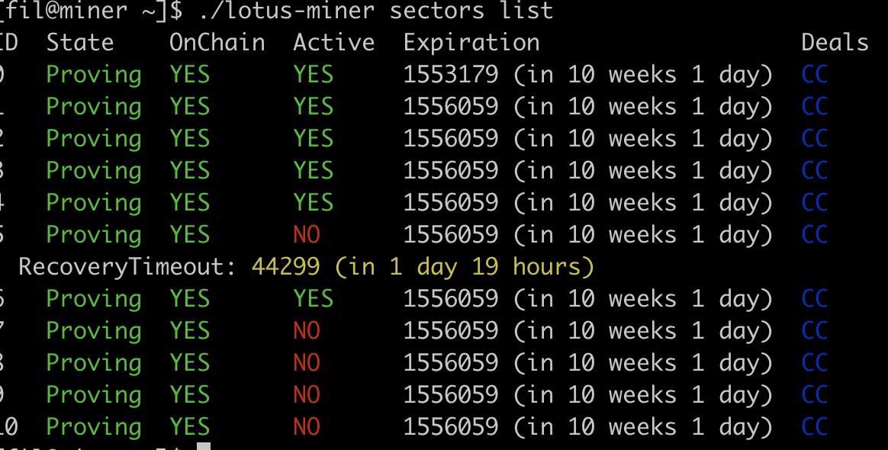
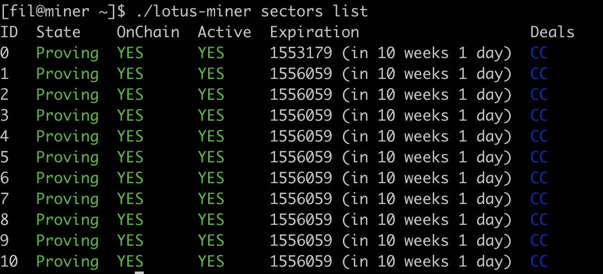

### 算力变化
```
[fil@miner ~]$ ./lotus-miner info
Chain: [sync ok] [basefee 100 aFIL]
Miner: t01002 (2 KiB sectors)
Power: 12 Ki / 112 Ki (10.7142%)
	Raw: 12 KiB / 22 KiB (54.5454%)
	有效的算力， 提交的全部算力
	Committed: 22 KiB
	提交的算力
	Proving: 14 KiB (2 KiB Faulty, 9.09%)
	证明过的算力
	
Expected block win rate: 11571.3360/day (every 7s)

Deals: 0, 0 B
	Active: 0, 0 B (Verified: 0, 0 B)

Miner Balance:    2.371 μFIL
      PreCommit:  0
      Pledge:     655.651 nFIL
      Vesting:    0
      Available:  1.716 μFIL
Market Balance:   0
       Locked:    0
       Available: 0
Worker Balance:   200 FIL
Total Spendable:  200 FIL

Sectors:
	Total: 11
	Proving: 11
```

对应的lotus： 



经过一下午， 算力都正常了：


都变成proving了
```
[fil@miner ~]$ ./lotus-miner info
Chain: [sync ok] [basefee 100 aFIL]
Miner: t01002 (2 KiB sectors)
Power: 22 Ki / 122 Ki (18.0327%)
	Raw: 22 KiB / 32 KiB (68.7500%)
	Committed: 22 KiB
	Proving: 22 KiB
Expected block win rate: 19475.3160/day (every 4s)

Deals: 0, 0 B
	Active: 0, 0 B (Verified: 0, 0 B)

Miner Balance:    2.371 μFIL
      PreCommit:  0
      Pledge:     655.651 nFIL
      Vesting:    0
      Available:  1.716 μFIL
Market Balance:   0
       Locked:    0
       Available: 0
Worker Balance:   200 FIL
       Control:   200 FIL
Total Spendable:  400 FIL

Sectors:
	Total: 12
	Proving: 11
	PreCommitWait: 1
```

### WinningPoSt 时间
miner log: 
2021-04-20T16:33:44.349+0800    ^[[34mINFO^[[0m storageminer    storage/miner.go:263    GenerateWinningPoSt took 28.335408042s


### miner提示机器不够快
miner log:

21-04-20T16:23:16.673+0800    ^[[33mWARN^[[0m miner   miner/miner.go:508      CAUTION: block production took longer than the block delay. Your computer may not be fast enough to keep up     {"tMinerBaseInfo ": 0.003201555, "tDrand ": 0.0000001, "tPowercheck ": 0.0000001, "tTicket ": 0.006252936, "tSeed ": 0.000004388, "tProof ": 28.336805794, "tPending ": 0.000679631, "tCreateBlock ": 0.0067428}


###  winning post时间
2k, 正常的log：
```
2021-04-21T10:15:40.240+0800    ^[[34mINFO^[[0m storageminer    storage/miner.go:256    Computing WinningPoSt ;[{SealProof:0 SectorNumber:1 SealedCID:bagboea4b5abcbyjtpcrh37phy2jbt7dtg4ab3cldunzwrjiletvtxgrsceyump3c}]; [31 158 3 38 228 226 67 27 210 22 208 59 154 145 122 39 111 191 173 133 214 215 158 85 7 242 221 179 29 210 42 208]
2021-04-21T10:15:41.731+0800    ^[[34mINFO^[[0m storageminer    storage/miner.go:263    GenerateWinningPoSt took 1.490156268s
```

不正常的log：
```
2021-04-21T10:13:12.197+0800    ^[[34mINFO^[[0m storageminer    storage/miner.go:256    Computing WinningPoSt ;[{SealProof:5 SectorNumber:51 SealedCID:bagboea4b5abca3w2ltipbmpyh7bmbdd3c2kpy6dk5fj3mbb3cqqawwqbw457axzl}]; [127 27 235 129 128 35 57 9 164 170 125 24 116 198 15 84 211 136 36 207 121 50 246 183 56 252 183 127 49 128 94 65]
2021-04-21T10:13:40.516+0800    ^[[34mINFO^[[0m storageminer    storage/miner.go:263    GenerateWinningPoSt took 28.319486969s
```


### winning post, window post 在一起的log， window elapse时间， 
```
2021-04-21T10:48:38.783+0800    ^[[34mINFO^[[0m storageminer    storage/miner.go:256    Computing WinningPoSt ;[{SealProof:5 SectorNumber:36 SealedCID:bagboea4b5abcb66r3mcsczwprxfaddrzg5tedsldxnam6m627rxyns2kq5fh4tse}]; [66 166 99 105 110 209 124 7 75 154 183 217 38 70 205 223 141 214 247 181 135 21 44 179 191 5 155 70 64 44 46 19]
2021-04-21T10:48:48.320+0800    ^[[34mINFO^[[0m storageminer    storage/wdpost_run.go:600       computing window post   {"batch": 0, "elapsed": 25.237117939}
window post耗用时间

2021-04-21T10:49:16.521+0800    ^[[34mINFO^[[0m storageminer    
storage/miner.go:263    GenerateWinningPoSt took 37.737823082s
winning post 耗用时间 
```
window post时间延长了winning post时间

### window post 每4分钟运行一次
```
2021-04-22T07:29:03.046+0800    ^[[34mINFO^[[0m storageminer    storage/wdpost_run.go:584       running window post     {"chain-random": "Yh9pAJcl4nnzOwlivbwQiOkR543R7RnOD/kjR+VXPvQ=", "deadline": {"CurrentEpoch":15761,"PeriodStart":15111,"Index":11,"Open":15771,"Close":15831,"Challenge":15751,"FaultCutoff":15701,"WPoStPeriodDeadlines":48,"WPoStProvingPeriod":2880,"WPoStChallengeWindow":60,"WPoStChallengeLookback":20,"FaultDeclarationCutoff":70}, "height": "15761", "skipped": 0}
2021-04-22T07:29:03.531+0800    ^[[34mINFO^[[0m storageminer    storage/wdpost_run.go:600       computing window post   {"batch": 0, "elapsed": 0.485604729}


2021-04-22T07:33:03.045+0800    ^[[34mINFO^[[0m storageminer    storage/wdpost_run.go:584       running window post     {"chain-random": "aNxS5GKrC0l6boaOEJwPh/nZl4VbuuImkfUjbYYe93c=", "deadline": {"CurrentEpoch":15821,"PeriodStart":15111,"Index":12,"Open":15831,"Close":15891,"Challenge":15811,"FaultCutoff":15761,"WPoStPeriodDeadlines":48,"WPoStProvingPeriod":2880,"WPoStChallengeWindow":60,"WPoStChallengeLookback":20,"FaultDeclarationCutoff":70}, "height": "15821", "skipped": 0}
2021-04-22T07:33:03.477+0800    ^[[34mINFO^[[0m storageminer    storage/wdpost_run.go:600       computing window post   {"batch": 0, "elapsed": 0.432190878}
```

### 连续出现time delta 是正常的
```
2021-04-22T07:49:09.607+0800    ^[[34mINFO^[[0m miner   miner/miner.go:506      mined new block {"cid": "bafy2bzacebnjcq36nykpezaxrhccypp24zolc3k6xphqtfjqe7wm2fhk6auze", "height": "16063", "miner": "t01002", "parents": ["t01000"], "took": 1.603346272}
2021-04-22T07:49:11.963+0800    ^[[34mINFO^[[0m miner   miner/miner.go:442      Time delta between now and our mining base: 0s (nulls: 0)
2021-04-22T07:49:16.007+0800    ^[[34mINFO^[[0m miner   miner/miner.go:442      Time delta between now and our mining base: 1s (nulls: 0)
2021-04-22T07:49:20.353+0800    ^[[34mINFO^[[0m miner   miner/miner.go:442      Time delta between now and our mining base: 1s (nulls: 0)
2021-04-22T07:49:24.007+0800    ^[[34mINFO^[[0m miner   miner/miner.go:442      Time delta between now and our mining base: 1s (nulls: 0)
2021-04-22T07:49:24.013+0800    ^[[34mINFO^[[0m storageminer    storage/miner.go:256    Computing WinningPoSt ;[{SealProof:5 SectorNumber:0 SealedCID:bagboea4b5abcbwioal4l24dzlslatekfk6sr3vrszh42zoeyerqaz7dmghbucaq2}]; [225 27 113 14 10 247 3 253 233 33 241 116 160 53 175 158 75 75 185 190 86 243 90 32 1 254 156 47 116 244 134 12]
2021-04-22T07:49:25.582+0800    ^[[34mINFO^[[0m storageminer    storage/miner.go:263    GenerateWinningPoSt took 1.568559409s
2021-04-22T07:49:25.595+0800    ^[[34mINFO^[[0m miner   miner/miner.go:506      mined new block {"cid": "bafy2bzacec3sbecfwae2hjfdxait74ezqswl4enu3h3v4w74wt7aomrrwpyi6", "height": "16067", "miner": "t01002", "parents": ["t01000"], "took": 1.591507113}
2021-04-22T07:49:27.855+0800    ^[[34mINFO^[[0m miner   miner/miner.go:442      Time delta between now and our mining base: 0s (nulls: 0)
```


### store 位置
