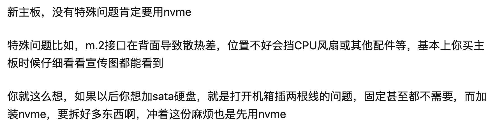

nvme快，sata慢。快能到2～3GB/S，慢也就400～500MB/S。nvme贵，sata便宜。不过差距正在缩小。nvme和sata（M.2）容量受体积所限，sata（2.5寸）容量优势更大。nvme目前已知最大2TB，sata超4TB都不是事。不过未来QLC可以提一下容量。nvme发热量大，需要更好的散热条件。质量好的sata（2.5寸）是金属外壳，散热好。nvme口十分有限，抠搜的主板给你一个就了不得了，不过可以用PCI-E转接卡。sata口一般是6～8个。nvme和sata（M.2）不需要额外插线，sata（2.5寸）需要插数据线和电源线两根，考验走线水平。综上所述，如果你拿来装系统、跑吃硬盘的软件，选nvme，快得一笔。如果你拿来存东西，文档音乐电影游戏啥的，选sata大容量的，美吱吱。

