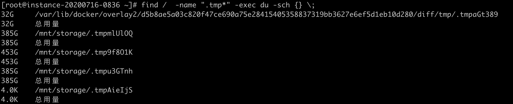
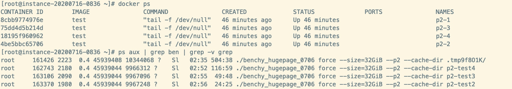

[TOC]
### 创建test本地镜像
#### 编写dockerfile
```
[root@instance-20200716-0836 storage]# cat Dockerfile
FROM centos:centos7
RUN yum update -y
RUN yum install epel-release -y
RUN yum install ocl-icd-devel -y
RUN yum install opencl-headers -y
```

#### docker build . -t test下载镜像并创建新的本地镜像
```
[root@instance-20200716-0836 ～]#docker build . -t test
```
docker build执行时， 遇到 docker daemon文件过大， 本来正常情况下几百兆， 但下了几个G还没下完， 
```
Sending build context to Docker daemon 218.2 MB
```
解决办法： 将Dockerfile移动到用户根目录下， 
然后再运行docker build:


这个docker build 可以生成一个名叫test镜像。
用docker images 看有没有这个镜像
```
[root@instance-20200716-0836 ~]# docker images
REPOSITORY          TAG                 IMAGE ID            CREATED             SIZE
test                latest              761927423150        About an hour ago   526 MB
docker.io/centos    centos7             b5b4d78bc90c        2 months ago        203 MB
```

后面编写的compose就可以基于这个这个test镜像，在docker compsoe文件里， 指定这个镜像文件， 启动容器

### 容器编排

#### cpu核数划分

    

#### 编写dockercompose文件
上面制作好了test镜像， 现在就可以用这个镜像启动容器了。 
可以在docker compose的配置文件使用这个镜像
这里给出p2按46核的划分
```
[root@instance-20200716-0836 ~]# cat p2-46cpu.yml
version: "2"
services:
    bench1:
        image: test
        container_name: "p2-1"
        cpuset: '0-45'
        network_mode: "host"
        privileged: true
        volumes:
            - /etc/localtime:/etc/localtime
            - /mnt/storage/:/mnt/storage/
            - /root/worker/:/root/worker/
        command: tail -f /dev/null

    bench2:
        image: test
        container_name: "p2-2"
        cpuset: '46-95'
        network_mode: "host"
        privileged: true
        volumes:
            - /etc/localtime:/etc/localtime
            - /mnt/storage/:/mnt/storage/
            - /root/worker/:/root/worker/
        command: tail -f /dev/null
```

如果提示语法错误， 又检查不到哪些有错误, 如遇到这样的错误：
```
[root@instance-20200716-0836 ~]# docker-compose -f p2.yml up -d
ERROR: yaml.parser.ParserError: while parsing a block mapping
  in "./p2.yml", line 1, column 1
expected <block end>, but found '<block mapping start>'
  in "./p2.yml", line 12, column 4
```
可以从别的正确的文件拷贝过来， 稍加修改    
  
P2所有需要用到的docker-compose的yml文件    
```
[root@instance-20200716-0836 ~]# ll *.yml
-rw-r--r--. 1 root root 1465 Jul 19 00:55 p2-23cpu.yml
-rw-r--r--. 1 root root 1104 Jul 18 07:47 p2-30cpu.yml
-rw-r--r--. 1 root root  665 Jul 17 08:16 p2-46cpu.yml
```
#### docker compose 启动容器

```
[root@instance-20200716-0836 ~]# docker-compose -f p2.yml up -d
Creating p2-1 ... done
Creating p2-1 ...
[root@instance-20200716-0836 ~]# docker ps
CONTAINER ID        IMAGE               COMMAND               CREATED             STATUS              PORTS               NAMES
41df88a7c418        test                "tail -f /dev/null"   5 seconds ago       Up 5 seconds                            p2-1
391b0d80fc6a        test                "tail -f /dev/null"   5 seconds ago       Up 5 seconds                            p2-2
```

#### 容器产生的临时文件占用了系统空间32G，需要手动删除

看下benchy生成的.tmp开头的文件存在什么地方：
```
find /  -name ".tmp*" -exec du -sch {} \;
```




由于没有容器启动时没有指定挂载目录，临时文件被放在这个目录下：
```
[root@instance-20200716-0836 ~]# du -sch /var/lib/docker/overlay2/d5b8ae5a03c820f47ce690a75e28415405358837319bb3627e6ef5d1eb10d280/diff/tmp/.tmpaGt389
32G	/var/lib/docker/overlay2/d5b8ae5a03c820f47ce690a75e28415405358837319bb3627e6ef5d1eb10d280/diff/tmp/.tmpaGt389
32G	总用量
```
这个容器的临时文件占用了32G。 
容器已经退出， 但容器的这个临时文件没有删除。 

系统空间都在/ 这个目录下，只有39G， 已经用了35G， 其中32G是被容器的临时为难占用的，  需要删除容器容器的临时文件。 


### 容器内操作
#### 进入容器
```
root@instance-20200716-0836 ~]# docker exec -it 41df88a7c418 /bin/bash

[root@instance-20200716-0836 ~]# cd /mnt/storage/
[root@instance-20200716-0836 storage]# RUST_BACKTRACE=1 RUST_LOG=trace ./benchy force --size=32GiB --p2 --cache-dir .tmpAieIjS  > benchy-p2-7742-task-1.log 2>&1 &
```
有时进入容器， 访问文件被拒绝， 解决办法是在p2.yml中加入 ：
```       
privileged: true
```
用docker-compose 重启容器即可解决。 

容器内启动的进程， 在容器外可以看到；
```
[root@instance-20200716-0836 ~]# ps aux | grep ben
root      23850 4315  0.5 47494176 10723784 ?   Sl   09:02 799:03 ./benchy_hugepage_0706 force --size=32GiB --p2 --cache-dir .tmp9f8O1K
root      24296  0.0  0.0 112824   972 pts/7    S+   09:20   0:00 grep --color=auto ben
```

#### 容器内启动bench

```
TMPDIR=./  RUST_BACKTRACE=1 RUST_LOG=trace ./benchy_hugepage_0706 force --size=32GiB --p2 --cache-dir test1  > benchy-p2-7742-task-2.log 2>&1 &
```
TMPDIR 存放p2 生成文件， p2 一方面生成layer-c, layer-r-last等文件， 还在/tmp下生成文件， 32G

#### 容器内对当前容器名的查看
进到容器里面， 由于是Host模式， 无法知道当前容器的id：
```
[root@instance-20200716-0836 storage]# cat /etc/hosts
127.0.0.1   localhost localhost.localdomain localhost4 localhost4.localdomain4
::1         localhost localhost.localdomain localhost6 localhost6.localdomain6
10.0.0.2 instance-20200716-0836.subnet.vcn.oraclevcn.com instance-20200716-0836
```

####  容器外部可以看到容器内运行的进程



### 测试完成后log文件下载及打包
下载：


打包：


### oracle的几个问题
* io 拷贝速度270M/s,  


理论值是480M/s， 因为同时有读写， 所以速度差不多降一半。 阿里的50G/s, 这个差距有点大。 

* 系统空间只有 39G， 存放个临时就不够用了， 


阿里的493G：


* 经常输入时卡顿，即使通过阿里登陆过去也不行， 拷贝的时候， 如果不后台运行， 一会就pipe broken了，就断开了，拷贝命令也随之停止

* oracle 从容器退出， 经常回不到宿主机命令行

