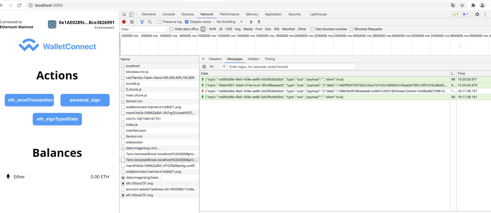

### yarn start 启动 npm 
 9384  npm run start
 9385  yarn
 9386  yarn start
 9387  yarn add eth-sig-util
 9388  yarn start
 9389  export REACT_APP_INFURA_PROJECT_ID=0c93fa9c94a64e04a87cbc87c1184991\n
 9390  yarn start
 9391  cd filwallet

### dapp websocket topic 数据返回

header 里面的101 含义：
Status Code: 101 Switching Protocols

 
 
 
 dapp 向 bridge 发送：
 {"topic":"ed06dd6e-f8e5-459e-ae66-2e53fbdbb5bb","type":"sub","payload":"","silent":true}
 
 
 pub: 
 {"topic":"ed06dd6e-f8e5-459e-ae66-2e53fbdbb5bb","type":"sub","payload":"","silent":true}
 {"topic":"8deb4957-dda0-474e-bca1-8fc496aeae42","type":"pub","payload":"{\"data\":\"e62fffb6759730e7c8ce7d742e1b8905e746aabbf7891c067d16c38a0b0ac8e9fb00eebaebbb66e4d6bf30c7ee0bbf6aead0eb9f3c2268621b48aa61105ba8a2fe5f1753977710eeae86c03ad3e75d018cc37f3d2cb7cdcd13af387dc8c0069839ccbede8859c41db1460a56d7501e5cac76d3b6606b96c9e27ba1977d7adab785329f56f7d69bbdde9995518ace66caa054c5fbfcb0d9908e70cc4b86fe4624ef0db7b8d0f81653ff53431d7d87ef1ff0951c1673bf27fe8825cbbfbcf4dc1ab3549aa0451d9d4c7d23d1ec97461fc2f902b393ba881a4e47c6501db3fce7b4ce3e36edf664f7739600f31bb44738ce78eb7ac4b92b1b06f5567bec6e5ad644ae846619e526db439bd339297be907cb7e27e148559903abccd931e877adb96b\",\"hmac\":\"9031f612043503f0df07198e07a95023e7d0a7a59d5df76a01c38be685ac27e7\",\"iv\":\"ba6187f32df240882300c47fd6d87865\"}","silent":true}
 
 
 
 
----------
{"topic":"d781877b-5d3f-459e-a1c6-f263ff1cc665","type":"pub","payload":"{\"data\":\"4343fb50e06af7364c5c838aed95a2a7a7dc91b0ee7ee5f97281078e4ae70
 
 approve: 流程： 
 

--------

approve 后：

发出请求：

wallet 接受：

reject 了：

消息的订阅与发送：

