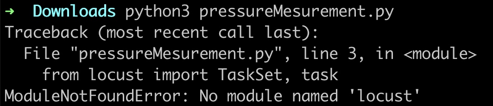
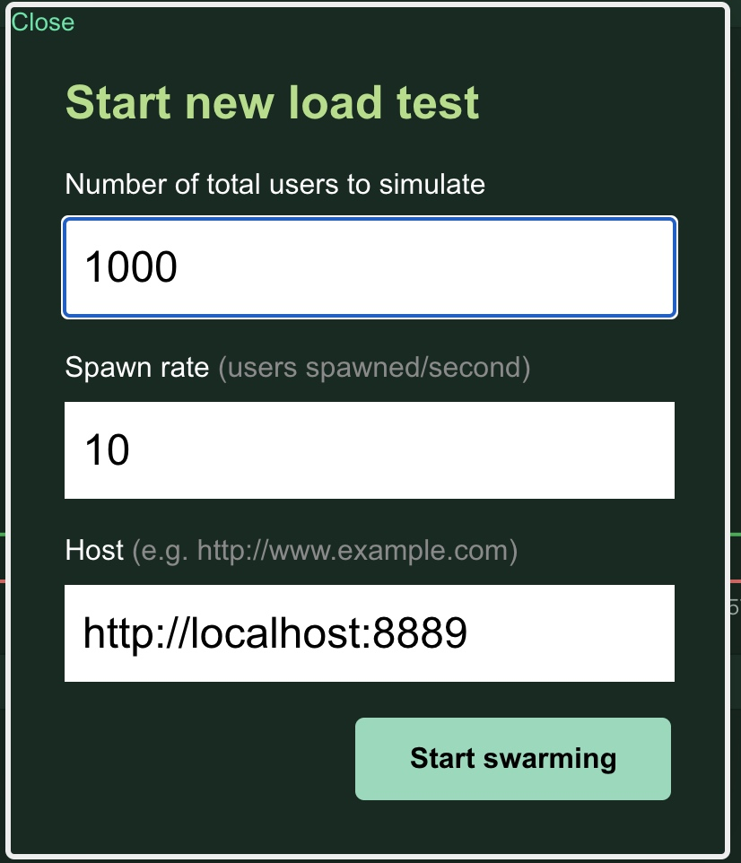
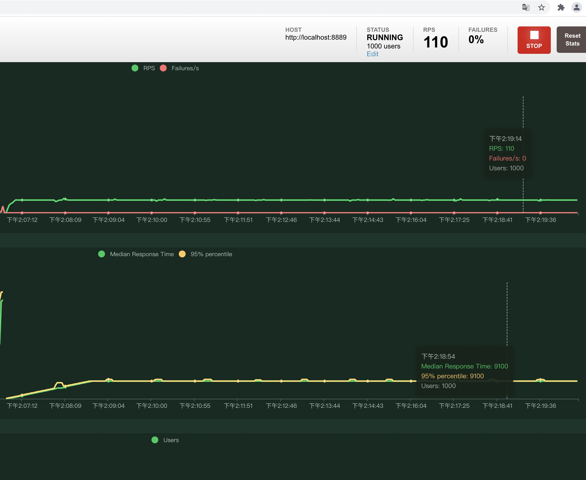
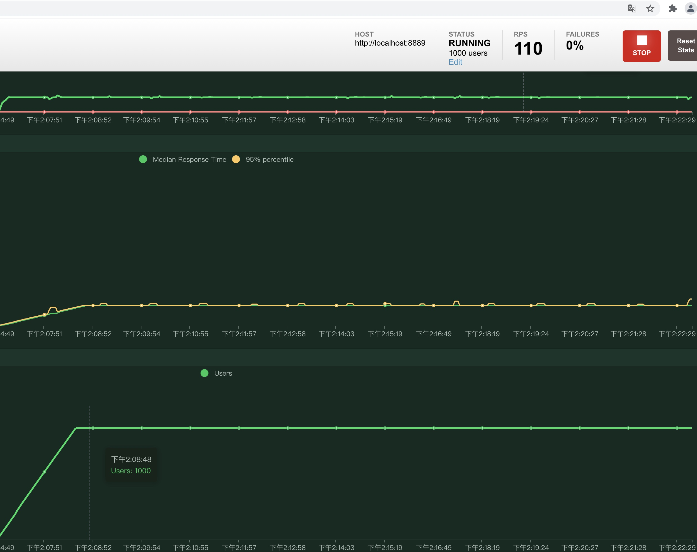
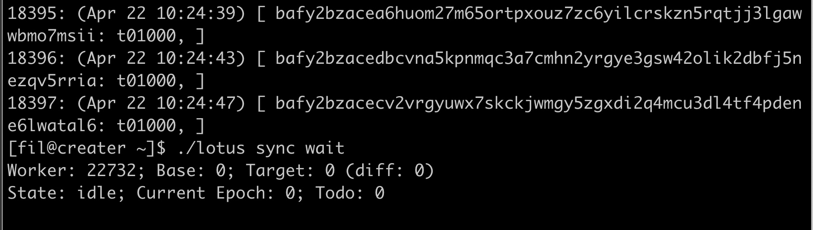

### ab
ab -n 100 -c 10 -p '123.txt' http://localhost:8080/pool-info
cat 123.txt
{
	"dbCmd":"al"
}

### python 压力测试
python 压力测试脚本：
pressureMesurement.py：
```py

import json
import os
from locust import TaskSet, task
from locust.contrib.fasthttp import FastHttpUser


class UserTask(TaskSet):

    header = {'Content-Type': 'application/json'}

    def on_start(self):
        pass

    @task
    def unlock(self):
        self.data = {
            "id":1,
            "jsonrpc":"2.0",
            "method": "filscan.BaseFeeAndGas",
            "params": ["f01", 2]
        }
        data_ = json.dumps(self.data)
        r = self.client.post("/rpc/v1",data=data_,headers = self.header)
        # r = self.client.get("/",headers = self.header)
        # unlock_re = json.loads(r.text)
        # print(self.u)
        assert json.loads(r.text).get("result").get("base_fee") is not None


    def on_stop(self):
        '''销毁数据，每个虚拟用户只执行一次'''
        # self.client.post("https://www.baidu.com")
        pass


class WebsiteUser(FastHttpUser):
    host = 'https://api.filscan.io:8700'
    # host = 'http://127.0.0.1:8000'


    tasks = [UserTask]
    # 每个任务之间设置间隔时间，随机从3~5区间内取，单位是 s
    # wait_time = between(0, 2)


if __name__ == "__main__":
    # -u 并发量 为 100  -r 指定并发加压速率  -t 脚本运行时间
    os.system('locust -f pressureMesurement.py --web-host="127.0.0.1"')


#  locust -f 1.py --headless -u 100 -r 20  -t 3 --csv=example


#  locust -f 1.py --headless -u 1 -r 1  -t 1 --csv=example


# locust -f 1.py --web-host="127.0.0.1"
```
启动脚本：


需要安装locust：
sudo python -m ensurepip
sudo python -m pip install --upgrade pip
sudo pip3 install locust


web 测试网页:



在用户数达到设定的1000之前， 状态在spawming， 即不断生成用户


 对应测试曲线：
 


得有一个爬坡的过程


稳定之后， 实际的值就接近了设定的值
rps 为request per second, 每秒请求数， 
如 设置1000 用户请求数， 10秒， 即10秒内完成1000次用户请求，
即rps为100, 这里实际的值是110， 接近设定的100, 
在开始的爬坡阶段， rps曲线， 相应时间曲线， 用户数曲线，都是一个爬坡的过程。 

 

### 创世矿工算力大于普通矿工， 并且上个高度里没普通矿工出块， 普通矿工停止，链也不会废掉




