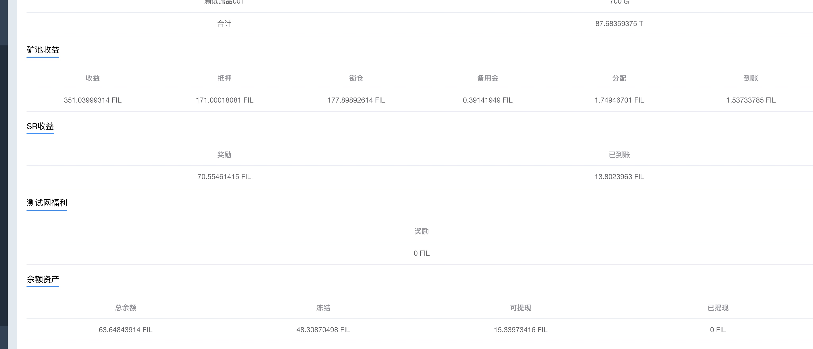

[TOC]
#### 版本查看
```
$ ./lotus -v
    lotus version 0.4.1+git.a34c4950c
```

a34c4950c 是提交号， 可以到git 上看到对应那个提交




### state 
```
$ ./lotus state
NAME:
   lotus state - Interact with and query filecoin chain state

USAGE:
   lotus state command [command options] [arguments...]

COMMANDS:
   power              Query network or miner power
   sectors            Query the sector set of a miner
   proving            Query the proving set of a miner
   fault              Query the fault set of a miner
   get-miner-state    get miner state info
   all-deadlines      get all deadlines of a miner
   cur-deadline       get cur deadline info
   pledge-collateral  Get minimum miner pledge collateral
   list-actors        list all actors in the network
   list-miners        list all miners in the network
   get-actor          Print actor information
   lookup             Find corresponding ID address
   replay             Replay a particular message within a tipset
   sector-size        Look up miners sector size
   read-state         View a json representation of an actors state
   list-messages      list messages on chain matching given criteria
   compute-state      Perform state computations
   call               Invoke a method on an actor locally
   get-deal           View on-chain deal info
   wait-msg           Wait for a message to appear on chain
   search-msg         Search to see whether a message has appeared on chain
   miner-info         Retrieve miner information
   help, h            Shows a list of commands or help for one command

OPTIONS:
   --tipset value  specify tipset to call method on (pass comma separated array of cids)
   --help, -h      show help (default: false)
   --version, -v   print the version (default: false)
```

#### list-messages
```
$ ./lotus state list-messages
2020-07-07T16:22:57.946+0800	WARN	main	lotus/main.go:81	must specify at least To or From in message filter
$ ./lotus state list-messages -h
NAME:
   lotus state list-messages - list messages on chain matching given criteria

USAGE:
   lotus state list-messages [command options] [arguments...]

OPTIONS:
   --to value        return messages to a given address
   --from value      return messages from a given address
   --toheight value  don't look before given block height (default: 0)
   --cids            print message CIDs instead of messages (default: false)
   --help, -h        show help (default: false)
```

### chain 
```
$ ./lotus chain
NAME:
   lotus chain - Interact with filecoin blockchain

USAGE:
   lotus chain command [command options] [arguments...]

COMMANDS:
   head             Print chain head
   getblock         Get a block and print its details
   read-obj         Read the raw bytes of an object
   stat-obj         Collect size and ipld link counts for objs
   getmessage       Get and print a message by its cid
   sethead          manually set the local nodes head tipset (Caution: normally only used for recovery)
   list             View a segment of the chain
   get              Get chain DAG node by path
   bisect           bisect chain for an event
   export           export chain to a car file
   slash-consensus  Report consensus fault
   help, h          Shows a list of commands or help for one command

OPTIONS:
   --help, -h     show help (default: false)
   --version, -v  print the version (default: false)
```

