[TOC]

### 测试目的
因为需要用docker容器做cpu核数划分，所以先准备好容器的镜像，然后启动容器
测试的目的， 是为了算出配比方案， 测试p1 , p2 , p4 不同核数下， bench 的时间和产量个数， 算出每种核数配置下的， 产量速度， 最后选出产量速度最快的核数配置，并记录下相应的产量速度。 

依照这个p1, p2, p4的各自的核数和产量速度，算出一个小集群需要的不同型号的机器数目，以及每个机器上运行的容器的数目。这个数据运维人员需要。 
然后再计算出p1,p2, p4的产出速度。 


然后把产出速度和比如月产出量期望值， 比如为1PB，把这些数据带入到excel表格， 得出每种型号的机器的台数。  这个配比数据采购人员需要。 下表用任务总量除以单台21天产量， 得到台数


本文主要介绍了bench运行所有需要的容器操作， P4证明参数文件的准备， p1，p2，p4的时间统计，p1大页内存问题，p4内存估算问题， 存放cache的本地块存储，存放p3cache和最终文件的共享存储挂载等，  

https://faucet.calibration.fildev.network/
### 创建本地镜像
#### 编写dockerfile
```
[root@instance-20200716-0836 storage]# cat Dockerfile
FROM centos:centos7
RUN yum update -y
RUN yum install epel-release -y
RUN yum install ocl-icd-devel -y
RUN yum install opencl-headers -y
```

#### docker build . -t test下载镜像并依此创建本地镜像
```
[root@instance-20200716-0836 storage]#docker build . -t test
```
docker build执行时， 遇到 docker daemon文件过大， 本来正常情况下几百兆， 但下了几个G还没下完， 
```
Sending build context to Docker daemon 218.2 MB
```
解决办法： 将Dockerfile移动到用户根目录下， 然后再运行docker build:
```
[root@instance-20200716-0836 ~]#docker build . -t test
```
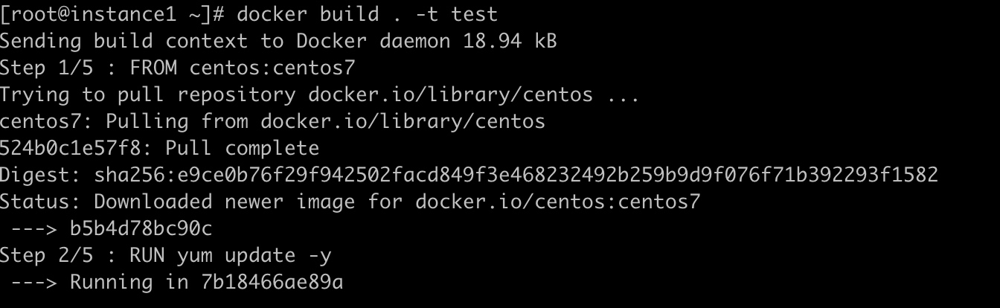

这个docker build 可以生成一个名叫test镜像, 用docker images 可以看到这个镜像
```
[root@instance-20200716-0836 ~]# docker images
REPOSITORY          TAG                 IMAGE ID            CREATED             SIZE
test                latest              761927423150        About an hour ago   526 MB
docker.io/centos    centos7             b5b4d78bc90c        2 months ago        203 MB
```

后面要运行的容器都基于这个test镜像，在docker compose文件里，指定好这个镜像文件

### 系统环境准备
#### 文件系统
查看所有的块设备：
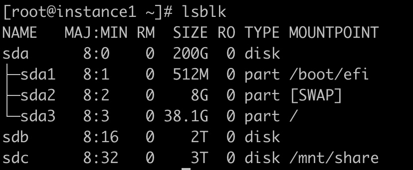

在块设备上创建ext4文件系统
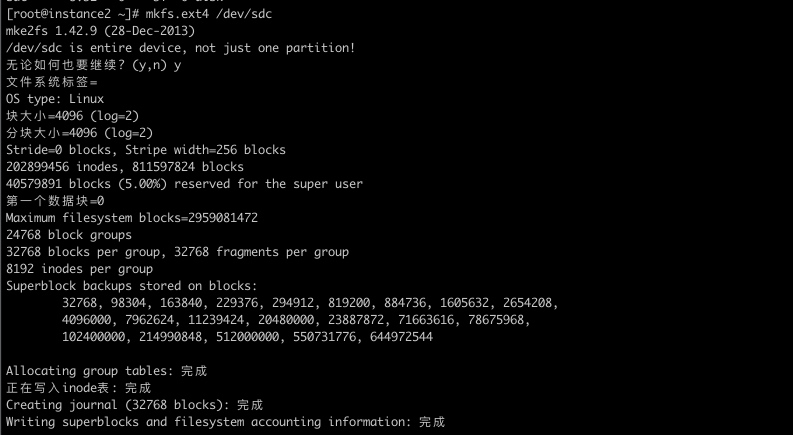
oracle 生成可以不通过网络文件系统， 即不用nfs.

#### 关闭超线程
p1 p2 p4 都要关闭超线程， 因为超出来的线程会来回切
```
[root@instance1 ~]# cat a.sh
#!/bin/bash
for cpunum in $(cat /sys/devices/system/cpu/cpu*/topology/thread_siblings_list | cut -s -d, -f2- | tr ',' '\n' | sort -un)
do
    echo 0 > /sys/devices/system/cpu/cpu$cpunum/online
done
```
#### 大页内存的开启与关闭
巨页内存是专给p1用的，有p1时就开启， 没p1时就不开启
```
[root@instance1 share]# echo 0 > /proc/sys/vm/nr_hugepages
```
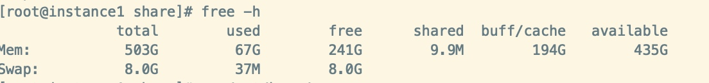
大页内存还占据67G， 需要删除/mnt/huge/* 
```
[root@instance1 share]# rm /mnt/huge/* -rf
```
再看：
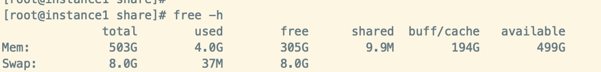


            


#### 防火墙原因导致connection refused了
防火墙导致connection refused
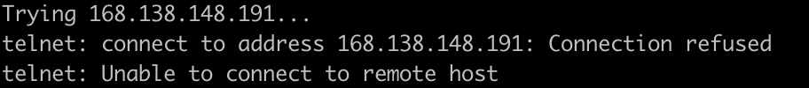

关闭防火墙：
```
 systemctl stop firewalld.service
```

### 容器编排
#### cpu核数划分
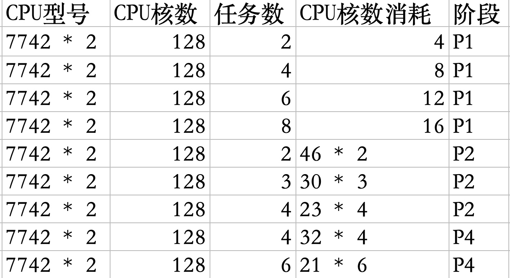


#### 编写dockercompose配置文件
上面制作好了test镜像， 现在就可以用这个镜像启动容器了。 
可以在docker compose的配置文件使用这个镜像
这里给出p2按46核的划分
```
[root@instance-20200716-0836 ~]# cat p2-46cpu.yml
version: "2"
services:
    bench1:
        image: test
        container_name: "p2-1"
        cpuset: '0-45'
        network_mode: "host"
        privileged: true
        volumes:
            - /etc/localtime:/etc/localtime
            - /mnt/storage/:/mnt/storage/
            - /var/tmp/filecoin-proof-parameters/:/var/tmp/filecoin-proof-parameters/
            - /root/worker/:/root/worker/
        command: tail -f /dev/null

    bench2:
        image: test
        container_name: "p2-2"
        cpuset: '46-95'
        network_mode: "host"
        privileged: true
        volumes:
            - /etc/localtime:/etc/localtime
            - /mnt/storage/:/mnt/storage/
            - /var/tmp/filecoin-proof-parameters/:/var/tmp/filecoin-proof-parameters/
            - /root/worker/:/root/worker/
        command: tail -f /dev/null
```
如果提示语法错误， 又检查不到哪里有错误, 如遇到这样的错误：
```
[root@instance-20200716-0836 ~]# docker-compose -f p2.yml up -d
ERROR: yaml.parser.ParserError: while parsing a block mapping
  in "./p2.yml", line 1, column 1
expected <block end>, but found '<block mapping start>'
  in "./p2.yml", line 12, column 4
```
中间有些非法字符，但看不出来哪个字符， 可以从别的正确的文件拷贝过来，稍加修改      
p2所有需要用到的docker-compose的yml文件    
```
[root@instance-20200716-0836 ~]# ll *.yml
-rw-r--r--. 1 root root 1465 Jul 19 00:55 p2-23cpu.yml
-rw-r--r--. 1 root root 1104 Jul 18 07:47 p2-30cpu.yml
-rw-r--r--. 1 root root  665 Jul 17 08:16 p2-46cpu.yml
```
#### docker compose 启动容器
```
[root@instance-20200716-0836 ~]# docker-compose -f p2.yml up -d
Creating p2-1 ... done
Creating p2-1 ...
[root@instance-20200716-0836 ~]# docker ps
CONTAINER ID        IMAGE               COMMAND               CREATED             STATUS              PORTS               NAMES
41df88a7c418        test                "tail -f /dev/null"   5 seconds ago       Up 5 seconds                            p2-1
391b0d80fc6a        test                "tail -f /dev/null"   5 seconds ago       Up 5 seconds                            p2-2
```

#### 容器产生的临时文件占用了系统空间32G，需要手动删除

看下benchy生成的.tmp开头的文件存在什么地方：
```
find /  -name ".tmp*" -exec du -sch {} \;
```

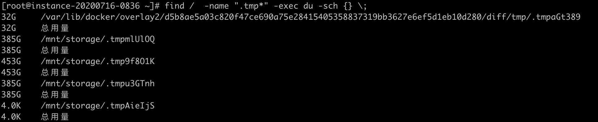

由于容器启动时没有指定挂载目录，临时文件就被放在这个目录下：
```
[root@instance-20200716-0836 ~]# du -sch /var/lib/docker/overlay2/d5b8ae5a03c820f47ce690a75e28415405358837319bb3627e6ef5d1eb10d280/diff/tmp/.tmpaGt389
32G	/var/lib/docker/overlay2/d5b8ae5a03c820f47ce690a75e28415405358837319bb3627e6ef5d1eb10d280/diff/tmp/.tmpaGt389
32G	总用量
```
这个容器的临时文件就占用了32G。 容器退出后，容器的这个临时文件不会被自动清除。 
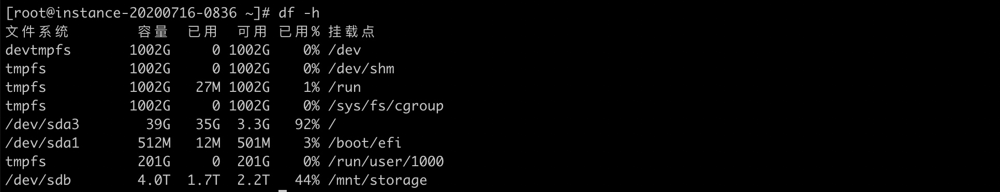
系统空间都在/ 这个目录下，只有39G， 已经用了35G， 其中32G就是被容器的临时文件占用的，需要删除容器容器的临时文件。 
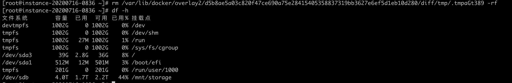


### 容器内操作
#### 进入容器
```
root@instance-20200716-0836 ~]# docker exec -it 41df88a7c418 /bin/bash

[root@instance-20200716-0836 ~]# cd /mnt/storage/
[root@instance-20200716-0836 storage]# RUST_BACKTRACE=1 RUST_LOG=trace ./benchy force --size=32GiB --p2 --cache-dir .tmpAieIjS  > benchy-p2-7742-task-1.log 2>&1 &
```
有时进入容器， 访问文件被拒绝， 解决办法是在p2.yml中加入 ：
```       
privileged: true
```
用docker-compose 重启容器即可解决。 

容器内启动的进程，在容器外可以看到；
```
[root@instance-20200716-0836 ~]# ps aux | grep ben
root      23850 4315  0.5 47494176 10723784 ?   Sl   09:02 799:03 ./benchy_hugepage_0706 force --size=32GiB --p2 --cache-dir .tmp9f8O1K
root      24296  0.0  0.0 112824   972 pts/7    S+   09:20   0:00 grep --color=auto ben
```

#### 容器内启动bench
```
TMPDIR=./  RUST_BACKTRACE=1 RUST_LOG=trace ./benchy_hugepage_0706 force --size=32GiB --p2 --cache-dir test1  > benchy-p2-7742-task-2.log 2>&1 &
```
TMPDIR 存放p2 生成文件， p2 一方面生成layer-c, layer-r-last等文件，还会生成sealed文件， 32G的sector的sealed文件就是32G。  benchy默认把sealed文件拷贝到/tmp目录下。 

#### 容器内对当前容器名的查看
进到容器里面， 由于是Host模式， cat /etc/hosts 无法知道当前容器的id：
```
[root@instance-20200716-0836 storage]# cat /etc/hosts
127.0.0.1   localhost localhost.localdomain localhost4 localhost4.localdomain4
::1         localhost localhost.localdomain localhost6 localhost6.localdomain6
10.0.0.2 instance-20200716-0836.subnet.vcn.oraclevcn.com instance-20200716-0836
```

####  容器外部可以看到容器内运行的进程


### oracle服务主机的几个问题
* io 拷贝速度270M/s,  
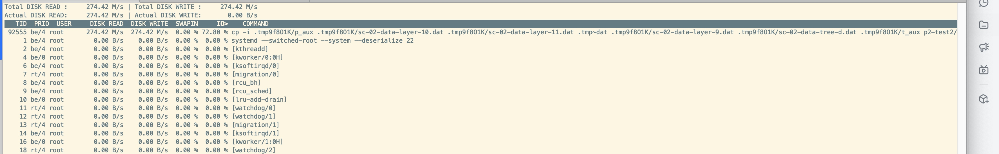

理论值是480M/s， 因为同时有读写， 所以速度差不多降一半。 阿里的50G/s, 这个差距有点大。 

* 系统空间只有 39G， 存放个临时就不够用了

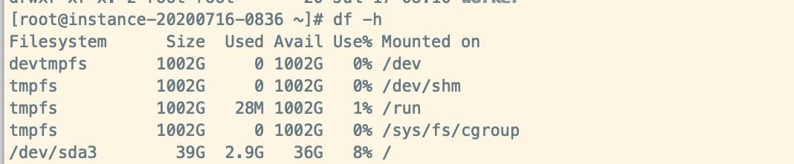

阿里的系统空间493G

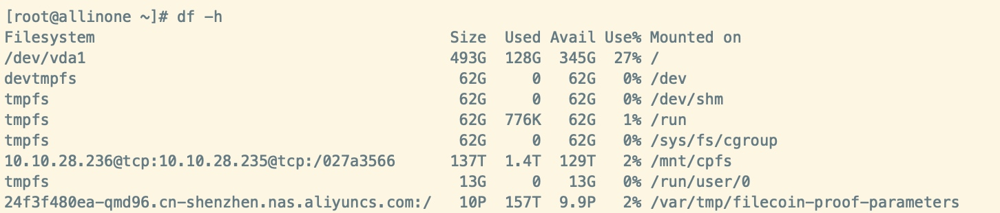

* 经常输入时卡顿，即使通过阿里登陆过去也不行， 拷贝的时候， 如果不后台运行， 一会就pipe broken了，就断开了，拷贝命令也随之停止，拷贝90%了，停了，等于白拷。 

* oracle 从容器退出， 经常回不到宿主机命令行
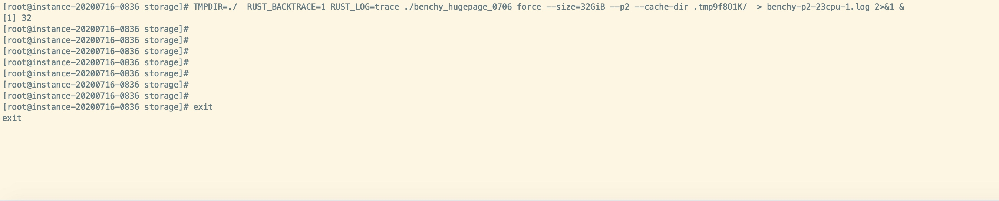


### 耗用时间统计
比较合理的做法是，benchy log里直接给出耗时，就是一个时间相减的运算， 因为benchy log里没有这个耗时， 所以需要手动处理。 
以p2为例叙述， p1,p4也要做相同处理。
#### 1. 先用grep过滤出开始时间， 和结束时间的log
用grep命令过滤出p2 的开始时间：
```
➜  benchylog1 grep "seal_pre_commit_phase2_all_zero: start" -nr *
benchy-p2-23cpu-1.log:12:thread_id: ThreadId(1) 2020-07-19 02:35:20 INFO [filecoin_proofs::api::seal_pledge] seal_pre_commit_phase2_all_zero: start
benchy-p2-23cpu-2.log:12:thread_id: ThreadId(1) 2020-07-19 02:56:48 INFO [filecoin_proofs::api::seal_pledge] seal_pre_commit_phase2_all_zero: start
benchy-p2-23cpu-3.log:12:thread_id: ThreadId(1) 2020-07-19 02:55:39 INFO [filecoin_proofs::api::seal_pledge] seal_pre_commit_phase2_all_zero: start
benchy-p2-23cpu-4.log:12:thread_id: ThreadId(1) 2020-07-19 02:52:40 INFO [filecoin_proofs::api::seal_pledge] seal_pre_commit_phase2_all_zero: start
benchy-p2-30cpu-1.log:12:thread_id: ThreadId(1) 2020-07-18 12:14:49 INFO [filecoin_proofs::api::seal_pledge] seal_pre_commit_phase2_all_zero: start
benchy-p2-30cpu-2.log:12:thread_id: ThreadId(1) 2020-07-18 12:16:50 INFO [filecoin_proofs::api::seal_pledge] seal_pre_commit_phase2_all_zero: start
benchy-p2-30cpu-3.log:12:thread_id: ThreadId(1) 2020-07-18 12:22:32 INFO [filecoin_proofs::api::seal_pledge] seal_pre_commit_phase2_all_zero: start
benchy-p2-46cpu-1.log:12:thread_id: ThreadId(1) 2020-07-17 09:02:10 INFO [filecoin_proofs::api::seal_pledge] seal_pre_commit_phase2_all_zero: start
benchy-p2-46cpu-2.log:12:thread_id: ThreadId(1) 2020-07-18 05:19:50 INFO [filecoin_proofs::api::seal_pledge] seal_pre_commit_phase2_all_zero: start
benchy-p2-7742-task-1.log:12:thread_id: ThreadId(1) 2020-07-17 09:02:10 INFO [filecoin_proofs::api::seal_pledge] seal_pre_commit_phase2_all_zero: start
benchy-p2-7742-task-2.log:12:thread_id: ThreadId(1) 2020-07-18 05:19:50 INFO [filecoin_proofs::api::seal_pledge] seal_pre_commit_phase2_all_zero: start
benchy-p2-cpu30-3.log:12:thread_id: ThreadId(1) 2020-07-18 12:22:32 INFO [filecoin_proofs::api::seal_pledge] seal_pre_commit_phase2_all_zero: start
```

再用grep 过滤出p2的结束时间： 
```
➜  benchylog1 grep " p34 disabled" -nr *
benchy-p2-23cpu-1.log:1975:thread_id: ThreadId(1) 2020-07-19 04:45:50 INFO [benchy::force] p34 disabled
benchy-p2-23cpu-2.log:1975:thread_id: ThreadId(1) 2020-07-19 05:10:47 INFO [benchy::force] p34 disabled
benchy-p2-23cpu-3.log:1975:thread_id: ThreadId(1) 2020-07-19 05:07:35 INFO [benchy::force] p34 disabled
benchy-p2-23cpu-4.log:1975:thread_id: ThreadId(1) 2020-07-19 04:50:48 INFO [benchy::force] p34 disabled
benchy-p2-30cpu-1.log:1975:thread_id: ThreadId(1) 2020-07-18 13:59:04 INFO [benchy::force] p34 disabled
benchy-p2-30cpu-2.log:1975:thread_id: ThreadId(1) 2020-07-18 14:02:49 INFO [benchy::force] p34 disabled
benchy-p2-30cpu-3.log:1975:thread_id: ThreadId(1) 2020-07-18 13:57:59 INFO [benchy::force] p34 disabled
benchy-p2-46cpu-1.log:1975:thread_id: ThreadId(1) 2020-07-17 10:08:25 INFO [benchy::force] p34 disabled
benchy-p2-46cpu-2.log:1975:thread_id: ThreadId(1) 2020-07-18 06:18:40 INFO [benchy::force] p34 disabled
benchy-p2-7742-task-1.log:1975:thread_id: ThreadId(1) 2020-07-17 10:08:25 INFO [benchy::force] p34 disabled
benchy-p2-7742-task-2.log:1975:thread_id: ThreadId(1) 2020-07-18 06:18:40 INFO [benchy::force] p34 disabled
benchy-p2-cpu30-3.log:1975:thread_id: ThreadId(1) 2020-07-18 13:57:59 INFO [benchy::force] p34 disabled
```

#### 2 从过滤出的log, 提取出时间列
把过滤出的log, 拷贝到ultraedit, 点击上面的列按钮， 就可以按列选取， 如下： 
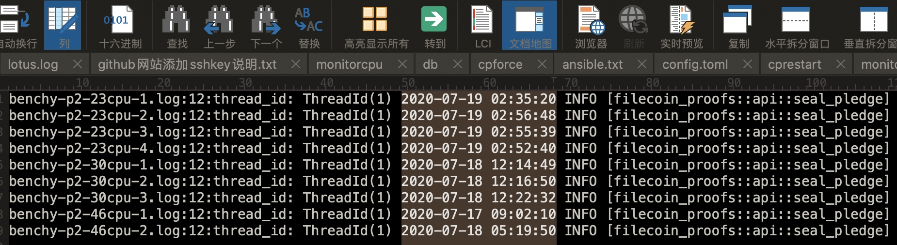

#### 3 将时间列拷到excel，做时间相减， 得出每个p2的耗时
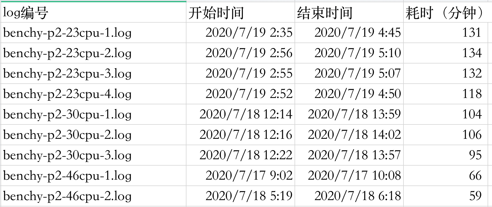


### bench p4 测试 
#### 1. 下载证明参数文件
代码的build/proof-parameter/parameters.json列出了所有的证明参数文件，32G的证明参数如下：
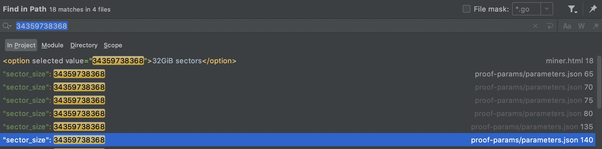
共有六个，如果做sector上链和出块，需要把这6个证明参数文件都下载下来。  
**证明参数文件是lotus, poster, sealer和p4所需要的**, p1, p2，p3不需要。 启动命令里没指定证明参数文件位置， 默认的路径是/var/tmp/filecoin-proof-parameters。 可以把证明参数文件专门放到一个特定的文件系统上，然后挂载这个文件系统。

p4 log里显示出p4所需要的证明参数文件：
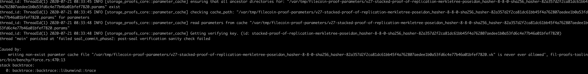

p4 需要两个证明参数文件, 在代码的params.json的描述为：
```
  "v27-stacked-proof-of-replication-merkletree-poseidon_hasher-8-8-0-sha256_hasher-82a357d2f2ca81dc61bb45f4a762807aedee1b0a53fd6c4e77b46a01bfef7820.params": {
    "cid": "Qmf8ngfArxrv9tFWDqBcNegdBMymvuakwyHKd1pbW3pbsb",
    "digest": "a16d6f4c6424fb280236739f84b24f97",
    "sector_size": 34359738368
  },
  "v27-stacked-proof-of-replication-merkletree-poseidon_hasher-8-8-0-sha256_hasher-82a357d2f2ca81dc61bb45f4a762807aedee1b0a53fd6c4e77b46a01bfef7820.vk": {
    "cid": "QmfQgVFerArJ6Jupwyc9tKjLD9n1J9ajLHBdpY465tRM7M",
    "digest": "7a139d82b8a02e35279d657e197f5c1f",
    "sector_size": 34359738368
  },
```
这里有下载证明参数文件的依据，一个是hash, 一个是cid，即下载命令需要的cid, 下载后的文件名是cid, 要手动重命名为hash. 
```
curl -o /var/tmp/v27-stacked-proof-of-replication-merkletree-poseidon_hasher-8-8-0-sha256_hasher-82a357d2f2ca81dc61bb45f4a762807aedee1b0a53fd6c4e77b46a01bfef7820.params https://ipfs.io/ipfs/Qmf8ngfArxrv9tFWDqBcNegdBMymvuakwyHKd1pbW3pbsb
```
或者用wget： 
```
wget https://ipfs.io/ipfs/Qmf8ngfArxrv9tFWDqBcNegdBMymvuakwyHKd1pbW3pbsb

wget https://ipfs.io/ipfs/QmfQgVFerArJ6Jupwyc9tKjLD9n1J9ajLHBdpY465tRM7M
```
wget 比curl 稳定一些，这个p4使用的证明参数文件45G，curl下载时出现传输断开的情况，重下又不能续传，wget没出现。 

wget 不会覆盖之前下载的文件。  wget 有剩余时间估算：
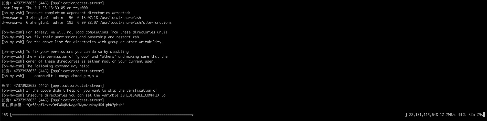

oracle下载 p4 45G证明参数文件 ， 用时55分钟
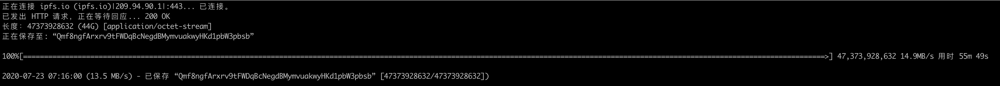

最好后台运行，前台运行如果ssh 断开， 下载进程也随之终止， 而且不支持续传。下了几个小时等于白下。 所以对于大文件，千万不要前台下载。 不退出的后台下载可以用screen 
##### screen 的使用
ssh 登陆如果broken了， ssh起的进程也推出了， 对于下载， 可以用screen起一个终端 这个终端不会随ssh 退出而退出， 相当于在远程主机开了一个单独的命令窗口。
先安装screen. 

###### 新建一个窗口
```
[root@instance2 ~]# screen
[detached from 13314.pts-3.instance2]
```
detached 表示离开窗口， 但窗口还在。 
###### 查看开了多少窗口


如果没有打开的窗口， 显示为：
```
[root@instance2 ~]# screen -ls
No Sockets found in /var/run/screen/S-root.
```

###### 进入已经打开的窗口：
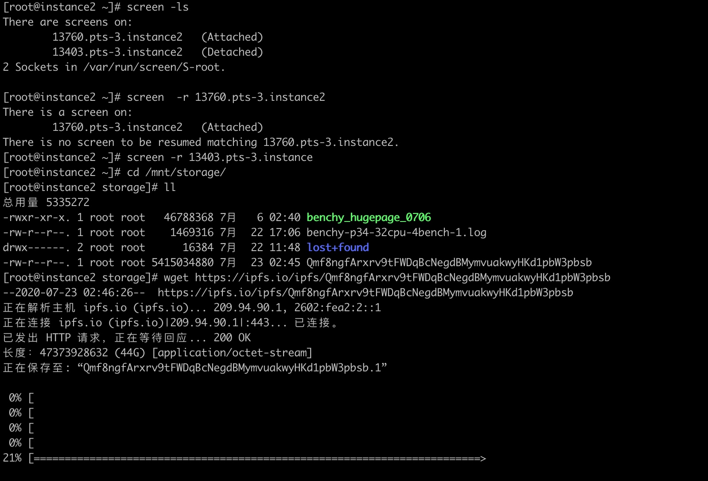
只能打开已经detached的窗口。 

###### 退出当前窗口：
用快捷键：ctl +a 按住ctl不放，再按d，可以回到原命令行，窗口显示detached from：
```
[root@instance2 ~]# screen
[detached from 13760.pts-3.instance2]
```
只会离开这个窗口， 不会结束。

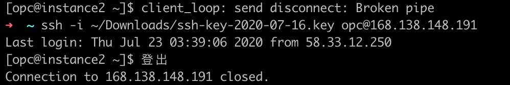

与ctl + a 放开 然后 ctl +d 效果一样。 

下载后改名：
```
[root@instance2 filecoin-proof-parameters]# mv QmfQgVFerArJ6Jupwyc9tKjLD9n1J9ajLHBdpY465tRM7M v27-stacked-proof-of-replication-merkletree-poseidon_hasher-8-8-0-sha256_hasher-82a357d2f2ca81dc61bb45f4a762807aedee1b0a53fd6c4e77b46a01bfef7820.vk

[root@instance2 storage]# mv Qmf8ngfArxrv9tFWDqBcNegdBMymvuakwyHKd1pbW3pbsb  v27-stacked-proof-of-replication-merkletree-poseidon_hasher-8-8-0-sha256_hasher-82a357d2f2ca81dc61bb45f4a762807aedee1b0a53fd6c4e77b46a01bfef7820.params
```
创建filecoin-proof-parameters目录， 并移动到这个目录下：


#### 2. 软链接证明参数文件
因为系统空间太小；
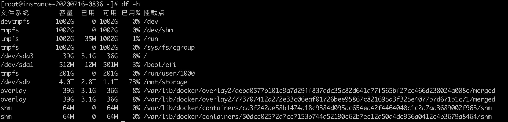
所以用软链接把/var/tmp/filecoin-proof-parameters链接过去： 
```
[root@instance-20200716-0836 storage]# ln -s /mnt/storage/filecoin-proof-parameters  /var/tmp/filecoin-proof-parameters

[root@instance-20200716-0836 storage]# ll /var/tmp/filecoin-proof-parameters/
总用量 41671684
-rw-r--r--. 1 root root 42671800320 7月  20 09:54 v27-stacked-proof-of-replication-merkletree-poseidon_hasher-8-8-0-sha256_hasher-82a357d2f2ca81dc61bb45f4a762807aedee1b0a53fd6c4e77b46a01bfef7820.params
```

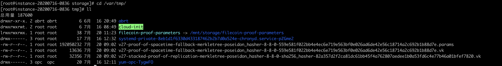

#### 3 找到所有cache和sealed的对应关系, 为bench p4的启动命令准备
p1，p2成功做完后，并不代表p1 p2完成的layer文件就是对的，p3会对p1 p2生成的所有Layer文件做验证， 验证的结果放在p3cache目录下，只有p3完成了，才能保证p1 p2做好的layer文件是正确的， 

因为 bench p34需要p1，p2生成的所有layer文件，生成的cache目录，
p2的 force worker log里记录了使用的cache目录和生成的sealed-file文件的名字。 


列出所有的 p2 完成的所有cache和sealed 文件对应关系
```
[root@instance-20200716-0836 storage]#  grep "using cache dir" -nr benchy-p2-23cpu*
benchy-p2-23cpu-1.log:5:thread_id: ThreadId(1) 2020-07-19 02:35:15 INFO [benchy::force] using cache dir ".tmp9f8O1K/", sealed file "/mnt/storage/./.tmp4lDfbd", thread id is ThreadId(1)
benchy-p2-23cpu-2.log:5:thread_id: ThreadId(1) 2020-07-19 02:56:43 INFO [benchy::force] using cache dir "p2-test2", sealed file "/mnt/storage/./.tmpJLmg0A", thread id is ThreadId(1)
benchy-p2-23cpu-3.log:5:thread_id: ThreadId(1) 2020-07-19 02:55:34 INFO [benchy::force] using cache dir "p2-test3", sealed file "/mnt/storage/./.tmpWklfZ5", thread id is ThreadId(1)
benchy-p2-23cpu-4.log:5:thread_id: ThreadId(1) 2020-07-19 02:52:35 INFO [benchy::force] using cache dir "p2-test4", sealed file "/mnt/storage/./.tmpbislmb", thread id is ThreadId(1)
```

看下这几个sealed文件在不在：
```
[root@instance-20200716-0836 storage]# ll .tmp4lDfbd .tmpJLmg0A .tmpWklfZ5 .tmpbislmb
-rw-r--r--. 1 root root 34359738368 7月  19 04:45 .tmp4lDfbd
-rw-r--r--. 1 root root 34359738368 7月  19 04:50 .tmpbislmb
-rw-r--r--. 1 root root 34359738368 7月  19 05:10 .tmpJLmg0A
-rw-r--r--. 1 root root 34359738368 7月  19 05:07 .tmpWklfZ5
```

#### 4. p4 bench启动命令
```
FIL_PROOFS_USE_FULL_GROTH_PARAMS=true BELLMAN_PROOF_THREADS=5  TMPDIR=./  RUST_BACKTRACE=1 RUST_LOG=trace ./benchy_hugepage_0706 force --size=32GiB --p34 --cache-dir .tmp9f8O1K/  --sealed-file .tmp4lDfbd  > benchy-p34-32cpu-4bench-1.log 2>&1 &
```

#### 5. p4 时间统计
p4 的开始log: 读证明参数文件的时间不能算到p4的耗时里。
```
thread_id: ThreadId(1) 2020-07-21 12:23:48 INFO [filecoin_proofs::api::seal] got groth params (34359738368) while sealing

thread_id: ThreadId(1) 2020-07-21 13:12:28 INFO [filecoin_proofs::api::seal] seal_commit_phase2:finish
```

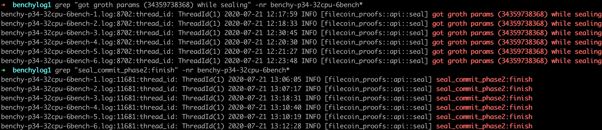
#### 6. p4 内存问题
##### p4 因内存不足报错
内存不足， p4会打印这样的log：
```
thread '<unnamed>' panicked at 'index 42671800440 out of range for slice of length 42671800320', src/libcore/slice/mod.rs:2725:5
stack backtrace:
   0: backtrace::backtrace::libunwind::trace
             at /cargo/registry/src/github.com-1ecc6299db9ec823/backtrace-0.3.44/src/backtrace/libunwind.rs:86
   1: backtrace::backtrace::trace_unsynchronized
```
##### threads参数决定p4占用的内存
每个p4占用的内存= 45G + threads * 30 
45G 内存是为了存放证明参数文件， 一次性装进内存。
threads 没有指定， 默认的就是10个。
一般threads设置为5。 所以P4按 45G + 5*30 = 195G 算。 

##### 关闭大页内存
系统当前开了大页内存： 
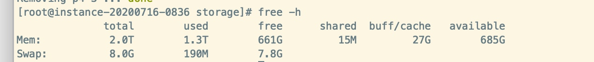

benchy p4没有用到大页内存，启动命令里没有FORCE_HUGE_PAGE环境变量，一般巨页内存只给P1用。 为了給p4尽量多的内存，没有P1运行时，可以关闭大页内存：
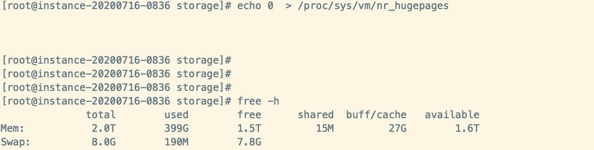


#### 7. 检查benchy p4 是否正常完成


### 测试完成后log文件下载及打包
下载测试获取的所有log：
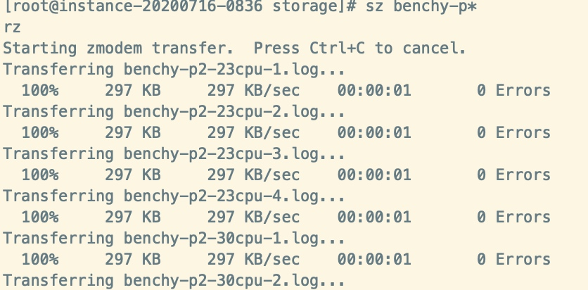

打包：


解压：
tar xzvf benchlog20200722.tar.gz -C ./目录名

### p1 测试
一个P1消耗64G内存， P1需要大叶内存， p2 p4一般不用大叶内存。 所以p1启动前，先开启大叶内存 
#### 开启大叶内存
按文档 巨页内存的开启，执行， 需要重启生效。

#### p1 p2  p34 一起启动

```
FIL_PROOFS_USE_FULL_GROTH_PARAMS=true BELLMAN_PROOF_THREADS=5 HACK_P1=1 FIL_PROOFS_MAXIMIZE_CACHING=1 FIL_PROOFS_BENCHY_HUGEPAGE_ENABLE=1 TMPDIR=./  RUST_BACKTRACE=1 RUST_LOG=trace ./benchy_hugepage_0706 force --size=32GiB --p1 --p2 --p34  > benchy-p34-32cpu-4bench-1.log 2>&1 &
```

终端打个字符有时特别卡， 有时正常 , 能不能一直保持正常

### docker compose问题
```
[root@instance1 share]# docker-compose -f p4-21cpu.yml up -d
ERROR: Couldn't connect to Docker daemon at http+docker://localunixsocket - is it running?

If it's at a non-standard location, specify the URL with the DOCKER_HOST environment variable.
```
解决办法：
```
[root@instance1 share]# groupadd docker
[root@instance1 share]# groupadd docker^C
[root@instance1 share]# gpasswd -a ${USER} docker
正在将用户“root”加入到“docker”组中

[root@instance1 share]#  service docker restart
Redirecting to /bin/systemctl restart docker.service
[root@instance1 share]# docker-compose -f p4-21cpu.yml up -d
Pulling bench1 (test:latest)...
Trying to pull repository docker.io/library/test ...
ERROR: repository docker.io/test not found: does not exist or no pull access

```
### scp问题
#### scp 权限问题
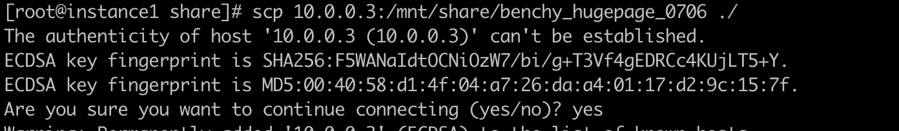

上面出现authenticity， 说明目标机上没有本机的ssh-key, 把本机的id_pub内容拷贝到目标机的~/.ssh/authorised 里面，这里目标机是10.0.0.3

#### scp 不能递归拷贝的问题
原因是没有加rp参数， 加上即可：
```
scp -rp 10.0.0.3:/mnt/share/* ./
```
可以完整递归拷贝目录


cpu 不足， p1 退出, p1 log:
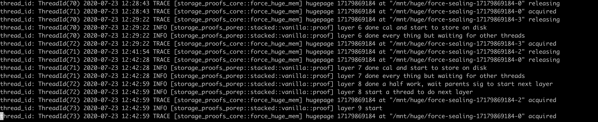

看文件：

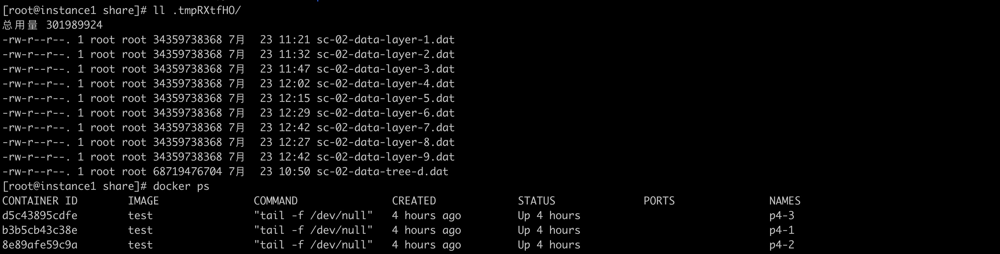


### p1 计算证明参数文件


### p1 p2 p4 的开始和结束
p1开始:
thread_id: ThreadId(1) 2020-07-23 14:52:09 INFO [filecoin_proofs::api::seal_pledge] seal_pre_commit_phase1_all_zero: start
结束：
thread_id: ThreadId(1) 2020-07-23 17:44:04 INFO [benchy::force] p2 enabled


----
p2开始:
seal_pre_commit_phase2_all_zero: start
thread_id: ThreadId(1) 2020-07-23 18:59:44 INFO [benchy::force] p34 enabled

p2结束：
thread_id: ThreadId(1) 2020-07-23 18:59:44 INFO [filecoin_proofs::api::seal] seal_commit_phase1:start


---
p4 开始:
thread_id: ThreadId(1) 2020-07-23 19:00:19 INFO [filecoin_proofs::api::seal] seal_commit_phase2:start

### 不同协议，拷贝速度不同：
scp 协议：
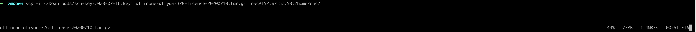
而zmodem协议：


### 证明参数文件
证明参数文件总的大小和参数列表
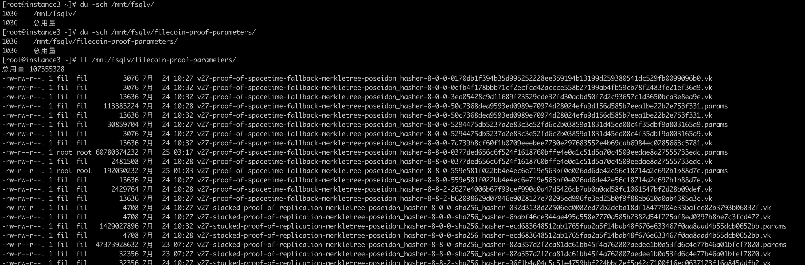


### lotus sync status 

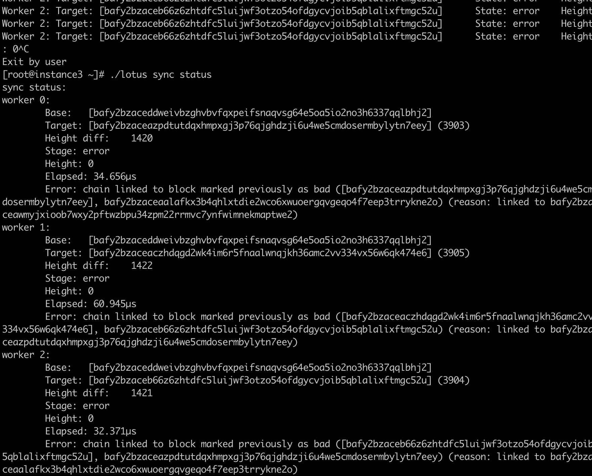


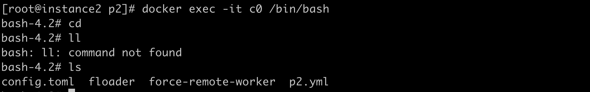


#### 启动force worker报错：
force worker 在开始的时候， 会连接lotus-server端口服务， 如果连不上， 会报如下错误：
```
nohup: ignoring input
^[[38;5;7mDEBUG^[[0m [flic_loader::loader] ^[[38;5;7msettings loaded: Settings { client_id: "dev", client_key: "dev_key", static_pub_key: PubKey { key: RSAPublicKey { n: BigUint { data: [9403744563632550731, 15636893577510509207, 7908396700207876033, 2349911377010148189, 3404479566132747154, 8919033981423213381, 9934012725932870088, 4287027268713126258, 9909142030565529169, 16613651502849711092, 13565734036186278805, 3388392181168824697, 51449515337061430, 7247608559431585465, 6899615128604535572, 12118298871080516872] }, e: BigUint { data: [65537] } }, raw: [48, 129, 137, 2, 129, 129, 0, 168, 44, 216, 158, 36, 197, 125, 8, 95, 192, 91, 103, 91, 98, 107, 20, 100, 148, 173, 149, 216, 0, 14, 185, 0, 182, 201, 15, 197, 136, 20, 54, 47, 5, 252, 188, 126, 71, 97, 121, 188, 67, 43, 59, 72, 79, 43, 149, 230, 143, 140, 4, 217, 125, 219, 244, 137, 132, 88, 45, 8, 192, 86, 81, 59, 126, 148, 150, 86, 15, 25, 114, 137, 220, 179, 241, 11, 112, 73, 200, 123, 198, 198, 38, 170, 94, 91, 69, 47, 63, 36, 32, 176, 107, 27, 146, 32, 156, 143, 242, 112, 86, 195, 93, 109, 192, 68, 229, 250, 195, 7, 193, 217, 1, 103, 220, 102, 25, 218, 151, 130, 128, 207, 219, 129, 212, 51, 75, 2, 3, 1, 0, 1] }, gateway_base_url: "http://10.0.0.6:3456", hardware_fingerprint: "", refresh_interval: 5 }^[[0m
Error: write first key into shared mem

Caused by:
    0: tcp connecting
    1: Connection timed out (os error 110)

Stack backtrace:
   0: anyhow::context::<impl anyhow::Context<T,E> for core::result::Result<T,E>>::context
   1: fhttp::roundtrip_json::{{closure}}
   2: <std::future::GenFuture<T> as core::future::future::Future>::poll
   3: async_std::task::task_locals_wrapper::TaskLocalsWrapper::set_current
   4: scoped_tls::ScopedKey<T>::set
   5: smol::run::run
   6: std::thread::local::LocalKey<T>::with
   7: async_std::task::builder::Builder::blocking
   8: flic_loader::loader::key_fetcher::remote::KeyFetcher::fetch_pub
   9: flic_loader::loader::Loader::exec
  10: floader::main
  11: std::rt::lang_start::{{closure}}
  12: std::rt::lang_start_internal::{{closure}}
             at src/libstd/rt.rs:52
      std::panicking::try::do_call
             at src/libstd/panicking.rs:296
  13: __rust_maybe_catch_panic
             at src/libpanic_unwind/lib.rs:79
  14: std::panicking::try
             at src/libstd/panicking.rs:272
      std::panic::catch_unwind
             at src/libstd/panic.rs:394
      std::rt::lang_start_internal
             at src/libstd/rt.rs:51
  15: main
  16: __libc_start_main
  17: <unknown>
```

经过telnet测试端口， 确定lotus-server的3456端口， 无法访问：
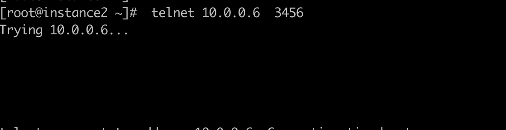

在10.0.0.6本机上测试， 可以访问本机的这个端口：


#### 宿主机的/root/p2 映射到 容器的/root/ 导致 没有初始化， 行标签为bash-4.2
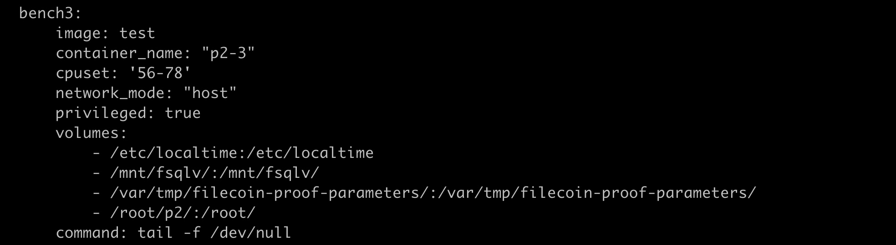
进入容器， 行的提示头为bash-4.2


#### scp 目录设置不对
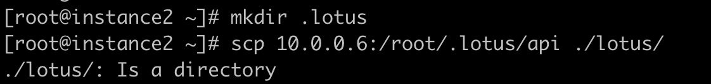

改成这样就对了：
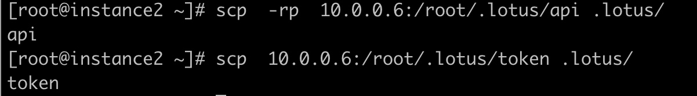

### 软链接
#### 删除软链接文件， 不会删除原文件
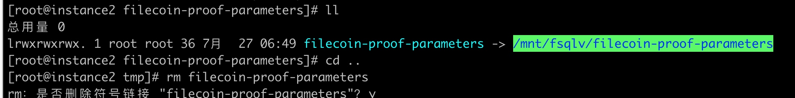


####  ln -s /mnt/fsqlv/filecoin-proof-parameters/  /var/tmp/filecoin-proof-parameters 与 ln -s /mnt/fsqlv/filecoin-proof-parameters  /var/tmp/filecoin-proof-parameters 的区别
这是有无 / 的区别，
有 / ， 表示链接的是同目录， 
没有 / , 表示链接的是子目录
ln -s /mnt/fsqlv/filecoin-proof-parameters/  /var/tmp/filecoin-proof-parameters 的结果：
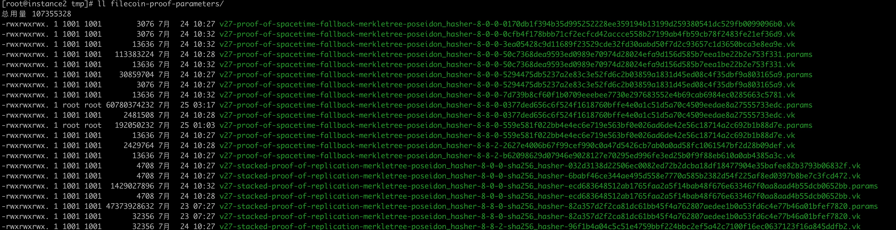
ln -s /mnt/fsqlv/filecoin-proof-parameters /var/tmp/filecoin-proof-parameters 的结果：


### 初始化矿工时， 没有证明参数文件， 会下载证明参数文件


#### 存储盘的分布
1 p1 1 p2


"p1num": 1,   num =1
 "p2num": 1.

sdc


----------------
	
	
#### raid	
再加两个盘 做raid 
       
#### 查看块下的分区    
```
[root@instance2 share]# lsblk
NAME   MAJ:MIN RM  SIZE RO TYPE MOUNTPOINT
sda      8:0    0  200G  0 disk
├─sda1   8:1    0  512M  0 part /boot/efi
├─sda2   8:2    0    8G  0 part [SWAP]
└─sda3   8:3    0 38.1G  0 part /
sdb      8:16   0    2T  0 disk /mnt/storage
sdc      8:32   0    3T  0 disk /mnt/share        
```

#### 链接的文件也在df 里显示为挂载
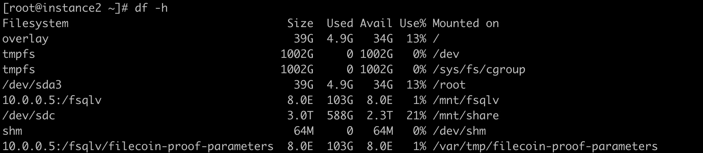


#### 容器重启后， history 的命令还在


FORCE_BUILDER_P1_WORKERS=2 FORCE_BUILDER_TASK_DELAY=1s FORCE_BUILDER_AUTO_PLEDGE_INTERVAL=1 TRUST_PARAMS=1 RUST_LOG=info RUST_BACKTRACE=1 FORCE_BUILDER_PLEDGE_TASK_TOTAL_NUM=5 nohup ./floader ./lotus-storage-miner run --mode=remote-sealer --server-api=http://10.0.0.6:3456 --dist-path=/mnt/fsqlv --nosync --groups=1 > ./sealer.log 2>&1 &


#### 测试截图
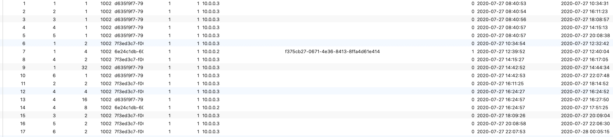


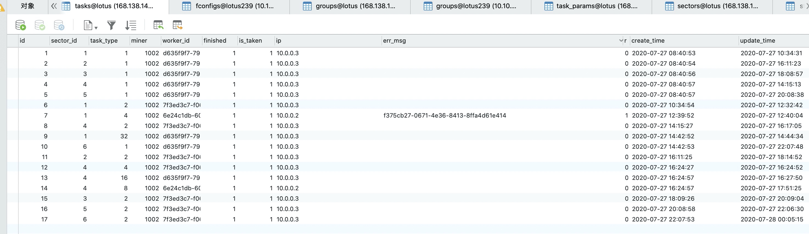

### 配比数据

#### 选出p1 p2 p4最优耗时
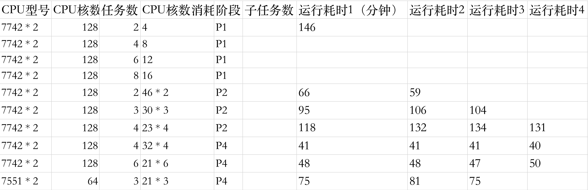

p1: 146分钟 按 150分钟算
p2: （118+132+134+131）/2 = 120 
因为存储吞吐量原因， p1, p2要放在同一个机器上
 
P4: 77分钟：


#### 由p1 p2 p4 耗时和月期望产量，确定购买台数
1024* 1024 / 21 /24 /  = 2080 G / 每小时

2080 / （2 *32） = 

把上面的时间带入到excel表格：


得出台数方案：
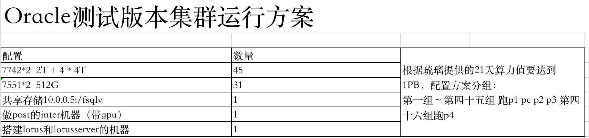


####  运维方案
128 核机器划分， 四个容器， 每个容器跑一个p1,   四个容器跑p2 p3, 每个容器跑一个p2一个p3。   一组p1 p2 p3 对应一个cache存储， 所以有4个cache存储。   
共享存储 为/mnt/fsqlv ， 存放证明参数和p3 cache

64 核机器划分： 三个容器， 一个容器跑一个p4. 
得出运维方案：
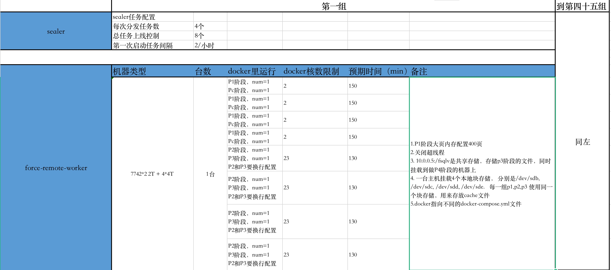

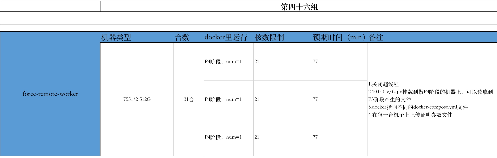


#### 存储的吞吐量
一组p1 p2 p3 对应一个单机cache存储， 所以有4个cache块存储，cache块存储吞吐量及挂载目录


  共享存储 为/mnt/fsqlv ， 存放证明参数和p3 cache，共享存储吞吐量：


