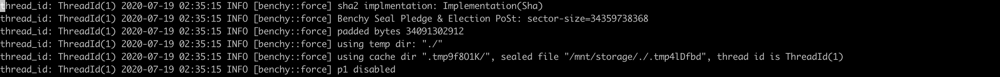

[TOC]

因为需要用docker容器做cpu核数划分，所以先准备好容器的镜像，然后启动容器
### 创建本地镜像
#### 编写dockerfile
```
[root@instance-20200716-0836 storage]# cat Dockerfile
FROM centos:centos7
RUN yum update -y
RUN yum install epel-release -y
RUN yum install ocl-icd-devel -y
RUN yum install opencl-headers -y
```

#### docker build . -t test下载镜像并依此创建本地镜像
```
[root@instance-20200716-0836 storage]#docker build . -t test
```
docker build执行时， 遇到 docker daemon文件过大， 本来正常情况下几百兆， 但下了几个G还没下完， 
```
Sending build context to Docker daemon 218.2 MB
```
解决办法： 将Dockerfile移动到用户根目录下， 然后再运行docker build:
```
[root@instance-20200716-0836 ~]#docker build . -t test
```
这个docker build 可以生成一个名叫test镜像, 用docker images 可以看到这个镜像
```
[root@instance-20200716-0836 ~]# docker images
REPOSITORY          TAG                 IMAGE ID            CREATED             SIZE
test                latest              761927423150        About an hour ago   526 MB
docker.io/centos    centos7             b5b4d78bc90c        2 months ago        203 MB
```

后面要运行的容器都基于这个test镜像，在docker compose文件里，指定好这个镜像文件

### 容器编排

#### cpu核数划分


#### 编写dockercompose配置文件
上面制作好了test镜像， 现在就可以用这个镜像启动容器了。 
可以在docker compose的配置文件使用这个镜像
这里给出p2按46核的划分
```
[root@instance-20200716-0836 ~]# cat p2-46cpu.yml
version: "2"
services:
    bench1:
        image: test
        container_name: "p2-1"
        cpuset: '0-45'
        network_mode: "host"
        privileged: true
        volumes:
            - /etc/localtime:/etc/localtime
            - /mnt/storage/:/mnt/storage/
            - /var/tmp/filecoin-proof-parameters/:/var/tmp/filecoin-proof-parameters/
            - /root/worker/:/root/worker/
        command: tail -f /dev/null

    bench2:
        image: test
        container_name: "p2-2"
        cpuset: '46-95'
        network_mode: "host"
        privileged: true
        volumes:
            - /etc/localtime:/etc/localtime
            - /mnt/storage/:/mnt/storage/
            - /var/tmp/filecoin-proof-parameters/:/var/tmp/filecoin-proof-parameters/
            - /root/worker/:/root/worker/
        command: tail -f /dev/null
```
如果提示语法错误， 又检查不到哪里有错误, 如遇到这样的错误：
```
[root@instance-20200716-0836 ~]# docker-compose -f p2.yml up -d
ERROR: yaml.parser.ParserError: while parsing a block mapping
  in "./p2.yml", line 1, column 1
expected <block end>, but found '<block mapping start>'
  in "./p2.yml", line 12, column 4
```
中间有些非法字符，但看不出来哪个字符， 可以从别的正确的文件拷贝过来，稍加修改      
p2所有需要用到的docker-compose的yml文件    
```
[root@instance-20200716-0836 ~]# ll *.yml
-rw-r--r--. 1 root root 1465 Jul 19 00:55 p2-23cpu.yml
-rw-r--r--. 1 root root 1104 Jul 18 07:47 p2-30cpu.yml
-rw-r--r--. 1 root root  665 Jul 17 08:16 p2-46cpu.yml
```
#### docker compose 启动容器
```
[root@instance-20200716-0836 ~]# docker-compose -f p2.yml up -d
Creating p2-1 ... done
Creating p2-1 ...
[root@instance-20200716-0836 ~]# docker ps
CONTAINER ID        IMAGE               COMMAND               CREATED             STATUS              PORTS               NAMES
41df88a7c418        test                "tail -f /dev/null"   5 seconds ago       Up 5 seconds                            p2-1
391b0d80fc6a        test                "tail -f /dev/null"   5 seconds ago       Up 5 seconds                            p2-2
```

#### 容器产生的临时文件占用了系统空间32G，需要手动删除

看下benchy生成的.tmp开头的文件存在什么地方：
```
find /  -name ".tmp*" -exec du -sch {} \;
```


由于容器启动时没有指定挂载目录，临时文件就被放在这个目录下：
```
[root@instance-20200716-0836 ~]# du -sch /var/lib/docker/overlay2/d5b8ae5a03c820f47ce690a75e28415405358837319bb3627e6ef5d1eb10d280/diff/tmp/.tmpaGt389
32G	/var/lib/docker/overlay2/d5b8ae5a03c820f47ce690a75e28415405358837319bb3627e6ef5d1eb10d280/diff/tmp/.tmpaGt389
32G	总用量
```
这个容器的临时文件就占用了32G。 容器退出后，容器的这个临时文件不会被自动清除。 

系统空间都在/ 这个目录下，只有39G， 已经用了35G， 其中32G就是被容器的临时文件占用的，需要删除容器容器的临时文件。 


### 容器内操作
#### 进入容器
```
root@instance-20200716-0836 ~]# docker exec -it 41df88a7c418 /bin/bash

[root@instance-20200716-0836 ~]# cd /mnt/storage/
[root@instance-20200716-0836 storage]# RUST_BACKTRACE=1 RUST_LOG=trace ./benchy force --size=32GiB --p2 --cache-dir .tmpAieIjS  > benchy-p2-7742-task-1.log 2>&1 &
```
有时进入容器， 访问文件被拒绝， 解决办法是在p2.yml中加入 ：
```       
privileged: true
```
用docker-compose 重启容器即可解决。 

容器内启动的进程，在容器外可以看到；
```
[root@instance-20200716-0836 ~]# ps aux | grep ben
root      23850 4315  0.5 47494176 10723784 ?   Sl   09:02 799:03 ./benchy_hugepage_0706 force --size=32GiB --p2 --cache-dir .tmp9f8O1K
root      24296  0.0  0.0 112824   972 pts/7    S+   09:20   0:00 grep --color=auto ben
```

#### 容器内启动bench

```
TMPDIR=./  RUST_BACKTRACE=1 RUST_LOG=trace ./benchy_hugepage_0706 force --size=32GiB --p2 --cache-dir test1  > benchy-p2-7742-task-2.log 2>&1 &
```
TMPDIR 存放p2 生成文件， p2 一方面生成layer-c, layer-r-last等文件，还会生成sealed文件， 32G的sector的sealed文件就是32G。  benchy默认把sealed文件拷贝到/tmp目录下。 

#### 容器内对当前容器名的查看
进到容器里面， 由于是Host模式， cat /etc/hosts 无法知道当前容器的id：
```
[root@instance-20200716-0836 storage]# cat /etc/hosts
127.0.0.1   localhost localhost.localdomain localhost4 localhost4.localdomain4
::1         localhost localhost.localdomain localhost6 localhost6.localdomain6
10.0.0.2 instance-20200716-0836.subnet.vcn.oraclevcn.com instance-20200716-0836
```

####  容器外部可以看到容器内运行的进程


### oracle服务主机的几个问题
* io 拷贝速度270M/s,  


理论值是480M/s， 因为同时有读写， 所以速度差不多降一半。 阿里的50G/s, 这个差距有点大。 

* 系统空间只有 39G， 存放个临时就不够用了


阿里的系统空间493G


* 经常输入时卡顿，即使通过阿里登陆过去也不行， 拷贝的时候， 如果不后台运行， 一会就pipe broken了，就断开了，拷贝命令也随之停止，拷贝90%了，停了，等于白拷。 

* oracle 从容器退出， 经常回不到宿主机命令行


### 耗用时间统计
比较合理的做法是，benchy log里直接给出耗时，就是一个时间相减的运算， 因为benchy log里没有这个耗时， 所以需要手动处理。 
以p2为例叙述， p1,p4也要做相同处理。
#### 1. 先用grep过滤出开始时间， 和结束时间的log
用grep命令过滤出p2 的开始时间：
```
➜  benchylog1 grep "seal_pre_commit_phase2_all_zero: start" -nr *
benchy-p2-23cpu-1.log:12:thread_id: ThreadId(1) 2020-07-19 02:35:20 INFO [filecoin_proofs::api::seal_pledge] seal_pre_commit_phase2_all_zero: start
benchy-p2-23cpu-2.log:12:thread_id: ThreadId(1) 2020-07-19 02:56:48 INFO [filecoin_proofs::api::seal_pledge] seal_pre_commit_phase2_all_zero: start
benchy-p2-23cpu-3.log:12:thread_id: ThreadId(1) 2020-07-19 02:55:39 INFO [filecoin_proofs::api::seal_pledge] seal_pre_commit_phase2_all_zero: start
benchy-p2-23cpu-4.log:12:thread_id: ThreadId(1) 2020-07-19 02:52:40 INFO [filecoin_proofs::api::seal_pledge] seal_pre_commit_phase2_all_zero: start
benchy-p2-30cpu-1.log:12:thread_id: ThreadId(1) 2020-07-18 12:14:49 INFO [filecoin_proofs::api::seal_pledge] seal_pre_commit_phase2_all_zero: start
benchy-p2-30cpu-2.log:12:thread_id: ThreadId(1) 2020-07-18 12:16:50 INFO [filecoin_proofs::api::seal_pledge] seal_pre_commit_phase2_all_zero: start
benchy-p2-30cpu-3.log:12:thread_id: ThreadId(1) 2020-07-18 12:22:32 INFO [filecoin_proofs::api::seal_pledge] seal_pre_commit_phase2_all_zero: start
benchy-p2-46cpu-1.log:12:thread_id: ThreadId(1) 2020-07-17 09:02:10 INFO [filecoin_proofs::api::seal_pledge] seal_pre_commit_phase2_all_zero: start
benchy-p2-46cpu-2.log:12:thread_id: ThreadId(1) 2020-07-18 05:19:50 INFO [filecoin_proofs::api::seal_pledge] seal_pre_commit_phase2_all_zero: start
benchy-p2-7742-task-1.log:12:thread_id: ThreadId(1) 2020-07-17 09:02:10 INFO [filecoin_proofs::api::seal_pledge] seal_pre_commit_phase2_all_zero: start
benchy-p2-7742-task-2.log:12:thread_id: ThreadId(1) 2020-07-18 05:19:50 INFO [filecoin_proofs::api::seal_pledge] seal_pre_commit_phase2_all_zero: start
benchy-p2-cpu30-3.log:12:thread_id: ThreadId(1) 2020-07-18 12:22:32 INFO [filecoin_proofs::api::seal_pledge] seal_pre_commit_phase2_all_zero: start
```

再用grep 过滤出p2的结束时间： 
```
➜  benchylog1 grep " p34 disabled" -nr *
benchy-p2-23cpu-1.log:1975:thread_id: ThreadId(1) 2020-07-19 04:45:50 INFO [benchy::force] p34 disabled
benchy-p2-23cpu-2.log:1975:thread_id: ThreadId(1) 2020-07-19 05:10:47 INFO [benchy::force] p34 disabled
benchy-p2-23cpu-3.log:1975:thread_id: ThreadId(1) 2020-07-19 05:07:35 INFO [benchy::force] p34 disabled
benchy-p2-23cpu-4.log:1975:thread_id: ThreadId(1) 2020-07-19 04:50:48 INFO [benchy::force] p34 disabled
benchy-p2-30cpu-1.log:1975:thread_id: ThreadId(1) 2020-07-18 13:59:04 INFO [benchy::force] p34 disabled
benchy-p2-30cpu-2.log:1975:thread_id: ThreadId(1) 2020-07-18 14:02:49 INFO [benchy::force] p34 disabled
benchy-p2-30cpu-3.log:1975:thread_id: ThreadId(1) 2020-07-18 13:57:59 INFO [benchy::force] p34 disabled
benchy-p2-46cpu-1.log:1975:thread_id: ThreadId(1) 2020-07-17 10:08:25 INFO [benchy::force] p34 disabled
benchy-p2-46cpu-2.log:1975:thread_id: ThreadId(1) 2020-07-18 06:18:40 INFO [benchy::force] p34 disabled
benchy-p2-7742-task-1.log:1975:thread_id: ThreadId(1) 2020-07-17 10:08:25 INFO [benchy::force] p34 disabled
benchy-p2-7742-task-2.log:1975:thread_id: ThreadId(1) 2020-07-18 06:18:40 INFO [benchy::force] p34 disabled
benchy-p2-cpu30-3.log:1975:thread_id: ThreadId(1) 2020-07-18 13:57:59 INFO [benchy::force] p34 disabled
```

#### 2 从过滤出的log, 提取出时间列
把过滤出的log, 拷贝到ultraedit, 点击上面的列按钮， 就可以按列选取， 如下： 


#### 3 将时间列拷到excel，做时间相减， 得出每个p2的耗时


### bench p4 测试 
**证明参数文件是lotus, poster, sealer和p4所需要的**, p1, p2，p3不需要。 启动命令里没指定证明参数文件位置， 默认的路径是/var/tmp/filecoin-proof-parameters。 可以把证明参数文件专门放到一个特定的文件系统上， 然后挂载这个文件系统。
p4 需要两个证明参数文件, 都是7280结尾的。 


#### 1. 下载证明参数文件
确定好当前版本使用的hash, 在parameters.json里， 找到这一项： 
```
"v27-stacked-proof-of-replication-merkletree-poseidon_hasher-8-8-0-sha256_hasher-82a357d2f2ca81dc61bb45f4a762807aedee1b0a53fd6c4e77b46a01bfef7820.params": {
    "cid": "Qmf8ngfArxrv9tFWDqBcNegdBMymvuakwyHKd1pbW3pbsb",
    "digest": "a16d6f4c6424fb280236739f84b24f97",
    "sector_size": 34359738368
  },
```
这里有下载证明参数文件的依据， 一个是hash, 一个是cid，即下载命令需要的hash和cid；
```
curl -o /var/tmp/v27-stacked-proof-of-replication-merkletree-poseidon_hasher-8-8-0-sha256_hasher-82a357d2f2ca81dc61bb45f4a762807aedee1b0a53fd6c4e77b46a01bfef7820.params https://ipfs.io/ipfs/Qmf8ngfArxrv9tFWDqBcNegdBMymvuakwyHKd1pbW3pbsb
```
或者用wget:
```
wget https://ipfs.io/ipfs/Qmf8ngfArxrv9tFWDqBcNegdBMymvuakwyHKd1pbW3pbsb
```
wget 比curl 稳定一些， 这个p4使用的证明参数文件45G， curl下载时出现传输断开的情况，重下又不能续传，  wget没出现。 
#### 2. 软链接证明参数文件
因为系统空间太小；

所以用软链接把/var/tmp/filecoin-proof-parameters链接过去： 
```
[root@instance-20200716-0836 storage]# ln -s /mnt/storage/filecoin-proof-parameters  /var/tmp/filecoin-proof-parameters

[root@instance-20200716-0836 storage]# ll /var/tmp/filecoin-proof-parameters/
总用量 41671684
-rw-r--r--. 1 root root 42671800320 7月  20 09:54 v27-stacked-proof-of-replication-merkletree-poseidon_hasher-8-8-0-sha256_hasher-82a357d2f2ca81dc61bb45f4a762807aedee1b0a53fd6c4e77b46a01bfef7820.params
```


#### 3 找到所有cache和sealed的对应关系, 为bench p4的启动命令准备
p1，p2成功做完后，并不代表p1 p2完成的layer文件就是对的，p3会对p1 p2生成的所有Layer文件做验证， 验证的结果放在p3cache目录下，只有p3完成了，才能保证p1 p2做好的layer文件是正确的， 

因为 bench p34需要p1，p2生成的所有layer文件，生成的cache目录，
p2的 force worker log里记录了使用的cache目录和生成的sealed-file文件的名字。 



列出所有的 p2 完成的所有cache和sealed 文件对应关系
```
[root@instance-20200716-0836 storage]#  grep "using cache dir" -nr benchy-p2-23cpu*
benchy-p2-23cpu-1.log:5:thread_id: ThreadId(1) 2020-07-19 02:35:15 INFO [benchy::force] using cache dir ".tmp9f8O1K/", sealed file "/mnt/storage/./.tmp4lDfbd", thread id is ThreadId(1)
benchy-p2-23cpu-2.log:5:thread_id: ThreadId(1) 2020-07-19 02:56:43 INFO [benchy::force] using cache dir "p2-test2", sealed file "/mnt/storage/./.tmpJLmg0A", thread id is ThreadId(1)
benchy-p2-23cpu-3.log:5:thread_id: ThreadId(1) 2020-07-19 02:55:34 INFO [benchy::force] using cache dir "p2-test3", sealed file "/mnt/storage/./.tmpWklfZ5", thread id is ThreadId(1)
benchy-p2-23cpu-4.log:5:thread_id: ThreadId(1) 2020-07-19 02:52:35 INFO [benchy::force] using cache dir "p2-test4", sealed file "/mnt/storage/./.tmpbislmb", thread id is ThreadId(1)
```

看下这几个sealed文件在不在：
```
[root@instance-20200716-0836 storage]# ll .tmp4lDfbd .tmpJLmg0A .tmpWklfZ5 .tmpbislmb
-rw-r--r--. 1 root root 34359738368 7月  19 04:45 .tmp4lDfbd
-rw-r--r--. 1 root root 34359738368 7月  19 04:50 .tmpbislmb
-rw-r--r--. 1 root root 34359738368 7月  19 05:10 .tmpJLmg0A
-rw-r--r--. 1 root root 34359738368 7月  19 05:07 .tmpWklfZ5
```

#### 4. p4 bench启动命令
```
FIL_PROOFS_USE_FULL_GROTH_PARAMS=true BELLMAN_PROOF_THREADS=5  TMPDIR=./  RUST_BACKTRACE=1 RUST_LOG=trace ./benchy_hugepage_0706 force --size=32GiB --p34 --cache-dir .tmp9f8O1K/  --sealed-file .tmp4lDfbd  > benchy-p34-32cpu-4bench-1.log 2>&1 &
```

#### 5. p4 时间统计
p4 的开始log: 读证明参数文件的时间不要算到这里
```
thread_id: ThreadId(1) 2020-07-21 12:23:48 INFO [filecoin_proofs::api::seal] got groth params (34359738368) while sealing

thread_id: ThreadId(1) 2020-07-21 13:12:28 INFO [filecoin_proofs::api::seal] seal_commit_phase2:finish
```


#### 6. p4 内存问题
##### p4 因内存不足报错
内存不足， p4会打印这样的log：
```
thread '<unnamed>' panicked at 'index 42671800440 out of range for slice of length 42671800320', src/libcore/slice/mod.rs:2725:5
stack backtrace:
   0: backtrace::backtrace::libunwind::trace
             at /cargo/registry/src/github.com-1ecc6299db9ec823/backtrace-0.3.44/src/backtrace/libunwind.rs:86
   1: backtrace::backtrace::trace_unsynchronized
```
##### threads参数决定p4占用的内存
每个p4占用的内存= 45G + threads * 30 
45G 内存是为了存放证明参数文件， 一次性装进内存。
threads 没有指定， 默认的就是10个。
一般threads设置为5。 所以P4按 45G + 5*30 = 195G 算。 

##### 关闭大页内存
系统当前开了大页内存： 


benchy p4没有用到大页内存，启动命令里没有FORCE_HUGE_PAGE环境变量，一般巨页内存只给P1用。 为了給p4尽量多的内存，没有P1运行时，可以关闭大页内存：


#### 7. 检查benchy p4 是否正常完成


### 测试完成后log文件下载及打包
下载测试获取的所有log：


打包：


解压：
tar xzvf benchlog20200722.tar.gz -C ./目录名