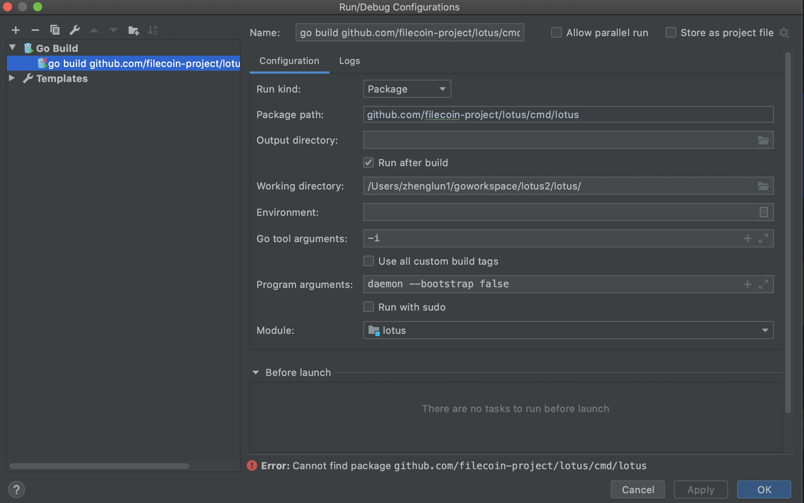
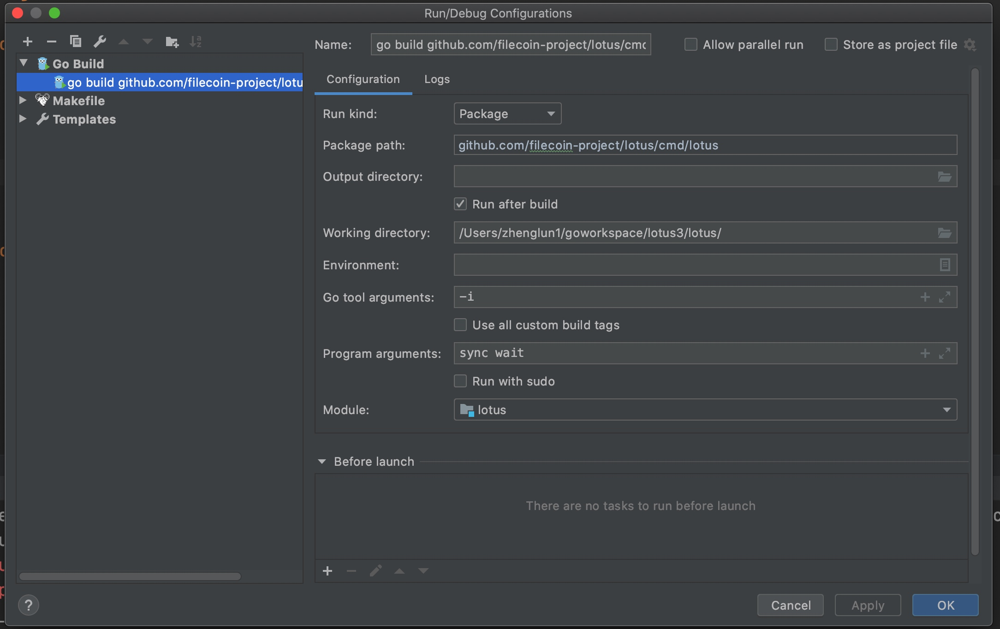
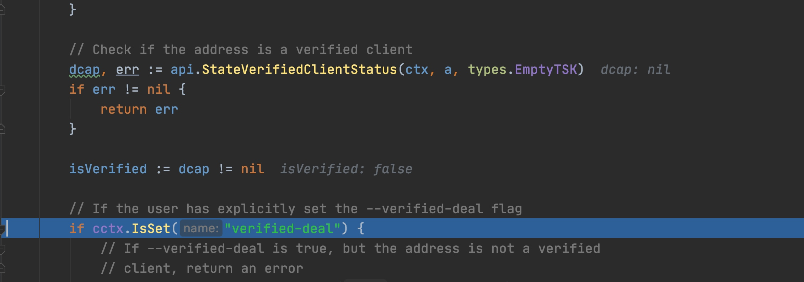

#### 使用 10.10.10.21 这个机会
10.10.11.30
10.10.11.31
10.10.11.32
10.10.11.33
10.10.11.34
10.10.11.35
10.10.11.36
10.10.11.37
10.10.11.38
10.10.11.39
10.10.11.40
amd: 
10.10.10.21  

#### 矿工和市场分开
市场有provider去做， 市场用于接单， 市场放在国外， 矿工放在国内

#### 发单

1.导入本地文件
```
./lotus client import 1.txt

WARN[0000] build parameter has set to testnet source="force_net_selector.go:41"
Import 1, Root bafkqapiknnuwy3bafu4saydqnfsg6zranrxxi5ltfvzwk4twmvzgaozabjvws3dmeawtsidaobuwi33gebwg65dvomww22lomvzgacqk
```
倒入的文件如果太小， 生成的cid会比较短， 而且provide log会提示piece 太小 

2.使用上面import 得到的cid，和本地的t3 地址发单：
```
    ./lotus client deal --start-epoch 10000 --from t3rf66ofoxbf7pb7dauajwx726wjsfno3jdvpyzyu6exjj7ecaqualdqureq42jrnws4z64aacamgmtexmbzpa bafkqauyknnuwy3bafu4saydqnfsg6zranrxxi5ltfvzwk4twmvzgaozabjvws3dmeawtsidaobuwi33gebwg65dvomww22lomvzgactlnfwgyibnheqga4djmrxwmidmn52hk43abifa t01011 0.0000000000000003 800000
WARN[0000] build parameter has set to testnet source="force_net_selector.go:41"
bafyreiggsw6deikkgpiiq4imzxfjpzyyswivsy2nefprrfj7teeur2jxsy
```

3.查询发单记录：
```
./lotus client list-deals
```

4.看provider的日志

#### 在大矿工，安排一个机会做provider

一个机会做force-worker， sealer 发任务，这些都是基本流程

 另加一个Proviver， 开一个端口给Provider， provider由这个端口， 接收订单， 接受数据。  provider的产出是发一个消息， 需要借助大矿工的算力， 尽量打包消息， 现在我们的lotus优先打包自己矿工的消息， 也可以打包制定的消息， 
 
 
### client deal注意事项
#### --start-epoch   设置的高度必须高于当前高度， 
 
#### sealer 不发任务的原因：
sealer启动命令里， 加上：
--enable_deal_sector --deal-concurrent 1
 作用类似 totol_num , 表示sealer 接到单后发的任务数
 
 
 
#### 长时间等待waitseed, sealer 不发p3 任务， 因为还没等到链上的信息。 
 相关代码， 在filecoin-project 库里：
 

 
####  sector commitfailed, sealer.log 显示sector not found的问题
sector 在本地链能找到， 但在创世节点的链没找到， 说明链分叉了。 

 ./lotus-miner sector list    
 
 
 看链上的：
 
 
 
#### deal state
 

### 客户端代码


### 公链同步问题


先涨高度， 在回高度


先找到链上最高的高度：


---
矿工和市场本来和在一起的

### nonce值和自己的t3地址相关

每个t3地址发出的消息的nonce值 是和自己相关的， 所以每个新的t3地址的发的消息的nonce值为0。 

转帐的消息： 

 

### 断点调试



比如 sync wait调试， 可以是这样：






#### 查看
可以查任意矿工的信息
```
➜  ~ ./lotus state miner-info t06498
Owner:	t04838
Worker:	t04838
PeerID:	12D3KooWJsfHmJeqvorTnmdtGx2Ag4Js3fDz8YnJJU6tgAtSWVFx
SectorSize:	32 GiB (34359738368)
Multiaddrs: 	/ip4/183.131.58.9/tcp/14567/p2p/12D3KooWJsfHmJeqvorTnmdtGx2Ag4Js3fDz8YnJJU6tgAtSWVFx
```


#### minier init 证明参数下载问题
如果没有提前下载好证明参数文件， miner init时会报 checksum mismatch这样的错误：


这个错误并不是lotus版本不支持。 


#### miner init 	Waiting for message: 要等待链同步完成， 并且消息被正确打包， 才会继续， 期间 lotus chain list 可以快速的同步， 不必是高度区间的时间。  


### 查看指定cid的消息
```
➜  ~ ./lotus chain getmessage
ERROR: must pass a cid of a message to get

➜  ~ ./lotus chain getmessage bafyreiesjihvm2cplg6zd3hhxgjfp2ct4v6ikqowa3zvfpuoroinsdviue
ERROR: failed to read object: blockstore get: blockstore: block not found
```

####  从水龙头接到8000fil的消息
```
➜  ~ ./lotus chain getmessage bafy2bzacebubn67ganpbblrsnypgz6q37sledk5g3ibqs67d4hzqyj4s7ltv2
{
  "Message": {
    "Version": 0,
    "To": "t3spocs3dxn2fwe46kyalbvfl7vklpbqmku37ua6wvnfyvo242ucjbgqmlha2cpx2jsitfcz5m7hab5d4w2vxq",
    "From": "t1w3ch536xa2xka5fw3gf2iv7tffkpoajvm4wtmjq",
    "Nonce": 30185,
    "Value": "8000000000000000000000",  
    "GasPrice": "10395721518",
    "GasLimit": 3384342,
    "Method": 0,
    "Params": null
  },
  "Signature": {
    "Type": 1,
    "Data": "kDbw61AxZU7aIkVXgNF9pMSeQF1/ym9yJxMZwQuiaIdWV90IvveXM+c4Oxs5TnKv0DN5e7vRpU1r3eTSaBZNagE="
  }
}
```
"Value": "8000000000000000000000",   划分下：
"Value": "8000 00 0000 0000 0000 0000",  
注意上面fil的单位，是 atto fil， 一个atto fil是10的负18次方fil, 
"GasLimit": 3384342,  表示此类消息的最大费用， 也是以 atto fil为单位。 
"GasPrice": "10395721518",  ？？  
 

#### 长时间处在StorageDealPublishing
没有发出消息， 导致StorageDealPublishing
```
// StorageDealPublishing means the deal has been published but we are waiting for it to appear on chain
	StorageDealPublishing
```

查看命令：
```
➜  ~ ./lotus-miner storage-deals list
ProposalCid  DealId  State                  Client                                                                                  Size   Price                Duration
...yu3bdena  0       StorageDealPublishing  t3svrxqfeoizhp3s3ui32xcacfmssthsazpgn2o4c2qjw4cchmcgn44wc3prqlpq4v4jw4ey2hxzxng2dkvana  32KiB  0.0000000898128 FIL  801900
```


#### 消息method 含义

```
builtin.MethodConstructor: a.Constructor,
2:                         a.ControlAddresses,
3:                         a.ChangeWorkerAddress,
4:                         a.ChangePeerID,
5:                         a.SubmitWindowedPoSt,
6:                         a.PreCommitSector,
7:                         a.ProveCommitSector,
8:                         a.ExtendSectorExpiration,
9:                         a.TerminateSectors,
10:                        a.DeclareFaults,
11:                        a.DeclareFaultsRecovered,
12:                        a.OnDeferredCronEvent,
13:                        a.CheckSectorProven,
14:                        a.AddLockedFund,
15:                        a.ReportConsensusFault,
16:                        a.WithdrawBalance,
```

这些消息类型的方法的定义在 miner_actor.go 文件， 这个文件在filecoin-project/specs-actors模块：


lotus代码的定义：


### windowpost对算力的影响
windowpost 没有及时证明， 就会面临一次多少TB的惩罚，比如从100TB的算力直接惩罚到50TB， 只有到第二天同一时间， 才有重新提供证明的机会， 才有恢复算力的机会。 


windowpost 要15分钟

window post 正常做了， 算力就能恢复

gpu 没驱动， 导致等于没有gpu, poster退出， gpu 没装驱动，要让程序直接退出，省着看日志了， 有时日志也不明白

nfs： 2000个32Gsector， 三分钟读完

### 发消息
一个消息在一个peer 走不动， 就会走动另一个peer

lotus-message 没有 server-api, 直接崩掉

pending 
151 - 152 

在lotus 攒够 nonce

缺的这些Nonce， 从数据库里读到


commitonchain 过了， 这个消息就能上链。 

#### 链抖了


#### 消息的nonce是以t3划分的
from后的t3地址， 如果是新的， nonce就是0， 所以在用新产生的t3， 在水龙头刚抢到钱后， 在去给目标t3转钱时， 发的消息的nonce就是0.  转账消息的类型是0， 即controlAddress. 
 


### 发单后， 查消息
```
➜  ~ ./lotus client deal --start-epoch 18000 --from t3svrxqfeoizhp3s3ui32xcacfmssthsazpgn2o4c2qjw4cchmcgn44wc3prqlpq4v4jw4ey2hxzxng2dkvana bafk2bzaceb4qutc7uc6lnonqkvgojt2kitxgfdcpmvwqku4agc45xzkezhnk2  t031137  0.0000000000000003 800000
bafyreifofhgup4nl754t6lcfkbk6gx5mvrxkcdfq6ckk7o4hozjtbsyhqu
➜  ~ ./lotus chain getmessage bafyreifofhgup4nl754t6lcfkbk6gx5mvrxkcdfq6ckk7o4hozjtbsyhqu
ERROR: failed to read object: blockstore get: blockstore: block not found
```

查看单被做的情况


#### 公网同步
公网同步的速度很快， 前一分钟，还在10点的高度， 再用./lotus chain list看就到13点的高度


### go mod tidy 出现time out错误
检查go mod env, 看下go 代理是否为GOPROXY="https://goproxy.cn"， 如： 


### go fil market 测试指定方法


###  新创建的t3地址因为没钱，而不能上链，导致address not found
new bls， 生成一个t3地址， 这个只是存放在本地，如果不给这个地址转帐， 或者到水龙上申请， 那么这个地址永远不会上链， 所以state get-actor 就不会查到这个地址， 因为state 只会显示已经在链上的信息：

所以不管有没有链同步， 都不会找到这个地址， 因为链上没有关于这个地址的消息。 
 
新创建的t3地址， 才能让这个t3地址上链。  t3地址上链后， state get-actor才能查到这个t3. 

以转账为例看消息的流程：
#### 转账得到一个消息
```
[fil@yangzhou010010011035 ~]$ ./lotus send --from t3xeo4xg2g3nk7mb2xhxyqcxmtvshaliquemmcsabivaoytqlez5ohbjrtoawuvcdpj7l4nvfn52f7acg625pa t3r55bj7ng334apf3iy4ytrwwmeovrongerccqlxyjpgdlgoau4y7kckcruvozywxt35vvp2d72gdmtu42nu3a 500

bafy2bzacedsl5bz2wx3v2isprsjivehgmeqo4tpp2jupo55jutw66pcplbing
```
#### 查看消息
这个消息会先在本地， 本地和链上的消息都可以通过chain getmessage得到：
```
[fil@yangzhou010010011035 ~]$ ./lotus chain  getmessage bafy2bzacedsl5bz2wx3v2isprsjivehgmeqo4tpp2jupo55jutw66pcplbing
{
  "Version": 0,
  "To": "t3r55bj7ng334apf3iy4ytrwwmeovrongerccqlxyjpgdlgoau4y7kckcruvozywxt35vvp2d72gdmtu42nu3a",
  "From": "t3xeo4xg2g3nk7mb2xhxyqcxmtvshaliquemmcsabivaoytqlez5ohbjrtoawuvcdpj7l4nvfn52f7acg625pa",
  "Nonce": 13,
  "Value": "500000000000000000000",
  "GasPrice": "10395721865",
  "GasLimit": 1267486,
  "Method": 0,
  "Params": null
}
```
"Method": 0, 表示是转账消息

还可以通过mpool pending查看没有上链的消息：
```
[fil@yangzhou010010011035 ~]$ ./lotus mpool pending | grep t3r55bj7ng334apf3iy4ytrwwmeovrongerccqlxyjpgdlgoau4y7kckcruvozywxt35vvp2d72gdmtu42nu3a

"To": "t3r55bj7ng334apf3iy4ytrwwmeovrongerccqlxyjpgdlgoau4y7kckcruvozywxt35vvp2d72gdmtu42nu3a",
```

#### 查看已经上链的消息
 ./lotus sync wait 后， 消息才有机会被打包上链
上链的消息一定会在网页网页上查到：


### mysql 查询 字符串中指定的字符串 
```
SELECT * FROM account_table WHERE t3address LIKE  "%t3qpgittw7mmj4mywoektv6e46aln256duqj5zel2gigzkwixwxo3dr2v557kxrkr3zwi7b2zgocs6p75jfvnq%";
```


