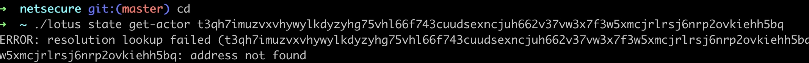
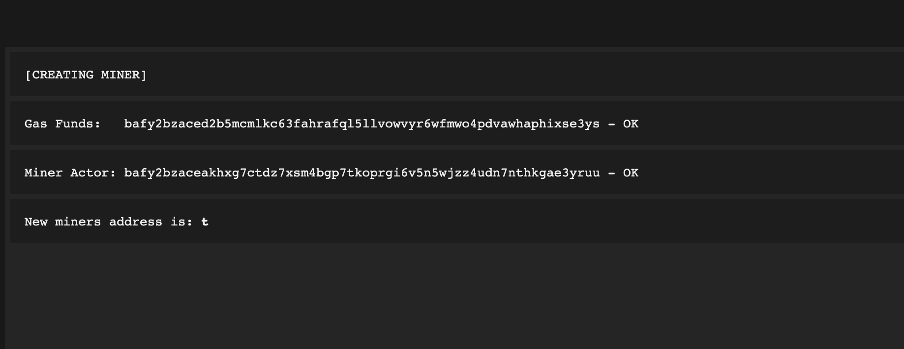
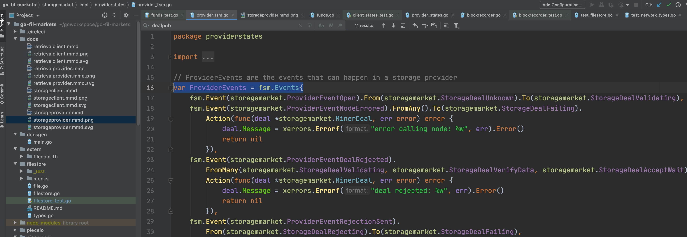
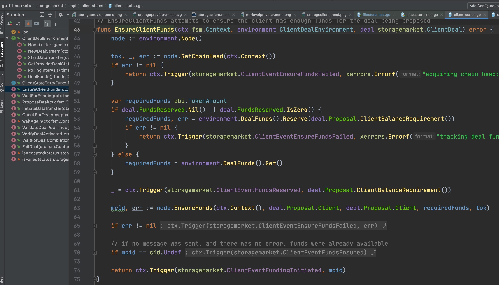

#### 订单 datatransfer 错误 


#### github 水龙头请求


#### 算力被惩罚，消息就不容易出去
gas费用太多
不应惩罚所欲， 要惩罚惩罚所有
做一个sector抵押要9000人名币
#### 洪水攻击

curl -o /dev/null -s -w '%{time_total}' 192.168.1.189 
#### 单位换算
lotus代码里的bigint表示的的price， 都是以atto fil为单位的。 
ask.Ask.Price是atto fil单位， 即10的负18次方。 types.FIL把他换算成fil为单位的并转换为字符串
如
types.FIL(ask.Ask.Price)
输出为：
ask.Ask.Price 为 500000000

types.FIL(ask.Ask.Price): 0.0000000005 FIL


如：
ask.Ask.Price = 500000000 则
types.FIL(ask.Ask.Price) 为 “0.0000000005 FIL”

types.FIL(ask.Ask.Price)的实现为：


相关代码：


#### 同步10个小时的高度， 几分钟就同步好
#### 参数必须带有双中线， 才能被cctx.Int cctx.String等识别
./lotus chain list --count 中count代表取的tipset的个数， 从最高处取 
例子：


对应代码


### 机器人发单
#### 与机器人链接， 接到机器人发的单
必须与机器人地址链接， 才能接到机器人发的单，如：
```
./lotus-miner net connect /ip4/104.248.116.108/tcp/34929/p2p/12D3KooWPhWQduBfQkCgExfwvpAQtT5A2VaBTaZ7PuKaFasefcau
``` 


#### 检查与机器人发单的连通性
检查当前矿工是否与机器人链接， 可以到
https://calibration.spacerace.filecoin.io/check
检查， 输入矿工号， success  表示链接成功 


#### 参数输出
cctx.Args().Get(i) 获取 有明确制定参数名后面的无名参数，如：
```
./lotus fadan deal1  --start-epoch 10000 --from t3rf66ofoxbf7pb7dauajwx726wjsfno3jdvpyzyu6exjj7ecaqualdqureq42jrnws4z64aacamgmtexmbzpa --manual-piece-cid 0  bafkqauyknnuwy3bafu4saydqnfsg6zranrxxi5ltfvzwk4twmvzgaozabjvws3dmeawtsidaobuwi33gebwg65dvomww22lomvzgactlnfwgyibnheqga4djmrxwmidmn52hk43abifa t01011 0.0000000000000003 800000
```
输出：
```
Args().Get( 0 )= bafkqauyknnuwy3bafu4saydqnfsg6zranrxxi5ltfvzwk4twmvzgaozabjvws3dmeawtsidaobuwi33gebwg65dvomww22lomvzgactlnfwgyibnheqga4djmrxwmidmn52hk43abifa
Args().Get( 1 )= t01011
Args().Get( 2 )= 0.0000000000000003
Args().Get( 3 )= 800000
```

#### 运维
不要rm, 全部改成mv
#### start-epotch的作用
到20000这个高度， 如果还没做完， 就以为这个单失败了


#### 矿工和市场分开
市场有provider去做， 市场用于接单， 市场放在国外， 矿工放在国内


### 本地起一个官方版本的矿工
```shell
nohup ./lotus daemon > lotus.log 2>&1 &
```

初始化一个矿工
```shell
./lotus-storage-miner init --actor=t05094 --owner=t3soxlnwaqzv3bn2medqkjujloneyaf272i3bfotxhx3muxoqvcbk5stt7mmkmz4ns4ubx7elrsaqo2fvk4v7a
```

启动矿工
```shell
nohup ./lotus-miner run > poster.log 2>&1 &
```

做sector任务：
```
./lotus-miner sectors pledge
```

#### 发单

1.导入本地文件
```
./lotus client import 1.txt

WARN[0000] build parameter has set to testnet source="force_net_selector.go:41"
Import 1, Root bafkqapiknnuwy3bafu4saydqnfsg6zranrxxi5ltfvzwk4twmvzgaozabjvws3dmeawtsidaobuwi33gebwg65dvomww22lomvzgacqk
```
倒入的文件如果太小， 生成的cid会比较短， 而且provide log会提示piece 太小 

2.使用上面import 得到的cid，和本地的t3 地址发单：
```
    ./lotus client deal --start-epoch 10000 --from t3rf66ofoxbf7pb7dauajwx726wjsfno3jdvpyzyu6exjj7ecaqualdqureq42jrnws4z64aacamgmtexmbzpa bafkqauyknnuwy3bafu4saydqnfsg6zranrxxi5ltfvzwk4twmvzgaozabjvws3dmeawtsidaobuwi33gebwg65dvomww22lomvzgactlnfwgyibnheqga4djmrxwmidmn52hk43abifa t01011 0.0000000000000003 800000
WARN[0000] build parameter has set to testnet source="force_net_selector.go:41"
bafyreiggsw6deikkgpiiq4imzxfjpzyyswivsy2nefprrfj7teeur2jxsy
```

3.查询发单记录：
```
./lotus client list-deals
```

4.看provider的日志


### lotus白名单方式同步
区块同步最好方式：
lotus以白名单方式启动，找几个同不好区块并且与lotus节点网络通信良好的节点（很重要），加入白名单，启动时加参数--only-white-peer=true，这样这个节点只会从白名单中获取数据。
示例：
```
nohup ./lotus  daemon --bootstrap=true --only-white-peer=true 2>&1 > lt.log &
```

白名单添加方式：
.lotus/config.toml文件中[Libp2p]选项卡下增加，如下所示:
[Libp2p]

   WhitelistPeers = ["/ip4/192.168.1.221/tcp/45533/p2p/12D3KooWCinLYTPkxpjKcvuFjDKZZrRTf4J8aAFDQTK24rCZXxeV","/ip4/117.48.133.73/tcp/40811/p2p/12D3KooWAgtdgnUJUQ4AdtCbjPJXbCu95GmTDEJ5gnrMyoxM66T4","/ip4/52.116.55.198/tcp/35559/p2p/12D3KooWQDCBo3kVhaabAUs4UWzM9PShN1YupgBHMnPjyrY6ev35"]
黑名单添加方式类似白名单，但信息只能是PeerId，不能包含其他信息，如下：
[Libp2p]

  BlacklistPeers = ["12D3KooWCinLYTPkxpjKcvuFjDKZZrRTf4J8aAFDQTK24rCZXxeV","12D3KooWAgtdgnUJUQ4AdtCbjPJXbCu95GmTDEJ5gnrMyoxM66T4","12D3KooWQDCBo3kVhaabAUs4UWzM9PShN1YupgBHMnPjyrY6ev35"]


#### lotus负载均衡维护方法

关于lotus-message负载均衡维护方法:
(1) lotus-message在运行中出现:(1.1)mysql信息配置错误,(1.2)消息签名时找不到对应wallet地址,lotus-message会直接崩掉,运维监视进程是否存在即可;
(2) lotus会向lotus-message上报自己的peerlist,lotus-message会连接lotus连接的所有节点,运维主要关注lotus的peerlist;
(3) lotus发送消息失败会打印Error级别日志,需要监控,日志特征: ...  ERROR    messager ... ;
(4) 规范部署流程,该加的启动参数,配置项启动前检查无误再启动;
(5) lotus-message先与lotus启动;
(6) 结果:lotus-message会同步lotus的peerlist(2分钟),所以连接数>=lotus的.
从下个版本开始：目前commitid：lotus相关：5a3d3e08； lotus-message：3dcedd89

### storagemarket代码 接口与实现结构
本目录的一级目录放各个接口文件

client.go   为存储用户的接口文件：


存储市场的接口文件：

还有用户事件的常量定义：


子目录impl放这些接口的实现文件， 如用户接口的实现文件：


impl也把一些接口和实现放在同一个文件里：


### lotus cmd 代码结构
专门处理命令选项， 参数， 命令执行的包："github.com/urfave/cli/v2"， 
lotus总的入口：


lotus命令的各选项入口：

client选项入口：


./lotus client list-deals的执行函数：


#### 代码测试
每个实现文件都有相应的test文件
* 对返回值及error的判读：


* 对状态转换的测试：


封装了一个函数，


这个函数的目标是把状态和对此状态的转换函数传到这个函数里， 就可以完成对状态转换函数的测试， 这里状态为
storagemarket.StorageDealStartDataTransfer, 状态转换函数为：clientstates.InitiateDataTransfer。 
makeExecutor函数会构造一个 被测试函数需要的一个虚拟环境：
```
		environment := &fakeEnvironment{
			node:                   node,
			dealStream:             envParams.dealStream,
			startDataTransferError: envParams.startDataTransferError,
			providerDealState:      envParams.providerDealState,
			getDealStatusErr:       envParams.getDealStatusErr,
			pollingInterval:        envParams.pollingInterval,
			dealFunds:              tut.NewTestDealFunds(),
		}
```

#### 算力期望
一个集群， 希望一天能上100多T，   

#### 常见命令 
```
 ./lotus-miner storage-deals get-ask
Price per GiB / Epoch  Min. Piece Size (w/bit-padding)  Max. Piece Size (w/bit-padding)  Expiry (Epoch)  Expiry (Appx. Rem. Time)  Seq. No.
500000000              256 B                            512 MiB                          1017361         8331h20m0s                1
```

设置后查询：
```
./lotus-miner storage-deals set-ask --price 0 --verified-price 0 --max-piece-size 512M

./lotus-miner storage-deals get-ask
Price per GiB / Epoch  Min. Piece Size (w/bit-padding)  Max. Piece Size (w/bit-padding)  Expiry (Epoch)  Expiry (Appx. Rem. Time)  Seq. No.
0                      256 B                            512 MiB                          104050          720h0m0s                  2
```
#### 在大矿工，安排一个机会做provider

一个机会做force-worker， sealer 发任务，这些都是基本流程

 另加一个Proviver， 开一个端口给Provider， provider由这个端口， 接收订单， 接受数据。  provider的产出是发一个消息， 需要借助大矿工的算力， 尽量打包消息， 现在我们的lotus优先打包自己矿工的消息， 也可以打包制定的消息， 
 
 
### client deal注意事项
#### --start-epoch   设置的高度必须高于当前高度， 
 
#### sealer 不发任务的原因：
sealer启动命令里， 加上：
--enable_deal_sector --deal-concurrent 1
 作用类似 totol_num , 表示sealer 接到单后发的任务数
 
 
 
#### 长时间等待waitseed, sealer 不发p3 任务， 因为还没等到链上的信息。 
 相关代码， 在filecoin-project 库里：
 

 
####  sector commitfailed, sealer.log 显示sector not found的问题
sector 在本地链能找到， 但在创世节点的链没找到， 说明链分叉了。 

 ./lotus-miner sector list    
 
 
 看链上的：
 
 
 
#### deal state
 

### 客户端代码


### 公链同步问题


先涨高度， 在回高度


先找到链上最高的高度：


---
矿工和市场本来和在一起的

### nonce值和自己的t3地址相关

每个t3地址发出的消息的nonce值 是和自己相关的， 所以每个新的t3地址的发的消息的nonce值为0。 

转帐的消息： 

 

#### 查看
可以查任意矿工的信息
```
➜  ~ ./lotus state miner-info t06498
Owner:	t04838
Worker:	t04838
PeerID:	12D3KooWJsfHmJeqvorTnmdtGx2Ag4Js3fDz8YnJJU6tgAtSWVFx
SectorSize:	32 GiB (34359738368)
Multiaddrs: 	/ip4/183.131.58.9/tcp/14567/p2p/12D3KooWJsfHmJeqvorTnmdtGx2Ag4Js3fDz8YnJJU6tgAtSWVFx
```


#### minier init 证明参数下载问题
如果没有提前下载好证明参数文件， miner init时会报 checksum mismatch这样的错误：


这个错误并不是lotus版本不支持。 


#### miner init 	Waiting for message: 要等待链同步完成， 并且消息被正确打包， 才会继续， 期间 lotus chain list 可以快速的同步， 不必是高度区间的时间。  


### 查看指定cid的消息
```
➜  ~ ./lotus chain getmessage
ERROR: must pass a cid of a message to get

➜  ~ ./lotus chain getmessage bafyreiesjihvm2cplg6zd3hhxgjfp2ct4v6ikqowa3zvfpuoroinsdviue
ERROR: failed to read object: blockstore get: blockstore: block not found
```

####  从水龙头接到8000fil的消息
```
➜  ~ ./lotus chain getmessage bafy2bzacebubn67ganpbblrsnypgz6q37sledk5g3ibqs67d4hzqyj4s7ltv2
{
  "Message": {
    "Version": 0,
    "To": "t3spocs3dxn2fwe46kyalbvfl7vklpbqmku37ua6wvnfyvo242ucjbgqmlha2cpx2jsitfcz5m7hab5d4w2vxq",
    "From": "t1w3ch536xa2xka5fw3gf2iv7tffkpoajvm4wtmjq",
    "Nonce": 30185,
    "Value": "8000000000000000000000",  
    "GasPrice": "10395721518",
    "GasLimit": 3384342,
    "Method": 0,
    "Params": null
  },
  "Signature": {
    "Type": 1,
    "Data": "kDbw61AxZU7aIkVXgNF9pMSeQF1/ym9yJxMZwQuiaIdWV90IvveXM+c4Oxs5TnKv0DN5e7vRpU1r3eTSaBZNagE="
  }
}
```
"Value": "8000000000000000000000",   划分下：
"Value": "8000 00 0000 0000 0000 0000",  
注意上面fil的单位，是 atto fil， 一个atto fil是10的负18次方fil, 
"GasLimit": 3384342,  表示此类消息的最大费用， 也是以 atto fil为单位。 
"GasPrice": "10395721518",  ？？  
 

#### 长时间处在StorageDealPublishing
没有发出消息， 导致StorageDealPublishing
```
// StorageDealPublishing means the deal has been published but we are waiting for it to appear on chain
	StorageDealPublishing
```

查看命令：
```
➜  ~ ./lotus-miner storage-deals list
ProposalCid  DealId  State                  Client                                                                                  Size   Price                Duration
...yu3bdena  0       StorageDealPublishing  t3svrxqfeoizhp3s3ui32xcacfmssthsazpgn2o4c2qjw4cchmcgn44wc3prqlpq4v4jw4ey2hxzxng2dkvana  32KiB  0.0000000898128 FIL  801900
```


#### 消息method 含义

```
builtin.MethodConstructor: a.Constructor,
2:                         a.ControlAddresses,
3:                         a.ChangeWorkerAddress,
4:                         a.ChangePeerID,
5:                         a.SubmitWindowedPoSt,
6:                         a.PreCommitSector,
7:                         a.ProveCommitSector,
8:                         a.ExtendSectorExpiration,
9:                         a.TerminateSectors,
10:                        a.DeclareFaults,
11:                        a.DeclareFaultsRecovered,
12:                        a.OnDeferredCronEvent,
13:                        a.CheckSectorProven,
14:                        a.AddLockedFund,
15:                        a.ReportConsensusFault,
16:                        a.WithdrawBalance,
```

这些消息类型的方法的定义在 miner_actor.go 文件， 这个文件在filecoin-project/specs-actors模块：


lotus代码的定义：


### windowpost对算力的影响
windowpost 没有及时证明， 就会面临一次多少TB的惩罚，比如从100TB的算力直接惩罚到50TB， 只有到第二天同一时间， 才有重新提供证明的机会， 才有恢复算力的机会。 


windowpost 要15分钟

window post 正常做了， 算力就能恢复

gpu 没驱动， 导致等于没有gpu, poster退出， gpu 没装驱动，要让程序直接退出，省着看日志了， 有时日志也不明白

nfs： 2000个32Gsector， 三分钟读完

### 发消息
一个消息在一个peer 走不动， 就会走动另一个peer

lotus-message 没有 server-api, 直接崩掉

pending 
151 - 152 

在lotus 攒够 nonce

缺的这些Nonce， 从数据库里读到


commitonchain 过了， 这个消息就能上链。 

#### 链抖了


#### 消息的nonce是以t3划分的
from后的t3地址， 如果是新的， nonce就是0， 所以在用新产生的t3， 在水龙头刚抢到钱后， 在去给目标t3转钱时， 发的消息的nonce就是0.  转账消息的类型是0， 即controlAddress. 
 


### 发单后， 查消息
```
➜  ~ ./lotus client deal --start-epoch 18000 --from t3svrxqfeoizhp3s3ui32xcacfmssthsazpgn2o4c2qjw4cchmcgn44wc3prqlpq4v4jw4ey2hxzxng2dkvana bafk2bzaceb4qutc7uc6lnonqkvgojt2kitxgfdcpmvwqku4agc45xzkezhnk2  t031137  0.0000000000000003 800000
bafyreifofhgup4nl754t6lcfkbk6gx5mvrxkcdfq6ckk7o4hozjtbsyhqu
➜  ~ ./lotus chain getmessage bafyreifofhgup4nl754t6lcfkbk6gx5mvrxkcdfq6ckk7o4hozjtbsyhqu
ERROR: failed to read object: blockstore get: blockstore: block not found
```

查看单被做的情况


#### 公网同步
公网同步的速度很快， 前一分钟，还在10点的高度， 再用./lotus chain list看就到13点的高度


### go mod tidy 出现time out错误
检查go mod env, 看下go 代理是否为GOPROXY="https://goproxy.cn"， 如： 


### go fil market 测试指定方法


###  新创建的t3地址因为没钱，而不能上链，导致address not found
new bls， 生成一个t3地址， 这个只是存放在本地，如果不给这个地址转帐， 或者到水龙上申请， 那么这个地址永远不会上链， 所以state get-actor 就不会查到这个地址， 因为state 只会显示已经在链上的信息：

所以不管有没有链同步， 都不会找到这个地址， 因为链上没有关于这个地址的消息。 
 
新创建的t3地址， 才能让这个t3地址上链。  t3地址上链后， state get-actor才能查到这个t3. 

以转账为例看消息的流程：
#### 转账得到一个消息
```
[fil@yangzhou010010011035 ~]$ ./lotus send --from t3xeo4xg2g3nk7mb2xhxyqcxmtvshaliquemmcsabivaoytqlez5ohbjrtoawuvcdpj7l4nvfn52f7acg625pa t3r55bj7ng334apf3iy4ytrwwmeovrongerccqlxyjpgdlgoau4y7kckcruvozywxt35vvp2d72gdmtu42nu3a 500

bafy2bzacedsl5bz2wx3v2isprsjivehgmeqo4tpp2jupo55jutw66pcplbing
```
#### 查看消息
这个消息会先在本地， 本地和链上的消息都可以通过chain getmessage得到：
```
[fil@yangzhou010010011035 ~]$ ./lotus chain  getmessage bafy2bzacedsl5bz2wx3v2isprsjivehgmeqo4tpp2jupo55jutw66pcplbing
{
  "Version": 0,
  "To": "t3r55bj7ng334apf3iy4ytrwwmeovrongerccqlxyjpgdlgoau4y7kckcruvozywxt35vvp2d72gdmtu42nu3a",
  "From": "t3xeo4xg2g3nk7mb2xhxyqcxmtvshaliquemmcsabivaoytqlez5ohbjrtoawuvcdpj7l4nvfn52f7acg625pa",
  "Nonce": 13,
  "Value": "500000000000000000000",
  "GasPrice": "10395721865",
  "GasLimit": 1267486,
  "Method": 0,
  "Params": null
}
```
"Method": 0, 表示是转账消息

还可以通过mpool pending查看没有上链的消息：
```
[fil@yangzhou010010011035 ~]$ ./lotus mpool pending | grep t3r55bj7ng334apf3iy4ytrwwmeovrongerccqlxyjpgdlgoau4y7kckcruvozywxt35vvp2d72gdmtu42nu3a

"To": "t3r55bj7ng334apf3iy4ytrwwmeovrongerccqlxyjpgdlgoau4y7kckcruvozywxt35vvp2d72gdmtu42nu3a",
```

#### 查看已经上链的消息
 ./lotus sync wait 后， 消息才有机会被打包上链
上链的消息一定会在网页网页上查到：


### mysql 查询 字符串中指定的字符串 
```
SELECT * FROM account_table WHERE t3address LIKE  "%t3qpgittw7mmj4mywoektv6e46aln256duqj5zel2gigzkwixwxo3dr2v557kxrkr3zwi7b2zgocs6p75jfvnq%";
```


#### 消息错误， 也会导致 state get-actor 找不到地址


Receip: 显示failed, 
导致：


### 申请t0矿工的问题


解决办法：同样的账号再申请一次：

所以是网络延迟等问题。 

### provider 事件 状态转换图
var ProviderEvents = fsm.Events{ 定义了一个事件将一个状态转换到另一个状态。 



### 存储用户的事件与状态
#### 状态转换图：


#### 状态， 进入状态立即执行的函数， 函数发的事件

如：
```
var ClientStateEntryFuncs = fsm.StateEntryFuncs{
	storagemarket.StorageDealEnsureClientFunds:  EnsureClientFunds,
```
表示一进入storagemarket.StorageDealEnsureClientFunds 这个状态， 就立即执行函数EnsureClientFunds, 这个函数执行结束后， 就立即触发一个事件，以驱动进入下一个状态：

 
 状态：StorageDealEnsureClientFunds
 进入状态后立即执行的函数：EnsureClientFunds
函数结束后要出发的事件：ClientEventFundingInitiated
这三个在状态图上的表示为：


其他依此类推。 
如：


#### 用户状态机


状态机：

状态机里有 状态和函数对应的map:
StateEntryFuncs: clientstates.ClientStateEntryFuncs,
即是上面讲到的状态，函数，事件。 

#### go-fil-market实现了用户对订单的所有方法，lotus cmd client 直接调用go-fil-margket的实现
go-fil-market对client的所有订单方法的实现：


#### 存储市场的事件状态转换图：


#### 使用 10.10.10.21 这个机会
10.10.11.30
10.10.11.31
10.10.11.32
10.10.11.33
10.10.11.34
10.10.11.35
10.10.11.36
10.10.11.37
10.10.11.38
10.10.11.39
10.10.11.40
amd: 
10.10.10.21  