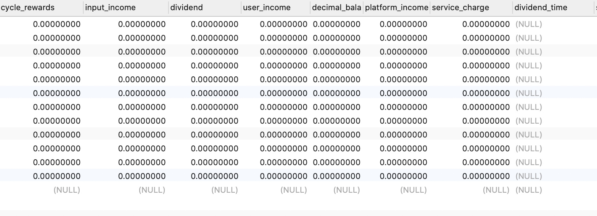

[TOC]

### 优化p1 p2 p4编排  
p1 p2 存储存到同一个存储， 所以p1 p2 就放在同一个主机上， 这样可以避免走网络， 之前p1 p4 在同一个主机上， 不如p1 p2 在同一台主机上，效果好， 


### p1 p2 p3 p4 挂载/sealer. pc(包括p5 p6)挂载/sealer 和 /mnt

#### 1.  /sealer: 存放中间数据，worker所在的所有节点主机都要有这个挂载目录 
从运行p2p3 的 11.33 节点上看：
```
[fil@yangzhou010010011033 ~]$ df -h
Filesystem           Size  Used Avail Use% Mounted on
10.10.10.21:/sealer   58T  291G   55T   1% /sealer
```

看下文件系统10.10.10.21:/sealer的详情：
```
$ mount 
10.10.10.21:/sealer on /sealer type nfs (rw,nosuid,nodev,noexec,relatime,vers=3,rsize=1048576,wsize=1048576,namlen=255,hard,nolock,proto=tcp,timeo=600,retrans=2,sec=sys,mountaddr=10.10.10.21,mountvers=3,mountport=20048,mountproto=udp,local_lock=all,addr=10.10.10.21,user)
```

#### 2.  /mnt：pc节点主机必须有这个挂载节点，存放封装好的 
pc所在的主机节点要同时有/sear和/mnt这两个目录， 分别挂载不同地址的nfs文件系统， pc的任务就是把前阶段封装好的sector， 即sealed文件夹：从/sear目录拷贝到/mnt/目录下， 
```
[fil@yangzhou010010010021 ~]$ df -h
Filesystem                Size  Used Avail Use% Mounted on
/dev/md1                   58T  290G   55T    1% /sealer
10.10.11.21:/mnt/storage  160T   33G  152T   1% /mnt
```

若/mnt没有挂载文件系统, 用下面命令挂载上文件系统：
```
mount -t nfs -o hard,nolock,rw,user,rsize=1048576,wsize=1048576,vers=3 10.10.11.21:/mnt/storage  /mnt/
```

用mount可以看到挂载的文件系统10.10.11.21:/mnt/storage的详细情况： 
```
# mount
10.10.11.21:/mnt/storage on /mnt type nfs (rw,nosuid,nodev,noexec,relatime,vers=3,rsize=1048576,wsize=1048576,namlen=255,hard,nolock,proto=tcp,timeo=600,retrans=2,sec=sys,mountaddr=10.10.11.21,mountvers=3,mountport=20048,mountproto=udp,local_lock=all,addr=10.10.11.21,user)
```

因为pc要从/sealer考到/mnt， 为了加快拷贝的速度，  /sealer 和 /mnt 两个文件系统， 应该放在同一个主机下，但目前的部署没有这么做。 


Pc所在节点主机的 /mnt 是真正存放封装好的sector地方, 如：
```
[fil@yangzhou010010010021 sealed]$ du -sch s-t01004-99
513M	s-t01004-99
513M	total
```
/mnt是绝对不可以删除的。 


一般将pc 与p1 放在同一个主机节点下.


## lotus-server启动前的准备 

### nfs挂载点的准备
##### 检查所有挂载点：
```
root@yangzhou010010019017 fil]# df -h
文件系统        容量  已用  可用 已用% 挂载点
/dev/sda2       2.0T   93G  2.0T    5% /
devtmpfs         63G     0   63G    0% /dev
tmpfs            63G     0   63G    0% /dev/shm
tmpfs            63G  818M   63G    2% /run
tmpfs            63G     0   63G    0% /sys/fs/cgroup
/dev/sda1      1014M  127M  888M   13% /boot
tmpfs            63G   12K   63G    1% /var/lib/kubelet/pods/62e5b3d7-53a8-4e6f-ac34-ab536be25ea2/volumes/kubernetes.io~secret/default-token-jbj6d
overlay         2.0T   93G  2.0T    5% /var/lib/docker/overlay2/113ad712394904013f5c02216d0d8debd465bb1cfc102511864d76ccb7c3606a/merged
shm              64M     0   64M    0% /var/lib/docker/containers/d78cd26c6125ba04748c4201e38fec61decb56699282bc3c4953d0b100acf34b/mounts/shm
overlay         2.0T   93G  2.0T    5% /var/lib/docker/overlay2/6a223d4ff6930ff19317e4ed5dbfc3460a300657e228a307cd0118719f65c76b/merged
tmpfs            13G     0   13G    0% /run/user/0
tmpfs            63G   12K   63G    1% /var/lib/kubelet/pods/96595a99-28af-41b4-a28c-1ed683e57575/volumes/kubernetes.io~secret/default-token-62shh
overlay         2.0T   93G  2.0T    5% /var/lib/docker/overlay2/118a85960d400fd1c4213ce17ddc821839b2f15d89fa13d38c245294423ac502/merged
shm              64M     0   64M    0% /var/lib/docker/containers/5717cf2b70e20b83dbcf68f297bfc1392011b3b58d0f57c0a973f1f86aa34599/mounts/shm
overlay         2.0T   93G  2.0T    5% /var/lib/docker/overlay2/95cb42c1924211e42bde298635caa68862c9589404abe07022e2ab002535e7cf/merged
```


```
	RawPower     decimal.Decimal `json:"rawPower" gorm:"type:decimal(20,8)"`
	QualityPower decimal.Decimal `json:"qualityPower" gorm:"type:decimal(20,8)"`
	
	必须指定  gorm:"type:decimal(20,8)"   否则报错： 
	2020-10-29T13:24:16.959+0800    info    models/models.go:83     apply model auto migrate start
panic: invalid sql type  (ptr) in field RawPower for mysql

goroutine 1 [running]:
```


李刚 committed about 2 hours ago
68d457a0

李刚 committed 24 minutes ago
e22e4bc7
#####  挂载nfs文件系统
```
[root@yangzhou010010019017 ~]# mount -t nfs -o hard,nolock,rw,user,rsize=1048576,wsize=1048576,vers=3 10.10.4.23:/mnt/storage  /mnt/nfs/10.10.4.23


10.10.4.23:/mnt/storage 表示 在10.10.4.23地址的主机上的 /mnt/storage挂载的文件系统
```

若要开机挂载， 就在rc.local中加：
```
root@yangzhou010010019017 ~]# cat /etc/rc.local
```




新部署：
```
root@yangzhou010010011039 mnt]# mount -t nfs -o hard,nolock,rw,user,rsize=1048576,wsize=1048576,vers=3 10.10.13.22:/mnt/storage  /mnt/
```
这里挂载了10.10.13.22主机的文件系统， 那么storage-nodes和groups表中的ip也要改变， 即：
storage-nodes表改为：
1	10.10.13.22	1	10.10.13.22	10.10.1.11

groups表改为：
1	10.10.13.22	10.10.13.22

这个表的信息要被sealer 和poster 读取，确定存放数据的地方。 


定时收益表里添加锁仓四项；整理定时收益表，去掉不必要的字段
poolshowdata增加一般地址
定时任务0点时间修改
矿池收益数据改为从poo_total_income读取
矿工地址和一般地址去重
解决可用余额报错问题
解决一般地址删除无效问题
关闭短信提醒
矿池总余额加上市场余额
当天新增的一般地址，不更新到数据库，也不计算到23:59:59收益
admin端代码与user端代码同步更新
##### 查看新的挂载点
```
[root@yangzhou010010019017 mnt]# df -h
文件系统                 容量  已用  可用 已用% 挂载点
/dev/sda2                2.0T   93G  2.0T    5% /
devtmpfs                  63G     0   63G    0% /dev
tmpfs                     63G     0   63G    0% /dev/shm
{
tmpfs                     63G  818M   63G    2% /run
tmpfs                     63G     0   63G    0% /sys/fs/cgroup
/dev/sda1               1014M  127M  888M   13% /boot
tmpfs                     63G   12K   63G    1% /var/lib/kubelet/pods/62e5b3d7-53a8-4e6f-ac34-ab536be25ea2/volumes/kubernetes.io~secret/default-token-jbj6d
overlay                  2.0T   93G  2.0T    5% /var/lib/docker/overlay2/113ad712394904013f5c02216d0d8debd465bb1cfc102511864d76ccb7c3606a/merged
shm                       64M     0   64M    0% /var/lib/docker/containers/d78cd26c6125ba04748c4201e38fec61decb56699282bc3c4953d0b100acf34b/mounts/shm
overlay                  2.0T   93G  2.0T    5% /var/lib/docker/overlay2/6a223d4ff6930ff19317e4ed5dbfc3460a300657e228a307cd0118719f65c76b/merged
tmpfs                     13G     0   13G    0% /run/user/0
tmpfs                     63G   12K   63G    1% /var/lib/kubelet/pods/96595a99-28af-41b4-a28c-1ed683e57575/volumes/kubernetes.io~secret/default-token-62shh
overlay                  2.0T   93G  2.0T    5% /var/lib/docker/overlay2/118a85960d400fd1c4213ce17ddc821839b2f15d89fa13d38c245294423ac502/merged
shm                       64M     0   64M    0% /var/lib/docker/containers/5717cf2b70e20b83dbcf68f297bfc1392011b3b58d0f57c0a973f1f86aa34599/mounts/shm
overlay                  2.0T   93G  2.0T    5% /var/lib/docker/overlay2/95cb42c1924211e42bde298635caa68862c9589404abe07022e2ab002535e7cf/merged
10.10.4.23:/mnt/storage  160T  273G  152T    1% /mnt/nfs/10.10.4.23
```

出现了10.10.4.23:/mnt/storage  160T  273G  152T    1% /mnt/nfs/10.10.4.23
说明10.10.4.23存储服务器的/mnt/storage已经成功挂载到当前主机的/mnt/nfs目录下

到挂在点下的目录，看有无内容
```
[root@yangzhou010010019017 mnt]# cd nfs/10.10.4.23/
[root@yangzhou010010019017 10.10.4.23]# ll
总用量 40
drwxrwxr-x 537 fil fil 20480 6月  13 14:00 cache
drwxrwxr-x   2 fil fil 20480 6月  13 14:00 sealed
```


#####  递归改变nfs目录下所有文件的属主
```
[root@yangzhou010010019017 mnt]# chown -R fil:fil nfs
[root@yangzhou010010019017 mnt]# chmod -R 777 nfs/
```

#### sealed 存放最后计算出的区块：
矿工号为t02481， lotus全部过程搭建好后， 可以在sealed看到所有矿工计算出的区块， 区块的编号由矿工号和任务号拼接成

```
[fil@yangzhou010010019017 sealed]$ pwd
/mnt/nfs/10.10.4.23/sealed
fil@yangzhou010010019017 sealed]$ ll | grep 2481
-rw-rw-r-- 1 fil fil 536870912 Jun 13 18:17 s-t02481-3000
-rw-rw-r-- 1 fil fil 536870912 Jun 13 19:43 s-t02481-3002
-rw-rw-r-- 1 fil fil 536870912 Jun 13 19:43 s-t02481-3003
-rw-rw-r-- 1 fil fil 536870912 Jun 13 23:42 s-t02481-3004
-rw-rw-r-- 1 fil fil 536870912 Jun 14 00:01 s-t02481-3005
-rw-rw-r-- 1 fil fil 536870912 Jun 14 13:40 s-t02481-3006
-rw-rw-r-- 1 fil fil 536870912 Jun 14 13:40 s-t02481-3007
-rw-rw-r-- 1 fil fil 536870912 Jun 14 15:11 s-t02481-3008
```

### focefs   
裸磁盘存储服务器， 有一个专门的代理进程， 让外部感知为 实现文件系统

forcefs性能远不如nfs


P2 P3 公用， 
plarm amd ；P1  3个小时 。 
 
P2 2个小时


产出记录如果reason字段为空，取矿池名字作为备注
为提现查看角色加入人工介入权限
給payment的待打款列表增加三个字段，result, status, fil_cid
为获取待打款的接口请求参数添加起止时间和状态参数
池空间收益分配时发送短信提醒或邮件提醒
收益计算的每天截止时间点改为23:59:59
添加提币申请查看权限，可操作管理后台-提币申请页面除审核功能外的权限
提现订单导出表格排序
导出订单添加申请时间