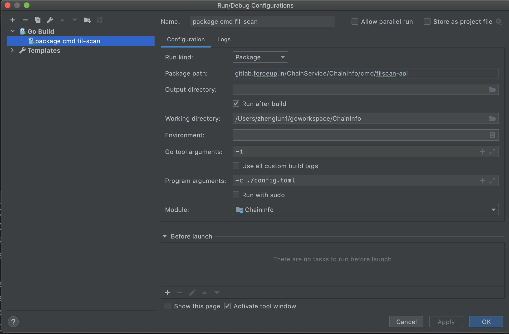
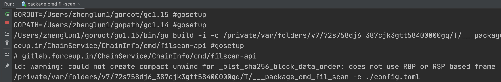
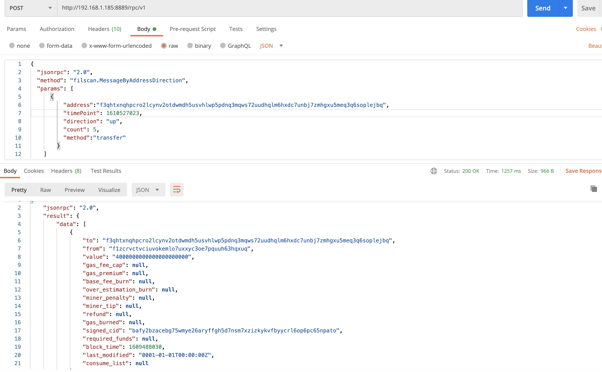

### git submodule update  必须加上--init --recursive 才能下载到extern下的代码
extern/子目录 没有同步到代码， 解决办法：
```
git submodule update --init --recursive
```
不能用git submodule update  必须加上--init --recursive

### goland package 编译运行

package 编译， 选择package, working directory, 
working directory,含有makefile文件：
```makefile
SHELL=/usr/bin/env bash

all: build-deps build

unexport GOFLAGS

.PHONY: all build

TARGET=./chain-info
Major=3
Minjor=1
Patch=0
GitVersion=`git --no-pager log --pretty="%h" -n 1`
LotusRevision=$(shell git submodule|sed 's/^[ ]*//'|sed 's/[\+]//'|cut -d' ' -f1|cut -c1-8)
LotusTag=$(shell git submodule|sed 's/^[ ]*//'|cut -d' ' -f3)

ldflags+=-X=main.Version=${Major}.${Minjor}.${Patch}
ldflags+=-X=main.GitVersion=${GitVersion}
ldflags+=-X=main.LotusRevision=${LotusRevision}${LotusTag}

GOFLAGS+=-ldflags="$(ldflags)"

## FFI

FFI_PATH:=extern/ChainSyncer/extern/filecoin-ffi/
FFI_DEPS:=.install-filcrypto
FFI_DEPS:=$(addprefix $(FFI_PATH),$(FFI_DEPS))

$(FFI_DEPS): build/.filecoin-install ;

build/.filecoin-install: $(FFI_PATH)
	$(MAKE) -C $(FFI_PATH) $(FFI_DEPS:$(FFI_PATH)%=%)
	@touch $@

MODULES+=$(FFI_PATH)
BUILD_DEPS+=build/.filecoin-install
CLEAN+=build/.filecoin-install

$(MODULES): build/.update-modules ;

# dummy file that marks the last time modules were updated
build/.update-modules:
	git submodule update --init --recursive
	touch $@

# end git modules

## MAIN BINARIES

CLEAN+=build/.update-modules

deps: $(BUILD_DEPS)
.PHONY: deps

build: clean
	echo "build version: ${Major}.${Minjor}.${Patch}-${GitVersion} ChainMonitor: ${LotusRevision}${LotusTag}"
	go build -o $(TARGET) $(GOFLAGS) cmd/filscan-api/*.go

build-cron: clean
	echo "build version: ${Major}.${Minjor}.${Patch}-${GitVersion} ChainMonitor: ${LotusRevision}${LotusTag}"
	go build -o ./cron-info $(GOFLAGS) cmd/cron-info/*.go

build-basefee: clean
	echo "build version: ${Major}.${Minjor}.${Patch}-${GitVersion} ChainMonitor: ${LotusRevision}${LotusTag}"
	go build -o ./base-fee $(GOFLAGS) cmd/base-fee/*.go

build-deps: clean-deps
	make -C ./extern/ChainSyncer deps

.PHONY: clean clean-lotus switch-interop switch-master
clean:
	-rm -f ${TARGET}

clean-deps:
	-make -C ./extern/ChainSyncer clean
```
设置后启动参数：-c ./config.toml
即等同于执行如下命令：
```
./chain-info -c ./config.toml
```
设置好的package编译： 

运行的时候， bin文件的名字就是go build名字加上下划线的名字： 



### 前端可以用stringfy直接将json格式化


在返回给前端时， omitempty表示，如果block_time 为0， 则不显示block_time, 如果不为0则显示
```
CreatedAt          int64               `pg:"block_time" json:"block_time,omitempty"`
```


