###3 跨域

解决：
将cors放在路由前面：


#### gorm求分组后的平均值
```
	go func () {
		defer waitGroup.Done()
		DB.Model(&Sector{}).Raw("select  group_id as groupid, s.state as state, avg(TIMESTAMPDIFF(SECOND, s.create_time, s.update_time)) as avgtime " +
			"from sectors as s LEFT JOIN  task_groups  as g ON s.sector_id=g.sector_id " +
			" WHERE s.state='Proving' GROUP BY g.group_id").
			Select("groupid, state, avgtime").Find(&groupSectorTimes)


		for _, groupSectorTime := range groupSectorTimes {
			// 将带有小数点的数字字符串， 去掉小数点后面的，并转换为整数， 以秒为单位
			groupSectorTime.AvgtimeInt = util.TimeStrToInt(groupSectorTime.Avgtime)
		}

	}()
```

根据groupid 放到最终结果里
```
		for _, groupSectorTime := range groupSectorTimes {
			if groupSectorTime.Groupid == groupSectorState.Groupid {
				media.AvgTaskTime = groupSectorTime.AvgtimeInt
				break
			}
		}
```


####  group_concat长度限制， 导致sector按机柜分组后，sector的个数统计错误
网上的方法， 需要root， 而且增加group_concat可能影响mysql性能
group_concat在无配置时，默认长度为1024，

可以在客户端（这里使用的是navicat ）, 需root用户 改配置：

SET GLOBAL group_concat_max_len = 102400;  #长度自定义

执行后重启客户端即可，

查询group_concat长度配置可使用

show variables like "group_concat_max_len";  

查看到修改成功后，只要mysql Service不重启就一直生效，但mysql重启后就会恢复默认值。

因此，想要彻底修改，就必须子mysql的配置文件(my.ini)上加上长度设置

group_concat_max_len = -1  

 -1 为最大值（4294967295） ，也可以填上想要的最大长度

设置保存后，重启mysql

在客户端（navicat）执行语句：

show variables like "group_concat_max_len";  

得到的结果为自己设置的默认值即修改成功

#### 插入记录， 用事务


#### 接口转字符串，并对字符串掐头去尾，給where in 查询 


#### 对每一个请求的处理函数， gin都会起一个单独的携程， 以支持并发， 所以不用考虑处理函数， 不同用户并发的问题。 

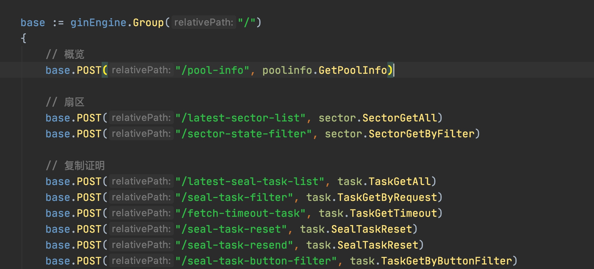

对应的：
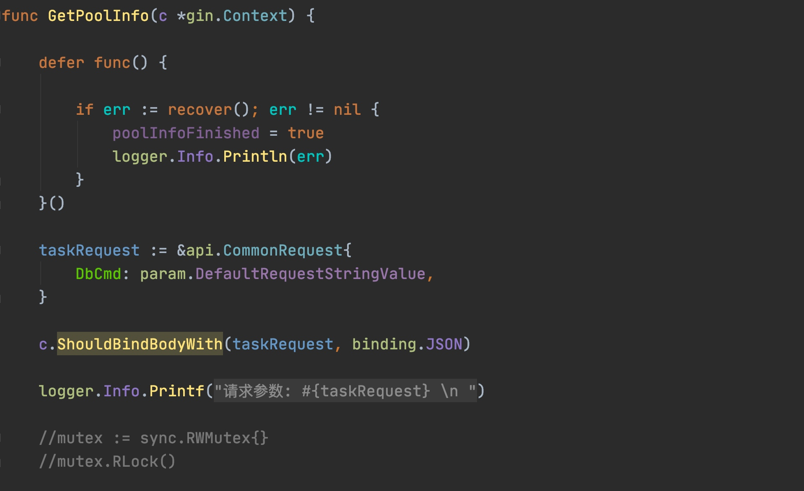
里面不用为不同用户加锁。 

network里可以看到这些header
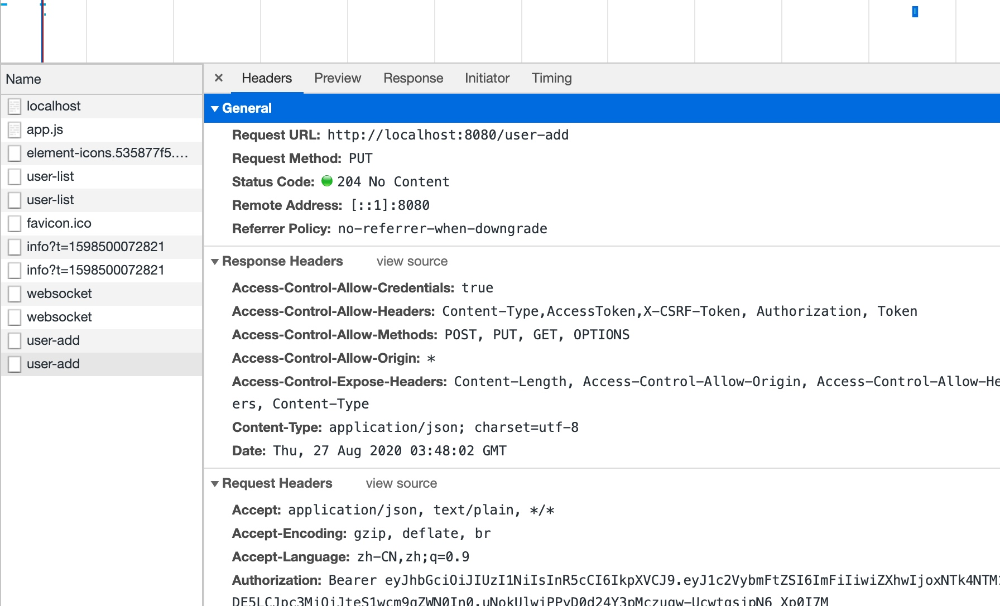


### 


#### 留一个增加用户的入口：
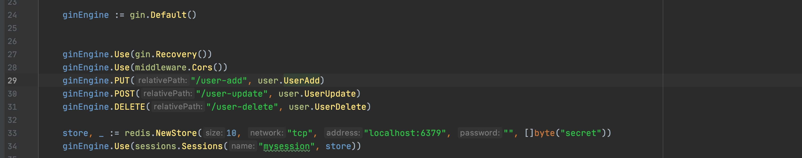
postman :
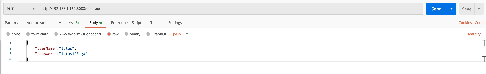


#### float32 转位 int64


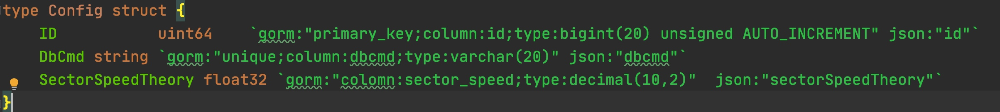

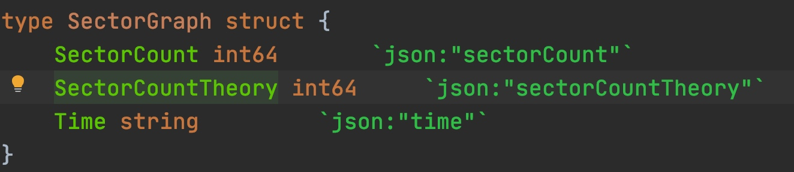


#### 数据库连接
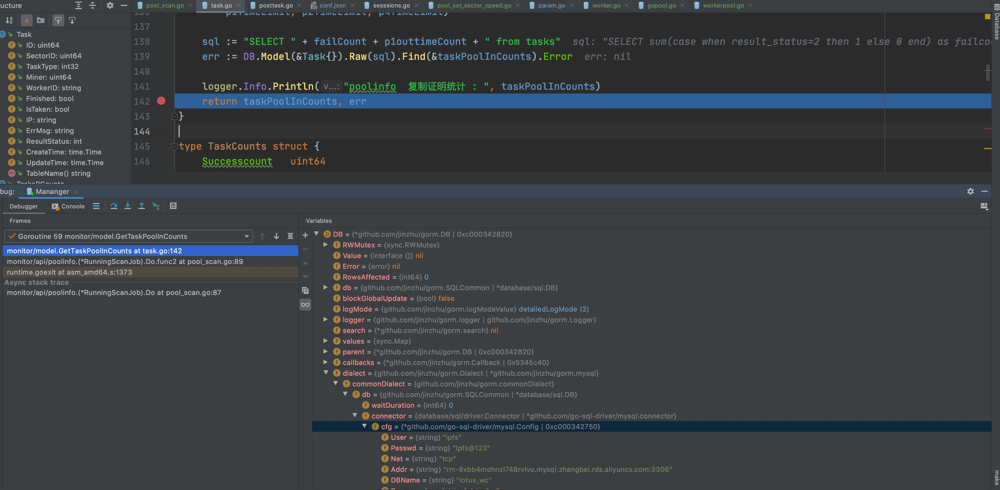


#### sync waitgroup count错误
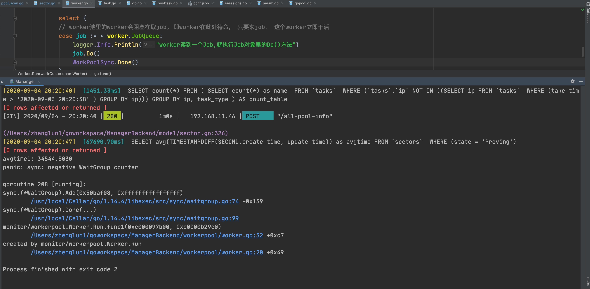


#### 开发 
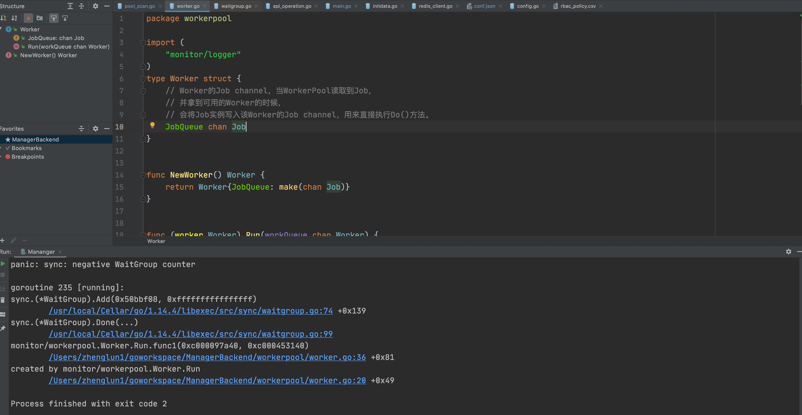


#### 时区问题 连接数据库没有制定loc=Local参数， 时间会显示为第0区的时间。 时间的末尾会加上Z， 表示第0区的时间， 前端拿到这个时间， 会加上8个小时， 以变成东8区的时间。 
结尾不带任何字母的表示本地时间， 这里本地时间为东8区时区： 
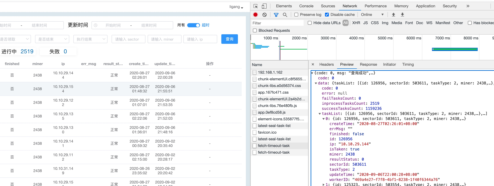


东8区时间，在原时间加上8个小时
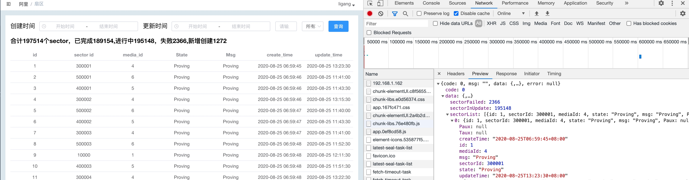


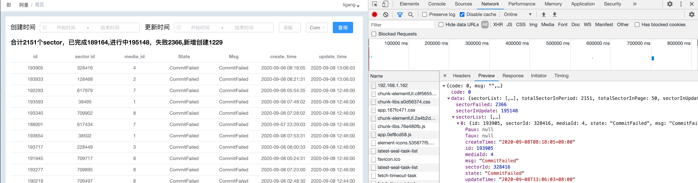


结尾为Z的， 表示第0区的时间， 前端会把这个时间加上8个小时， 以转变为东8区时间。
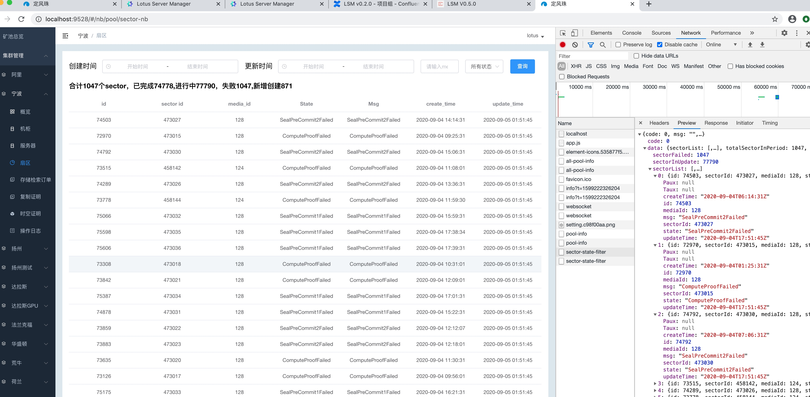


#### 先发option 通过跨域， 然后再真正的post等请求
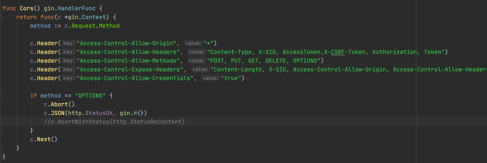

header里是option跨域请求：
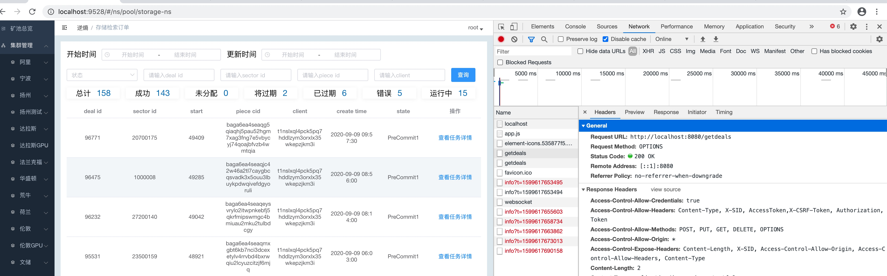

然后是真正的请求：
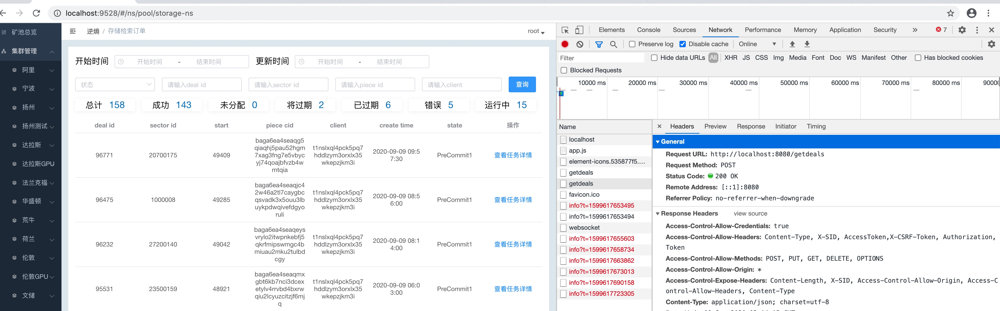


#### casbin 数据保存权限策略
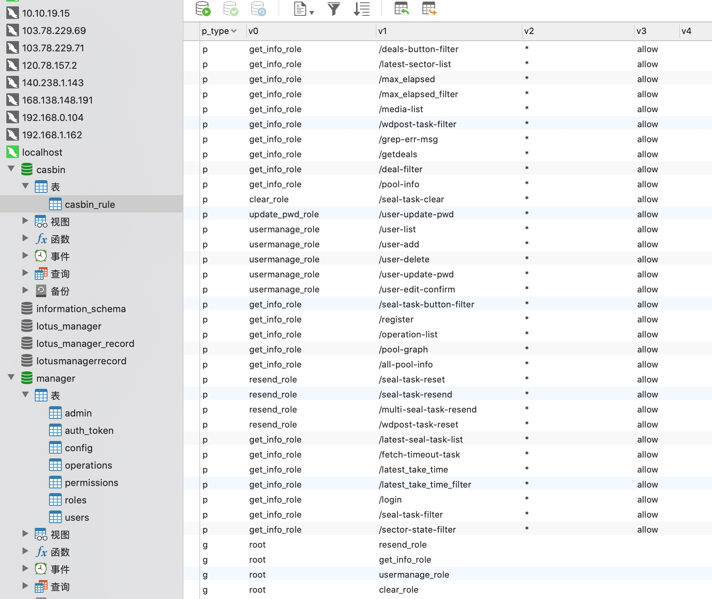
对应的策略生成代码：


#### write: broken pipe 错误
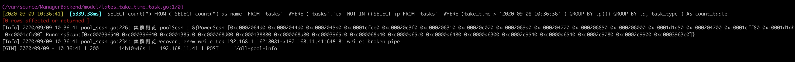

[Info] 2020/09/09 10:29:37 pool_scan.go:226: 集群概览 poolScan : &{PowerScan:[0xc00020c5b0 0xc0002064d0 0xc0001e79d0 0xc0002044d0 0xc000206850 0xc00020c3f0 0xc0002060e0 0xc00020c700 0xc00020c4d0 0xc00020c620 0xc000206310 0xc0001e78f0 0xc0001e7ea0 0xc0002067e0 0xc0001e7ab0 0xc0001e7ce0] RunningScan:[0xc000396580 0xc000138c00 0xc000139280 0xc000396840 0xc0000a7940 0xc0000a7a80 0xc000396e40 0xc0000a6e40 0xc000138d40 0xc0000a6d80 0xc000139100 0xc0000a7500 0xc0003963c0 0xc0001387c0 0xc0003968c0 0xc000068480]}
[Info] 2020/09/09 10:29:37 pool_scan.go:234: 集群概览recover, err= write tcp 192.168.1.162:8081->192.168.11.41:64522: write: broken pipe


#### windowpost留了10几分中的上链时间， 但还是没有上


消息上链还是有些慢， 

没有打包消息

有些矿工在搞事， 办法是用白名单

网络有万兆或千兆

万兆吞吐量 实际能达到800多兆


#### 配置文件的意义
如果写死在代码里， 要改， 就要经过重新编译代码， 发布， 有时代码已经改了很多， 还不是稳定版本， 失去了灵活性。 所以配置文件， 让很多问题变成重启服务就可以就解决， 而不是要经过修改代码，提交， 发布版本来解决。 


#### 定时的语法

表示每过6个小时， 从0点开始， 每6个小时， 执行60次， 每一分钟执行一次： 即在第6个小时到第7个小时之间， 这一个小时， 每一分钟执行一次


每6个小时， 执行一次的正确写法是：


GOPROXY="https://goproxy.cn"


