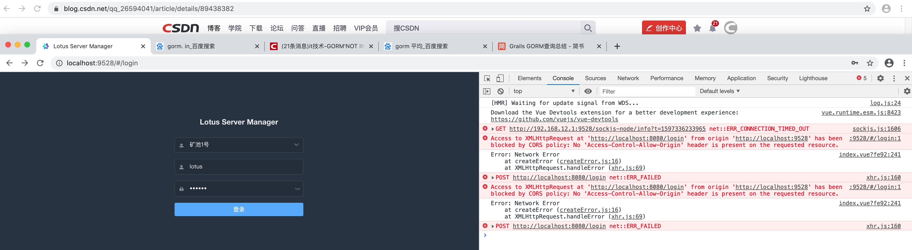
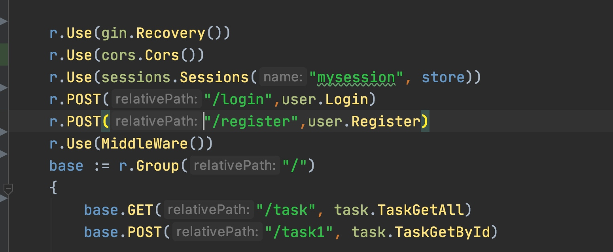
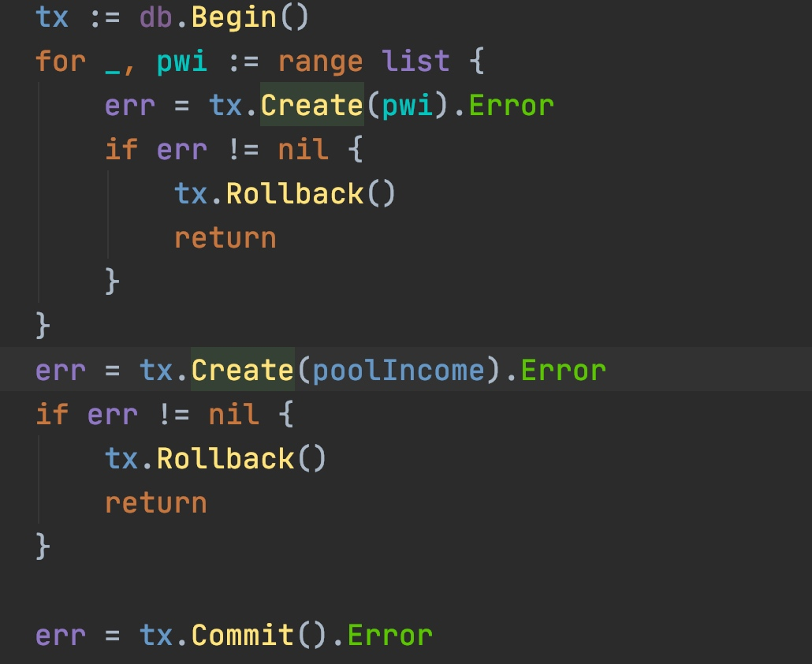
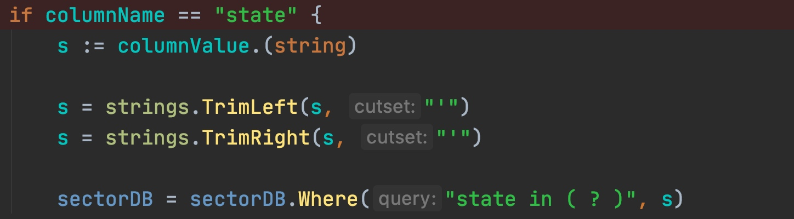

###3 跨域

解决：
将cors放在路由前面：



#### gorm求分组后的平均值
```
	go func () {
		defer waitGroup.Done()
		DB.Model(&Sector{}).Raw("select  group_id as groupid, s.state as state, avg(TIMESTAMPDIFF(SECOND, s.create_time, s.update_time)) as avgtime " +
			"from sectors as s LEFT JOIN  task_groups  as g ON s.sector_id=g.sector_id " +
			" WHERE s.state='Proving' GROUP BY g.group_id").
			Select("groupid, state, avgtime").Find(&groupSectorTimes)


		for _, groupSectorTime := range groupSectorTimes {
			// 将带有小数点的数字字符串， 去掉小数点后面的，并转换为整数， 以秒为单位
			groupSectorTime.AvgtimeInt = util.TimeStrToInt(groupSectorTime.Avgtime)
		}

	}()
```

根据groupid 放到最终结果里
```
		for _, groupSectorTime := range groupSectorTimes {
			if groupSectorTime.Groupid == groupSectorState.Groupid {
				media.AvgTaskTime = groupSectorTime.AvgtimeInt
				break
			}
		}
```


####  group_concat长度限制， 导致sector按机柜分组后，sector的个数统计错误
网上的方法， 需要root， 而且增加group_concat可能影响mysql性能
group_concat在无配置时，默认长度为1024，

可以在客户端（这里使用的是navicat ）, 需root用户 改配置：

SET GLOBAL group_concat_max_len = 102400;  #长度自定义

执行后重启客户端即可，

查询group_concat长度配置可使用

show variables like "group_concat_max_len";  

查看到修改成功后，只要mysql Service不重启就一直生效，但mysql重启后就会恢复默认值。

因此，想要彻底修改，就必须子mysql的配置文件(my.ini)上加上长度设置

group_concat_max_len = -1  

 -1 为最大值（4294967295） ，也可以填上想要的最大长度

设置保存后，重启mysql

在客户端（navicat）执行语句：

show variables like "group_concat_max_len";  

得到的结果为自己设置的默认值即修改成功

#### 插入记录， 用事务



#### 接口转字符串，并对字符串掐头去尾，給where in 查询 

