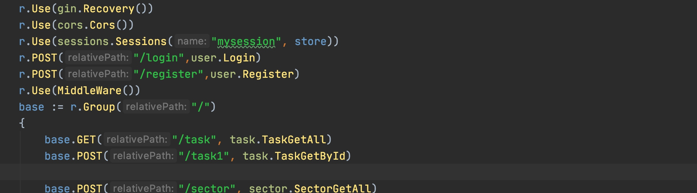
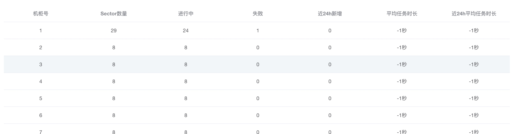
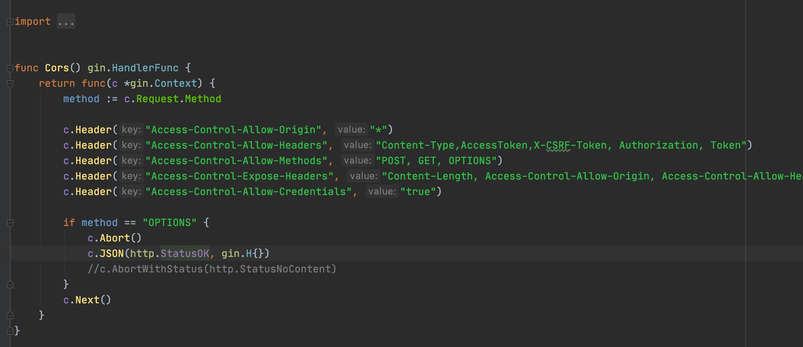

# 


### 分页正确写法


### 跨域要在所有路由设置之前

否则请求被挡住

#### 需求页面   



#### 数据库超时

10 秒超时 会报出：
[mysql] 2020/08/18 09:32:14 packets.go:122: closing bad idle connection: operation timed out


#### mac查看端口、进程号、进程名的命令

薛延祥
0.086
2019.10.08 10:42:30
字数 124
阅读 675
1、查看进程号

ps -ef | grep 进程名

2、查看端口被哪个进程监听

sudo lsof -i :端口

3、查看进程监听的端口

sudo lsof -nP -p 进程号 | grep LISTEN

sudo lsof -nP | grep LISTEN | grep 进程号

4、查看监听端口的进程

sudo lsof -nP | grep LISTEN | grep 端口号

————————————————

示例：

查看3306端口号被占用情况

sudo lsof -nP | grep LISTEN 3306


### 浏览器看到服务返回的数据


#### 浏览器缓存问题
前端服务已经更新了， 但没显示出来， 是因为缓存了， 可以右键检查， 然后Disable Cache. 


#### 出现异常， 先看请求参数对不对


#### 用ssh session 在远程主机上运行命令


#### 命令中 双引号 等的转义


打印出的转义后的结果：

```
[Info] 2020/08/19 20:32:30 ssh.go:172: ssh client在远程运行的命令:  ansible 10.10.31.94 -m shell -a "grep \"57eecad6-272a-43ac-b71e-e7c72ebb0066\" -nr /srv/worker/log-* -A 50 -B 50  --exclude=*.gz " 
```


#### id 没有 AUTO_INCREMENT 导致插入错误

解决：


###  阿里连接突然被拒绝的错误
```
(/var/source/ManagerBackend/model/task.go:217)
[2020-08-27 09:39:34]  [50.25ms]  SELECT count(*) FROM `tasks`  WHERE (is_taken=0 and task_type= 4 and finished=0)
[0 rows affected or returned ]

(/var/source/ManagerBackend/model/task.go:217)
[2020-08-27 09:39:34]  dial tcp: lookup rm-wz9k8c5q11f6n4syhno.mysql.rds.aliyuncs.com on 192.168.1.1:53: read udp 192.168.1.162:54319->192.168.1.1:53: read: connection refused

(/var/source/ManagerBackend/model/task.go:217)
[2020-08-27 09:39:34]  dial tcp: lookup rm-wz9k8c5q11f6n4syhno.mysql.rds.aliyuncs.com on 192.168.1.1:53: read udp 192.168.1.162:54319->192.168.1.1:53: read: connection refused
```

### 跨域没有允许， 预检就过不去， 就不会显示出真正请求， 只显示optiosns


不是没有put请求， 而是预检没有过去， 
原因：


在Access-Control-Allow-Methods 这个header里添加 PUT 就可以了。 

