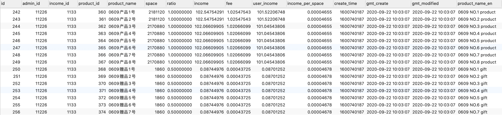
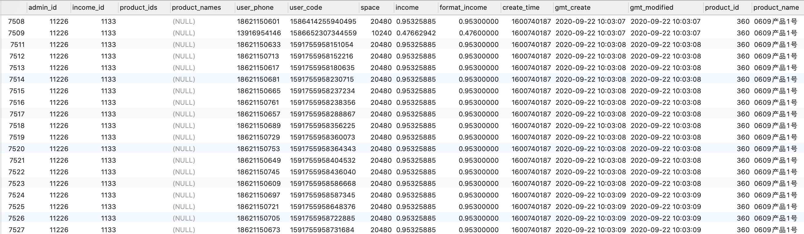
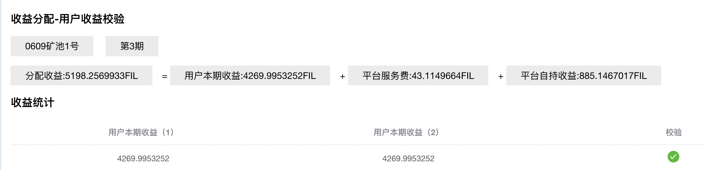
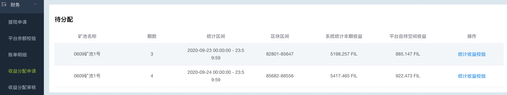
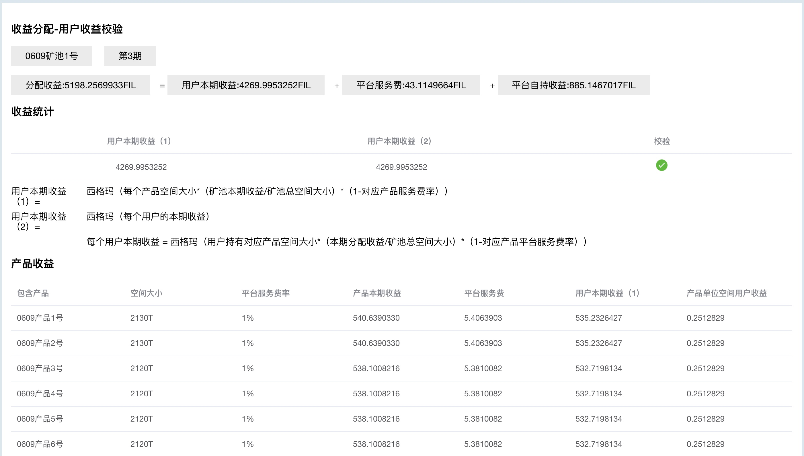
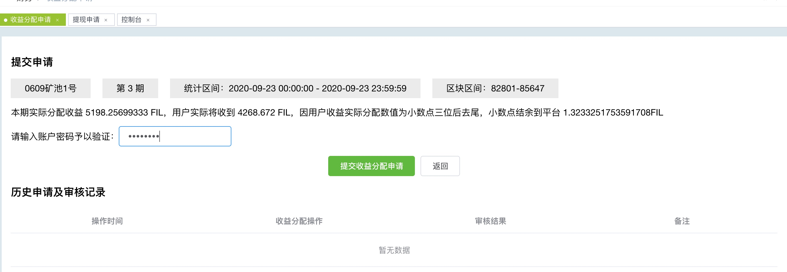
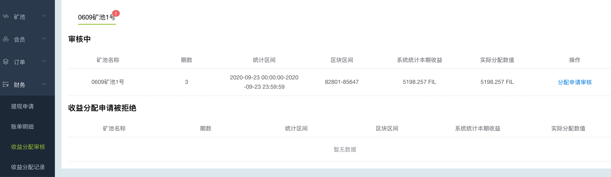
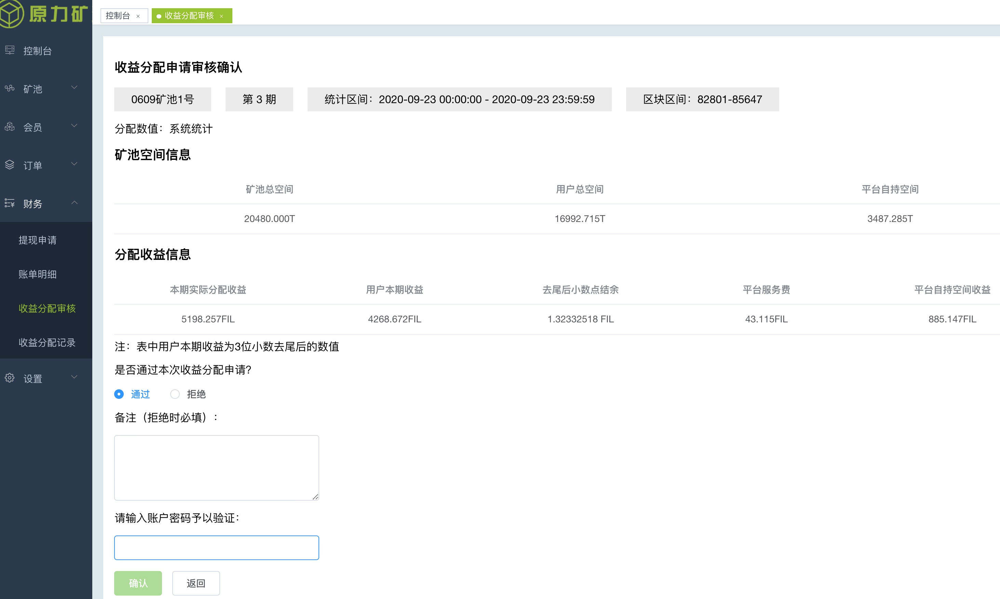

[TOC]
### 收益与校验的概念
####  每期矿池收益的来源, 申请收益分配
一个矿池下有多个产品， 每个产品有多个用户购买订单， 
矿池能出的块是和其算力有关， 算力就是矿池拥有的空间。 所以矿池的收益完全由空间决定。 
矿池的空间一部分是卖给了用户， 一部分是平台自己持有， 所以对应的收益就有用户收益， 和平台收益， 如：

 
 
法官都缺少保护，何以体现法律的威严 
法官需要监督，私人方面尽量与被告原告隔离， 以保证秉公执法

收益的来源是出块， 每出一个块就奖励一定的fil，每期的收益是指一个矿池在一段时间的总收益， 即产生多少fil。  
每期的收益中包含用户收益， 平台服务费， 平台自持收益。 
一期的收益在申请分配时， 会校验用户的收益是否准确。 
通过两个表的计算结果来判断用户收益是否准确，

#### 矿池产品收益表与矿池用户收益表
矿池的空间被分割成产品卖给用户， 产品都是有收益的， 所以一期收益分配时， 要生成多个矿池产品收益记录：pool_product_income, 

主要字段:  产品的空间， 单位空间的价格， 一个产品的总收益，一个产品中的用户收益。 
从这个表里可以计算一个矿池下所有产品的用户总收益， 

产品收益在分配给用户时， 是按购买订单（purchase_orders表）发给用户的， 分配后会生成矿池用户收益记录： pool_user_income, 如： 

#### 申请收益分配时， 用户收益校验
在用户收益校验的时候， 会模拟生成本期矿池产品收益表用户收益总和， 按购买订单酸楚矿池用户收益表的用户收益总和。 
两个总和相等。 用户收益才会通过：

以上通过收益计算通过验证， 收益本质是从空间计算得出，所以再从空间的角度说明用户收益校验：
收益是完全按照算力大小严格计算的， 算力大小也是空间大小，单位空间价格乘以总的空间大小， 就是收益， 矿池的用户总空间， 从矿池产品表里计算出用户总空间， 和订单表里计算出该矿池的总空间， 俩个用户总空间大小， 必须完全相等， 用户的收益也就完全相等， 这样才能通过用户收益校验。

校验的时候并不会生成两个收益表的记录。

### 收益的申请流程
#### 1. 有待分配的收益
运行一个矿池后，目前的设计是每天有一期收益。

点 统计分配校验， 进入申请收益 的流程
#### 2. 用户收益校验通过

#### 3. 提交收益分配申请

### 收益的审核流程
一个用户不能同时具有申请和审核的权限， 审核又另一个用户完成
#### 1. 有待审核的申请

#### 2. 审核确认

这里审核点确认后，  才会在pool_product_income表和pool_user_income表插入矿池收益表和用户收益表的记录。 这些插入的记录非常多，后端log会看到大量的插入数据的log, 这个过程有时会持续2分钟以上。